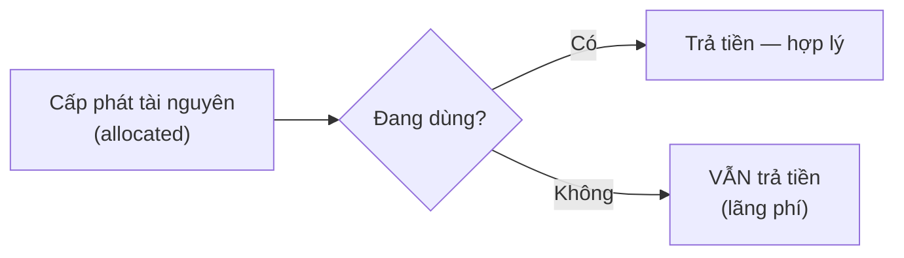

# Cloud Models & Mô hình trả theo dùng

> [!summary] TL;DR
> Có **3 cloud models**: **Public** (hạ tầng dùng chung, multi-tenant), **Private** (dành riêng 1 tổ chức, single-tenant), **Hybrid** (kết hợp public + private/on-prem). Mỗi mô hình đánh đổi giữa **chi phí, kiểm soát, quyền riêng tư, độ phức tạp**. Đi kèm là **consumption-based model** (mô hình tiêu thụ): bạn trả tiền cho tài nguyên được **cấp phát (allocated)** — kể cả khi không dùng tới — nên quy tắc tiết kiệm là "đừng cấp dư & dùng hết những gì đã cấp".

---

## 1. Ba cloud models

| | Public | Private | Hybrid |
|---|---|---|---|
| Hạ tầng | Dùng chung (multi-tenant) | Dành riêng (single-tenant) | Kết hợp |
| Agility | ✅ cao, có thể tự động | ✅ | ✅ |
| Chi phí | Trả theo dùng, kiểm soát tốt | Cao nếu tự mua hạ tầng | Trung gian |
| Kiểm soát/riêng tư | Thấp hơn (chia sẻ) | Cao (mạng riêng, có thể chạy offline) | Linh hoạt |
| Hợp legacy/on-prem | Hạn chế | — | ✅ giữ hệ thống cũ on-prem |
| Nhược điểm | Mất kiểm soát, hạ tầng chia sẻ | Chi phí & nhân sự IT cao | **Phức tạp** kết nối & data compatibility |

- **Public:** nhanh triển khai, dễ quản lý, kiểm soát chi phí; nhược: ít kiểm soát, dữ liệu trên hạ tầng chia sẻ.
- **Private:** mạng riêng, có thể hoạt động **không cần Internet** (vd tàu biển ngoài khơi rồi sync khi online); nhược: chi phí đầu tư & vận hành cao (con dao 2 lưỡi).
- **Hybrid:** giữ DB nhạy cảm on-prem, dùng networking của cloud kết nối; hỗ trợ hệ thống legacy; nhược: **phức tạp khi setup & troubleshoot**, vấn đề tương thích dữ liệu.

> [!question] Phỏng vấn: "Public cloud rẻ hơn private — đúng không?"
> Không tuyệt đối. Public thường rẻ nhờ trả-theo-dùng & không phải đầu tư hạ tầng, nhưng private **có thể** rẻ hơn về dài hạn nếu tải ổn định, lớn, và doanh nghiệp đã có sẵn nhân lực/hạ tầng. Câu trả lời đúng là "tuỳ yêu cầu (privacy, compliance, quy mô, tính ổn định của tải)".

---

## 2. Consumption-based model (mô hình tiêu thụ)

Bạn trả cho tài nguyên được **allocated (cấp phát)**, **không phải** chỉ khi đang dùng. Một VM đang chạy mà không ai truy cập → **vẫn tính tiền** vì nó được cấp cho bạn.

**2 quy tắc tiết kiệm:**
1. **Đừng cấp dư** — không chỉ về *số lượng* mà cả *mức* tài nguyên (đừng chọn VM 8 core khi cần 2 core).
2. **Dùng hết tài nguyên đã cấp** — đừng để tài nguyên nằm không.



> [!question] Phỏng vấn: "VM dừng chạy thì có còn tính tiền không?"
> Khái niệm allocated quan trọng ở đây: nếu chỉ "stop" mà VM vẫn được cấp phát thì vẫn tốn (compute). Trong Azure, **deallocate** (giải phóng) VM mới ngừng tính phí compute (vẫn tính phí disk). → liên hệ [[07-Compute-VM-Container-Functions]].

---

```
★ Insight ─────────────────────────────────────
• "Allocated ≠ used": bẫy chi phí lớn nhất của người mới. Tài nguyên
  bật mà bỏ quên = đốt tiền dù chẳng ai dùng.
• Chọn cloud model = bài toán đánh đổi, không có "tốt nhất". Liệt kê
  yêu cầu (privacy/compliance/cost/quản lý) rồi mới cân ưu–nhược.
• Private cloud KHÔNG đồng nghĩa "tự mua máy": có thể thuê private
  cloud provider — vẫn dành riêng nhưng do bên thứ ba vận hành.
─────────────────────────────────────────────────
```

---

## Tự kiểm tra

1. Multi-tenant vs single-tenant ứng với mô hình nào?
2. Vì sao private cloud có thể chạy không cần Internet, và khi nào hữu ích?
3. Nhược điểm lớn nhất của hybrid cloud là gì?
4. "Allocated" khác "used" thế nào và ảnh hưởng tới hoá đơn ra sao?

---

## Liên quan
- [[01-Tong-quan-Cloud-Shared-Responsibility]] — nền tảng khái niệm cloud
- [[03-Loi-ich-dam-may]] — agility, elasticity bổ trợ consumption-based
- [[11-Quan-ly-chi-phi]] — công cụ kiểm soát chi phí (Reservations, Spot, calculator)
