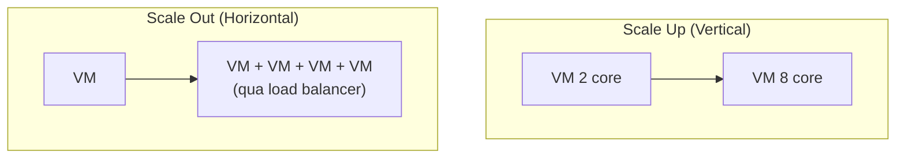

# Lợi ích của đám mây

> [!summary] TL;DR
> Cloud mang lại: **High Availability** (sẵn sàng ≥99%), **Scalability** (mở rộng — *vertical/scale up* đổi máy mạnh hơn vs *horizontal/scale out* thêm nhiều máy), **Elasticity** (co giãn tự động như dây thun), **Agility** (nhanh nhẹn), **Reliability & Predictability** (fault tolerance chống *lỗi nhỏ*, BCDR chống *thảm hoạ lớn*), **Security & Governance** (bảo mật = ai được vào; governance = vào rồi làm được gì), và **Manageability** (giám sát, tự scale, cảnh báo ngân sách).

---

## 1. Availability & Scalability

- **Availability:** app & hệ thống của nó **truy cập được** bởi người dùng. Bị phá vỡ bởi: lỗi mạng, lỗi app, lỗi VM/hệ thống, mất điện, lỗi hệ thống phụ thuộc (DB)…
- **High Availability:** thường được hiểu là mức **≥ 99%**.

| | Vertical scaling (scale up/down) | Horizontal scaling (scale out/in) |
|---|---|---|
| Cách làm | Đổi sang máy **mạnh hơn/yếu hơn** (thêm core, thêm RAM) | Thêm/bớt **số lượng instance** giống hệt nhau |
| Ví dụ | 1 core → 2 core; 8GB → 16GB | 1 VM → 4 VM (cần load balancer phân tải) |
| Giới hạn | Bị chặn bởi máy mạnh nhất | Gần như vô hạn |

- **Elasticity** = khả năng **tự** scale ra/vào & lên/xuống theo nhu cầu (như dây thun co giãn rồi trở lại).
- **Agility** = triển khai & thay đổi tài nguyên nhanh.



> [!question] Phỏng vấn: "Scale up vs scale out khác gì?"
> **Scale up** = phình to **một** máy (vertical). **Scale out** = thêm **nhiều** bản sao máy (horizontal), cần load balancer. Scale out thường ưu tiên cho HA vì 1 máy chết vẫn còn máy khác; scale up bị giới hạn bởi máy mạnh nhất và thường phải reboot.

---

## 2. Reliability & Predictability

- **Fault tolerance (chịu lỗi):** một **fault** = một sự cố quy mô nhỏ (mạng, mất điện cục bộ, hỏng phần cứng). Chịu lỗi nghĩa là **vẫn sẵn sàng dù có fault**.
- **Disaster (thảm hoạ):** sự cố **quy mô lớn** (bão, cháy rừng, lụt) → cần kế hoạch **BCDR** (Business Continuity & Disaster Recovery).

> Phân biệt: **fault tolerance** lo cho sự cố *nhỏ trong cùng một khu vực*; **disaster recovery** lo cho sự cố *lớn xoá sổ cả vùng* → cần triển khai **đa vùng (region pairs)**. Xem [[05-Kien-truc-vat-ly-Regions-AZ]].

---

## 3. Security, Governance, Manageability

| Khái niệm | Nghĩa |
|---|---|
| **Security** | Hạn chế **ai** được truy cập tài nguyên |
| **Governance** | Khi đã vào: **mức quyền** & **làm được gì, làm thế nào** (tuân quy định/chính sách công ty) |
| **Manageability** | Giám sát (monitor), tự scale theo rule, cảnh báo ngân sách, dễ triển khai |

```
★ Insight ─────────────────────────────────────
• Mẹo phân biệt cặp hay nhầm: Availability = "vào được không"; Scal-
  ability = "to/nhiều thêm được không"; Elasticity = "TỰ ĐỘNG co giãn".
• Fault ≠ Disaster: fault = cục bộ (→ availability zones); disaster =
  cả vùng (→ region pairs / BCDR). Đề thi cực thích phân biệt này.
• Security vs Governance: "ai vào" vs "vào rồi làm gì". RBAC chính là
  công cụ governance điển hình (→ note Identity).
─────────────────────────────────────────────────
```

---

## Tự kiểm tra

1. High availability thường tương ứng mức % nào?
2. Vertical vs horizontal scaling — cái nào cần load balancer?
3. Elasticity khác scalability ở điểm cốt lõi nào?
4. Fault vs disaster — mỗi cái cần giải pháp Azure nào (gợi ý: AZ vs region pair)?
5. Phân biệt security và governance.

---

## Liên quan
- [[05-Kien-truc-vat-ly-Regions-AZ]] — AZ chống fault, region pair chống disaster
- [[07-Compute-VM-Container-Functions]] — autoscale, VMSS hiện thực elasticity
- [[10-Identity-Security-AzureAD-RBAC]] — RBAC = công cụ governance
