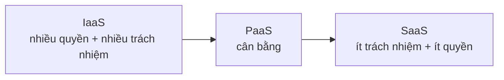

# Cloud Service Types — IaaS / PaaS / SaaS

> [!summary] TL;DR
> Ba loại dịch vụ cloud, khác nhau ở **provider cung cấp tới đâu** và do đó **bạn chịu trách nhiệm tới đâu**: **IaaS** (provider cấp hạ tầng — bạn lo OS↑, nhiều trách nhiệm nhất nhưng kiểm soát cao nhất, vd Azure VM); **PaaS** (provider thêm OS + middleware — cân bằng, vd Azure App Service); **SaaS** (provider cấp cả phần mềm — ít trách nhiệm & ít kiểm soát nhất, vd Outlook.com, OneDrive). Đây là hiện thực cụ thể của [[01-Tong-quan-Cloud-Shared-Responsibility|Shared Responsibility Model]].

---

## 1. Bảng so sánh

| | IaaS | PaaS | SaaS |
|---|---|---|---|
| Provider cấp | Hạ tầng (máy, mạng, đĩa) | + OS + middleware/runtime | + cả phần mềm |
| Bạn lo | OS, app, cấu hình, bảo mật OS↑ | Chỉ app & dữ liệu | Chỉ dữ liệu & cách dùng |
| Trách nhiệm | **Cao nhất** | Trung bình | **Thấp nhất** |
| Kiểm soát/linh hoạt | **Cao nhất** | Trung bình | **Thấp nhất** |
| Truy cập | — | — | thường qua web/app |
| Ví dụ Azure | Azure Virtual Machines | Azure App Service | Outlook.com, OneDrive, Microsoft 365 |

**Quy luật xương sống:** đi từ IaaS → SaaS, bạn **giảm trách nhiệm** nhưng cũng **giảm quyền kiểm soát**. Chọn loại nào = cân giữa "muốn tự chủ" và "muốn nhẹ gánh".



---

## 2. Đặc trưng từng loại

- **IaaS:** chi phí thường theo tiêu thụ; bạn tự cấu hình OS, cài thành phần, deploy app. Linh hoạt tối đa.
- **PaaS:** provider lo OS + middleware; nhiều tính năng **turnkey** (bật là dùng, vd Authentication trong App Service). Giảm gánh nặng quản lý nhưng phải dùng những lựa chọn provider cho sẵn (vd chỉ vài phiên bản runtime).
- **SaaS:** trả theo dùng/đôi khi miễn phí; dùng qua trình duyệt/app. Tiện lợi tối đa, gần như không kiểm soát.

> [!question] Phỏng vấn: "Khi nào chọn PaaS thay vì IaaS?"
> Khi muốn **giảm gánh nặng quản lý** (không muốn vá OS, lo middleware) và chấp nhận **ít linh hoạt hơn** (dùng runtime/cấu hình provider cho sẵn). PaaS cho tính năng turnkey (auth, scale tự động) nhanh chóng. Chọn IaaS khi cần **toàn quyền** cấu hình OS/môi trường, hoặc chạy phần mềm legacy đặc thù.

> [!question] Phỏng vấn: "Outlook.com thuộc loại dịch vụ nào?"
> **SaaS** — provider cấp toàn bộ (hạ tầng + OS + phần mềm email), người dùng chỉ dùng qua trình duyệt. Nhiều người dùng SaaS hằng ngày mà không nhận ra (OneDrive, Gmail, Microsoft 365…).

---

```
★ Insight ─────────────────────────────────────
• "Pizza as a Service" là ẩn dụ kinh điển: tự nấu (on-prem) → mua đế
  bán sẵn (IaaS) → đặt giao tận nhà (PaaS) → ra nhà hàng ăn (SaaS).
• Đề thi hay hỏi "dịch vụ X là loại nào": Azure VM=IaaS, App Service/
  Functions/AKS=PaaS, Microsoft 365/Outlook.com=SaaS.
• Service type quyết định ranh giới shared responsibility — học 2 khái
  niệm này CÙNG nhau, đừng tách rời.
─────────────────────────────────────────────────
```

---

## Tự kiểm tra

1. Sắp xếp IaaS/PaaS/SaaS theo mức trách nhiệm của bạn (tăng dần)?
2. PaaS cung cấp thêm gì so với IaaS?
3. Tính năng "turnkey" là gì, cho ví dụ trong App Service?
4. Azure VM, Azure App Service, Outlook.com lần lượt thuộc loại nào?

---

## Liên quan
- [[01-Tong-quan-Cloud-Shared-Responsibility]] — gốc của việc chia trách nhiệm
- [[07-Compute-VM-Container-Functions]] — VM (IaaS) vs App Service/AKS (PaaS)
- [[18-Azure-App-Service-Functions-deploy]] — dùng PaaS deploy ứng dụng AI
