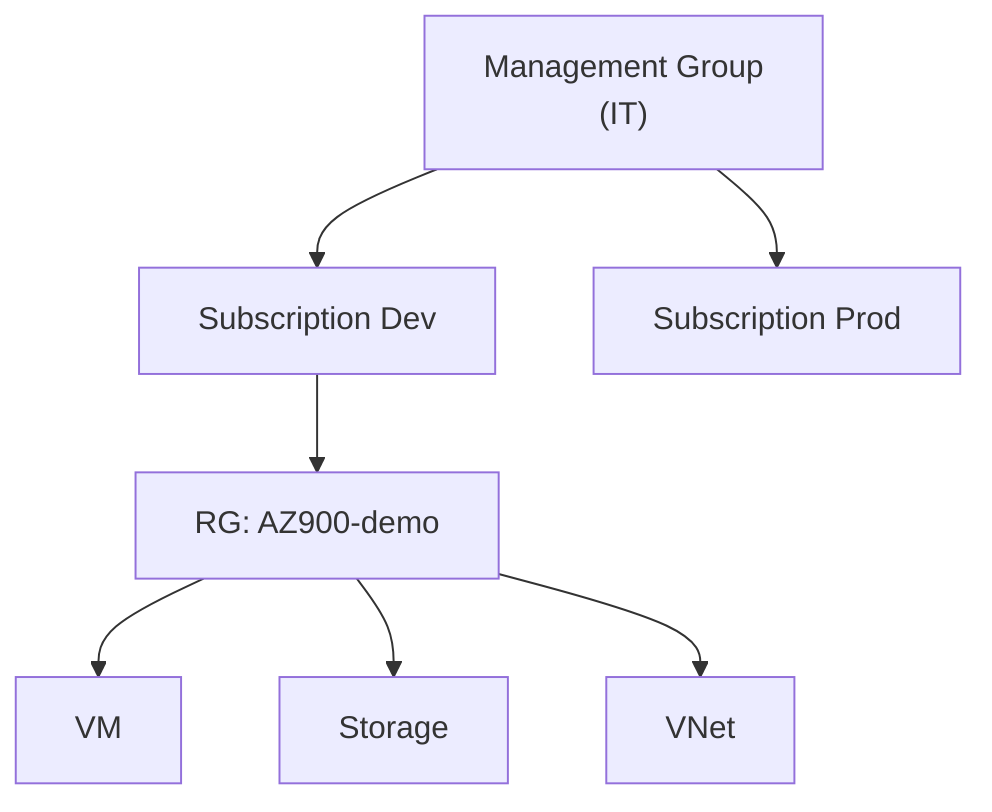

# Tổ chức tài nguyên trong Azure

> [!summary] TL;DR
> Phân cấp tổ chức **logic** (khác với phân cấp **vật lý** region/AZ): **Resource** (bất kỳ thứ gì bạn tạo: VM, web app, DB…) nằm trong **Resource Group** (RG — hộp chứa logic giúp quản lý, gom xoá, gắn tag, redeploy). RG nằm trong **Subscription** (đơn vị thanh toán & ranh giới). Nhiều subscription được tổ chức bằng **Management Group** (chỉ chứa subscription hoặc management group khác). Phân cấp: **Management Group → Subscription → Resource Group → Resource**.

---

## 1. Phân cấp

```
Management Group (tổ chức nhiều subscription)
└── Subscription (đơn vị thanh toán & ranh giới)
    └── Resource Group (hộp chứa logic)
        └── Resource (VM, web app, DB, storage…)
```

| Tầng | Là gì | Dùng để |
|---|---|---|
| **Resource** | Mọi thực thể tạo trong Azure | Đơn vị làm việc |
| **Resource Group** | Hộp chứa **logic** cho resource | Gom quản lý, xoá hàng loạt, gắn tag, áp policy/RBAC |
| **Subscription** | Ranh giới thanh toán/giới hạn | Tách chi phí, hạn mức, môi trường |
| **Management Group** | Tổ chức nhiều subscription | Áp governance/policy diện rộng theo phòng ban |

---

## 2. Resource Group — điểm cần nhớ

- Là **logical container**: tạo resource luôn phải đặt trong một RG.
- **Xoá RG = xoá toàn bộ resource bên trong** trong một thao tác (rất tiện dọn dẹp project).
- **Tags** trên RG hiện trên hoá đơn → phân loại chi phí, lọc/sắp xếp.
- Hỗ trợ **redeploy** sang region khác/sau này bằng **ARM templates** ([[13-Cong-cu-quan-ly-CLI-ARM-Arc]]).
- Một resource thuộc **đúng một** RG; có thể di chuyển giữa các RG.



> [!question] Phỏng vấn: "Tạo 1 VM tại sao lại sinh ra nhiều resource?"
> Một VM kéo theo: virtual network, network interface, public IP, network security group, OS disk (và SSH key nếu Linux). Đặt tất cả trong **một resource group** giúp nhận diện chúng thuộc về VM nào và **xoá sạch một lần** bằng cách xoá RG. Đây là lý do RG hữu ích cho quản lý vòng đời tài nguyên.

> [!question] Phỏng vấn: "Vì sao cần management group khi đã có resource group?"
> RG nằm **bên trong** subscription nên không tổ chức được **nhiều** subscription. Management group là tầng trên subscription, cho phép áp policy/RBAC cho nhiều subscription cùng lúc (vd theo phòng ban Sales/IT/Training). MG chỉ chứa subscription hoặc MG khác.

---

```
★ Insight ─────────────────────────────────────
• Đừng nhầm phân cấp LOGIC (MG→Sub→RG→Resource) với phân cấp VẬT LÝ
  (Geography→Region→AZ→Datacenter). RG không có vị trí vật lý cố định
  cho mọi resource bên trong.
• RG là đơn vị vòng đời: gom theo dự án/môi trường để xoá gọn. Tag là
  đơn vị kế toán: gom theo phòng ban/chi phí.
• Governance chảy từ trên xuống: policy ở Management Group áp cho mọi
  subscription con → quản trị diện rộng (→ note Governance).
─────────────────────────────────────────────────
```

---

## Tự kiểm tra

1. Viết lại phân cấp logic 4 tầng từ trên xuống.
2. Lợi ích của việc gom resource vào một RG khi cần dọn dẹp?
3. Tag trên RG liên quan gì tới hoá đơn?
4. Vì sao RG không tổ chức được nhiều subscription, và giải pháp là gì?

---

## Liên quan
- [[05-Kien-truc-vat-ly-Regions-AZ]] — phân cấp vật lý (đối chiếu)
- [[11-Quan-ly-chi-phi]] — tags & cost management theo RG
- [[12-Governance-Blueprints-Policy-Locks]] — policy/lock áp theo scope (RG, sub, MG)
