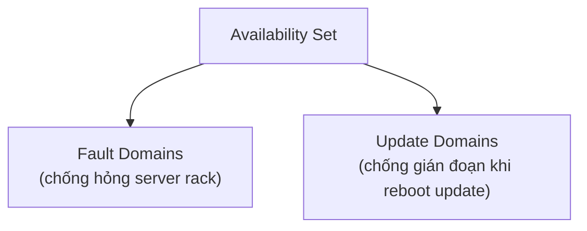

# Azure Compute & App Hosting

> [!summary] TL;DR
> **Compute** = dịch vụ tiêu thụ CPU/RAM. Các loại chính: **Azure VM** (IaaS, toàn quyền), **ACI** (Azure Container Instances — chạy container nhanh, không cần VM), **Azure Functions** (serverless, event-driven, trả theo compute), và **AKS** (Kubernetes — điều phối container quy mô lớn). VM có các tuỳ chọn HA: **Availability Sets** (fault domain + update domain), **VMSS** (scale set, autoscale), **Azure Virtual Desktop**. Hosting app: **App Service** (PaaS, web app + App Service Plan), **AKS**, hoặc tự dùng **VM** (linh hoạt nhất nhưng nhiều trách nhiệm nhất).

---

## 1. Container là gì (nền tảng cho ACI/AKS)

Container = môi trường ảo **cô lập** chạy app + tài nguyên của nó. Tạo từ **image** (như file zip chứa OS user-mode + app + thư viện). Chạy bằng **container runtime** (phổ biến: **Docker**). Image chỉ chứa **user-mode** OS, dùng **kernel** của host → image Linux chỉ chạy trên host Linux, image Windows chỉ chạy trên host Windows.

---

## 2. Các loại compute

| Loại | Bản chất | Khi nào dùng |
|---|---|---|
| **Azure VM** | IaaS, máy ảo Win/Linux | Toàn quyền OS, cài đặt tuỳ ý, legacy |
| **ACI** | Container chạy ngay, không cần quản VM | Workload nhỏ, chạy nhanh; chỉ trả CPU/RAM |
| **Azure Functions** | Serverless, **event-driven** | Microservice "nhận input → xử lý → trả kết quả"; chạy khi có sự kiện (vd file upload) |
| **AKS** | Kubernetes managed | Điều phối container quy mô lớn, chạy lâu dài |
| **Azure Virtual Desktop** | Ảo hoá desktop | Phát hành app cho user không cần cài máy |

- **ACI:** trỏ tới image là chạy; **không trả tiền VM nền**, chỉ trả compute; có thể gom **container groups**.
- **Functions:** consumption-based, không trả VM; hợp microservice & tác vụ ngắn.
- **AKS:** cụm gồm **control plane** (điều phối) + **nodes** (chạy container); chỉ trả compute trong cụm.

---

## 3. VM options cho HA



| Khái niệm | Bảo vệ khỏi |
|---|---|
| **Fault domain** | Lỗi phần cứng của một **server rack** |
| **Update domain** | Gián đoạn khi VM phải **reboot để update** (Azure update lần lượt từng update domain) |
| **VMSS** (Scale Set) | Tạo & **autoscale** nhiều VM giống hệt (dùng availability set bên trong) |

- **Stop/Deallocate:** VM deallocate thì **ngừng tính phí compute** (vẫn trả disk). → liên hệ consumption-based [[02-Cloud-Models-Consumption]].
- ⚠️ **Availability Set ≠ Availability Zone**: AS chống lỗi *trong một datacenter/rack*; AZ chống lỗi *cả datacenter* ([[05-Kien-truc-vat-ly-Regions-AZ]]).

---

## 4. Hosting ứng dụng

| Cách host | Loại | Đặc điểm |
|---|---|---|
| **Azure App Service** | PaaS | Web app dễ tạo; chạy trong **App Service Plan** (đơn vị scale, định tier/giá); turnkey (auth, autoscale); tên app phải **unique toàn Azure** (là DNS) |
| **AKS** | PaaS | Container orchestration mạnh |
| **VM** | IaaS | Linh hoạt nhất, trách nhiệm nhiều nhất |

- **App Service Plan:** các app cùng plan chạy trên **cùng VM**; scale plan = scale mọi app trong plan. Scale up (đổi tier mạnh hơn) & scale out (thêm instance) đều nhanh, có **autoscale theo rule/metrics**.

> [!question] Phỏng vấn: "ACI vs AKS vs Functions chọn cái nào?"
> **ACI** cho container đơn lẻ chạy nhanh, ít cấu hình. **AKS** khi cần điều phối nhiều container, scale phức tạp, chạy lâu dài. **Functions** cho logic ngắn, event-driven, không bận tâm hạ tầng. Tiêu chí: độ phức tạp điều phối & mô hình kích hoạt (luôn chạy vs theo sự kiện).

> [!question] Phỏng vấn: "Fault domain khác update domain thế nào?"
> Cả hai trong **availability set**. **Fault domain** = nhóm theo **server rack vật lý** → bảo vệ khỏi hỏng phần cứng rack. **Update domain** = nhóm logic được **reboot lần lượt** khi update → bảo vệ khỏi gián đoạn do bảo trì.

---

```
★ Insight ─────────────────────────────────────
• Container "nhẹ" hơn VM vì dùng chung kernel host — đó cũng là lý do
  image Linux không chạy trên host Windows và ngược lại.
• Bậc thang trừu tượng compute: VM (tự lo OS) → Container/ACI (đóng gói
  app) → Functions (chỉ còn code). Càng lên càng ít hạ tầng phải lo.
• Đừng nhầm 2 cặp "set vs zone" và "fault vs update domain" — đề thi
  cài bẫy ở đúng các thuật ngữ na ná này.
─────────────────────────────────────────────────
```

---

## Tự kiểm tra

1. Image container chứa gì, vì sao Linux image không chạy trên host Windows?
2. ACI khác AKS ở quy mô & mục đích thế nào?
3. Functions phù hợp loại workload nào (gợi ý: event-driven)?
4. Fault domain vs update domain — mỗi cái chống sự cố gì?
5. App Service Plan ảnh hưởng thế nào khi scale nhiều app cùng plan?

---

## Liên quan
- [[04-Cloud-Service-Types-IaaS-PaaS-SaaS]] — VM=IaaS, App Service/AKS/Functions=PaaS
- [[08-Networking-VNet-VPN-ExpressRoute]] — VM cần VNet, NIC, public/private endpoint
- [[18-Azure-App-Service-Functions-deploy]] — deploy FastAPI lên App Service/Functions
