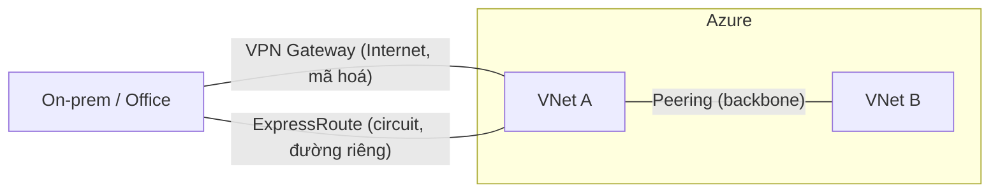

# Azure Networking

> [!summary] TL;DR
> **Azure Virtual Network (VNet)** cho phép dựng mạng trong cloud (như on-prem nhưng không cần phần cứng). VNet có dải IP (CIDR, vd `10.0.0.0/16`) chia thành **subnet** (phân tầng web/app/data). Kết nối 2 VNet bằng **VNet Peering** (chạy trên backbone riêng Microsoft, **không** mã hoá; xuyên region gọi **Global Peering**). Kết nối lai/ngoài Azure: **VPN Gateway** (qua Internet, mã hoá, ~1.25 Gbps; S2S/P2S/VNet2VNet) hoặc **ExpressRoute** (đường riêng, không qua Internet, tới 10–100 Gbps, "circuit"). **Azure DNS** quản lý bản ghi DNS. **Public endpoint** = có IP truy cập từ Internet; **private endpoint** = chỉ trong mạng riêng (một resource có thể có cả hai).

---

## 1. VNet & Subnet

- VNet = mạng riêng ảo trong Azure; khai báo dải IP dạng **CIDR**. Vd `10.0.0.0/16` ≈ 65.534 IP dùng được.
- Chia **subnet** để phân tầng & cô lập, vd:
  - Subnet 1: web tier (giao diện)
  - Subnet 2: middle tier (business rules)
  - Subnet 3: data tier (DB)
- Best practice: subnet web không nói thẳng tới subnet data; chỉ subnet web ra Internet.

---

## 2. Kết nối các mạng

| Dịch vụ | Kết nối | Qua đâu | Tốc độ / mã hoá |
|---|---|---|---|
| **VNet Peering** | VNet ↔ VNet (Azure) | **Backbone riêng** Microsoft | Nhanh; **không** mã hoá. Cùng/khác region (Global Peering) |
| **VPN Gateway** | VNet ↔ mạng ngoài/on-prem/thiết bị | **Internet** (mã hoá) | ~1.25 Gbps; trả phí xử lý mã hoá |
| **ExpressRoute** | Azure ↔ on-prem | **Đường riêng** (không qua Internet) | 10 Gbps (tới 100 Gbps với Direct); gọi là **circuit** |

**3 loại VPN Gateway:**
- **VNet-to-VNet** — nối 2 VNet Azure.
- **Site-to-Site (S2S)** — nối VNet với mạng ngoài Azure (vd văn phòng).
- **Point-to-Site (P2S)** — nối **một thiết bị** (laptop/điện thoại) vào VNet.



> [!question] Phỏng vấn: "Nối 2 VNet Azure: dùng Peering hay VPN Gateway?"
> Thường **Peering** vì nhanh hơn (chạy backbone Microsoft), không tốn phí/overhead mã hoá. Dùng VPN Gateway khi cần **mã hoá** lưu lượng hoặc nối tới mạng **ngoài** Azure. Lưu ý peering **không mã hoá** (vì đi đường riêng nội bộ).

> [!question] Phỏng vấn: "Khi nào chọn ExpressRoute thay vì VPN Gateway?"
> Khi cần băng thông lớn & ổn định (10–100 Gbps), độ trễ thấp, và **không muốn lưu lượng đi qua Internet** (bảo mật/compliance). ExpressRoute đắt hơn, kết nối qua provider tới MSEE; VPN Gateway rẻ & nhanh dựng nhưng giới hạn ~1.25 Gbps qua Internet.

---

## 3. Azure DNS & Endpoints

- **Azure DNS:** quản lý bản ghi DNS (A, CNAME, MX…). **Public zone** = hướng Internet; **private zone** = chỉ cho VNet.
- **Public endpoint:** có IP truy cập được từ **Internet**.
- **Private endpoint:** IP chỉ truy cập trong **mạng riêng**.
- Một resource có thể có **cả hai** (vd VM có private IP trong VNet + public IP để truy cập từ ngoài).

```
★ Insight ─────────────────────────────────────
• Quy tắc chọn kết nối: VNet↔VNet → Peering; lai/ngoài rẻ → VPN Gateway;
  lai/ngoài băng thông cao & riêng tư → ExpressRoute.
• "Peering không mã hoá" nghe đáng lo nhưng hợp lý: nó đi backbone
  riêng của Microsoft, không ra Internet công cộng.
• Subnet hoá theo tier (web/app/data) là hiện thực defense-in-depth ở
  tầng mạng — cô lập để giảm bề mặt tấn công (→ note Identity/Security).
─────────────────────────────────────────────────
```

---

## Tự kiểm tra

1. `10.0.0.0/16` cho khoảng bao nhiêu IP dùng được? Subnet để làm gì?
2. VNet Peering đi qua đâu, có mã hoá không?
3. Ba loại VPN Gateway và mục đích từng loại?
4. ExpressRoute hơn VPN Gateway ở điểm nào, đánh đổi gì?
5. Public endpoint vs private endpoint; một resource có cả hai được không?

---

## Liên quan
- [[07-Compute-VM-Container-Functions]] — VM sinh VNet/NIC/public IP
- [[05-Kien-truc-vat-ly-Regions-AZ]] — Global Peering nối VNet xuyên region
- [[10-Identity-Security-AzureAD-RBAC]] — zero-trust & defense in depth ở tầng mạng
