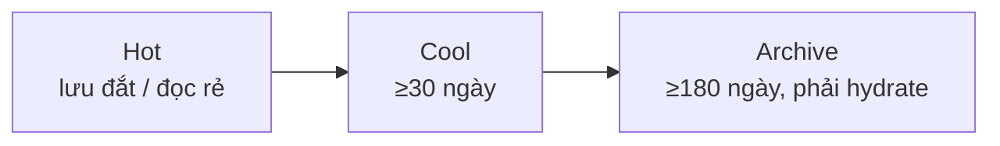

# Azure Storage

> [!summary] TL;DR
> Dịch vụ lưu trữ chính: **Blob** (file phi cấu trúc — ảnh/video/doc; blob nằm trong **container**; 3 loại: block/append/page), **Disks** (đĩa cho VM: OS disk & data disk), **Files** (chia sẻ SMB `//server/share`). Blob có **3 tier** theo tần suất truy cập: **Hot / Cool / Archive** (lưu càng nguội → phí lưu càng rẻ, phí truy cập càng đắt). **Redundancy** (nhân bản chống mất dữ liệu): **LRS** (3 bản 1 datacenter) < **ZRS** (3 AZ) < **GRS** (LRS + LRS ở region xa) < **GZRS** (ZRS + LRS region xa). Đưa dữ liệu vào: **AzCopy** (CLI), **Storage Explorer** (GUI), **SAS token** (cấp quyền tạm), **Azure Migrate** & **Data Box** (di chuyển khối lượng lớn).

---

## 1. Các dịch vụ lưu trữ

| Dịch vụ | Lưu gì | Ghi chú |
|---|---|---|
| **Blob** | File phi cấu trúc (ảnh, video, doc) | Blob nằm trong **container** (≈ thư mục) |
| **Disks** | Đĩa cho VM (HDD/SSD) | **OS disk** tạo cùng VM; **data disk** cho dữ liệu bền |
| **Files** | Chia sẻ file qua **SMB** | Truy cập `//servername/sharename`; có **Azure File Sync** sync về server nội bộ cho nhanh |

**3 loại blob:** **Block** (file thường) · **Append** (tối ưu ghi nối tiếp, vd log) · **Page** (lưu VHD cho VM).

---

## 2. Storage tiers (cho blob)

| Tier | Dành cho | Phí lưu | Phí truy cập | Lưu tối thiểu |
|---|---|---|---|---|
| **Hot** | Truy cập thường xuyên | Cao | Thấp | — |
| **Cool** | Ít truy cập, giữ lâu | Thấp hơn | Cao hơn | 30 ngày |
| **Archive** | Lưu trữ dài hạn | **Thấp nhất** | **Cao nhất** | 180 ngày |

> Archive phải **"hydrate"** (chuyển về Hot/Cool) trước khi đọc — đảm bảo truy cập byte đầu trong ≤15 giờ. Xoá/đổi tier sớm hơn mức tối thiểu → phí phạt prorated.



---

## 3. Redundancy (nhân bản)

| Tuỳ chọn | Cách nhân bản | Phạm vi | Chống |
|---|---|---|---|
| **LRS** | 3 bản, cùng **1 datacenter** | Primary region | Lỗi đĩa/server (kém bền nhất) |
| **ZRS** | 3 bản, **3 AZ** khác nhau | Primary region | Mất 1 datacenter (fault) |
| **GRS** | LRS primary + **LRS** ở region xa | Đa region | **Disaster** cả region |
| **GZRS** | ZRS primary + LRS ở region xa | Đa region | Fault + disaster (bền nhất) |

- LRS/ZRS = **primary region redundancy** → fault tolerance, **không** lo disaster.
- GRS/GZRS = **multi-region redundancy** → chống thảm hoạ vùng. (Khớp đúng fault↔disaster ở [[05-Kien-truc-vat-ly-Regions-AZ]].)

---

## 4. Storage account & đưa dữ liệu vào

- **Storage account** chứa mọi object; loại khuyến nghị chung: **Standard general-purpose v2** (blob, files, queue, table; đủ mọi redundancy). Loại **Premium** (block blob / file share / page blob) dùng SSD cho hiệu năng cao.
- **Công cụ chuyển dữ liệu:**

| Công cụ | Kiểu | Dùng khi |
|---|---|---|
| **AzCopy** | CLI, scriptable | Tự động hoá, copy file/thư mục |
| **Storage Explorer** | GUI đa nền | Kéo–thả, đổi tier, tạo SAS |
| **SAS token** | Chuỗi cấp quyền tạm | Cho người khác truy cập có thời hạn/giới hạn quyền |
| **Azure Migrate** | Di trú server/DB/web app | Discovery → assess → migrate |
| **Data Box** | Thiết bị vật lý gửi qua bưu điện | **Khối lượng cực lớn** (TB→PB), mạng yếu/không có |

**Data Box họ 3 mức:** Data Box **Disk** (tới 5 SSD ~7TB, AES-128, 1 storage account) · Data Box (80TB, AES-256, tới 10 account) · Data Box **Heavy** (tới ~1PB).

> [!question] Phỏng vấn: "Cần độ bền cao nhất, chống cả thảm hoạ vùng — chọn redundancy nào?"
> **GZRS** — nhân 3 bản qua các AZ (ZRS) ở primary **và** thêm bản LRS ở region xa → chịu được cả lỗi datacenter (fault) lẫn thảm hoạ cả region (disaster). Nếu chỉ cần fault tolerance trong vùng thì ZRS đủ và rẻ hơn.

> [!question] Phỏng vấn: "Cần đẩy 500TB lên cloud, mạng yếu — làm sao?"
> Dùng **Azure Data Box** (Data Box/Data Box Heavy): Microsoft gửi thiết bị, copy dữ liệu rồi gửi trả, họ import vào storage. Nhanh & an toàn hơn truyền qua Internet (AzCopy) khi khối lượng quá lớn hoặc băng thông hạn chế.

---

```
★ Insight ─────────────────────────────────────
• Tier là bài toán "đánh đổi phí lưu vs phí đọc": dữ liệu ít đụng tới
  → Archive (lưu rẻ); dữ liệu nóng → Hot (đọc rẻ).
• Redundancy bám đúng tầng vật lý: L=datacenter, Z=availability zone,
  G=geo/region. Nhớ chữ cái là suy ra phạm vi bảo vệ.
• Data Box là minh hoạ vui mà thực tế: đôi khi "chở ổ cứng bằng xe
  tải" nhanh hơn truyền mạng — băng thông vật lý vẫn vô địch ở quy mô PB.
─────────────────────────────────────────────────
```

---

## Tự kiểm tra

1. Blob nằm trong gì? Kể 3 loại blob và công dụng.
2. Hot/Cool/Archive khác nhau ở phí lưu vs phí truy cập thế nào?
3. Giải nghĩa LRS/ZRS/GRS/GZRS theo chữ cái (L/Z/G).
4. Redundancy nào chống disaster, redundancy nào chỉ chống fault?
5. AzCopy vs Storage Explorer vs Data Box — chọn theo tiêu chí gì?

---

## Liên quan
- [[05-Kien-truc-vat-ly-Regions-AZ]] — AZ/region là cơ sở của ZRS/GRS
- [[07-Compute-VM-Container-Functions]] — OS disk/data disk của VM
- [[17-Azure-AI-Search]] — lưu nguồn dữ liệu cho RAG trên Blob
