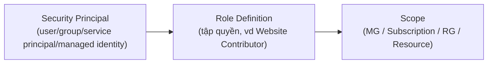

# Identity, Access & Security

> [!summary] TL;DR
> **Azure Active Directory (Azure AD / nay là Microsoft Entra ID)** là dịch vụ định danh đám mây: **Authentication** (xác thực — *bạn là ai*) vs **Authorization** (uỷ quyền — *bạn được làm gì*). Đối tượng: user, **service principal** (app), **managed identity** (đại diện resource Azure). Phương thức xác thực: **SSO** (đăng nhập một lần), **MFA** (đa yếu tố: *điều bạn biết / có / là*), **passwordless** (FIDO2, Authenticator, Windows Hello). **Conditional Access** áp chính sách theo tín hiệu (ai/ở đâu/thiết bị gì). **RBAC** kiểm soát *làm được gì* qua **security principal + role + scope** (cộng dồn — additive). Hai triết lý: **Zero Trust** ("luôn coi như đã bị xâm nhập", least privilege) & **Defense in Depth** (phòng thủ nhiều lớp — "castle doctrine"). **Microsoft Defender for Cloud** giám sát & bảo vệ posture đa môi trường.

---

## 1. Authentication vs Authorization

| | Authentication (AuthN) | Authorization (AuthZ) |
|---|---|---|
| Trả lời | "Bạn **là ai**?" | "Bạn **được làm gì**?" |
| Ví dụ | Đăng nhập bằng mật khẩu/MFA | RBAC cho quyền sửa web app |

**Azure AD / Entra ID** xử lý cả hai; cấp quyền cho cả resource Azure, app bên thứ ba, và on-prem. Đối tượng định danh:
- **User** — người dùng.
- **Service principal** — một **application** trong Entra ID.
- **Managed identity** — service principal đặc biệt đại diện một **resource Azure** (vd cho web app quyền truy cập VM mà không cần lưu credential).

> **Azure AD DS** (Domain Services) = bản Windows Active Directory chạy trong cloud (managed domain) — cho hệ thống legacy cần authentication kiểu cũ hoặc lift-and-shift app phụ thuộc AD.

---

## 2. Phương thức xác thực

- **SSO (Single Sign-On):** đăng nhập một lần dùng credential OS cho mọi resource; nối on-prem qua **Azure AD Connect** (password hash sync hoặc pass-through authentication).
- **MFA (Multi-Factor Authentication):** kết hợp ≥2 yếu tố:

| Yếu tố | Ví dụ |
|---|---|
| **Điều bạn biết** | mật khẩu, PIN |
| **Điều bạn có** | điện thoại, security key sinh mã |
| **Điều bạn là** | vân tay, khuôn mặt, võng mạc (biometrics) |

  > Azure MFA dùng **2 yếu tố**. MFA cần gói **Entra ID Premium** (bản free không có).
- **Passwordless:** thay "điều bạn biết" bằng: **FIDO2** security key, **Microsoft Authenticator** app, SMS, Temporary Access Pass (TAP), certificate, **Windows Hello for Business**.

---

## 3. Conditional Access & RBAC

- **Conditional Access:** dùng **tín hiệu** (người dùng, vị trí, thiết bị, OS, app, rủi ro real-time) để **quyết định**: cho vào / chặn / buộc MFA / yêu cầu thiết bị tuân thủ… Đặc biệt quan trọng khi nhân viên dùng thiết bị cá nhân (BYOD).

- **RBAC (Role-Based Access Control)** = 3 thành phần:



| Thành phần | Là gì |
|---|---|
| **Security principal** | Đối tượng được gán quyền (user/group/app/managed identity) |
| **Role definition** | Tập permission (có role dựng sẵn: Owner/Contributor/Reader… + role tự tạo) |
| **Scope** | Nơi gán (gán ở RG → áp cho mọi resource trong RG) |

> ⚠️ RBAC **cộng dồn (additive)**: gán Owner ở RG rồi gán role hạn chế hơn cho 1 resource bên trong → role hạn chế **không có tác dụng** (quyền rộng vẫn thắng).

---

## 4. Zero Trust, Defense in Depth, Defender for Cloud

- **Zero Trust:** giả định **mọi truy cập đều là một cuộc xâm nhập**; xác thực bằng MFA + Conditional Access; thiết kế **least privilege** (chỉ cấp mức quyền tối thiểu cần thiết).
- **Defense in Depth ("castle doctrine"):** phòng thủ **nhiều lớp** (tường thành → hào nước → cung thủ → lính trong thành). Một lớp thủng vẫn còn lớp khác. Các lớp: data, application, compute, network, perimeter, identity, physical.
- **Microsoft Defender for Cloud:** giám sát & đánh giá **security posture** liên tục, cảnh báo real-time, hướng dẫn best practice; bảo vệ cả on-prem & cloud khác; hỗ trợ compliance (HIPAA, GDPR…).

> [!question] Phỏng vấn: "AuthN khác AuthZ thế nào?"
> **Authentication** xác minh **danh tính** ("bạn là ai" — đăng nhập). **Authorization** xác định **quyền hạn** sau khi đã xác thực ("bạn được làm gì" — RBAC). Phải authenticate trước rồi mới authorize.

> [!question] Phỏng vấn: "RBAC additive nghĩa là gì, có bẫy gì?"
> Quyền **cộng dồn**: hiệu lực = hợp của các role được gán ở mọi scope cha. Bẫy: gán role rộng (Owner) ở scope trên (RG) rồi muốn "thu hẹp" bằng role hẹp ở resource con → **không hiệu quả**, quyền rộng vẫn còn. Muốn hạn chế phải bỏ role rộng, không thể "ghi đè giảm".

> [!question] Phỏng vấn: "Managed identity giải quyết vấn đề gì?"
> Cho phép một resource Azure (vd web app) truy cập resource khác (vd Key Vault/VM) **mà không cần lưu credential/secret trong code**. Azure quản lý vòng đời identity → giảm rủi ro lộ secret. Đây là service principal đại diện resource.

---

```
★ Insight ─────────────────────────────────────
• AuthN→AuthZ là trình tự bắt buộc: cổng (xác thực) rồi mới tới nội
  quy (quyền). RBAC là tầng AuthZ điển hình trong Azure.
• Zero Trust + Defense in Depth bổ trợ nhau: ZT là tư duy ("không tin
  mặc định"), DiD là kiến trúc ("nhiều lớp"). MFA & least privilege là
  điểm giao của cả hai.
• "Data + identity luôn là của bạn" (shared responsibility) chính là
  lý do cả module này tồn tại — bảo mật danh tính là phần KHÔNG cloud
  nào gánh thay bạn.
─────────────────────────────────────────────────
```

---

## Tự kiểm tra

1. Phân biệt authentication và authorization, cái nào trước?
2. Service principal vs managed identity khác nhau ở đâu?
3. Ba yếu tố của MFA? Azure MFA dùng mấy yếu tố?
4. RBAC gồm 3 thành phần nào? "Additive" gây bẫy gì?
5. Zero Trust và Defense in Depth — mỗi cái là tư duy hay kiến trúc?

---

## Liên quan
- [[01-Tong-quan-Cloud-Shared-Responsibility]] — data & identity luôn thuộc về bạn
- [[12-Governance-Blueprints-Policy-Locks]] — RBAC vs Policy vs Lock (3 cơ chế quản trị)
- [[16-Azure-OpenAI-Service]] — dùng managed identity gọi Azure OpenAI an toàn
