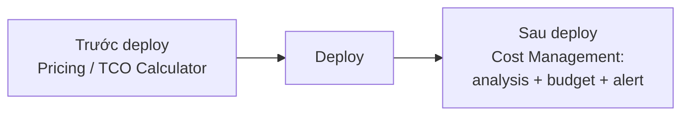

# Quản lý chi phí trong Azure

> [!summary] TL;DR
> Yếu tố ảnh hưởng chi phí: **meters** (đo theo thao tác/dung lượng/băng thông), **cách mua** (**Reservations** cam kết dài hạn, **Spot VM** tận dụng dung lượng dư — rẻ tới 90%, **Hybrid Benefit** mang license riêng), và **region** (giá khác nhau theo vùng). Hai công cụ ước tính **trước**: **Pricing Calculator** (ước giá dịch vụ Azure) vs **TCO Calculator** (so sánh tiết kiệm khi chuyển từ on-prem sang Azure). Sau khi deploy: **Cost Management + Billing** (phân tích, forecast, **budget** & **alert**). **Tags** (cặp name-value) phân loại chi phí trên hoá đơn.

---

## 1. Yếu tố ảnh hưởng chi phí

| Yếu tố | Chi tiết |
|---|---|
| **Meters** | Tính theo mức dùng: thao tác (copy/rename file), băng thông/GB truyền, dung lượng… (vd blob có 2 meter: thao tác + truyền dữ liệu) |
| **Cách mua** | **Reservations** (cam kết 1–3 năm, giảm giá VM); **Spot VM** (dùng dung lượng dư, rẻ tới ~90%, có thể bị thu hồi); **Hybrid Benefit** (mang license Windows/SQL Server) |
| **Region** | Giá điện/hạ tầng khác nhau → cùng dịch vụ, region khác giá khác |

> Mỗi loại resource có **pricing page** riêng — luôn xem trước khi triển khai.

---

## 2. Hai calculator (ước tính TRƯỚC khi deploy)

| | Pricing Calculator | TCO Calculator |
|---|---|---|
| Mục đích | Ước **giá** các dịch vụ Azure | So sánh **tiết kiệm** khi chuyển on-prem → Azure |
| Đầu vào | Chọn dịch vụ, region, mức dùng | Khai workload on-prem (server, DB, storage, network) + giả định chi phí |
| Kết quả | Bảng giá ước tính (lưu/chia sẻ/export) | So sánh chi phí on-prem vs Azure |
| Dùng khi | Triển khai mới trên Azure | Đang cân nhắc **di trú** từ on-prem |

> [!question] Phỏng vấn: "Pricing Calculator vs TCO Calculator chọn cái nào?"
> **Pricing Calculator** khi tạo dịch vụ **mới** trên Azure để ước giá. **TCO Calculator** khi muốn chứng minh **tiết kiệm bao nhiêu nếu chuyển** từ on-prem sang Azure (so sánh hai mô hình chi phí). Cả hai chỉ là **ước tính**, không phải báo giá cam kết.

---

## 3. Cost Management + Billing (SAU khi deploy)

- **Cost Analysis:** xem chi phí tích luỹ, **forecast** tháng, breakdown theo dịch vụ/region.
- **Budget:** đặt ngân sách theo chu kỳ.
- **Cost alert / anomaly alert:** cảnh báo khi sắp vượt ngưỡng → người liên quan được báo proactively.



---

## 4. Tags

- Cặp **name-value** gắn lên bất kỳ resource nào (vd `department=marketing`, `usage=AZ900`).
- Dùng để **lọc** view trong portal **và** xuất hiện trên **hoá đơn** → tách chi phí theo nhóm (phòng ban, dự án, công ty).
- Có thể áp tag tự động bằng **Azure Policy** (effect *append*) → xem [[12-Governance-Blueprints-Policy-Locks]].

> [!question] Phỏng vấn: "Làm sao tách chi phí theo phòng ban trên hoá đơn?"
> Dùng **tags** (vd `department=...`). Tag hiện trên hoá đơn nên có thể sort/filter chi phí theo nhóm. Để đảm bảo mọi resource đều có tag, dùng **Azure Policy** tự động gắn tag — kết hợp governance + cost management.

---

```
★ Insight ─────────────────────────────────────
• Chia trục thời gian: TRƯỚC deploy = calculator (dự báo); SAU deploy
  = Cost Management (theo dõi & cảnh báo). Đề thi hay hỏi đúng "trước/
  sau" này.
• Spot VM rẻ tới 90% nhưng có thể bị Azure thu hồi bất cứ lúc nào →
  chỉ hợp workload chịu gián đoạn (batch, test), không cho production
  cần ổn định.
• Tag là cầu nối giữa quản trị (Policy gắn tag) và kế toán (hoá đơn
  lọc theo tag) — một khái niệm bắc qua hai module.
─────────────────────────────────────────────────
```

---

## Tự kiểm tra

1. Kể 3 cách mua giúp tiết kiệm và đánh đổi của Spot VM.
2. Vì sao cùng một dịch vụ lại có giá khác nhau giữa các region?
3. Pricing vs TCO Calculator — phân biệt theo tình huống dùng.
4. Cost Management cung cấp những gì sau khi đã deploy?
5. Tag liên quan thế nào tới hoá đơn và tới Azure Policy?

---

## Liên quan
- [[02-Cloud-Models-Consumption]] — gốc "trả theo dùng" của bài toán chi phí
- [[06-To-chuc-tai-nguyen-Resource-Group-Management-Group]] — tag & RG cho hoá đơn
- [[12-Governance-Blueprints-Policy-Locks]] — Policy tự gắn tag, kiểm soát chi tiêu
