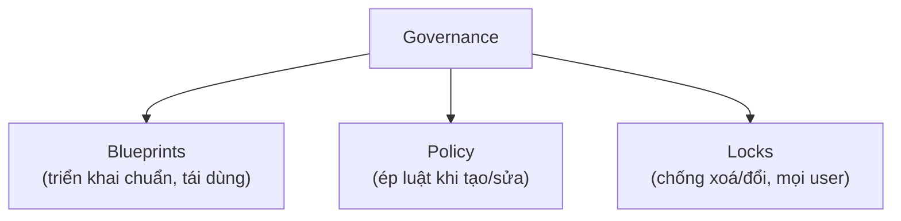

# Governance & Compliance

> [!summary] TL;DR
> Ba công cụ quản trị, đừng nhầm lẫn: **Azure Blueprints** = gói tái sử dụng (resource group, ARM template, policy, RBAC) để **triển khai lặp lại nhất quán** (workflow create → publish → assign). **Azure Policy** = **định nghĩa & ép luật** khi tạo/quản resource (vd "VM phải đúng size", "resource phải ở region X"); có **6 effects** (append, audit, audit-if-not-exists, deploy-if-not-exists, deny, disabled). **Resource Locks** = chống **đổi/xoá** resource; **áp cho mọi user** (khác RBAC theo role); 2 loại: **read-only** & **delete**.

---

## 1. Ba cơ chế quản trị — bảng phân biệt

| Công cụ | Trả lời câu hỏi | Áp cho |
|---|---|---|
| **Blueprints** | "Triển khai bộ tài nguyên chuẩn thế nào?" | Subscription/MG (gói có thể tái dùng) |
| **Azure Policy** | "Resource có được tạo/cấu hình theo luật không?" | Resource khi create/update |
| **Resource Locks** | "Cấm ai đó đổi/xoá resource này" | **Mọi user** (kể cả Owner) |
| RBAC ([[10-Identity-Security-AzureAD-RBAC]]) | "User được làm gì?" | Theo role gán cho principal |

---

## 2. Azure Blueprints

- Gói **artifacts** tái dùng: entire resource groups, **ARM templates**, **Azure Policy assignments**, **RBAC role assignments**.
- Workflow: **Create → Publish → Assign**. Lưu ở subscription/management group; assign vào subscription → mọi resource trong blueprint được tạo tự động.

## 3. Azure Policy & 6 effects

Định nghĩa & **ép** rule (vd: mọi VM cùng size; mọi resource ở region cho phép; nếu deploy X thì phải kèm Y).

| Effect | Tác dụng |
|---|---|
| **Append** | Thêm property cho resource (vd tự gắn tag) |
| **Audit** | Ghi **warning** nếu không tuân (không chặn) |
| **AuditIfNotExists** | Cảnh báo nếu thiếu resource đi kèm |
| **DeployIfNotExists** | **Tự deploy** resource đi kèm còn thiếu |
| **Deny** | **Chặn** thao tác create/update |
| **Disabled** | Policy bị tắt |

> [!question] Phỏng vấn: "Muốn cấm tạo VM ngoài region cho phép — dùng gì?"
> **Azure Policy** với effect **Deny**: định nghĩa rule giới hạn region hợp lệ; thao tác tạo VM ở region khác sẽ bị **chặn**. Nếu chỉ muốn ghi nhận vi phạm mà không chặn thì dùng effect **Audit**.

---

## 4. Resource Locks

- Chống **đổi/xoá** ngoài ý muốn; **áp cho tất cả user**, không theo role.
- 2 loại:

| Loại lock | Cho phép | Cấm |
|---|---|---|
| **Read-only** | chỉ đọc | mọi thay đổi **và** xoá |
| **Delete** | đọc & sửa | **xoá** |

> [!question] Phỏng vấn: "RBAC vs Resource Lock khác nhau thế nào?"
> **RBAC** kiểm soát theo **role** gán cho từng principal ("ai được làm gì"). **Resource Lock** áp **cho mọi người** bất kể role, để chống **xoá/đổi nhầm** một resource quan trọng. Ngay cả Owner cũng bị lock chặn (muốn xoá phải gỡ lock trước). Hai cơ chế bổ trợ: RBAC giới hạn quyền, Lock bảo vệ tài sản trọng yếu khỏi tai nạn.



---

```
★ Insight ─────────────────────────────────────
• Bộ ba dễ nhầm: Blueprint = "khuôn đúc" (triển khai), Policy = "luật"
  (tuân thủ), Lock = "khoá" (bảo vệ). Ba mục đích khác hẳn nhau.
• Policy effect Deny ≠ Audit: Deny CHẶN, Audit chỉ GHI cảnh báo. Câu
  hỏi tình huống thường phân biệt "ngăn chặn" vs "phát hiện".
• Lock thắng cả RBAC Owner: đó là chủ ý — bảo vệ tài sản sống còn khỏi
  thao tác nhầm, độc lập với hệ thống phân quyền.
─────────────────────────────────────────────────
```

---

## Tự kiểm tra

1. Blueprints, Policy, Locks — mỗi cái giải quyết vấn đề gì?
2. Workflow của Blueprints gồm mấy bước?
3. Kể 6 effect của Azure Policy; Deny khác Audit ra sao?
4. Read-only lock vs delete lock cho/cấm gì?
5. Vì sao Lock áp cho cả Owner trong khi RBAC thì không?

---

## Liên quan
- [[10-Identity-Security-AzureAD-RBAC]] — RBAC (ai làm gì) vs Lock (cấm mọi người)
- [[11-Quan-ly-chi-phi]] — Policy effect Append tự gắn tag chi phí
- [[13-Cong-cu-quan-ly-CLI-ARM-Arc]] — ARM template là artifact trong Blueprint
