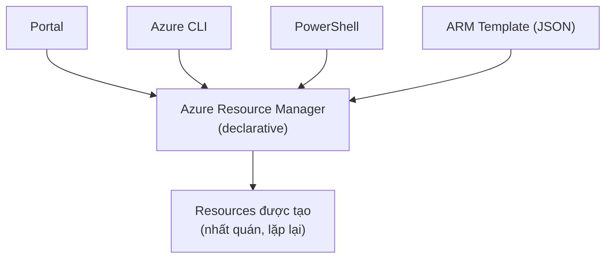

# Công cụ quản lý & triển khai tài nguyên

> [!summary] TL;DR
> Tạo/quản resource bằng: **Azure Portal** (web, dashboard tuỳ biến), **Azure PowerShell** (module **AZ**) & **Azure CLI** (`az ...`) — cả hai đa nền tảng, **scriptable**; **Cloud Shell** (PowerShell/Bash ngay trong browser, cả trên mobile). **Azure Arc** **mở rộng** quản lý & governance của Azure ra resource **ngoài Azure** (on-prem / cloud khác). Bên dưới mọi cách trên là **ARM (Azure Resource Manager)** — hệ thống tạo/quản resource dùng **declarative syntax**; **ARM templates** là file **JSON** khai báo "cần gì" để deploy **nhất quán, lặp lại được**.

---

## 1. Các công cụ

| Công cụ | Kiểu | Đặc điểm |
|---|---|---|
| **Azure Portal** | Web GUI | Tuỳ biến cao, **dashboard** lưu theo subscription (xem ở máy nào cũng có) |
| **Azure PowerShell** | CLI (module **AZ**) | Hợp người quen PowerShell; scriptable |
| **Azure CLI** | CLI (`az ...`) | Hợp người quen shell Linux/macOS; scriptable |
| **Cloud Shell** | Shell trong browser | PowerShell **hoặc** Bash; không cần cài; chạy được trên **mobile** (Azure app); lưu vào storage account |

- PowerShell vs CLI chỉ là **sở thích**; cả hai chạy trên Windows/Linux/macOS và đều có thể script hoá để deploy phức tạp.
- Cloud Shell lưu file/module vào **storage account** → khả dụng ở mọi phiên.

```
# Azure CLI (Bash)
az resource list --output table
az vm create --resource-group AZ900 --name VM1 --image Ubuntu2204

# Azure PowerShell (AZ module)
Get-AzResource | Format-Table Name, Location
```

---

## 2. Azure Arc

- **Mở rộng** quản lý & governance của Azure ra **ngoài** Azure: server vật lý/VM **on-prem hoặc cloud khác**, Kubernetes, data services (SQL MI, PostgreSQL).
- Server đưa vào Arc trở thành **hybrid machine**, được gán **Azure resource ID** → có thể bỏ vào resource group, áp **Policy/RBAC** như resource Azure thật. Hoạt động qua **Azure connected machine agent**.

> [!question] Phỏng vấn: "Quản lý server on-prem bằng công cụ Azure (Policy, RBAC) — làm sao?"
> Dùng **Azure Arc**: cài connected machine agent lên server on-prem, nó được gán Azure resource ID và xuất hiện như một resource Azure → áp được Policy, RBAC, tag, giám sát… cho cả tài nguyên ngoài Azure. Đây là chìa khoá quản trị **hybrid/multi-cloud** thống nhất.

---

## 3. ARM & ARM templates

- **ARM (Azure Resource Manager):** hệ thống nền cho **mọi** thao tác tạo/quản resource (Portal, CLI, PowerShell đều gọi xuống ARM). Đảm bảo **predictability & repeatability**.
- **Declarative syntax:** bạn khai báo **"cần cái gì"** (what), không phải "làm thế nào" (how) — ARM tự lo cách thực hiện.
- **ARM template:** file **JSON** khai báo các operation → deploy **nhất quán, lặp lại**; có **parameters** để tái dùng (truyền tên VM… lúc deploy). Có thể export template từ resource sẵn có trong portal.



> [!question] Phỏng vấn: "Declarative vs imperative trong triển khai hạ tầng?"
> **Declarative** (ARM template): mô tả **trạng thái mong muốn** ("cần 1 VM, 1 VNet…"), hệ thống tự tính cách đạt tới → idempotent, lặp lại an toàn. **Imperative** (script lệnh tuần tự): liệt kê **từng bước** phải làm. ARM/IaC ưu tiên declarative vì đảm bảo deploy nhất quán dù chạy nhiều lần.

---

```
★ Insight ─────────────────────────────────────
• Mọi con đường đều dẫn về ARM: Portal/CLI/PowerShell/Template chỉ là
  các "mặt tiền", bên dưới cùng một engine → kết quả nhất quán.
• Declarative = "đặt món", không phải "đứng bếp": bạn nói cần gì, ARM
  lo cách nấu. Đây là tinh thần của Infrastructure as Code.
• Azure Arc xoá ranh giới "trong/ngoài Azure": gán resource ID cho máy
  on-prem để quản trị thống nhất — nền cho chiến lược hybrid.
─────────────────────────────────────────────────
```

---

## Tự kiểm tra

1. PowerShell (AZ) vs CLI (`az`) khác nhau chủ yếu ở đâu?
2. Cloud Shell có gì đặc biệt so với cài CLI cục bộ?
3. Azure Arc giải quyết bài toán gì?
4. ARM là gì, "declarative syntax" nghĩa là sao?
5. ARM template viết bằng định dạng nào, lợi ích parameters?

---

## Liên quan
- [[06-To-chuc-tai-nguyen-Resource-Group-Management-Group]] — ARM quản resource/RG
- [[12-Governance-Blueprints-Policy-Locks]] — ARM template là artifact của Blueprint
- [[14-Monitoring-Advisor-Monitor]] — giám sát sau khi triển khai
