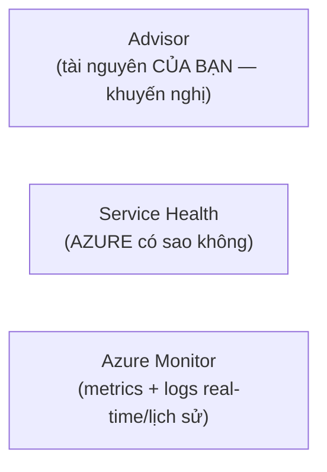

# Monitoring trong Azure

> [!summary] TL;DR
> Ba công cụ giám sát, phân biệt theo **đối tượng**: **Azure Advisor** = khuyến nghị **về tài nguyên CỦA BẠN** (cost, security, reliability, performance, operational excellence) — có **advisor score**, đôi khi "fix it" tự động. **Azure Service Health** = tình trạng **của chính Azure** (sự cố dịch vụ, bảo trì theo lịch) — tự scope về region bạn đang dùng. **Azure Monitor** = thu thập **metrics & logs** real-time + lịch sử cho VM/web app; mở rộng bằng **Application Insights** (instrument app) và **Log Analytics** (truy vấn lịch sử bằng **KQL — Kusto Query Language**).

---

## 1. Phân biệt 3 công cụ

| Công cụ | Giám sát gì | Output |
|---|---|---|
| **Azure Advisor** | Tài nguyên **của bạn** | Khuyến nghị + **advisor score**, đôi khi fix tự động |
| **Service Health** | **Azure** (dịch vụ Microsoft) | Sự cố, bảo trì theo lịch, root cause |
| **Azure Monitor** | Hiệu năng/log tài nguyên của bạn | Metrics, logs, alerts, dashboards |



---

## 2. Azure Advisor

- Đề xuất cải thiện theo **5 trục**: **Cost, Security, Reliability, Operational Excellence, Performance**.
- **Advisor score** (vd 89%) cho biết mức tối ưu; có bước **remediation** thủ công, đôi khi nút **"fix it"** tự sửa.

## 3. Azure Service Health

- Thông tin **sự cố Azure** & **bảo trì theo lịch**, tự **scope** về region bạn có resource. Có **root cause analysis**, xuất PDF, theo dõi qua QR trên mobile. (Khác Advisor: đây là "Azure có vấn đề", không phải "bạn cấu hình sai".)

## 4. Azure Monitor

- **Metrics** cho VM/web app, tạo **custom view** & **dashboard**.
- **Application Insights:** tự instrument web app, Azure Functions, VM (kể cả on-prem) → failed requests, response time…
- **Log Analytics:** môi trường phân tích **dữ liệu lịch sử**, truy vấn bằng **KQL (Kusto Query Language)**.
- Tạo **alert** để tự thông báo người phụ trách khi có bất thường.

> [!question] Phỏng vấn: "App của tôi chậm — Advisor, Service Health hay Monitor?"
> **Azure Monitor** (+ Application Insights) để xem metrics/log hiệu năng app của bạn (response time, failed requests) và đặt alert. **Service Health** chỉ dùng nếu nghi sự cố nằm ở **chính Azure**. **Advisor** đưa khuyến nghị tối ưu chung, không phải để debug real-time. → mẹo: "của tôi (cấu hình)?" = Advisor; "của Azure?" = Service Health; "số liệu real-time?" = Monitor.

> [!question] Phỏng vấn: "KQL dùng để làm gì?"
> **Kusto Query Language** là ngôn ngữ truy vấn của **Log Analytics** (trong Azure Monitor), dùng để phân tích **dữ liệu log lịch sử** đã thu thập, dựng view hiệu năng phức tạp. Tư duy giống SQL nhưng tối ưu cho log/telemetry quy mô lớn.

---

```
★ Insight ─────────────────────────────────────
• Mẹo 3 câu hỏi: "tôi cấu hình tối ưu chưa?" → Advisor; "Azure có sự
  cố?" → Service Health; "số liệu vận hành thế nào?" → Monitor.
• Application Insights "miễn phí từ trên trời rơi xuống": bật web app
  là có sẵn metrics cơ bản, không cần cấu hình thủ công.
• Advisor score = "điểm tín nhiệm hạ tầng" theo 5 trục — security
  thường là phần kéo điểm xuống nhiều nhất, ưu tiên xử lý trước.
─────────────────────────────────────────────────
```

---

## Tự kiểm tra

1. Advisor, Service Health, Monitor — mỗi cái giám sát đối tượng nào?
2. Kể 5 trục khuyến nghị của Azure Advisor.
3. Service Health khác Advisor ở chỗ căn bản nào?
4. Application Insights và Log Analytics thuộc công cụ nào, làm gì?
5. KQL là gì, dùng ở đâu?

---

## Liên quan
- [[03-Loi-ich-dam-may]] — manageability: giám sát là một lợi ích cloud
- [[13-Cong-cu-quan-ly-CLI-ARM-Arc]] — dashboard portal hiển thị metrics Monitor
- [[11-Quan-ly-chi-phi]] — Cost Management & budget alert (giám sát chi phí)
