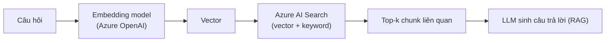

# Azure AI Search

> [!summary] TL;DR
> **Azure AI Search** (trước là Azure Cognitive Search) là dịch vụ tìm kiếm có quản lý, hỗ trợ **vector search**, **keyword (BM25)** và **hybrid search** + **semantic ranking** → là **vector store** điển hình cho **RAG** trên Azure. Khái niệm: **index** (lược đồ field, trong đó field kiểu `Collection(Edm.Single)` lưu vector), **indexer** (tự nạp dữ liệu từ nguồn như Blob), **vector field** + thuật toán **HNSW** cho ANN. Đây là **tương đương Azure của Amazon S3 Vectors** trong nhánh đề thi.

---

## 1. Khái niệm cốt lõi

| Khái niệm | Vai trò |
|---|---|
| **Index** | Lược đồ (schema) các field, gồm field vector lưu embedding |
| **Document** | Một bản ghi trong index (vd 1 chunk văn bản + vector + metadata) |
| **Vector field** | Field lưu embedding; dùng **HNSW** (ANN) để tìm gần nhất |
| **Indexer** | Pipeline tự nạp & cập nhật dữ liệu từ nguồn (Blob, SQL…) |
| **Hybrid search** | Kết hợp vector + keyword (BM25) |
| **Semantic ranker** | Xếp hạng lại kết quả theo ngữ nghĩa |

---

## 2. Ba kiểu tìm kiếm

| Kiểu | Dựa trên | Mạnh khi |
|---|---|---|
| **Keyword (BM25)** | Khớp từ khoá | Truy vấn chính xác, thuật ngữ |
| **Vector** | Khoảng cách embedding | Khớp **ngữ nghĩa**, diễn đạt khác từ |
| **Hybrid** | Cả hai + semantic rank | RAG chất lượng cao (khuyến nghị) |



> [!question] Phỏng vấn: "Vì sao RAG nên dùng hybrid search?"
> Vector search bắt **ngữ nghĩa** (câu hỏi diễn đạt khác từ tài liệu vẫn khớp) nhưng có thể bỏ sót **từ khoá chính xác** (mã sản phẩm, tên riêng). Keyword/BM25 ngược lại. **Hybrid** kết hợp cả hai + semantic ranker → recall & precision tốt hơn cho RAG.

> [!question] Phỏng vấn: "Đối chiếu Azure AI Search với Amazon S3 Vectors?"
> Cùng vai trò **vector store cho RAG** trên cloud tương ứng. Azure AI Search là dịch vụ search đầy đủ (vector + keyword + semantic + indexer tự nạp). Amazon S3 Vectors (nhánh đề thi) là khả năng lưu/truy vấn vector tích hợp S3, dùng qua `langchain-aws`. Cùng pattern RAG: embed → lưu vector → ANN truy vấn top-k → đưa vào LLM.

---

```
★ Insight ─────────────────────────────────────
• HNSW (Hierarchical Navigable Small World) là thuật toán ANN phổ biến
  cho vector search — đánh đổi độ chính xác lấy tốc độ ở quy mô lớn.
• Indexer là điểm cộng lớn của Azure AI Search: tự kéo dữ liệu từ Blob
  & cập nhật, đỡ phải tự viết pipeline nạp embedding.
• Pattern RAG là BẤT BIẾN giữa các cloud; chỉ đổi tên dịch vụ (AI
  Search ↔ S3 Vectors, Azure OpenAI ↔ Bedrock). Học pattern, không học
  riêng một vendor.
─────────────────────────────────────────────────
```

---

## Tự kiểm tra

1. Index, indexer, vector field trong Azure AI Search là gì?
2. Keyword vs vector vs hybrid search — mỗi kiểu mạnh khi nào?
3. Vì sao hybrid search thường tốt nhất cho RAG?
4. Vẽ luồng RAG dùng Azure OpenAI + Azure AI Search.
5. Đối chiếu với Amazon S3 Vectors của nhánh đề thi.

---

## Liên quan
- [[16-Azure-OpenAI-Service]] — embedding & LLM cho pipeline RAG
- [[09-Storage-Blob-Disk-Files]] — Blob làm nguồn dữ liệu cho indexer
- [[../01-AWS-Bedrock/00-MOC-AWS-Bedrock]] — S3 Vectors (đối chiếu, bám đề thi)
