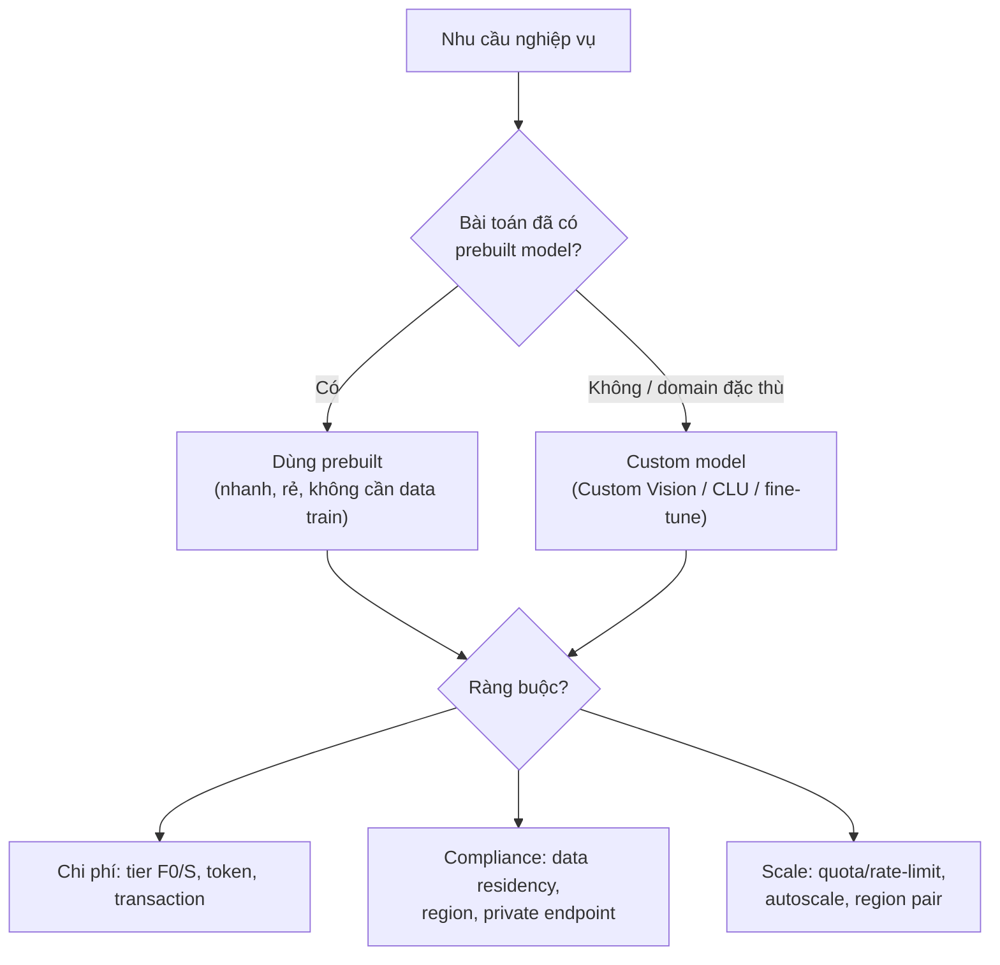
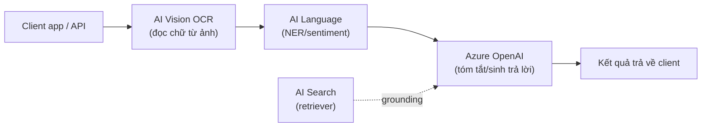

# Tổng quan & chọn dịch vụ Azure AI

> [!summary] TL;DR
> Azure gom các năng lực AI thành **danh mục dịch vụ** (mỗi dịch vụ giải một nhóm bài toán): **Azure OpenAI** (sinh/hiểu ngôn ngữ bằng LLM), **AI Vision** (ảnh/OCR), **AI Language** (NLP: sentiment/NER/intent), **AI Speech** (giọng nói ↔ văn bản), **AI Search** (tìm kiếm + RAG), **Document Intelligence** (trích xuất biểu mẫu/hoá đơn), **Content Safety** (kiểm duyệt). Khi tạo tài nguyên (resource) có 2 kiểu: **multi-service resource** (một tài nguyên *Azure AI Services* gộp nhiều dịch vụ chung **1 key + 1 endpoint** — tiện) hoặc **single-service resource** (mỗi dịch vụ một tài nguyên riêng — dễ tách billing/quyền/region). Chọn dịch vụ là bài toán **ràng buộc**: chi phí, tuân thủ (data residency/region), khả năng mở rộng, độ chính xác, và **build-vs-buy** — dùng **model dựng sẵn (prebuilt)** cho nhanh hay **train model riêng (custom)** khi nghiệp vụ đặc thù. **Azure AI Foundry** (trước là AI Studio) là *hub/portal* gom mọi tài nguyên AI thành **hub → project** để phát triển tập trung.

> **Thuật ngữ:** *resource* = tài nguyên Azure (một thực thể dịch vụ đã cấp phát, có key/endpoint riêng). *endpoint* = URL gốc để gọi API dịch vụ. *prebuilt model* = mô hình Microsoft huấn luyện sẵn, gọi là dùng ngay. *custom model* = mô hình bạn tự train trên dữ liệu của mình.

---

## 1. Bức tranh dịch vụ Azure AI

Vai trò **Azure AI Engineer** (đối tượng thi AI-102) là người **chọn đúng dịch vụ → cấu hình → tích hợp vào ứng dụng**, chứ không nhất thiết tự train model từ đầu (đó là việc của Data Scientist). Vì vậy bước đầu tiên luôn là **map nhu cầu nghiệp vụ ↔ dịch vụ**.

| Dịch vụ | Giải bài toán | Ví dụ use case | Note |
|---|---|---|---|
| **Azure OpenAI Service** | Sinh/tóm tắt/hiểu ngôn ngữ bằng **LLM** (GPT) + embeddings | Chatbot, summarize, RAG, sinh code | 12, [[../AI-Azure/16-Azure-OpenAI-Service]] |
| **Azure AI Vision** | Phân tích ảnh dựng sẵn + **OCR** (đọc chữ trong ảnh) | Mô tả ảnh, đọc CMND, kiểm kê | 4 |
| **Custom Vision** | Train model ảnh **riêng** (phân loại / phát hiện vật thể) | Phân loại lỗi sản phẩm trên dây chuyền | 5 |
| **Azure AI Language** | NLP: sentiment, **NER**, **PII**, tóm tắt, **CLU** (hiểu ý định) | Phân tích phản hồi khách, ẩn thông tin nhạy cảm | 6 |
| **Translator** | Dịch máy đa ngữ (100+ ngôn ngữ) | Dịch nội dung, app đa ngôn ngữ | 7 |
| **Azure AI Speech** | STT, TTS, dịch giọng nói, nhận dạng người nói | Caption, voice assistant, đọc văn bản | 8 |
| **Azure AI Search** | Tìm kiếm full-text + **vector/hybrid** → nền RAG | Tìm kiếm doc nội bộ, retriever cho LLM | 10, [[../AI-Azure/17-Azure-AI-Search]] |
| **Document Intelligence** | Trích xuất **có cấu trúc** từ hoá đơn/biểu mẫu/CMND | Tự động nhập liệu hoá đơn | 11 |
| **Content Safety** | Kiểm duyệt text/ảnh độc hại + chống prompt injection | Lọc nội dung user, kiểm duyệt LLM output | 3 |

> **NER** = Named Entity Recognition (nhận diện thực thể: tên người, địa danh, ngày…). **PII** = Personally Identifiable Information (thông tin định danh cá nhân). **CLU** = Conversational Language Understanding (hiểu ý định trong hội thoại). **OCR** = Optical Character Recognition (nhận dạng ký tự quang học — đọc chữ từ ảnh).

---

## 2. Single-service vs Multi-service resource

Khi cấp phát tài nguyên AI trong Azure, bạn chọn 1 trong 2 kiểu — đây là điểm **rất hay hỏi**:

| Tiêu chí | **Multi-service** (*Azure AI Services*) | **Single-service** |
|---|---|---|
| Phạm vi | Một tài nguyên dùng cho **nhiều** dịch vụ (Vision + Language + Speech…) | Một tài nguyên cho **một** dịch vụ |
| Key / endpoint | **Dùng chung 1 key + 1 endpoint** | Mỗi dịch vụ key/endpoint **riêng** |
| Billing | Gộp hoá đơn (khó tách chi phí theo dịch vụ) | **Tách bạch** chi phí từng dịch vụ |
| Phân quyền / region | Khó tinh chỉnh riêng | Linh hoạt theo từng dịch vụ |
| Free tier (F0) | Thường **không** | Nhiều dịch vụ có F0 riêng để thử |
| Chọn khi | Prototype nhanh, dùng nhiều dịch vụ chung 1 app | Production cần tách billing/quyền/region rõ ràng |

> [!tip] Quy tắc nhớ
> **Multi-service = tiện** (ít key phải quản), **Single-service = kiểm soát** (tách chi phí, quyền, region). Production nghiêm túc thường thiên về single-service vì governance.

---

## 3. Tiêu chí chọn dịch vụ (cost / compliance / scale)

Đề thi luôn cho một **kịch bản nghiệp vụ** rồi hỏi chọn dịch vụ/cấu hình nào. Khung suy nghĩ:



- **Build vs Buy:** ưu tiên **prebuilt** (gọi API là xong) trừ khi nghiệp vụ quá đặc thù (ảnh lỗi sản phẩm riêng, intent hội thoại riêng) thì mới **custom**. Custom tốn dữ liệu + công train + quản vòng đời model.
- **Cost:** chọn tier (F0 free giới hạn / S trả phí), với OpenAI là **chi phí theo token**. Cân nhắc cache + batch.
- **Compliance:** dữ liệu phải nằm ở **region** nào (data residency)? Có cần **private endpoint** (không ra internet)? → liên kết [[02-Bao-mat-Giam-sat-Van-hanh-AI]].
- **Scale & độ chính xác:** quota/rate-limit (lỗi **429** khi vượt), khả năng autoscale, và độ chính xác model có đạt SLA nghiệp vụ không.

---

## 4. Kiến trúc tham chiếu giải pháp AI

Một giải pháp AI thực tế thường **ghép nhiều dịch vụ** thành pipeline:



- Mẫu phổ biến: **RAG** = AI Search (tìm ngữ cảnh) → Azure OpenAI (sinh câu trả lời có dẫn nguồn). Xem [[../AI-Azure/17-Azure-AI-Search]] + [[../../../04-AI/01-AI-Fundamentals-RAG/02-RAG-Theoretical-Foundations]].
- **Azure AI Foundry** (hub → project) là nơi gom tài nguyên (model deployment, AI Search, storage, content safety) cho cả team dùng chung, kèm playground để thử nghiệm trước khi viết code.

> [!question] Phỏng vấn: "Khi nào dùng prebuilt model, khi nào train custom?"
> Mặc định **prebuilt** vì nhanh, rẻ, không cần dữ liệu train và Microsoft đã tối ưu (ví dụ OCR, sentiment, dịch). Chỉ chuyển sang **custom** (Custom Vision, custom CLU, fine-tune OpenAI) khi nghiệp vụ **đặc thù** mà prebuilt không nhận đúng — ví dụ phân loại lỗi linh kiện riêng của nhà máy, hoặc intent hội thoại riêng của sản phẩm. Đánh đổi: custom cần dữ liệu gán nhãn + công huấn luyện + quản vòng đời/độ chính xác model.

> [!question] Phỏng vấn: "Multi-service resource khác single-service ở điểm gì quan trọng nhất?"
> Multi-service gộp **1 key + 1 endpoint** cho nhiều dịch vụ (tiện prototype) nhưng **khó tách billing/quyền/region**; single-service mỗi dịch vụ một tài nguyên → **tách bạch chi phí, phân quyền, region** và có free tier riêng để thử — phù hợp production cần governance.

---

```
★ Insight ─────────────────────────────────────
• Vai trò AI-102 là "lắp ráp" dịch vụ AI chứ không train từ đầu:
  câu hỏi cốt lõi luôn là "dịch vụ nào + prebuilt hay custom".
• Multi vs single-service resource là đánh đổi tiện-lợi ↔ governance,
  giống Storage Account gộp vs tách ở AZ-900 — cùng tư duy.
• Mọi giải pháp AI thực tế là pipeline ghép nhiều dịch vụ; nhớ mẫu
  RAG (AI Search → OpenAI) vì nó nối thẳng với domain 04-AI.
─────────────────────────────────────────────────
```

---

## Tự kiểm tra

1. Kể 6 dịch vụ Azure AI và bài toán mỗi cái giải.
2. Multi-service vs single-service resource — khác nhau về key/endpoint, billing, khi nào chọn cái nào?
3. Khung tiêu chí chọn dịch vụ gồm những ràng buộc gì? (gợi ý: cost/compliance/scale/build-vs-buy)
4. Khi nào nên train custom model thay vì prebuilt?
5. Azure AI Foundry (hub → project) dùng để làm gì?

---

## Liên quan
- [[00-MOC-AI-102]]
- [[02-Bao-mat-Giam-sat-Van-hanh-AI]] — bảo mật & vận hành dịch vụ vừa chọn
- [[../AI-Azure/16-Azure-OpenAI-Service]] — dịch vụ generative AI
- [[../AI-Azure/17-Azure-AI-Search]] — nền tảng tìm kiếm/RAG
