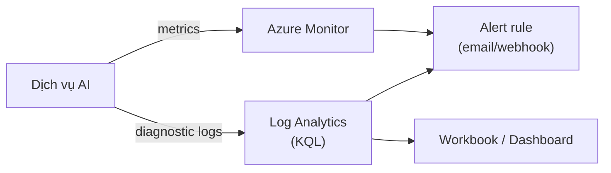

# Bảo mật, giám sát & vận hành dịch vụ AI

> [!summary] TL;DR
> Dịch vụ Azure AI gọi qua **endpoint + key**, nhưng **API key là cách yếu nhất** (key lộ là mất tất cả). Production nên dùng **Entra ID + Managed Identity**: app lấy **token** tự động từ Azure, không nhúng secret nào trong code; key xoay (rotate) tự động. Nếu buộc phải dùng key thì cất trong **Key Vault**, không hard-code. Về **mạng**: mặc định endpoint là public — siết lại bằng **firewall (IP allowlist)** hoặc **private endpoint** (chỉ truy cập trong VNet, không ra internet). Về **phân quyền**: gán **RBAC role** (ví dụ *Cognitive Services User* để gọi, *Contributor* để quản) thay vì phát key. Về **giám sát**: bật **diagnostic logs + metrics** đẩy vào **Azure Monitor / Log Analytics**, dựng **alert**. Về **tối ưu**: canh **quota/rate-limit** (vượt là lỗi **429 Too Many Requests** → cần retry/backoff), chọn tier/region hợp lý, **cache** kết quả lặp, **batch** request, và với OpenAI là **kiểm soát chi phí token** (TPM/quota).

> **Thuật ngữ:** *Managed Identity (MI)* = danh tính do Azure tự quản cho resource, dùng để lấy token truy cập dịch vụ khác **không cần secret**. *RBAC* = Role-Based Access Control (phân quyền theo vai trò). *429* = mã lỗi HTTP "quá nhiều request" (bị throttle). *TPM* = Tokens Per Minute (hạn mức token/phút của OpenAI).

---

## 1. Xác thực: API key vs Entra ID / Managed Identity

| Cách xác thực | Cơ chế | Ưu / Nhược |
|---|---|---|
| **API key** | Gửi key trong header `Ocp-Apim-Subscription-Key` | Đơn giản; **rủi ro lộ key**, phải tự rotate, không truy vết được "ai gọi" |
| **Entra ID token** | App lấy access token từ Entra ID rồi gọi API | An toàn hơn, có audit; cần cấu hình app registration |
| **Managed Identity** | Azure tự cấp danh tính cho resource → lấy token **không secret** | **An toàn nhất**: không key trong code, Azure tự xoay; chỉ chạy trên resource Azure |

```python
# Cách KHÔNG khuyến nghị: key cứng trong code
from azure.ai.textanalytics import TextAnalyticsClient
from azure.core.credentials import AzureKeyCredential
client = TextAnalyticsClient(endpoint, AzureKeyCredential(key))   # key lộ là mất

# Cách khuyến nghị: Managed Identity qua DefaultAzureCredential
from azure.identity import DefaultAzureCredential
cred = DefaultAzureCredential()   # trên Azure → dùng MI; ở local → dùng az login
client = TextAnalyticsClient(endpoint, cred)   # không secret nào trong code
```

> `DefaultAzureCredential` tự dò chuỗi cách lấy token (Managed Identity khi chạy trên Azure, Azure CLI/biến môi trường khi chạy local) — viết code một lần chạy cả hai môi trường. Xem thêm [[../AZ-204/07-Key-Vault-App-Configuration-Managed-Identity]].

- Nếu vẫn dùng key: cất trong **Key Vault**, app đọc qua MI (đừng để key trong app settings/source).

---

## 2. Bảo mật mạng (private endpoint, firewall)

| Mức | Cấu hình | Ý nghĩa |
|---|---|---|
| Mặc định | Public endpoint | Ai có key/token + URL đều gọi được qua internet |
| **Firewall** | IP allowlist | Chỉ dải IP cho phép gọi được |
| **Private endpoint** | Gắn IP riêng trong **VNet** | Lưu lượng đi nội bộ, **không ra internet** — an toàn nhất |
| VNet service endpoint | Mở dịch vụ cho subnet | Trung gian giữa firewall và private endpoint |

> [!tip] Compliance
> Yêu cầu "dữ liệu không được ra internet công cộng" → **private endpoint**. Kết hợp với chọn **region** đúng để thoả **data residency** (dữ liệu lưu trong lãnh thổ quy định).

---

## 3. RBAC cho dịch vụ AI

Thay vì phát API key cho mọi người, gán **role** cho user/app/MI (nguyên tắc least-privilege):

| Role | Cho phép |
|---|---|
| **Cognitive Services User** | Gọi API + đọc key (dùng dịch vụ) |
| **Cognitive Services Contributor** | Quản lý tài nguyên (tạo/sửa/xoá) |
| **Cognitive Services OpenAI User / Contributor** | Riêng cho Azure OpenAI (gọi model / quản deployment) |

- RBAC **additive** (cộng dồn) và kế thừa theo phạm vi (Management Group → Subscription → RG → Resource). Nền tảng xem [[../AZ-900/10-Identity-Security-AzureAD-RBAC]].

---

## 4. Giám sát & alert (Azure Monitor, diagnostic logs)



- **Metrics**: số request, độ trễ (latency), tỉ lệ lỗi, số lần bị throttle (429) — xem ngay trên blade Metrics.
- **Diagnostic logs**: bật để đẩy log chi tiết vào **Log Analytics**, truy vấn bằng **KQL**; hoặc lưu Storage / stream Event Hub.
- **Alert**: ví dụ "tỉ lệ 429 > 5% trong 5 phút" → cảnh báo để tăng quota/scale. Nền tảng monitoring xem [[../AZ-900/14-Monitoring-Advisor-Monitor]].

---

## 5. Tối ưu chi phí & hiệu năng (quota, 429, caching)

| Vấn đề | Cách xử lý |
|---|---|
| **429 Too Many Requests** | Vượt rate-limit/quota → **retry + exponential backoff**, xin tăng quota, scale ra nhiều resource/region |
| Chi phí cao | Chọn đúng **tier** (F0 thử / S production); **cache** kết quả lặp; **batch** nhiều input một request |
| Latency | Chọn **region** gần user; tránh round-trip thừa |
| Chi phí token (OpenAI) | Theo dõi **TPM/quota**, giảm prompt thừa, dùng model nhỏ khi đủ, cache câu hỏi lặp |

> [!question] Phỏng vấn: "Vì sao Managed Identity an toàn hơn API key?"
> API key là **bí mật tĩnh**: nhúng trong code/config dễ lộ (commit nhầm, log ra), phải tự rotate, và lộ là ai cũng gọi được. **Managed Identity** để Azure cấp **token ngắn hạn tự động**, **không có secret nào trong code**, Azure tự xoay, và mọi truy cập gắn danh tính → **audit được**. Đây là cách production nên dùng.

> [!question] Phỏng vấn: "Gặp lỗi 429 hàng loạt khi gọi dịch vụ AI, xử lý thế nào?"
> 429 = vượt **rate-limit/quota**. Trước mắt: **retry với exponential backoff** (lùi thời gian tăng dần) để không dội thêm. Dài hạn: **xin tăng quota**, **scale out** (nhiều resource/region rồi load-balance), **cache** kết quả lặp và **batch** request để giảm số lời gọi. Với OpenAI canh thêm **TPM**.

---

```
★ Insight ─────────────────────────────────────
• Thứ tự an toàn xác thực: Managed Identity > Entra token > key-trong-
  Key-Vault > key hard-code (cấm). Đề thi luôn ưu tiên MI.
• Bảo mật mạng nâng dần: public → firewall (IP) → private endpoint
  (VNet, không ra internet). "Không ra internet" = private endpoint.
• 429 không phải bug mà là tín hiệu quota: retry+backoff trước, rồi
  tăng quota/scale — đây là tư duy vận hành dịch vụ AI ở quy mô.
─────────────────────────────────────────────────
```

---

## Tự kiểm tra

1. Ba cách xác thực dịch vụ AI; vì sao Managed Identity an toàn nhất?
2. `DefaultAzureCredential` giúp gì khi chạy local vs trên Azure?
3. Public endpoint → private endpoint khác nhau gì? Khi nào bắt buộc private endpoint?
4. Role *Cognitive Services User* vs *Contributor* — khác quyền gì?
5. Lỗi 429 nghĩa là gì và chuỗi xử lý ngắn-hạn → dài-hạn?

---

## Liên quan
- [[00-MOC-AI-102]]
- [[01-Tong-quan-va-Chon-dich-vu-Azure-AI]] — chọn dịch vụ trước, bảo mật sau
- [[../AZ-900/10-Identity-Security-AzureAD-RBAC]] — nền tảng Entra ID / RBAC
- [[../AZ-900/14-Monitoring-Advisor-Monitor]] — nền tảng Azure Monitor
- [[../AZ-204/07-Key-Vault-App-Configuration-Managed-Identity]] — Managed Identity trong code
