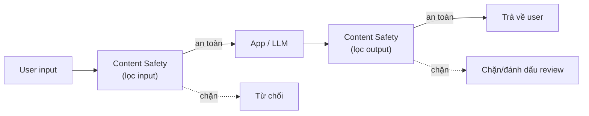

# Responsible AI & Content Safety

> [!summary] TL;DR
> **Responsible AI** là bộ **6 nguyên tắc** Microsoft dùng để xây AI có trách nhiệm: **Fairness** (công bằng, không thiên vị), **Reliability & Safety** (tin cậy & an toàn), **Privacy & Security** (riêng tư & bảo mật), **Inclusiveness** (bao trùm, ai cũng dùng được), **Transparency** (minh bạch, giải thích được), **Accountability** (chịu trách nhiệm — con người chịu trách nhiệm cuối). **Azure AI Content Safety** là dịch vụ hiện thực hoá nguyên tắc đó: kiểm duyệt **text & image** theo **4 nhóm hại** (Hate, Sexual, Violence, Self-harm) với **mức độ nghiêm trọng (severity)** 0/2/4/6, kèm **blocklist** tự định nghĩa. Cho thời đại LLM, Content Safety thêm: **Prompt Shields** (chặn **prompt injection / jailbreak**), **Groundedness detection** (phát hiện câu trả lời "bịa", không bám nguồn), **Protected material detection** (phát hiện trích nội dung có bản quyền/đoạn code bảo hộ). Quy trình thực tế: cắm Content Safety vào **cả input (lọc user) lẫn output (lọc LLM)** và dựng workflow **approve/reject** cho compliance.

> **Thuật ngữ:** *moderation* = kiểm duyệt nội dung. *severity* = mức độ nghiêm trọng của nội dung hại. *prompt injection / jailbreak* = thủ thuật nhét chỉ thị độc vào prompt để ép model phá luật. *groundedness* = mức độ câu trả lời **bám vào** nguồn dữ liệu cho trước (chống "ảo giác"/hallucination).

---

## 1. 6 nguyên tắc Responsible AI (Microsoft)

| Nguyên tắc | Ý nghĩa | Ví dụ áp dụng |
|---|---|---|
| **Fairness** | Không thiên vị theo giới/chủng tộc/tuổi… | Kiểm tra model tuyển dụng không loại nhóm nào |
| **Reliability & Safety** | Hoạt động ổn định, an toàn cả khi gặp input lạ | Test biên, fallback khi model không chắc |
| **Privacy & Security** | Bảo vệ dữ liệu cá nhân, chống rò rỉ | Ẩn **PII**, mã hoá, private endpoint |
| **Inclusiveness** | Phục vụ mọi người, kể cả người khuyết tật | Caption (STT), TTS, hỗ trợ đa ngôn ngữ |
| **Transparency** | Người dùng hiểu AI làm gì, vì sao | Nêu rõ "đây là AI", giải thích quyết định |
| **Accountability** | **Con người** chịu trách nhiệm cuối cùng | Có người duyệt, có cơ chế khiếu nại |

> [!tip] Nhớ nhanh
> **F-R-P-I-T-A**. Hai nguyên tắc bao trùm (meta) là **Transparency** và **Accountability** — chúng đảm bảo 4 nguyên tắc còn lại được thực thi và có người chịu trách nhiệm.

---

## 2. Azure AI Content Safety — kiến trúc & severity levels

**Content Safety** = API kiểm duyệt, đặt **trước/sau** ứng dụng để lọc nội dung:



**4 nhóm hại** (mỗi nhóm chấm điểm severity riêng): **Hate** (thù ghét), **Sexual** (tình dục), **Violence** (bạo lực), **Self-harm** (tự hại).

| Severity | Ý nghĩa | Xử lý gợi ý |
|---|---|---|
| **0** | An toàn | Cho qua |
| **2** | Thấp | Cho qua / ghi log |
| **4** | Trung bình | Cảnh báo / đưa người duyệt |
| **6** | Cao | Chặn |

> Ngưỡng (threshold) chặn do **bạn cấu hình** theo mức chấp nhận rủi ro của nghiệp vụ — ví dụ app trẻ em đặt ngưỡng thấp hơn.

---

## 3. Kiểm duyệt text & image

- **Text moderation** (Lesson 4): gửi đoạn text → trả về severity 4 nhóm hại + có khớp **blocklist** (danh sách từ cấm tự định nghĩa, ví dụ tên thương hiệu đối thủ, từ lóng nội bộ) hay không.
- **Image moderation** (Lesson 5): gửi ảnh → trả về severity 4 nhóm hại cho **nội dung hình ảnh** (kể cả ảnh có chữ — kết hợp OCR).
- **Blocklist** cho phép vượt khỏi 4 nhóm dựng sẵn để bắt nội dung **đặc thù domain**.

```python
# Kiểm duyệt text bằng Azure AI Content Safety
from azure.ai.contentsafety import ContentSafetyClient
from azure.ai.contentsafety.models import AnalyzeTextOptions
from azure.identity import DefaultAzureCredential

client = ContentSafetyClient(endpoint, DefaultAzureCredential())   # MI, không key
res = client.analyze_text(AnalyzeTextOptions(text="nội dung cần kiểm tra"))
for c in res.categories_analysis:        # duyệt 4 nhóm hại
    print(c.category, c.severity)        # ví dụ: Hate 0 / Violence 4 ...
```

---

## 4. Prompt Shields, Groundedness, Protected material

Bộ tính năng dành riêng cho **thời đại LLM** (rất hay hỏi vì gắn với generative AI):

| Tính năng | Chống gì | Cơ chế |
|---|---|---|
| **Prompt Shields** | **Prompt injection / jailbreak** (cả "direct" lẫn "indirect" qua tài liệu nhúng) | Phát hiện chỉ thị độc trong user prompt & nội dung tham chiếu |
| **Groundedness detection** | Câu trả lời **bịa**, không bám nguồn (hallucination) | So câu trả lời với tài liệu nguồn → cờ "không grounded" |
| **Protected material detection** | Trích nội dung **có bản quyền** (text/đoạn code bảo hộ) | Phát hiện output trùng tài liệu/đoạn code được bảo vệ |

- Cắm vào pipeline LLM: **Prompt Shields ở input**, **Groundedness + Protected material ở output**. Liên kết tấn công prompt injection: [[../../../04-AI/04-LangGraph-Agentic/03-Tool-Calling-Tavily]].
- Đây là phần **operationalize** của 6 nguyên tắc: Reliability & Safety + Privacy → có công cụ cụ thể.

> [!question] Phỏng vấn: "Kể 6 nguyên tắc Responsible AI và cái nào là 'bao trùm'?"
> Fairness, Reliability & Safety, Privacy & Security, Inclusiveness, Transparency, Accountability. Hai nguyên tắc **bao trùm** là **Transparency** (minh bạch — người dùng hiểu AI làm gì) và **Accountability** (con người chịu trách nhiệm cuối, có cơ chế giám sát) — chúng đảm bảo 4 nguyên tắc kia được thực thi.

> [!question] Phỏng vấn: "Content Safety phát hiện gì, và làm sao chống prompt injection cho chatbot LLM?"
> Content Safety chấm **severity (0/2/4/6)** cho **4 nhóm hại** (hate/sexual/violence/self-harm) trên cả text lẫn image, kèm **blocklist** tuỳ biến. Chống prompt injection dùng **Prompt Shields** đặt ở **input** (chặn chỉ thị độc trong prompt người dùng và trong tài liệu được nhúng), kết hợp **Groundedness detection** ở output để chặn câu trả lời bịa.

---

```
★ Insight ─────────────────────────────────────
• Responsible AI là "vì sao", Content Safety là "làm thế nào": 6
  nguyên tắc trừu tượng được hiện thực bằng API chấm severity cụ thể.
• Kiểm duyệt phải đặt ở CẢ input lẫn output: lọc user (input) và lọc
  cả model sinh ra (output) — chatbot LLM cần cả hai.
• Prompt Shields/Groundedness/Protected material là tầng phòng thủ
  của kỷ nguyên LLM — nối thẳng với prompt injection ở domain 04-AI.
─────────────────────────────────────────────────
```

---

## Tự kiểm tra

1. Kể đủ 6 nguyên tắc Responsible AI; hai nguyên tắc nào bao trùm?
2. Content Safety chấm điểm theo mấy nhóm hại, thang severity nào?
3. Blocklist dùng để làm gì mà 4 nhóm dựng sẵn không làm được?
4. Prompt Shields, Groundedness, Protected material — mỗi cái chống vấn đề gì?
5. Vì sao phải kiểm duyệt ở cả input lẫn output của một chatbot LLM?

---

## Liên quan
- [[00-MOC-AI-102]]
- [[12-Azure-OpenAI-Advanced]] — generative AI cần Content Safety bọc quanh
- [[../../../04-AI/04-LangGraph-Agentic/03-Tool-Calling-Tavily]] — Prompt Injection
