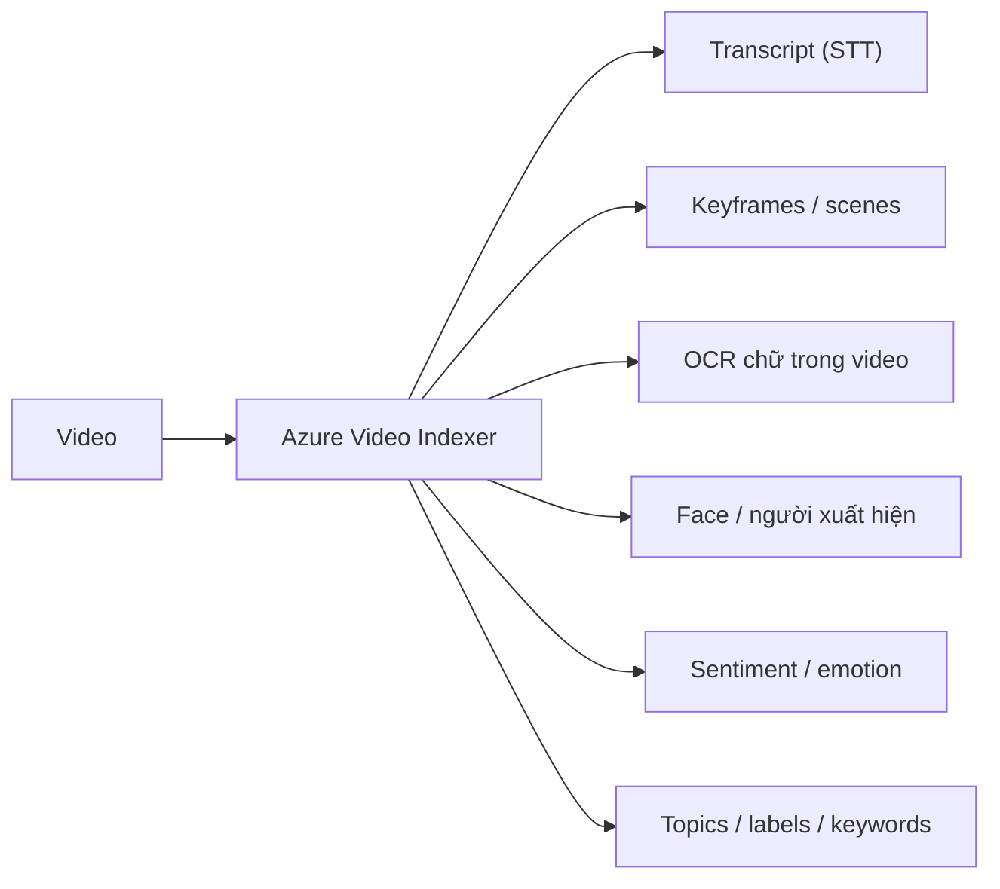

# Azure AI Vision (dựng sẵn + OCR) & Video Indexer

> [!summary] TL;DR
> **Azure AI Vision** là dịch vụ **thị giác máy dựng sẵn** (prebuilt) — gọi API là phân tích ảnh ngay, không cần train. Năng lực chính qua **Image Analysis 4.0**: **tags** (gắn từ khoá nội dung), **objects** (phát hiện vật thể + bounding box), **captions / dense captions** (sinh câu mô tả ảnh), **smart crop** (cắt thông minh giữ chủ thể), **brand / face detection**. Phần **OCR** dùng **Read API** để trích **text** (cả chữ in lẫn viết tay) từ ảnh/tài liệu — khác **Document Intelligence** (note 11) ở chỗ Read chỉ trả **text thô + vị trí**, còn Document Intelligence trả **dữ liệu có cấu trúc** (key-value, bảng, trường hoá đơn). Khi prebuilt không nhận đúng vật thể đặc thù → chuyển **Custom Vision** (note 5). Với **video**, dùng **Azure Video Indexer**: trích **insights** đa phương thức từ một video (transcript lời nói, keyframe, OCR chữ trong video, nhận diện khuôn mặt, sentiment, topics, nhãn nội dung) để tìm kiếm/biên tập/kiểm duyệt.

> **Thuật ngữ:** *prebuilt* = mô hình huấn luyện sẵn, dùng ngay. *bounding box* = khung chữ nhật khoanh vị trí vật thể. *caption* = câu mô tả tự sinh cho ảnh. *insight* = thông tin trích xuất tự động (ví dụ transcript, chủ đề) từ media.

---

## 1. Azure AI Vision — phân tích ảnh dựng sẵn

| Năng lực | Trả về gì | Use case |
|---|---|---|
| **Tags** | Danh sách từ khoá + độ tin cậy | Gắn nhãn/lập chỉ mục thư viện ảnh |
| **Objects** | Vật thể + **bounding box** | Đếm sản phẩm, kiểm kê |
| **Caption / Dense captions** | Câu mô tả toàn ảnh / mô tả từng vùng | Accessibility (đọc ảnh cho người khiếm thị) |
| **Smart crop** | Vùng cắt giữ chủ thể | Tạo thumbnail tự động |
| **People / Face detection** | Vị trí khuôn mặt (không nhận danh tính ở Vision cơ bản) | Làm mờ mặt, đếm người |
| **Brand detection** | Logo thương hiệu | Đo hiện diện thương hiệu |

```python
# Image Analysis 4.0 — gọi prebuilt, không cần train
from azure.ai.vision.imageanalysis import ImageAnalysisClient
from azure.ai.vision.imageanalysis.models import VisualFeatures
from azure.identity import DefaultAzureCredential

client = ImageAnalysisClient(endpoint, DefaultAzureCredential())   # MI thay key
result = client.analyze_from_url(
    image_url="https://.../photo.jpg",
    visual_features=[VisualFeatures.CAPTION, VisualFeatures.OBJECTS, VisualFeatures.TAGS],
)
print(result.caption.text)                 # câu mô tả ảnh
for o in result.objects.list:              # từng vật thể + vùng
    print(o.tags[0].name, o.bounding_box)
```

> [!warning] Face / nhận diện danh tính
> Nhận diện **danh tính người** (Face Recognition / identify) là **Limited Access** — phải đăng ký use case và được Microsoft duyệt (Responsible AI). Vision cơ bản chỉ **phát hiện** khuôn mặt (vị trí), không định danh.

---

## 2. OCR / Read API

- **Read API** trích **text** từ ảnh/PDF: chữ **in và viết tay**, nhiều ngôn ngữ, trả về text kèm **toạ độ** (dòng/từ) và độ tin cậy.
- Phù hợp **text không cấu trúc** (biển hiệu, ghi chú, trang sách). Nếu cần **trường có cấu trúc** (số hoá đơn, tổng tiền, bảng) → dùng **Document Intelligence** (note 11).

| | **AI Vision — Read (OCR)** | **Document Intelligence** |
|---|---|---|
| Trả về | Text thô + vị trí | **Key-value, bảng, trường nghiệp vụ** có cấu trúc |
| Hợp với | Chữ tự do trong ảnh | Biểu mẫu/hoá đơn/CMND |
| Train riêng | Không | Có (custom model) |

---

## 3. Azure Video Indexer

**Video Indexer** chạy một video qua nhiều model AI cùng lúc → tổng hợp **insights** để tìm kiếm/kiểm duyệt:



- Ứng dụng: làm **caption/phụ đề**, tìm "đoạn nào nhắc tới X", kiểm duyệt nội dung video, lập chỉ mục kho video.
- Là dịch vụ **đa phương thức** (multimodal): gộp Speech + Vision + Language trên trục thời gian của video.

> [!question] Phỏng vấn: "Đọc chữ từ ảnh nên dùng Read API hay Document Intelligence?"
> Tuỳ **đầu ra cần**: nếu chỉ cần **text thô + vị trí** từ ảnh tự do (biển hiệu, ghi chú, sách) → **Read API (OCR)** của AI Vision. Nếu cần **dữ liệu có cấu trúc** — trường hoá đơn, key-value, bảng, CMND — thì **Document Intelligence**, vì nó hiểu *bố cục biểu mẫu* và trả về trường nghiệp vụ chứ không chỉ text.

> [!question] Phỏng vấn: "Phân tích nội dung một video dài thì dùng gì?"
> **Azure Video Indexer** — chạy video qua nhiều model (STT transcript, OCR, face, sentiment, topics) và trả **insights theo timeline** để tìm kiếm/caption/kiểm duyệt, thay vì tự ghép từng dịch vụ Vision/Speech/Language.

---

```
★ Insight ─────────────────────────────────────
• AI Vision = "buy" (prebuilt gọi ngay); Custom Vision = "build"
  (train riêng). Mặc định thử prebuilt trước, chỉ custom khi cần.
• Ranh giới Read OCR vs Document Intelligence là "text thô" vs "dữ
  liệu có cấu trúc" — đề thi rất hay đưa kịch bản hoá đơn để bẫy.
• Video Indexer là dịch vụ multimodal: nó không thay Vision/Speech mà
  điều phối chúng trên trục thời gian video → nhớ khi gặp "video".
─────────────────────────────────────────────────
```

---

## Tự kiểm tra

1. Kể 4-5 năng lực của Image Analysis 4.0 (tags/objects/caption/smart crop…).
2. Read API (OCR) khác Document Intelligence ở đầu ra nào?
3. Vision cơ bản "phát hiện" vs "nhận diện danh tính" khuôn mặt khác nhau ra sao? Vì sao identify bị giới hạn?
4. Video Indexer trích những insight gì từ một video?
5. Khi nào prebuilt Vision không đủ và phải sang Custom Vision?

---

## Liên quan
- [[00-MOC-AI-102]]
- [[05-Custom-Vision]] — model ảnh riêng khi prebuilt không đủ
- [[11-Document-Intelligence-Form-Recognizer]] — OCR có cấu trúc
- [[08-Speech-to-Text-Text-to-Speech-SSML]] — STT là một phần insight của Video Indexer
