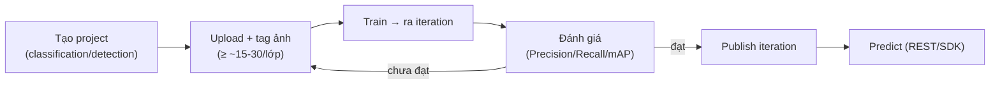

# Custom Vision (classification / object detection)

> [!summary] TL;DR
> **Custom Vision** dùng khi prebuilt AI Vision **không nhận đúng** vật thể đặc thù của bạn (lỗi linh kiện riêng, loài cây riêng) → bạn **tự train model ảnh**. Hai bài toán: **Image classification** (gắn **nhãn cho cả ảnh** — "ảnh này là gì") và **Object detection** (khoanh **bounding box** từng vật thể — "vật gì, ở đâu"). Vòng đời chuẩn: **tạo project → upload + tag ảnh → train → đánh giá → publish iteration → predict**. Custom Vision tách **2 tài nguyên**: **Training resource** (train) và **Prediction resource** (gọi dự đoán) để tách quota/billing. Đánh giá bằng **Precision** (dự đoán đúng trong số đã báo), **Recall** (bắt được bao nhiêu trong số thực có), **mAP** (mean Average Precision — điểm tổng cho object detection). Chọn **domain** (general/food/landmark/retail; bản **compact** export ra **ONNX** chạy **edge/offline**). Ít ảnh + train quá kỹ → **overfitting**; khắc phục bằng thêm ảnh đa dạng + data augmentation.

> **Thuật ngữ:** *iteration* = một lần train ra một phiên bản model. *publish* = đưa iteration thành endpoint gọi được. *Precision/Recall* = độ chính xác/độ bao phủ. *mAP* = điểm trung bình độ chính xác cho object detection. *ONNX* = định dạng model mở để chạy ngoài cloud (edge). *overfitting* = học thuộc dữ liệu train, kém trên dữ liệu mới.

---

## 1. Classification vs Object detection

| | **Image classification** | **Object detection** |
|---|---|---|
| Trả về | **Nhãn cho cả ảnh** (+ confidence) | **Nhiều vật thể** + nhãn + **bounding box** |
| Câu hỏi | "Ảnh này thuộc loại nào?" | "Có những gì, ở đâu, bao nhiêu?" |
| Loại nhãn | Single-label / multi-label | Mỗi vật thể một box |
| Ví dụ | Phân loại ảnh đạt/lỗi | Đếm sản phẩm trên kệ + vị trí |
| Gán nhãn data | Gắn tag/ảnh | **Vẽ box** từng vật (tốn công hơn) |

---

## 2. Vòng đời train → publish → predict



- **Training resource vs Prediction resource:** train ở một tài nguyên, gọi dự đoán ở tài nguyên khác → tách **quota** (train nặng) khỏi **traffic dự đoán** (production), và tách billing.
- Mỗi lần train ra một **iteration**; **publish** iteration tốt nhất thành endpoint. Lặp lại khi có thêm dữ liệu (cải tiến liên tục).

```python
# Gọi dự đoán từ iteration đã publish
from azure.cognitiveservices.vision.customvision.prediction import CustomVisionPredictionClient
from msrest.authentication import ApiKeyCredentials

cred = ApiKeyCredentials(in_headers={"Prediction-key": pred_key})
client = CustomVisionPredictionClient(endpoint, cred)
with open("test.jpg", "rb") as f:
    res = client.classify_image(project_id, "iteration1", f.read())   # tên model đã publish
for p in res.predictions:                 # nhãn + xác suất
    print(p.tag_name, p.probability)
```

---

## 3. Đánh giá model (Precision / Recall / mAP)

| Chỉ số | Nghĩa | Trade-off |
|---|---|---|
| **Precision** | Trong số ảnh model báo "lớp X", bao nhiêu **đúng** | Cao = ít báo nhầm (false positive) |
| **Recall** | Trong số ảnh **thực sự** lớp X, model bắt được bao nhiêu | Cao = ít bỏ sót (false negative) |
| **mAP** | Mean Average Precision — điểm tổng cho **object detection** | Càng cao càng tốt |

- **Probability threshold** điều chỉnh đánh đổi Precision↔Recall: ngưỡng cao → precision tăng, recall giảm. Tuỳ nghiệp vụ ưu tiên "không báo nhầm" hay "không bỏ sót".

---

## 4. Domain & compact model (edge / ONNX)

- **Domain** = bộ trọng số nền tối ưu cho loại ảnh: *General, Food, Landmarks, Retail*… chọn đúng domain giúp train nhanh, chính xác hơn.
- **Compact domain**: model nhẹ, **export** ra **ONNX / TensorFlow / CoreML** để chạy **trên thiết bị / edge / offline** (không cần gọi cloud) — hợp dây chuyền sản xuất, IoT, app mobile.
- **Dữ liệu & overfitting:** cần đủ ảnh mỗi lớp (tối thiểu ~15, nên 50+), **đa dạng** (góc/sáng/nền), dùng **data augmentation**. Ít ảnh + train kỹ → **overfitting** (giỏi trên train, dở thực tế). Liên kết [[../../../04-AI/01-AI-Fundamentals-RAG/01-Introduction-AI-GenAI]].

> [!question] Phỏng vấn: "Classification vs object detection — chọn cái nào?"
> **Classification** khi chỉ cần biết **ảnh thuộc loại gì** (ví dụ "đạt/lỗi"). **Object detection** khi cần biết **có những vật gì, ở đâu, bao nhiêu** (bounding box) — ví dụ đếm sản phẩm trên kệ. Detection tốn công gán nhãn hơn (phải vẽ box) và đánh giá bằng **mAP**.

> [!question] Phỏng vấn: "Model Custom Vision precision cao nhưng recall thấp nghĩa là gì?"
> Model **báo gì cũng khá đúng** nhưng **bỏ sót nhiều** ca thực tế (false negative cao). Khắc phục: **hạ probability threshold**, **thêm dữ liệu đa dạng** cho lớp bị sót, train lại. Cân nhắc nghiệp vụ: phát hiện lỗi an toàn thì recall quan trọng hơn (đừng bỏ sót lỗi).

---

```
★ Insight ─────────────────────────────────────
• Custom Vision là "build" trong cặp build-vs-buy: chỉ dùng khi
  prebuilt không nhận đúng vật thể domain của bạn.
• Tách Training vs Prediction resource = tách workload nặng (train)
  khỏi traffic production (predict) — cùng tư duy tách quota/billing.
• Precision/Recall/mAP là ngôn ngữ chung đánh giá model ML — nối
  thẳng overfitting/metrics ở domain 04-AI, không chỉ riêng Azure.
─────────────────────────────────────────────────
```

---

## Tự kiểm tra

1. Image classification vs object detection — đầu ra và công gán nhãn khác gì?
2. Liệt kê vòng đời từ tạo project tới predict.
3. Vì sao tách Training resource và Prediction resource?
4. Precision vs Recall vs mAP — mỗi cái đo gì? Threshold ảnh hưởng ra sao?
5. Compact domain + ONNX dùng để làm gì? Khi nào cần?

---

## Liên quan
- [[00-MOC-AI-102]]
- [[04-Azure-AI-Vision-va-Video-Indexer]] — model dựng sẵn (buy) đối chiếu
- [[../../../04-AI/01-AI-Fundamentals-RAG/01-Introduction-AI-GenAI]] — overfitting & metrics ML
