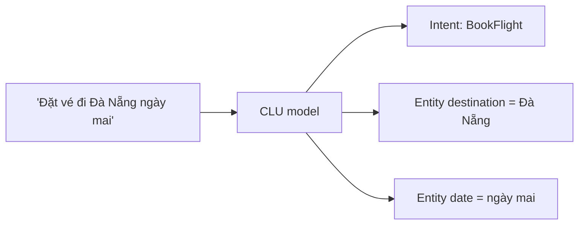

# Azure AI Language: sentiment / NER / PII / CLU

> [!summary] TL;DR
> **Azure AI Language** là dịch vụ **NLP** (xử lý ngôn ngữ tự nhiên) gom nhiều năng lực. Nhóm **dựng sẵn (prebuilt)** — gọi API ngay: **language detection** (nhận ngôn ngữ), **sentiment analysis** (tích cực/tiêu cực/trung tính) + **opinion mining** (gắn cảm xúc vào từng khía cạnh, ví dụ "đồ ăn ngon nhưng phục vụ chậm"), **key phrase extraction** (rút cụm từ khoá), **NER** (nhận diện thực thể: người/địa danh/ngày), **PII detection & redaction** (phát hiện + **ẩn** thông tin nhạy cảm), **entity linking** (gắn thực thể với Wikipedia), **summarization**. Nhóm **tuỳ biến (custom)** — phải train: **CLU** (Conversational Language Understanding = nhận **intent + entity** trong câu người dùng, kế thừa **LUIS** cũ), **custom text classification**, **custom NER**. Luồng custom giống mọi dịch vụ train được: **tạo project → label → train → deploy → predict**. CLU là "bộ não hiểu ý định" cho chatbot (ghép với Question Answering — note 9).

> **Thuật ngữ:** *NLP* = xử lý ngôn ngữ tự nhiên. *sentiment* = sắc thái cảm xúc. *NER* = nhận diện thực thể có tên. *PII* = thông tin định danh cá nhân. *redaction* = che/ẩn thông tin. *intent* = ý định người nói. *entity* = thực thể/tham số trong câu (ví dụ ngày, địa điểm). *CLU* kế thừa *LUIS* (Language Understanding — dịch vụ cũ đã ngừng).

---

## 1. Tính năng dựng sẵn (sentiment, key phrase, NER, PII)

| Tính năng | Trả về | Use case |
|---|---|---|
| **Language detection** | Mã ngôn ngữ + confidence | Định tuyến xử lý theo ngôn ngữ |
| **Sentiment + opinion mining** | Pos/Neg/Neutral toàn câu **+ theo khía cạnh** | Phân tích đánh giá khách hàng |
| **Key phrase extraction** | Danh sách cụm từ khoá | Tóm ý, gắn thẻ |
| **NER** | Thực thể (Person/Location/DateTime…) | Trích thông tin từ văn bản |
| **PII detection & redaction** | Thực thể nhạy cảm (SĐT, email, CMND) + bản đã **che** | Tuân thủ riêng tư (GDPR) |
| **Entity linking** | Liên kết thực thể → Wikipedia | Làm giàu ngữ cảnh |

```python
# Prebuilt: sentiment + PII redaction, không cần train
from azure.ai.textanalytics import TextAnalyticsClient
from azure.identity import DefaultAzureCredential

client = TextAnalyticsClient(endpoint, DefaultAzureCredential())   # MI thay key
docs = ["Sản phẩm tốt nhưng giao hàng chậm. Liên hệ 0901234567."]
print(client.analyze_sentiment(docs)[0].sentiment)        # mixed/positive/...
pii = client.recognize_pii_entities(docs)[0]
print(pii.redacted_text)                                  # SĐT bị che thành ***
```

---

## 2. Summarization (extractive vs abstractive)

| Kiểu | Cách làm | Đặc điểm |
|---|---|---|
| **Extractive** | **Chọn ra** các câu quan trọng nhất từ văn bản gốc | Trung thực với bản gốc, không "bịa" |
| **Abstractive** | **Viết lại** thành câu mới ngắn gọn (như người) | Mượt hơn, rủi ro lệch nội dung |

- Có **document summarization** (văn bản) và **conversation summarization** (tóm tắt hội thoại/cuộc gọi: vấn đề + giải pháp).

---

## 3. CLU & custom text classification

**CLU (Conversational Language Understanding)** — model **custom** nhận **intent** (ý định) + **entity** (tham số) từ câu người dùng:



| Dịch vụ custom | Bài toán |
|---|---|
| **CLU** | Hiểu **ý định + tham số** trong hội thoại (chatbot) — kế thừa LUIS |
| **Custom text classification** | Phân loại văn bản theo nhãn riêng (single/multi-label) |
| **Custom NER** | Trích thực thể **đặc thù domain** (mã hợp đồng, mã sản phẩm) |

- Luồng custom: **tạo project → gán nhãn (label) → train → deploy → predict**. CLU ghép với **Question Answering** thành bot hoàn chỉnh (note 9).
- **Conversational Language vs Question Answering:** CLU hiểu **ý định để hành động** (gọi API đặt vé); Question Answering **trả lời câu hỏi** từ knowledge base (FAQ). Bot thật thường dùng cả hai (orchestration).

> [!question] Phỏng vấn: "Cần ẩn số điện thoại/CMND trong văn bản tự do — dùng gì?"
> **PII detection & redaction** của Azure AI Language: nó nhận diện thực thể nhạy cảm (SĐT, email, số CMND, thẻ) và trả về **redacted_text** đã che — dùng cho tuân thủ riêng tư (GDPR) trước khi lưu/log. Đây là tính năng **prebuilt**, không cần train.

> [!question] Phỏng vấn: "CLU khác Question Answering thế nào?"
> **CLU** xác định **intent + entity** để app **hành động** (ví dụ "đặt vé đi Đà Nẵng ngày mai" → intent BookFlight, entity điểm đến/ngày). **Question Answering** trả **câu trả lời** từ knowledge base (FAQ). Chatbot đầy đủ thường **orchestrate** cả hai: nếu là câu hỏi FAQ thì QnA, nếu là yêu cầu hành động thì CLU.

---

```
★ Insight ─────────────────────────────────────
• AI Language chia rõ "prebuilt gọi-ngay" (sentiment/NER/PII) vs
  "custom phải-train" (CLU/custom classification) — cùng cặp buy-vs-build.
• Extractive (chọn câu) an toàn hơn abstractive (viết lại) về "bịa" —
  nối thẳng groundedness/hallucination ở note 03 và domain 04-AI.
• CLU = ý-định-để-hành-động, QnA = trả-lời-câu-hỏi; nhớ cặp này vì
  note 09 (Bot) sẽ orchestrate cả hai.
─────────────────────────────────────────────────
```

---

## Tự kiểm tra

1. Kể 5 tính năng prebuilt của AI Language.
2. Sentiment analysis vs opinion mining khác nhau gì?
3. Extractive vs abstractive summarization — đánh đổi gì?
4. CLU trích những thành phần nào từ câu người dùng? Luồng train ra sao?
5. CLU vs Question Answering — khi nào dùng cái nào trong một bot?

---

## Liên quan
- [[00-MOC-AI-102]]
- [[09-Bot-Question-Answering-CLU]] — CLU + QnA ghép thành bot
- [[07-Translator-va-Da-ngu]] — xử lý đa ngôn ngữ
- [[../../../04-AI/01-AI-Fundamentals-RAG/01-Introduction-AI-GenAI]] — NLP nền tảng
