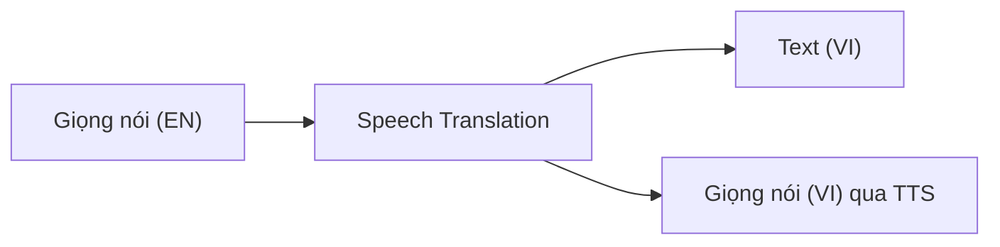

# Speech-to-Text & Text-to-Speech + SSML

> [!summary] TL;DR
> **Azure AI Speech** xử lý giọng nói hai chiều. **Speech-to-Text (STT)** chuyển **âm thanh → văn bản**: chế độ **real-time** (stream micro/cuộc gọi, trả text ngay) và **batch transcription** (xử lý hàng loạt file audio đã lưu, async qua Blob). Cải thiện độ chính xác cho **giọng/thuật ngữ đặc thù** bằng **Custom Speech** (train trên audio + transcript của bạn); **diarization** = tách "ai nói câu nào". **Text-to-Speech (TTS)** chuyển **văn bản → giọng nói** với **neural voices** (giọng tự nhiên như người); điều khiển ngữ điệu/tốc độ/ngắt nghỉ/cách phát âm bằng **SSML** (Speech Synthesis Markup Language — XML đánh dấu cách đọc). Muốn **giọng thương hiệu riêng** → **Custom Neural Voice** (Limited Access). **Speech Translation** dịch **giọng nói trực tiếp** (nói tiếng Anh → ra text/giọng tiếng Việt) — khác Translator chỉ làm text.

> **Thuật ngữ:** *STT/TTS* = speech-to-text / text-to-speech. *real-time* = xử lý ngay theo luồng. *batch* = xử lý hàng loạt sau. *diarization* = phân tách người nói. *neural voice* = giọng tổng hợp bằng mạng nơ-ron (rất tự nhiên). *SSML* = ngôn ngữ đánh dấu điều khiển cách đọc của TTS. *phoneme* = âm vị (đơn vị phát âm).

---

## 1. Speech-to-Text (real-time, batch, Custom Speech)

| Chế độ | Khi nào | Cách chạy |
|---|---|---|
| **Real-time** | Caption trực tiếp, voice assistant, cuộc gọi | Stream audio → text ngay (SDK) |
| **Batch transcription** | Hàng loạt file ghi âm đã lưu | Async, trỏ tới audio trên **Blob**, lấy kết quả sau |
| **Fast transcription** | Cần kết quả nhanh cho file ngắn | Đồng bộ, độ trễ thấp |

- **Custom Speech**: khi audio có **từ chuyên ngành / giọng vùng / tiếng ồn nền** mà model chung nghe sai → train trên **audio + transcript** của bạn để tăng độ chính xác.
- **Diarization**: gắn nhãn "Speaker 1 / Speaker 2…" — hữu ích cho biên bản họp, tổng đài.

```python
# STT real-time từ micro
import azure.cognitiveservices.speech as speechsdk
cfg = speechsdk.SpeechConfig(subscription="<KEY>", region="<REGION>")
cfg.speech_recognition_language = "vi-VN"
recognizer = speechsdk.SpeechRecognizer(speech_config=cfg)
result = recognizer.recognize_once()         # nghe một câu rồi trả text
print(result.text)
```

---

## 2. Text-to-Speech & SSML

- **Neural voices**: hàng trăm giọng đa ngôn ngữ, nghe tự nhiên (ngữ điệu, nhịp thở).
- **SSML** điều khiển chi tiết cách đọc — đây là điểm thi hay hỏi:

```xml
<speak version="1.0" xml:lang="vi-VN">
  <voice name="vi-VN-HoaiMyNeural">
    Xin chào, <break time="500ms"/>          <!-- chèn khoảng lặng 0.5s -->
    <prosody rate="-10%" pitch="+2st">        <!-- chậm lại 10%, cao giọng 2 nửa cung -->
      tốc độ và cao độ được điều chỉnh.
    </prosody>
    <say-as interpret-as="date">2026-06-28</say-as>   <!-- đọc thành ngày tháng -->
  </voice>
</speak>
```

| Thẻ SSML | Điều khiển |
|---|---|
| `<prosody rate/pitch/volume>` | Tốc độ / cao độ / âm lượng |
| `<break time>` | Khoảng lặng (pause) |
| `<say-as interpret-as>` | Đọc số/ngày/tiền đúng kiểu |
| `<phoneme>` | Ép phát âm theo âm vị (đọc đúng tên riêng) |
| `<voice name>` | Chọn giọng |
| `<emphasis>` / `<mstts:express-as style>` | Nhấn / phong cách cảm xúc (vui, buồn…) |

---

## 3. Custom Neural Voice & Speech Translation

- **Custom Neural Voice (CNV)**: tạo **giọng thương hiệu riêng** từ mẫu thu âm của một người → là **Limited Access** (phải đăng ký, có cam kết Responsible AI để chống deepfake giọng nói).
- **Speech Translation**: dịch **giọng nói trực tiếp** — nói ngôn ngữ A → nhận text/giọng ngôn ngữ B trong một luồng (gộp STT + dịch + TTS). Khác **Translator** (note 7) chỉ dịch **text**.



> [!question] Phỏng vấn: "Real-time vs batch transcription — chọn khi nào?"
> **Real-time** khi cần text **ngay theo luồng** (caption trực tiếp, voice assistant, tổng đài đang gọi). **Batch** khi có **nhiều file ghi âm đã lưu** cần xử lý hàng loạt, không gấp — chạy async trỏ tới audio trên Blob rồi lấy kết quả sau, rẻ và scale tốt hơn cho khối lượng lớn.

> [!question] Phỏng vấn: "Làm sao điều khiển ngữ điệu, ngắt nghỉ, phát âm tên riêng trong TTS?"
> Dùng **SSML**: `<prosody>` chỉnh tốc độ/cao độ/âm lượng, `<break>` chèn pause, `<say-as>` đọc đúng số/ngày, `<phoneme>` ép phát âm tên riêng, `<mstts:express-as>` đặt phong cách cảm xúc. SSML là cách điều khiển chi tiết hơn so với chỉ truyền text thô.

---

```
★ Insight ─────────────────────────────────────
• STT real-time vs batch = "ngay theo luồng" vs "hàng loạt async qua
  Blob" — cùng mô-típ real-time/batch xuyên suốt Azure AI.
• SSML là "CSS cho giọng nói": text thô ra giọng phẳng, SSML mới
  điều khiển ngữ điệu/pause/phát âm — đề thi hay hỏi thẻ cụ thể.
• Custom Neural Voice là Limited Access vì rủi ro deepfake giọng —
  nối thẳng Responsible AI (note 03).
─────────────────────────────────────────────────
```

---

## Tự kiểm tra

1. STT real-time vs batch transcription — khác nhau và chọn khi nào?
2. Custom Speech và diarization giải quyết vấn đề gì?
3. SSML dùng để làm gì? Kể 3-4 thẻ và tác dụng.
4. Custom Neural Voice là gì, vì sao bị giới hạn truy cập?
5. Speech Translation khác Translator (note 7) ở điểm nào?

---

## Liên quan
- [[00-MOC-AI-102]]
- [[07-Translator-va-Da-ngu]] — dịch text (đối chiếu Speech Translation)
- [[04-Azure-AI-Vision-va-Video-Indexer]] — Video Indexer dùng STT để transcript
- [[03-Responsible-AI-va-Content-Safety]] — Custom Neural Voice & Responsible AI
