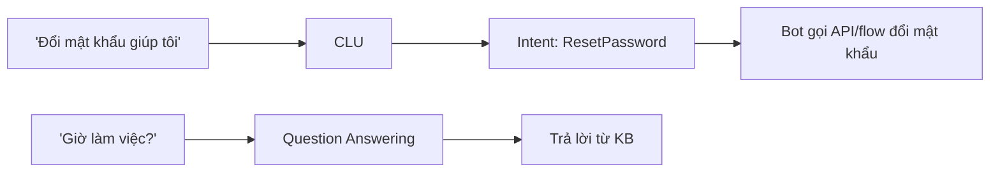
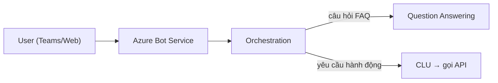

# Bot, Question Answering & CLU

> [!summary] TL;DR
> Một **chatbot truyền thống** trên Azure ghép 3 mảnh: **Custom Question Answering** (kế thừa **QnA Maker**) tạo **knowledge base** từ FAQ/URL/tài liệu để **trả lời câu hỏi** (hỗ trợ **multi-turn** hỏi nối tiếp + **chit-chat** xã giao); **CLU** (Conversational Language Understanding) nhận **intent + entity** để **định tuyến hành động** (note 6); và **Azure Bot Service / Bot Framework SDK** đóng gói logic, kết nối nhiều **channel** (Teams, Web Chat, Slack…). Khi câu của user vừa có FAQ vừa có yêu cầu hành động → dùng **Orchestration** để chọn gọi QnA hay CLU. So với **chatbot LLM** (Azure OpenAI, note 12): bot **intent-based** kiểm soát chặt, câu trả lời tiền định, dễ tuân thủ — hợp tổng đài/quy trình; **generative** linh hoạt, tự nhiên, nhưng cần kiểm soát "bịa" (grounding/Content Safety). Xu hướng mới: **RAG + LLM** thay dần QnA cứng.

> **Thuật ngữ:** *knowledge base (KB)* = kho cặp hỏi-đáp. *multi-turn* = hội thoại nhiều lượt nối ngữ cảnh. *chit-chat* = câu xã giao ("bạn khoẻ không"). *channel* = kênh hội thoại bot kết nối tới (Teams/Web…). *orchestration* = điều phối chọn đúng dịch vụ con. *intent-based* = bot chạy theo ý định + kịch bản định trước.

---

## 1. Custom Question Answering (knowledge base)

- Tạo **KB** từ nguồn: **trang FAQ (URL)**, tài liệu (PDF/DOCX), nhập tay cặp Q&A.
- Tính năng: **multi-turn** (câu hỏi nối tiếp có follow-up prompt), **chit-chat** dựng sẵn (lịch sự/thân thiện), **confidence score** + **active learning** (gợi ý câu hỏi mới từ log để cải thiện KB).
- Là một tính năng trong **Azure AI Language** (thay cho **QnA Maker** đã ngừng).

---

## 2. CLU — intent & entity

CLU (đã học ở [[06-Azure-AI-Language]]) là phần **hiểu ý định để hành động**:



- **CLU = hành động** (đặt vé, đổi mật khẩu), **QnA = trả lời** (FAQ). Bot thật cần cả hai.

---

## 3. Azure Bot Service & channels

| Thành phần | Vai trò |
|---|---|
| **Bot Framework SDK** | Viết logic hội thoại (dialog, state) bằng C#/JS/Python |
| **Azure Bot Service** | Host bot + kết nối **channels** |
| **Channels** | Teams, Web Chat, Slack, Telegram, Email… (một bot, nhiều kênh) |
| **Orchestration** | Chọn gọi **QnA** hay **CLU** theo câu của user |



---

## 4. Bot truyền thống vs chatbot LLM

| Tiêu chí | **Intent-based (QnA + CLU)** | **Generative (Azure OpenAI)** |
|---|---|---|
| Câu trả lời | Tiền định (KB/kịch bản) | Sinh tự do theo ngữ cảnh |
| Kiểm soát / tuân thủ | **Chặt**, dễ audit | Lỏng hơn, cần grounding + Content Safety |
| Linh hoạt ngôn ngữ | Hạn chế theo intent đã train | **Rất tự nhiên** |
| Công xây dựng | Phải định nghĩa intent/KB | Ít cấu hình, nhưng cần prompt/RAG |
| Hợp với | Tổng đài, quy trình cố định | Trợ lý mở, hỏi-đáp tài liệu (RAG) |

- Xu hướng: dùng **RAG + LLM** (note 10 + note 12) thay KB cứng, nhưng vẫn bọc **Content Safety** (note 3) để kiểm soát.

> [!question] Phỏng vấn: "Question Answering và CLU phối hợp trong một bot thế nào?"
> Dùng **orchestration**: nếu câu của user là **hỏi thông tin** (FAQ) → route sang **Question Answering** lấy đáp án từ KB; nếu là **yêu cầu hành động** (đổi mật khẩu, đặt vé) → route sang **CLU** để lấy intent + entity rồi gọi API/flow tương ứng. Bot Framework điều phối và quản state hội thoại.

> [!question] Phỏng vấn: "Khi nào chọn bot intent-based thay vì chatbot LLM?"
> Khi cần **kiểm soát chặt và tuân thủ**: câu trả lời phải tiền định, audit được, không được "bịa" — ví dụ tổng đài ngân hàng, quy trình cố định. **LLM/generative** chọn khi cần linh hoạt, tự nhiên, hỏi-đáp trên kho tài liệu lớn (RAG) — đánh đổi là phải thêm grounding + Content Safety để chống hallucination.

---

```
★ Insight ─────────────────────────────────────
• Công thức bot cổ điển = QnA (trả lời) + CLU (hành động) + Bot
  Service (host + channels) + Orchestration (định tuyến).
• Intent-based vs generative là đánh đổi kiểm-soát ↔ linh-hoạt; đề thi
  AI-102 vẫn hỏi bot cổ điển dù LLM đang thay dần.
• "Một bot, nhiều channel" là điểm mạnh Bot Service: viết logic một
  lần, phát ra Teams/Web/Slack — tách logic khỏi kênh.
─────────────────────────────────────────────────
```

---

## Tự kiểm tra

1. Custom Question Answering tạo KB từ những nguồn nào? Multi-turn & chit-chat là gì?
2. CLU vs Question Answering — phân vai trong bot ra sao?
3. Azure Bot Service + channels giải quyết vấn đề gì?
4. Orchestration trong bot làm gì?
5. Intent-based vs generative chatbot — đánh đổi và khi nào chọn cái nào?

---

## Liên quan
- [[00-MOC-AI-102]]
- [[06-Azure-AI-Language]] — CLU intent & entity chi tiết
- [[12-Azure-OpenAI-Advanced]] — chatbot generative
- [[10-Knowledge-Mining-AI-Search-Skillset]] — RAG thay KB cứng
