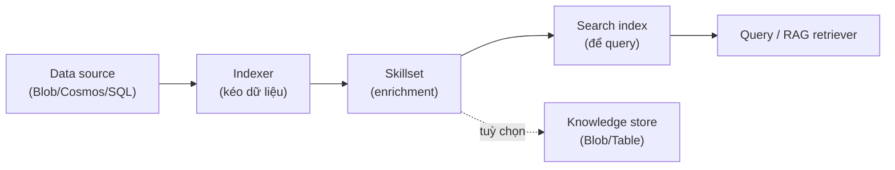

# Knowledge Mining: AI Search + skillset

> [!summary] TL;DR
> **Knowledge Mining** = biến **dữ liệu thô không cấu trúc** (PDF, ảnh, audio nằm trong Blob/DB) thành **index tìm kiếm được** bằng cách chạy nó qua **pipeline AI enrichment** của **Azure AI Search**. Pipeline: **data source → indexer → skillset → index → query**. **Indexer** tự kéo dữ liệu từ nguồn; **skillset** là chuỗi **skill** làm giàu (enrich) dữ liệu — gồm **built-in skills** (OCR đọc chữ trong ảnh, key phrase, entity recognition, language detection, image analysis, **split** cắt chunk…) và **custom skill** (gọi **Web API/Azure Function** của bạn cho logic riêng). Kết quả enrich đổ vào **index** (để tìm) và tuỳ chọn **knowledge store** (lưu ra Blob/Table cho phân tích/BI). Về **độ liên quan (relevance)**: ngoài full-text còn có **scoring profile** (tăng điểm theo field), **semantic ranking** (xếp hạng lại theo nghĩa) và **vector/hybrid search** — đây chính là cầu nối tới **RAG**: AI Search làm **retriever** cấp ngữ cảnh cho LLM (note 12). Nền tảng AI Search xem [[../AI-Azure/17-Azure-AI-Search]]; note này tập trung **pipeline enrichment**.

> **Thuật ngữ:** *enrichment* = làm giàu dữ liệu (trích thêm thông tin AI). *indexer* = thành phần tự kéo + nạp dữ liệu vào index. *skill / skillset* = bước / chuỗi bước AI xử lý trong pipeline. *index* = cấu trúc dữ liệu để tìm kiếm nhanh. *knowledge store* = nơi lưu dữ liệu đã enrich để dùng lại. *retriever* = bộ lấy ngữ cảnh cho RAG.

---

## 1. Pipeline: data source → indexer → skillset → index



| Thành phần | Vai trò |
|---|---|
| **Data source** | Trỏ tới nguồn (Blob, Cosmos DB, Azure SQL…) |
| **Indexer** | Crawler tự kéo dữ liệu + lịch chạy (schedule) + change detection |
| **Skillset** | Chuỗi skill enrich (OCR, entity, split…) |
| **Index** | Schema field (searchable/filterable/facetable) để query |
| **Field mappings** | Ánh xạ output enrich → field trong index |

---

## 2. Built-in skills & custom skill

| Loại | Ví dụ | Dùng khi |
|---|---|---|
| **Built-in skill** | OCR, Image Analysis, Key Phrase, Entity Recognition, Language Detection, **Text Split** (chunk), Translation, PII | Enrich phổ biến — chỉ cần cấu hình |
| **Custom skill** | Gọi **Azure Function / Web API** của bạn | Logic riêng: phân loại domain, gọi model riêng, làm sạch đặc thù |

- Skill nối tiếp nhau: ví dụ **OCR** (ảnh → text) → **Split** (cắt chunk) → **Entity Recognition** (trích thực thể) → đổ vào index.
- **Custom skill** tuân theo schema input/output JSON định sẵn để AI Search gọi như một skill thường.

---

## 3. Knowledge store

- Ngoài việc đổ vào **index để tìm**, skillset có thể ghi dữ liệu đã enrich ra **knowledge store**:
  - **Object projection** (JSON ra Blob), **table projection** (bảng ra Table Storage), **file projection** (ảnh ra Blob).
- Mục đích: **dùng lại** dữ liệu enrich cho phân tích/BI (Power BI), không phải lúc nào cũng để tìm kiếm.

---

## 4. Relevance, semantic & vector search (cầu nối RAG)

| Cơ chế | Làm gì |
|---|---|
| **Scoring profile** | Tăng/giảm điểm theo field (ví dụ ưu tiên tiêu đề, độ mới) |
| **Semantic ranking** | Dùng model ngôn ngữ **xếp hạng lại** top kết quả theo *nghĩa* + trích **caption/answer** |
| **Vector search** | Tìm theo **embedding** (gần nghĩa) thay vì khớp từ |
| **Hybrid search** | Kết hợp full-text (BM25) + vector → tốt nhất cho RAG |

- **Cầu nối RAG**: AI Search làm **retriever** — câu hỏi → tìm chunk liên quan (hybrid + semantic) → đưa làm ngữ cảnh cho Azure OpenAI sinh câu trả lời có dẫn nguồn. Xem [[../../../04-AI/01-AI-Fundamentals-RAG/02-RAG-Theoretical-Foundations]] và [[../../../04-AI/02-RAG-Optimization/03-Query-Transformation]].

> [!tip] Knowledge Mining (AI-102) vs RAG retriever (LangChain)
> Cùng ý tưởng "tìm chunk liên quan cấp cho LLM". Khác ở chỗ **Knowledge Mining** dựng pipeline **indexer + skillset** *bên trong* Azure AI Search (enrich lúc index); còn ở **LangChain** (domain 04-AI) bạn tự chunk/embed/lưu vector store và viết retriever bằng code. AI-102 nhấn mạnh phía **dịch vụ managed**.

> [!question] Phỏng vấn: "Skillset trong AI Search là gì? Built-in vs custom skill?"
> **Skillset** là chuỗi bước AI **enrich** dữ liệu trong indexer pipeline (OCR, trích entity, key phrase, cắt chunk…). **Built-in skill** do Microsoft cung cấp, chỉ cần cấu hình; **custom skill** gọi **Azure Function/Web API** của bạn theo schema định sẵn để xử lý logic riêng (phân loại domain, model riêng). Output enrich được map vào index.

> [!question] Phỏng vấn: "AI Search liên quan RAG thế nào?"
> AI Search đóng vai **retriever**: index hoá dữ liệu (kèm enrich + vector), khi có câu hỏi thì dùng **hybrid (full-text + vector) + semantic ranking** lấy chunk liên quan nhất, rồi đưa vào prompt cho Azure OpenAI sinh câu trả lời **có dẫn nguồn** — giảm hallucination.

---

```
★ Insight ─────────────────────────────────────
• Indexer + skillset là "ETL có AI": kéo dữ liệu thô → enrich (OCR/
  entity/chunk) → index. Custom skill = chỗ cắm logic riêng của bạn.
• Index để TÌM, knowledge store để DÙNG LẠI (BI/phân tích) — hai đích
  ra khác nhau của cùng một skillset.
• Hybrid + semantic ranking + vector là phần biến AI Search thành
  retriever RAG chất lượng — nối thẳng domain 04-AI.
─────────────────────────────────────────────────
```

---

## Tự kiểm tra

1. Vẽ pipeline knowledge mining: data source → … → query.
2. Built-in skill vs custom skill — khác nhau và khi nào cần custom?
3. Index vs knowledge store — hai đầu ra này khác mục đích thế nào?
4. Scoring profile, semantic ranking, vector, hybrid — mỗi cái cải thiện relevance ra sao?
5. AI Search đóng vai gì trong kiến trúc RAG?

---

## Liên quan
- [[00-MOC-AI-102]]
- [[../AI-Azure/17-Azure-AI-Search]] — nền tảng AI Search (index/vector)
- [[../../../04-AI/01-AI-Fundamentals-RAG/02-RAG-Theoretical-Foundations]] — nền tảng RAG
- [[../../../04-AI/02-RAG-Optimization/03-Query-Transformation]] — tối ưu truy vấn
- [[12-Azure-OpenAI-Advanced]] — LLM sinh câu trả lời từ ngữ cảnh
