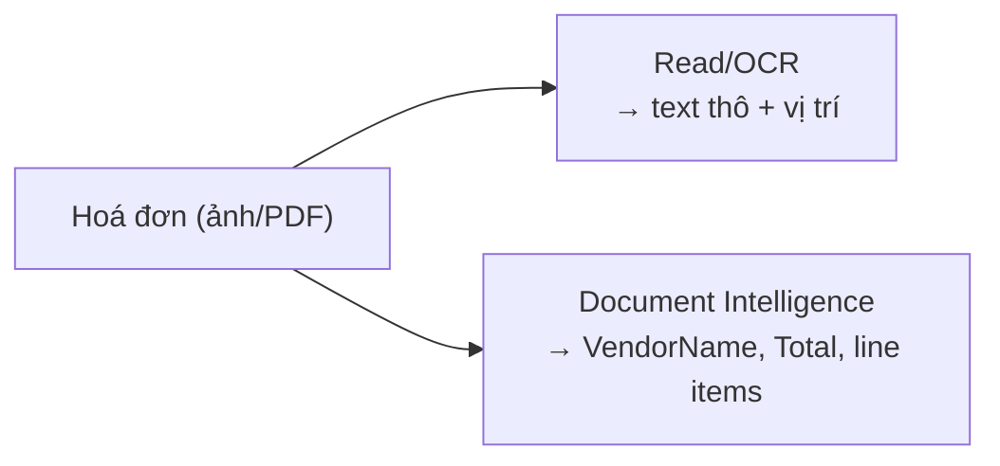

# Document Intelligence (Form Recognizer)

> [!summary] TL;DR
> **Azure AI Document Intelligence** (tên cũ **Form Recognizer**) trích **dữ liệu CÓ CẤU TRÚC** từ tài liệu — không chỉ text thô mà cả **key-value pairs**, **bảng**, và **trường nghiệp vụ** đã hiểu nghĩa. Có 3 nhóm model: **Prebuilt** (dùng ngay cho loại tài liệu phổ biến: **invoice** hoá đơn, **receipt** biên lai, **ID document** giấy tờ tuỳ thân, **business card**, **W-2**, cùng 2 model nền **read** = OCR và **layout** = cấu trúc/bảng/checkbox). **Custom** (tự train trên biểu mẫu riêng của bạn): **template/custom** (mẫu cố định, ít dữ liệu, nhanh) vs **neural** (mẫu biến thiên, chính xác hơn, cần nhiều dữ liệu hơn). **Composed model** gộp nhiều custom model thành một endpoint tự nhận đúng loại. Khác **OCR/Read** (note 4): Read chỉ trả **text + vị trí**, còn Document Intelligence hiểu **bố cục biểu mẫu** → trả trường nghiệp vụ → cắm thẳng vào pipeline tự động nhập liệu (Blob trigger → extract → lưu DB).

> **Thuật ngữ:** *key-value pair* = cặp nhãn-giá trị ("Tổng tiền: 500.000"). *layout model* = model đọc cấu trúc trang (bảng/ô/checkbox). *template model* = học mẫu cố định. *neural model* = học sâu, chịu được mẫu biến thiên. *composed model* = gộp nhiều model con.

---

## 1. Prebuilt models (invoice / receipt / ID / layout)

| Model | Trích gì | Use case |
|---|---|---|
| **Read** | Text + ngôn ngữ + vị trí (OCR) | Nền cho các model khác |
| **Layout** | Bảng, ô, **selection mark** (checkbox), cấu trúc | Tài liệu có bảng/form bất kỳ |
| **Invoice** | Số HĐ, nhà cung cấp, line items, tổng, thuế | Tự động nhập hoá đơn |
| **Receipt** | Cửa hàng, ngày, mặt hàng, tổng | Quản lý chi tiêu |
| **ID document** | Họ tên, ngày sinh, số giấy tờ | KYC/onboarding |
| **Business card / W-2** | Liên hệ / thông tin thuế (US) | CRM / kế toán |

```python
# Prebuilt invoice — trích trường nghiệp vụ có cấu trúc
from azure.ai.documentintelligence import DocumentIntelligenceClient
from azure.identity import DefaultAzureCredential

client = DocumentIntelligenceClient(endpoint, DefaultAzureCredential())   # MI thay key
poller = client.begin_analyze_document("prebuilt-invoice", body=invoice_bytes)
result = poller.result()
for doc in result.documents:
    f = doc.fields
    print(f["VendorName"].value_string, f["InvoiceTotal"].value_currency)  # trường đã hiểu nghĩa
```

---

## 2. Custom models (template vs neural)

| | **Custom template** | **Custom neural** |
|---|---|---|
| Mẫu tài liệu | **Cố định**, layout ổn định | **Biến thiên** (nhiều layout khác nhau) |
| Dữ liệu train | Ít (~5 mẫu) | Nhiều hơn |
| Tốc độ train | Nhanh | Chậm hơn |
| Độ chính xác mẫu lạ | Kém | **Tốt hơn** |
| Ngôn ngữ | Chủ yếu in | Đa dạng hơn |

- Luồng: **gắn nhãn field** (Document Intelligence Studio) → **train** → **trích** key-value/table theo schema bạn định nghĩa.

---

## 3. Composed model

- **Composed model** = gộp nhiều **custom model** thành một endpoint; khi gửi tài liệu, nó **tự phân loại** rồi áp model con đúng.
- Hữu ích khi hệ thống nhận **nhiều loại biểu mẫu** qua cùng một cổng (đơn A, đơn B, hợp đồng C…).

---

## 4. Document Intelligence vs OCR thuần



| | **OCR / Read (note 4)** | **Document Intelligence** |
|---|---|---|
| Đầu ra | Text thô + toạ độ | **Trường nghiệp vụ + bảng + key-value** |
| Hiểu bố cục | Không | **Có** (layout, form) |
| Train riêng | Không | Có (custom) |
| Hợp với | Chữ tự do trong ảnh | Hoá đơn/biểu mẫu cần nhập liệu tự động |

- Pipeline tự động hoá điển hình: **Blob trigger** (hoá đơn upload) → **Function** gọi Document Intelligence → ghi kết quả vào **DB/Cosmos** → khỏi nhập tay. (Liên kết AZ-204 binding: [[../AZ-204/03-Azure-Functions-Bindings-Triggers]].)

> [!question] Phỏng vấn: "Đọc hoá đơn lấy tổng tiền & nhà cung cấp — Read API hay Document Intelligence?"
> **Document Intelligence** (prebuilt **invoice**): nó hiểu *bố cục hoá đơn* và trả **trường nghiệp vụ** (VendorName, InvoiceTotal, line items) đã gắn nghĩa. **Read/OCR** chỉ cho **text thô + vị trí**, bạn phải tự parse — kém bền khi layout đổi.

> [!question] Phỏng vấn: "Custom template vs custom neural — chọn khi nào?"
> **Template** khi biểu mẫu **layout cố định**, ít dữ liệu, cần train nhanh. **Neural** khi tài liệu **biến thiên nhiều layout/ngôn ngữ** và cần chính xác cao hơn trên mẫu lạ — đổi lại cần nhiều dữ liệu train và train lâu hơn. Nhiều loại biểu mẫu qua một cổng → **composed model**.

---

```
★ Insight ─────────────────────────────────────
• Ranh giới cốt lõi: OCR cho "text", Document Intelligence cho "dữ
  liệu có cấu trúc đã hiểu nghĩa" — câu hỏi hoá đơn là bẫy kinh điển.
• Template vs neural = "mẫu cố định, ít data, nhanh" vs "mẫu biến
  thiên, nhiều data, chính xác" — cùng tư duy đánh đổi data↔robust.
• Document Intelligence tỏa sáng trong pipeline tự động (Blob→Function
  →DB): nó là mắt xích biến giấy tờ thành dữ liệu nhập máy.
─────────────────────────────────────────────────
```

---

## Tự kiểm tra

1. Kể vài prebuilt model; Read vs Layout khác gì?
2. Document Intelligence khác OCR/Read ở đầu ra nào?
3. Custom template vs custom neural — đánh đổi gì, chọn khi nào?
4. Composed model giải quyết tình huống nào?
5. Phác pipeline tự động xử lý hoá đơn upload lên Blob.

---

## Liên quan
- [[00-MOC-AI-102]]
- [[04-Azure-AI-Vision-va-Video-Indexer]] — OCR/Read (text thô) đối chiếu
- [[../AZ-204/03-Azure-Functions-Bindings-Triggers]] — Blob trigger pipeline
- [[10-Knowledge-Mining-AI-Search-Skillset]] — OCR/extract trong skillset
