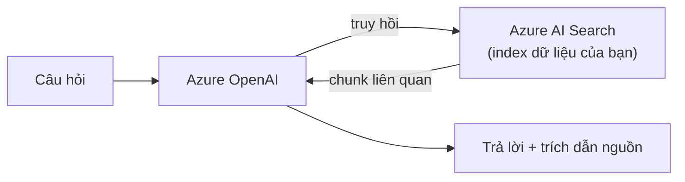

# Azure OpenAI nâng cao: fine-tune, agents, Semantic Kernel

> [!summary] TL;DR
> Note này đi **sâu phần generative AI nâng cao** (cơ bản deployment/endpoint/key đã có ở [[../AI-Azure/16-Azure-OpenAI-Service]]). Bốn cách "dạy" LLM theo nghiệp vụ, xếp theo công sức tăng dần: **Prompt engineering** (system message + few-shot + chỉnh parameters) → **RAG "on your data"** (cắm Azure AI Search làm nguồn → trả lời có dẫn nguồn, dữ liệu cập nhật) → **Fine-tuning** (train thêm trên cặp prompt-completion **JSONL** để đổi *phong cách/định dạng*, không phải nhồi kiến thức mới) → **Agents/Assistants** (LLM tự **gọi tool/function** để hành động nhiều bước). **Quy tắc vàng**: cần **kiến thức/dữ liệu mới** → **RAG**; cần **phong cách/định dạng ổn định** → **fine-tune**; cần **hành động** → **function calling/agents**. **Semantic Kernel** là framework **orchestration** của Microsoft (plugins + planner + memory) — vai trò như LangChain/LangGraph, nối thẳng domain 04-AI.

> **Thuật ngữ:** *prompt engineering* = thiết kế câu lệnh đầu vào. *RAG* = Retrieval-Augmented Generation (sinh có truy hồi ngữ cảnh). *fine-tuning* = huấn luyện thêm model trên dữ liệu riêng. *JSONL* = JSON Lines (mỗi dòng một bản ghi). *function calling* = LLM tự chọn gọi hàm/tool. *agent* = LLM hành động nhiều bước qua tool. *orchestration* = điều phối các bước LLM + tool.

---

## 1. Model, deployment, quota (recap nhanh)

- **Deployment ≠ model**: bạn tạo một **deployment** (đặt tên riêng) cho một model nền (GPT-4o, GPT-4, embeddings `text-embedding-3`, DALL·E ảnh) — code gọi theo **tên deployment**, không phải tên model (bẫy hay gặp). Chi tiết [[../AI-Azure/16-Azure-OpenAI-Service]].
- **Quota theo TPM** (Tokens Per Minute) + RPM; vượt → **429**, cần backoff/tăng quota (note 2).

---

## 2. Prompt engineering & parameters

| Kỹ thuật | Tác dụng |
|---|---|
| **System message** | Đặt vai trò/luật cho model ("Bạn là trợ lý pháp lý, chỉ trả lời từ tài liệu") |
| **Few-shot** | Cho vài ví dụ mẫu → model bắt chước định dạng |
| **Grounding** | Nhét ngữ cảnh thật vào prompt (nền của RAG) |

| Parameter | Ý nghĩa |
|---|---|
| **temperature** | Độ ngẫu nhiên (0 = ổn định/đúng sự kiện, cao = sáng tạo) |
| **top_p** | Nucleus sampling (thường chỉnh 1 trong 2: temperature hoặc top_p) |
| **max_tokens** | Giới hạn độ dài output (kiểm soát chi phí) |
| **stop** | Chuỗi dừng sinh |

---

## 3. RAG "on your data" (OpenAI + AI Search)



- **"On your data"**: tính năng cắm thẳng **AI Search** làm nguồn ngay trong Azure OpenAI (Studio/API) → câu trả lời **bám tài liệu của bạn** + **citation**. Dựng index xem note 10.
- Ưu điểm vs fine-tune: **cập nhật dữ liệu tức thì** (chỉ cần reindex), **dẫn nguồn được**, giảm hallucination — không phải train lại model.

---

## 4. Fine-tuning (vs RAG vs prompt)

| Phương án | Giải quyết | Khi dùng |
|---|---|---|
| **Prompt engineering** | Hướng dẫn hành vi tức thì | Đủ cho phần lớn ca; thử trước tiên |
| **RAG** | **Kiến thức/dữ liệu mới**, hay đổi | Hỏi-đáp tài liệu nội bộ, cần dẫn nguồn |
| **Fine-tuning** | **Phong cách/định dạng/giọng** ổn định | Output phải theo khuôn cố định, prompt dài lặp lại |

- Fine-tune cần **dataset JSONL** (mỗi dòng cặp prompt → completion mong muốn), tốn chi phí train + host deployment riêng.
- **Hiểu lầm thường gặp:** fine-tune **không** để "nạp kiến thức mới" tốt bằng RAG — nó dạy *cách trả lời* chứ không phải *biết thêm sự thật*. Cần kiến thức mới → **RAG**.

```jsonl
{"messages":[{"role":"system","content":"Trợ lý CSKH lịch sự"},{"role":"user","content":"Đơn của tôi đâu?"},{"role":"assistant","content":"Dạ, anh/chị cho em xin mã đơn để kiểm tra ạ."}]}
```

---

## 5. Assistants / agents & function calling

- **Function calling**: bạn khai báo **schema hàm**; model **tự quyết** khi nào gọi hàm nào + sinh tham số JSON → app thực thi → trả kết quả lại cho model. Đây là cách LLM **hành động** (tra DB, gọi API thời tiết…).
- **Assistants API / agents**: tầng cao hơn, model **lập kế hoạch nhiều bước**, dùng tool (code interpreter, file search, function), giữ **thread/state** hội thoại.

```python
# Function calling: model tự chọn gọi tool
tools = [{
  "type": "function",
  "function": {
    "name": "get_order_status",
    "parameters": {"type": "object", "properties": {"order_id": {"type": "string"}}},
  }}]
resp = client.chat.completions.create(model="gpt-4o-deploy", messages=msgs, tools=tools)
# nếu resp có tool_calls -> app chạy hàm thật rồi gửi kết quả lại model
```

---

## 6. Semantic Kernel (orchestration)

| Khái niệm SK | Vai trò | Tương đương LangChain |
|---|---|---|
| **Plugin / function** | Khối kỹ năng model gọi được | Tool |
| **Planner** | Tự ghép các plugin thành kế hoạch | Agent/graph |
| **Memory** | Lưu ngữ cảnh + vector store | Memory/retriever |

- **Semantic Kernel** (C#/Python) là framework Microsoft để **orchestrate** LLM + tool + memory thành ứng dụng agentic — vai trò giống **LangChain/LangGraph** (domain 04-AI). Đối chiếu [[../../../04-AI/04-LangGraph-Agentic/01-LangGraph-Foundations-State]].
- Bọc mọi giải pháp generative bằng **Content Safety** (note 3): Prompt Shields ở input, Groundedness ở output.

> [!question] Phỏng vấn: "Cần chatbot trả lời theo tài liệu nội bộ luôn cập nhật — RAG hay fine-tune?"
> **RAG**. Vì dữ liệu **hay đổi** và cần **dẫn nguồn**: chỉ việc index tài liệu vào AI Search rồi để OpenAI truy hồi — cập nhật tức thì khi reindex, giảm hallucination. **Fine-tune** dạy *phong cách/định dạng* chứ không hợp để nạp kiến thức mới (phải train lại mỗi lần dữ liệu đổi).

> [!question] Phỏng vấn: "Function calling khác RAG thế nào?"
> **RAG** đưa **kiến thức** (ngữ cảnh tài liệu) vào để model **trả lời đúng**. **Function calling** cho model **hành động**: tự chọn gọi hàm/API (tra trạng thái đơn, đặt lịch) và sinh tham số — kết quả thực thi quay lại model. Một cấp ngữ cảnh, một cấp hành động; agent thật thường dùng cả hai.

---

```
★ Insight ─────────────────────────────────────
• Thang "dạy" LLM: prompt → RAG → fine-tune → agents, công sức tăng
  dần. Quy tắc: kiến-thức-mới=RAG, phong-cách=fine-tune, hành-động=tool.
• Hiểu lầm chí mạng: fine-tune KHÔNG phải để nhồi kiến thức — đề thi
  và phỏng vấn rất hay bẫy chỗ này.
• Semantic Kernel ↔ LangGraph: cùng bài toán orchestration agentic,
  chỉ khác hệ sinh thái — nắm một cái là hiểu cái kia (domain 04-AI).
─────────────────────────────────────────────────
```

---

## Tự kiểm tra

1. Bốn cách tuỳ biến LLM (prompt/RAG/fine-tune/agents) — mỗi cái giải bài toán gì?
2. Vì sao cần kiến thức mới thì chọn RAG chứ không fine-tune?
3. Fine-tune cần dữ liệu định dạng gì? Nó dạy model điều gì?
4. Function calling hoạt động ra sao? Khác RAG ở điểm nào?
5. Semantic Kernel gồm plugin/planner/memory — tương ứng gì bên LangChain?

---

## Liên quan
- [[00-MOC-AI-102]]
- [[../AI-Azure/16-Azure-OpenAI-Service]] — nền tảng Azure OpenAI (deployment/model)
- [[10-Knowledge-Mining-AI-Search-Skillset]] — AI Search làm retriever cho RAG
- [[03-Responsible-AI-va-Content-Safety]] — bọc generative bằng Content Safety
- [[../../../04-AI/04-LangGraph-Agentic/01-LangGraph-Foundations-State]] — orchestration đối chiếu
