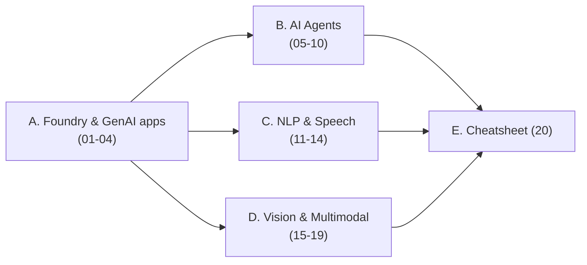

# MOC: AI-103 — Develop AI Solutions with Microsoft Foundry

> 📚 Bộ **4 learning path Microsoft Learn thế hệ mới (2025-2026)** cho lộ trình **Azure AI Engineer** — xây trên nền tảng **Microsoft Foundry** (tên mới của Azure AI Foundry/AI Studio). Đây là giáo trình **thay thế AI-102 cũ**: bỏ Custom Vision/Video Indexer/Bot Framework, thêm **Agents, MCP, A2A, Foundry IQ, Content Understanding, Voice Live**.
> Nguồn: `_source/Microsoft/AI-103/` (4 docx ≈ 30 module Microsoft Learn).
> *Ghi chú tên:* "AI-103" là cách đặt tên của bộ nguồn — Microsoft chưa công bố mã cert này; nội dung là bản refresh chính thức của lộ trình AI Engineer.
> *Ảnh minh hoạ:* folder `_img/` chứa ảnh chọn lọc từ Microsoft Learn (© Microsoft, dùng cho mục đích học tập, nguồn ghi dưới từng ảnh); sơ đồ khái niệm còn lại vẽ lại bằng Mermaid bám sát bản gốc.
>
> **Trạng thái:** ✅ HOÀN TẤT — đủ 20 note phủ ~30 module của 4 learning path.

## Cụm A — GenAI apps với Microsoft Foundry (path "Develop generative AI apps", 6 module)

| # | Note | Module gốc | TT |
|---|------|-----------|----|
| 01 | [[01-Microsoft-Foundry-Tong-quan-Plan-Prepare\|Microsoft Foundry: tổng quan, project, Foundry Tools, Responsible AI]] | GenAI M1 | ✅ |
| 02 | [[02-Model-Catalog-Chon-Deploy-Danh-gia\|Model catalog: chọn (benchmark), deploy, đánh giá model]] | GenAI M2 | ✅ |
| 03 | [[03-Chat-App-Foundry-SDK-va-Tools\|Chat app: endpoint/SDK, Responses API & tools (function calling…)]] | GenAI M3+M4 | ✅ |
| 04 | [[04-Toi-uu-Model-va-Responsible-GenAI\|Tối ưu model (prompt/RAG/fine-tune) & Responsible GenAI]] | GenAI M5+M6 | ✅ |

## Cụm B — AI Agents (path "Develop AI agents on Azure", 9 module — trọng tâm mới nhất)

| # | Note | Module gốc | TT |
|---|------|-----------|----|
| 05 | [[05-Foundry-Agent-Service-va-VS-Code\|Foundry Agent Service + phát triển agent bằng VS Code]] | Agents M1 | ✅ |
| 06 | [[06-Custom-Tools-va-MCP-Tools\|Custom tools & MCP tools cho agent]] | Agents M2+M3 | ✅ |
| 07 | [[07-Foundry-IQ-Knowledge-Agents\|Foundry IQ — knowledge-enhanced agents (nền tảng RAG dùng chung)]] | Agents M4 | ✅ |
| 08 | [[08-M365-va-Agent-Workflows\|Tích hợp Microsoft 365 & agent-driven workflows]] | Agents M5+M6 | ✅ |
| 09 | [[09-Agent-Framework-va-Multi-Agent\|Microsoft Agent Framework & multi-agent orchestration]] | Agents M7+M8 | ✅ |
| 10 | [[10-A2A-Protocol\|A2A protocol: Agent Card, Agent Skills, routing agent]] | Agents M9 | ✅ |

## Cụm C — NLP & Speech (path "Develop natural language solutions", 7 module)

| # | Note | Module gốc | TT |
|---|------|-----------|----|
| 11 | [[11-Azure-Language-Text-Analysis\|Azure Language: text analysis (sentiment/NER/PII) bản Foundry Tools]] | NLP M1 | ✅ |
| 12 | [[12-Language-va-Speech-MCP-Server\|Language MCP server & Speech MCP server cho agents]] | NLP M2+M5 | ✅ |
| 13 | [[13-Speech-GenAI-va-Voice-Live-API\|Speech GenAI app + Azure Speech + Voice Live API (realtime)]] | NLP M3+M4+M6 | ✅ |
| 14 | [[14-Translator-Text-va-Speech\|Translator: dịch văn bản & giọng nói]] | NLP M7 | ✅ |

## Cụm D — Vision & Multimodal (path "Extract insights from visual data", 8 module)

| # | Note | Module gốc | TT |
|---|------|-----------|----|
| 15 | [[15-Vision-GenAI-Multimodal\|Vision-enabled GenAI app (multimodal prompt)]] | Vision M1 | ✅ |
| 16 | [[16-Sinh-anh-va-Video-gpt-image-Sora\|Sinh ảnh & video: gpt-image, Sora trên Foundry]] | Vision M2+M3 | ✅ |
| 17 | [[17-Content-Understanding\|Content Understanding: analyzer, schema, multimodal]] | Vision M4+M5+M6 | ✅ |
| 18 | [[18-Document-Intelligence-Foundry\|Document Intelligence bản Foundry]] | Vision M7 | ✅ |
| 19 | [[19-Knowledge-Mining-AI-Search\|Knowledge mining với Azure AI Search]] | Vision M8 | ✅ |

## Cụm E — Ôn thi

| # | Note | Nguồn | TT |
|---|------|-------|----|
| 20 | [[20-AI-103-Cheatsheet-va-QA\|AI-103 Cheatsheet + Q&A phỏng vấn + bảng "gì mới so với AI-102"]] | Tự tổng hợp | ✅ |

---

## Bản đồ dịch vụ ↔ chức năng (tra nhanh)

| Nhu cầu | Dịch vụ / tính năng Foundry | Note |
|---------|------------------------------|------|
| Chatbot LLM, sinh text | Foundry Models (Responses API) | 03 |
| Chọn model theo chất lượng/giá | Model catalog + benchmarks | 02 |
| Agent tự động hoá tác vụ | Foundry Agent Service | 05 |
| Agent gọi hệ thống ngoài | Custom tools / MCP tools | 06 |
| RAG quy mô enterprise cho agent | Foundry IQ | 07 |
| Nhiều agent phối hợp | Agent Framework / multi-agent | 09 |
| Agent của các bên nói chuyện với nhau | A2A protocol | 10 |
| Sentiment, NER, PII | Azure Language (Foundry Tools) | 11 |
| Giọng nói ↔ văn bản, voice agent realtime | Azure Speech + Voice Live API | 13 |
| Dịch đa ngữ | Azure Translator | 14 |
| Phân tích ảnh bằng LLM đa phương thức | Vision-enabled GenAI | 15 |
| Sinh ảnh / video | gpt-image / Sora | 16 |
| Trích xuất từ tài liệu+ảnh+audio+video theo schema | Content Understanding | 17 |
| Trích trường từ hoá đơn/biểu mẫu | Document Intelligence | 18 |
| Tìm kiếm + index tài liệu quy mô lớn | Azure AI Search | 19 |
| Kiểm duyệt nội dung, chống jailbreak | Guardrails (content filters, prompt shields) | 04 |

## Lộ trình đọc

## Liên quan
- [[../00-MOC-Azure]] — MOC Azure tổng (AZ-900 + AI-Azure + AZ-204)
- [[../AI-Azure/16-Azure-OpenAI-Service]] — Azure OpenAI cơ bản (đối chiếu Bedrock)
- [[../../../04-AI/00-MOC-AI|MOC: AI]] — nền tảng RAG/LangChain/LangGraph (đối chiếu Agent Framework)
- [[../../01-AWS-Bedrock/00-MOC-AWS-Bedrock|MOC: AWS Bedrock]] — nhánh AWS tương đương
