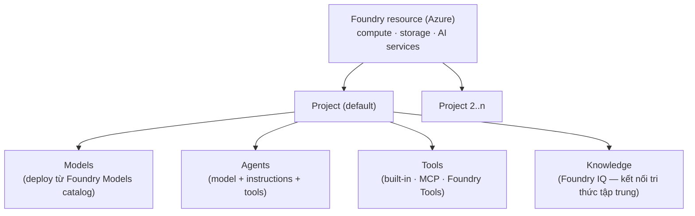

# Note 01 — Microsoft Foundry: tổng quan, plan & prepare AI solution

> **TL;DR:** **Microsoft Foundry** là nền tảng phát triển AI trên Azure (tên mới của Azure AI Foundry / AI Studio). Mọi thứ xoay quanh **Foundry resource** (tài nguyên Azure cấp compute/storage/dịch vụ) chứa nhiều **project** (đơn vị tổ chức asset). Mỗi project quản lý 4 loại asset: **Models** (LLM deploy từ catalog), **Agents** (thực thể AI = model + instructions + tools), **Tools** (công cụ agent dùng, gồm cả **Foundry Tools** — bộ dịch vụ AI dựng sẵn, tên mới của Azure AI Services), và **Knowledge** (nguồn tri thức, tập trung qua **Foundry IQ**). Làm việc qua **Foundry portal** (giao diện web — *ai.azure.com*) hoặc **Foundry SDK** (`azure-ai-projects`). Trước khi build phải "map" đúng loại năng lực AI cần dùng và tuân 6 nguyên tắc **Responsible AI**.

## 1. Năm nhóm năng lực AI khi lập kế hoạch

Trước khi chọn dịch vụ, xác định app cần năng lực nào (mỗi năng lực → nhóm dịch vụ tương ứng):

| Năng lực | Nghĩa là gì | Ví dụ |
|----------|-------------|-------|
| **Generative AI & agents** | LLM sinh nội dung gốc từ prompt; agent = LLM + instructions (chỉ dẫn nhiệm vụ) + tools | Chatbot, trợ lý tự động hoá task |
| **Natural language processing (NLP)** | Phân tích văn bản bằng model thống kê/chuyên biệt (rẻ và đoán được hơn LLM) | Sentiment, phân loại text, tóm tắt |
| **Computer speech** | Nhận dạng (speech-to-text) & tổng hợp giọng nói (text-to-speech) | Voice assistant, transcription |
| **Computer vision** | Hiểu ảnh/video/camera stream; model đa phương thức còn *sinh* được ảnh/video | Checkout tự động nhận diện sản phẩm |
| **Information extraction** | Kết hợp GenAI + NLP + vision + speech để rút trích thông tin từ tài liệu/media | Đọc hoá đơn, trích line item từ receipt |

`★ Insight ─────────────────────────────────────`
Giáo trình mới nhấn mạnh: **không phải cái gì cũng cần GenAI**. Dùng Foundry Tools (model dựng sẵn) cho tác vụ chuyên biệt thì **rẻ hơn và dự đoán được** (predictable) hơn là ném mọi thứ vào agent LLM. Đây là câu phỏng vấn kinh điển: "khi nào KHÔNG dùng LLM?"
`─────────────────────────────────────────────────`

## 2. Kiến trúc Microsoft Foundry: resource → project → assets

- **Foundry resource**: tài nguyên Azure thật sự — cấp compute, data storage, AI tools cho các project con. Một resource chứa **một hoặc nhiều project**, một cái là **default project**.
- **Project**: nơi developer quản lý connections, data, code, asset của một giải pháp AI. Cho "mức độ tập trung tài nguyên vừa đủ với chi phí quản trị tối thiểu".
- 4 loại asset trong project:
  - **Models** — các deployment LLM từ **Foundry Models** (catalog model của Microsoft, OpenAI và provider khác). Truy cập qua **project endpoint** (API/SDK riêng của Foundry) *hoặc* **Azure OpenAI endpoint** (API/SDK chuẩn OpenAI).
  - **Agents** — cấu hình AI có tên, đóng gói LLM + instructions + tools thành thực thể tự trị; phát triển/tiêu thụ qua **Foundry Agent Service**.
  - **Tools** — công cụ agent dùng: built-in (web search, code interpreter), kết nối tool bên ngoài qua **MCP** (Model Context Protocol — giao thức chuẩn cho LLM gọi tool/dữ liệu ngoài), và **Foundry Tools** (bộ dịch vụ AI dựng sẵn, host ngay trong Foundry resource).
  - **Knowledge** — agent nối tới kho tri thức; **Foundry IQ** tạo **một kết nối tri thức trung tâm dựa trên MCP** thay vì nối lẻ tẻ từng nguồn.

> ⚠️ **Phân biệt kiến trúc mới vs cũ:** project kiểu mới gắn trực tiếp vào Foundry resource. Project **classic** (cũ) dùng kiến trúc **hub-based** (hub + project — như thời Azure AI Studio). Thi/phỏng vấn: "hub" là dấu hiệu tài liệu cũ.

## 3. Foundry portal vs Foundry SDK

| | Foundry portal | Foundry SDK |
|---|---------------|-------------|
| Là gì | Giao diện web trực quan (ai.azure.com) | Thư viện code (`azure-ai-projects` cho Python) |
| Dùng để | Tìm/so sánh/deploy/test model, tạo test agent, tạo MCP connection & Foundry IQ, xem endpoint/key, quản lý quyền | Tự động hoá thao tác project bằng script hoặc **CI/CD pipeline** |
| Khi nào | Khởi đầu dự án, prototyping, quản trị | Sản xuất, lặp lại được, DevOps |

## 4. Foundry Tools — bộ dịch vụ AI dựng sẵn

**Foundry Tools** = tên mới của **Azure AI Services** (trước nữa là **Azure Cognitive Services**) — chuỗi đổi tên này hay bị hỏi. Các tool chính:

| Tool | Chức năng |
|------|-----------|
| **Azure Language** | Phân tích văn bản: entity extraction, sentiment, tóm tắt; conversational model & question answering |
| **Azure Speech** | Text-to-speech, speech-to-text, **real-time live speech** cho app/agent hội thoại |
| **Azure Translator** | Dịch máy giữa rất nhiều ngôn ngữ |
| **Azure Document Intelligence** | Trích trường (field) từ tài liệu phức tạp: hoá đơn, biên lai, biểu mẫu |
| **Azure Content Understanding** | Phân tích **đa phương thức**: trích dữ liệu từ tài liệu, ảnh, video, audio — cái mới hoàn toàn so với đời AI-102 |

Cách dùng: client app nối tới **endpoint riêng của từng tool** trong Foundry resource, xác thực bằng key của project hoặc token (Entra ID), rồi gọi API/SDK của tool đó.

`★ Insight ─────────────────────────────────────`
Ba đời tên cùng một thứ: **Cognitive Services → Azure AI Services → Foundry Tools**. API/SDK cũ vẫn còn giữ tên cũ. Tương tự: **Azure AI Studio → Azure AI Foundry → Microsoft Foundry**. Nhà tuyển dụng có thể cố tình dùng tên cũ để thử — cứ map về tên mới.
`─────────────────────────────────────────────────`

## 5. Công cụ phát triển

- **IDE/editor**: Visual Studio (mạnh cho .NET) hoặc **VS Code** (đa ngôn ngữ, open-source) — cả hai đều hợp cho AI dev trên Azure.
- **Foundry Toolkit extension cho VS Code**: duyệt/quản lý resource project (model, agent, connection, vector store), deploy model từ catalog, test trong playground tích hợp, cấu hình **declarative agent bằng YAML** + visual designer, **sinh code tích hợp** agent vào app.
- **GitHub + GitHub Copilot**: source control/DevOps + AI assistant.
- **Ngôn ngữ & SDK chính**:
  - **Foundry SDK** (`azure-ai-projects`) — nối project, truy cập asset riêng Foundry (agents, Foundry IQ).
  - **OpenAI API/SDK** — chat app với model tương thích cú pháp OpenAI.
  - **Foundry Tools SDKs** — thư viện riêng từng dịch vụ (Language, Speech…), hoặc gọi thẳng REST API.

## 6. Responsible AI — 6 nguyên tắc Microsoft

| Nguyên tắc | Nội dung cốt lõi | Ví dụ ghi nhớ |
|-----------|------------------|----------------|
| **Fairness** (công bằng) | Không thiên lệch theo giới/sắc tộc…; review training data đại diện đủ nhóm | Model duyệt vay không dựa giới tính |
| **Reliability & safety** (tin cậy & an toàn) | Test nghiêm ngặt; đặt **ngưỡng confidence score** vì model là xác suất | Xe tự lái, chẩn đoán bệnh |
| **Privacy & security** (riêng tư & bảo mật) | Bảo vệ dữ liệu train lẫn dữ liệu suy luận | Che PII, safeguard dữ liệu khách |
| **Inclusiveness** (hoà nhập) | AI phục vụ mọi người bất kể khả năng thể chất, giới, sắc tộc | Thiết kế/test với nhóm đa dạng |
| **Transparency** (minh bạch) | User biết mục đích, cách hoạt động, giới hạn của hệ thống | Công bố confidence score, cách dùng dữ liệu khuôn mặt |
| **Accountability** (trách nhiệm) | **Con người** chịu trách nhiệm cuối cùng, có khung governance | Dev chịu trách nhiệm về quyết định của model |

Mẹo nhớ: **F-R-P-I-T-A** — "**F**air **R**obots **P**rotect **I**nclusive **T**ransparent **A**ccountability".

## Q&A phỏng vấn

**Q1. Microsoft Foundry là gì, quan hệ gì với Azure AI Studio?**
→ Nền tảng phát triển AI trên Azure: portal + SDK, tổ chức theo Foundry resource → projects → assets (Models/Agents/Tools/Knowledge). Là bản kế nhiệm của Azure AI Studio / Azure AI Foundry; kiến trúc mới bỏ hub, project gắn thẳng vào resource.

**Q2. Foundry Tools khác gì "tools" của agent?**
→ Hai khái niệm khác nhau: *Foundry Tools* = bộ dịch vụ AI dựng sẵn (Language, Speech, Translator, Document Intelligence, Content Understanding — tên mới của Azure AI Services). *Tools của agent/model* = công cụ khai báo trong prompt/agent để model gọi (function, code interpreter, web search, MCP tool).

**Q3. Khi nào dùng Foundry SDK, khi nào dùng OpenAI SDK?**
→ Foundry SDK khi cần tính năng riêng Foundry: agents, evaluations, tracing, connections, Foundry direct models. OpenAI SDK khi chỉ cần suy luận model với độ tương thích OpenAI tối đa (code chạy được cả OpenAI lẫn Azure). Có thể dùng cả hai trong cùng app.

**Q4. Kể 6 nguyên tắc Responsible AI và ví dụ một nguyên tắc.**
→ Fairness, Reliability & safety, Privacy & security, Inclusiveness, Transparency, Accountability. Ví dụ Transparency: cho user biết hệ số tin cậy của dự đoán và giới hạn của model.

**Q5. Một project Foundry quản lý những asset nào?**
→ Models (deployment từ catalog), Agents (model+instructions+tools qua Agent Service), Tools (built-in / MCP / Foundry Tools), Knowledge (Foundry IQ kết nối tri thức trung tâm).

## Liên quan
- [[00-MOC-AI-103]] — MOC AI-103
- [[02-Model-Catalog-Chon-Deploy-Danh-gia]] — bước tiếp: chọn & deploy model
- [[../AI-Azure/16-Azure-OpenAI-Service]] — Azure OpenAI cơ bản (note cũ, đối chiếu Bedrock)
- [[../../../04-AI/01-AI-Fundamentals-RAG/01-Introduction-AI-GenAI|Introduction AI/GenAI]] — nền tảng GenAI ở domain AI
