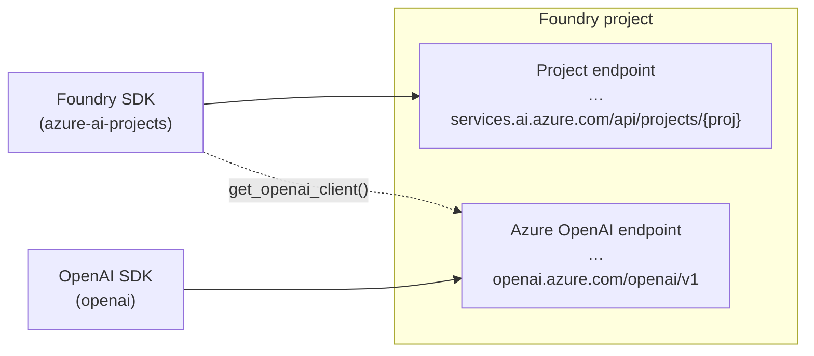
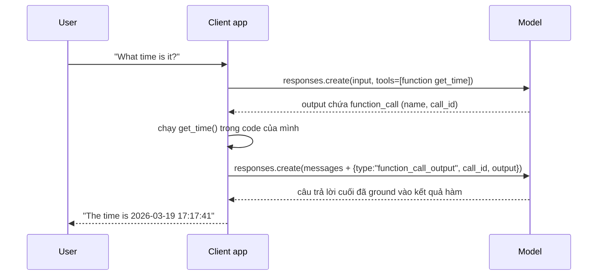

# Note 03 — Chat app: endpoint/SDK, Responses API & tools (function calling…)

> **TL;DR:** Mỗi Foundry project có **2 endpoint**: **project endpoint** (`…services.ai.azure.com/api/projects/…` — dùng Foundry SDK `AIProjectClient`, truy cập được agents/evaluations/tracing) và **Azure OpenAI endpoint** (`…openai.azure.com/openai/v1` — dùng OpenAI SDK thuần, tương thích tối đa). Xác thực production nên dùng **Microsoft Entra ID** (`DefaultAzureCredential`), không hardcode key. Sinh response bằng **Responses API** (`client.responses.create()` — *stateful*: nối hội thoại bằng `previous_response_id`) — khuyến nghị cho dự án mới, thay cho **ChatCompletions API** (*stateless*: tự quản list `messages`). Muốn model làm được việc ngoài kiến thức train thì khai **tools** trong request: `code_interpreter` (chạy Python sandbox), `web_search` (thông tin mới), `file_search` (RAG trên vector store), `function` (gọi hàm app của bạn — model *yêu cầu* gọi, app *thực thi* rồi trả kết quả về).

## 1. Hai endpoint & hai SDK



| | **Foundry SDK** (project endpoint) | **OpenAI SDK** (Azure OpenAI endpoint) |
|---|---|---|
| Package | `azure-ai-projects` (+ `azure-identity`, `openai`) | `openai` (+ `azure-identity` nếu Entra ID) |
| Client | `AIProjectClient` | `OpenAI` (hoặc `AzureOpenAI` khi cần API version cụ thể) |
| Thế mạnh | **Agent Service**, tool approval workflow, cloud **evaluations**, **tracing**, Foundry direct models, connections/datasets/indexes | Tương thích OpenAI API tối đa — code port được giữa OpenAI ↔ Azure, ít phụ thuộc khái niệm Foundry |
| Khi dùng | App có agent/evaluation/tính năng Foundry | Chỉ cần model inference |

Hai SDK **dùng chung được trong một app**: Foundry SDK lo phần project, OpenAI SDK lo inference.

```python
# Foundry SDK → lấy OpenAI-compatible client từ project
from azure.identity import DefaultAzureCredential
from azure.ai.projects import AIProjectClient

project_client = AIProjectClient(
    credential=DefaultAzureCredential(),
    endpoint="https://{res}.services.ai.azure.com/api/projects/{proj}")
openai_client = project_client.get_openai_client(api_version="2024-10-21")
```

```python
# OpenAI SDK thẳng vào Azure OpenAI endpoint, auth bằng Entra ID token
from openai import OpenAI
from azure.identity import DefaultAzureCredential, get_bearer_token_provider

token_provider = get_bearer_token_provider(
    DefaultAzureCredential(), "https://ai.azure.com/.default")
openai_client = OpenAI(
    base_url="https://{res}.openai.azure.com/openai/v1/",
    api_key=token_provider)
```

**Xác thực (auth)** — 3 cách: **Entra ID** (khuyến nghị production — app chạy dưới danh tính cụ thể, không giữ secret), **API key** (cất trong Key Vault, không bao giờ hardcode), **environment variables** (`OPENAI_BASE_URL`/`OPENAI_API_KEY` — client tự đọc).

> Chạy local với `DefaultAzureCredential` phải có phiên Azure đã đăng nhập (`az login`).

## 2. Responses API — cách sinh response khuyến nghị

**Responses API** hợp nhất ChatCompletions + Assistants API cũ. Điểm ăn tiền: **stateful** — server nhớ hội thoại, client chỉ cần trỏ `previous_response_id`.

```python
response = openai_client.responses.create(
    model="gpt-4.1",                 # tên DEPLOYMENT, không phải tên model gốc
    instructions="You are a helpful AI assistant.",   # system prompt
    input="What is Microsoft Foundry?",
    temperature=0.8, max_output_tokens=200)
print(response.output_text)          # ngoài ra: .id .status .usage .model

# Nối hội thoại: trỏ về response trước
response2 = openai_client.responses.create(
    model="gpt-4.1", input="Can you give me an example?",
    previous_response_id=response.id)

# Lấy lại response cũ theo id
old = openai_client.responses.retrieve("resp_67cb61fa…")
```

- Chạy được với cả **Azure OpenAI models** lẫn **Foundry direct models** (Phi, DeepSeek… host thẳng trong Foundry).
- Vẫn có thể **tự quản history thủ công** (truyền list message làm `input`) khi cần: cắt tỉa context (pruning), lưu/khôi phục hội thoại từ DB, kiểm soát chính xác cái gì vào context.
- **Token vẫn tốn đủ**: mỗi request gửi kèm instructions + history + tool schemas + tool outputs + tài liệu RAG — API giúp *quản state*, không giúp *rẻ đi*.

### Responsiveness: streaming & async
```python
stream = openai_client.responses.create(model="gpt-4.1", input="…", stream=True)
for event in stream:
    if event.type == "response.output_text.delta":
        print(event.delta, end="")
    elif event.type == "response.completed":
        response_id = event.response.id   # lấy id khi stream kết thúc
```
- **Streaming**: user thấy chữ hiện dần, không tưởng app treo.
- **Async** (`AsyncOpenAI` + `await`): non-blocking, xử lý nhiều request đồng thời.

## 3. ChatCompletions API — chuẩn cũ vẫn phải biết

```python
completion = openai_client.chat.completions.create(
    model="gpt-4o",
    messages=[
        {"role": "system", "content": "You are a helpful assistant."},
        {"role": "user", "content": "When was Microsoft founded?"}])
print(completion.choices[0].message.content)
```

| | **Responses API** | **ChatCompletions API** |
|---|---|---|
| State | **Stateful** — `previous_response_id` | **Stateless** — tự append `messages` mỗi lượt |
| Trạng thái chuẩn | Khuyến nghị cho dự án mới | Chuẩn phổ biến cross-platform, code cũ |
| Lấy output | `response.output_text` | `completion.choices[0].message.content` |
| Kèm tool built-in (web_search…) | Có | Chỉ function calling |

## 4. Tools — mở khoá năng lực ngoài model

Tools cho phép model **truy cập thông tin realtime, hành động, ground câu trả lời, nối hệ thống có sẵn**. Khai trong `tools=[…]` của `responses.create()`; **model tự quyết** khi nào dùng tool nào (điều hướng thêm bằng `instructions`).

> ⚠️ Đừng nhầm với **Foundry Tools** (bộ dịch vụ AI dựng sẵn — xem [[01-Microsoft-Foundry-Tong-quan-Plan-Prepare]]). Ở đây là tool khai trong prompt — cấu hình nằm ở client app; khi đóng gói bền vững vào agent thì thành agent tools ([[06-Custom-Tools-va-MCP-Tools]]).

| Tool | Làm gì | Điểm cần nhớ |
|------|--------|--------------|
| **code_interpreter** | Model viết + chạy Python trong **sandbox** (có pandas/numpy/matplotlib) | `{"type":"code_interpreter","container":{"type":"auto"}}`; không có network ngoài; model thấy lỗi và tự sửa; nhiều model gọi nó là "python tool" — dùng từ đó trong instructions |
| **web_search** | Tìm thông tin mới trên Internet lúc chạy | Vượt cutoff của training data; kết quả thay đổi theo thời điểm; tăng latency + token |
| **file_search** | Tìm ngữ nghĩa trong **tài liệu của bạn** đã index vào **vector store** | Tạo `client.vector_stores.create()` → `files.upload_and_poll()` → khai `vector_store_ids`; thêm `include=["file_search_call.results"]` để debug; RAG gọn cho tập tài liệu nhỏ — quy mô enterprise thì dùng **Foundry IQ** ([[07-Foundry-IQ-Knowledge-Agents]]) |
| **function** | Model **yêu cầu** gọi hàm do bạn định nghĩa; **app của bạn thực thi** | Vòng 2 bước — xem dưới |

### Function calling — luồng 2 bước



Điểm bản chất: **model không bao giờ tự chạy code của bạn** — nó chỉ trả về "lời yêu cầu" có cấu trúc (function name + arguments + `call_id`); app chạy hàm rồi gửi `function_call_output` kèm đúng `call_id` để model hoàn tất câu trả lời. Prompt không cần tool (như "Hello") thì model trả lời thẳng.

Best practices: hàm nhỏ một mục đích; **validate arguments** model đưa (không tin mù); trả lỗi rõ ràng để model suy luận tiếp; log tool usage; **thao tác nhạy cảm phải yêu cầu authorization tường minh**.

`★ Insight ─────────────────────────────────────`
Bốn tool ứng bốn "lỗ hổng" của LLM thuần: không biết tính chính xác (**code_interpreter**), không biết tin mới (**web_search**), không biết dữ liệu riêng của bạn (**file_search**), không chạm được hệ thống của bạn (**function**). Trả lời phỏng vấn "khi nào dùng tool nào" bằng cách gọi tên lỗ hổng tương ứng là gọn nhất.
`─────────────────────────────────────────────────`

## Q&A phỏng vấn

**Q1. Responses API khác ChatCompletions API chỗ nào?**
→ Responses API stateful (server giữ hội thoại, nối bằng `previous_response_id`, có `retrieve`), hợp nhất chat + assistants, chạy được Foundry direct models và tools built-in; là khuyến nghị cho dự án mới. ChatCompletions stateless — client tự nuôi list `messages` mỗi lượt; vẫn quan trọng vì tương thích rộng khắp hệ sinh thái.

**Q2. Vì sao production nên dùng Entra ID thay vì API key?**
→ Không có secret tĩnh để lộ/xoay vòng; quyền gắn với danh tính (managed identity/service principal) quản bằng RBAC; key nếu buộc dùng phải cất Key Vault.

**Q3. Trong function calling, model có chạy hàm không?**
→ Không. Model chỉ *emit* function call (tên + tham số + call_id). App thực thi, trả `function_call_output` với đúng `call_id`, model mới sinh câu trả lời cuối. Vì vậy app phải validate tham số và giới hạn thao tác nhạy cảm.

**Q4. file_search khác web_search?**
→ file_search tìm ngữ nghĩa trong tài liệu **riêng** bạn upload vào vector store (grounding nội bộ, RAG); web_search tìm thông tin **công khai mới** trên Internet. Chọn theo nguồn sự thật cần bám.

**Q5. Stateful của Responses API có làm giảm token không?**
→ Không. Mỗi lượt vẫn gửi đủ instructions + history + tool schemas/outputs + tài liệu vào model. API chỉ đỡ việc *quản lý* state, chi phí token phải tự kiểm soát (pruning, giới hạn history).

**Q6. Khi nào dùng `AzureOpenAI` client thay vì `OpenAI` client?**
→ Khi cần chốt một **API version** Azure cụ thể (`api_version=` + `azure_endpoint=`). Bình thường dùng `OpenAI` client với endpoint `/openai/v1` là đủ.

## Liên quan
- [[00-MOC-AI-103]] — MOC AI-103
- [[02-Model-Catalog-Chon-Deploy-Danh-gia]] — deploy model trước khi code
- [[06-Custom-Tools-va-MCP-Tools]] — nâng cấp tools thành agent tools + MCP
- [[../AZ-204/00-MOC-AZ-204|MOC AZ-204]] — Key Vault, managed identity (nền bảo mật)
- [[../../../02-Backend/00-MOC-Backend|MOC Backend]] — streaming/async phía server
