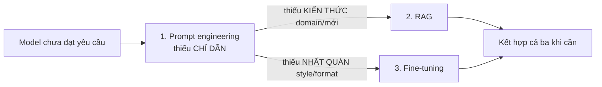
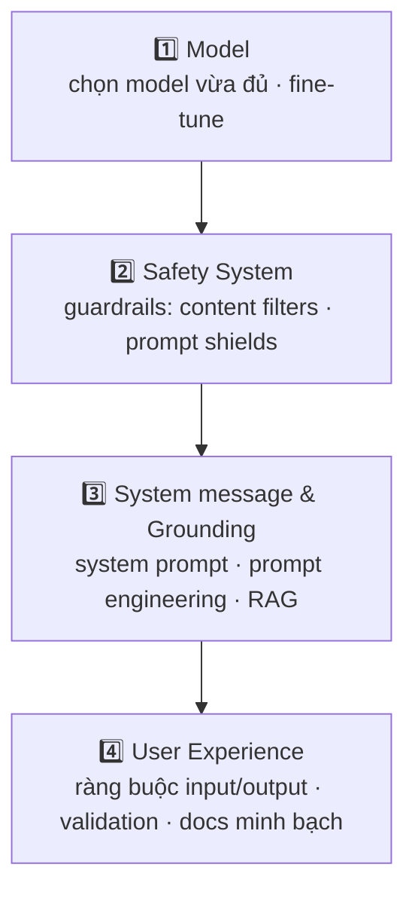

# Note 04 — Tối ưu model performance & Responsible GenAI

> **TL;DR:** Ba chiến lược tối ưu **bổ trợ nhau, không thay thế nhau**: **prompt engineering** (chỉnh *hành vi* — rẻ, làm đầu tiên), **RAG** (bù *kiến thức* — khi model thiếu dữ liệu domain/mới), **fine-tuning** (ép *độ nhất quán* style/format — đắt, làm cuối, dùng LoRA với 3 kiểu SFT/RFT/DPO). Quy trình **Responsible GenAI** 4 bước: **Map** (nhận diện + ưu tiên harm, red teaming) → **Measure** (đo baseline bằng bộ prompt "khiêu khích") → **Mitigate** (giảm hại ở **4 tầng**: model → safety system/guardrails → system message & grounding → UX) → **Manage** (review pháp lý/riêng tư, phased rollout, incident/rollback plan). Guardrails của Foundry gồm **content filters** (4 mức severity × 5 nhóm harm) và **prompt shields** (chặn jailbreak).

## 1. Ba chiến lược tối ưu — chọn theo "cái đang thiếu"

| Chiến lược | Thời gian | Phức tạp | Chi phí | Giải quyết |
|-----------|-----------|----------|---------|-----------|
| **Prompt engineering** | Thấp | Thấp | Chỉ per-token | Tone, format, hành vi; lặp nhanh |
| **RAG** | Vừa | Vừa | Search infra + storage + token | Độ chính xác factual, kiến thức domain, dữ liệu đổi thường xuyên |
| **Fine-tuning** | Cao | Cao | Train compute + hosting + token | Nhất quán hành vi, ép style, **rút ngắn prompt**, distillation |

**Decision framework:** bắt đầu prompt engineering → thêm RAG nếu *accuracy* là vấn đề → thêm fine-tuning nếu *consistency* là vấn đề → kết hợp khi cần (app khắt khe nhất dùng cả ba: fine-tune giữ brand voice, RAG cấp dữ liệu, prompt thêm chỉ dẫn theo phiên).

## 2. Prompt engineering

**Thành phần prompt:** system message (định nghĩa vai trò/ràng buộc — ảnh hưởng nhưng **không bảo đảm** tuân thủ), user message, assistant message (lượt trước), examples.

**Checklist system message:** vai trò + kết quả kỳ vọng → boundaries (chủ đề cấm) → output format tường minh → chính sách "khi không chắc" (hỏi lại/từ chối).

**Các pattern:**

| Pattern | Cách làm | Khi dùng |
|---------|----------|----------|
| **Persona** | "You are a seasoned marketing professional…" | Đổi giọng điệu/góc nhìn |
| **Format template** | Liệt kê khung output (tên, vị trí, giá…) | Cần output parse được |
| **Chain-of-thought** | "Take a step-by-step approach: consider…" | Bài suy luận nhiều bước — **chỉ cho model thường; reasoning model (o-series) tự làm bên trong** |
| **Task decomposition** | Tách task thành sub-step qua nhiều prompt | Task phức tạp nhiều phần |
| **Few-shot** | Kèm 1+ cặp input→output mẫu (0 mẫu = zero-shot, 1 = one-shot) | Dạy pattern phân loại/format |
| **Delimiters** | `---`, heading Markdown, XML tag tách instruction/content | Prompt nhiều phần, chống hiểu nhầm |

- **Recency bias**: model chú ý phần **cuối** prompt hơn — chỉ dẫn quan trọng bị lờ thì lặp lại nó ở cuối.
- **Tham số**: `temperature` (ngẫu nhiên/sáng tạo — thấp ~0.2 cho factual, cao ~0.7 cho sáng tạo) và `top_p` (giới hạn tập token xác suất cao nhất) — **chỉnh một trong hai, đừng cả hai**.

## 3. RAG — grounding bằng dữ liệu của bạn

**Grounding** = đưa dữ liệu đáng tin vào prompt để model trả lời dựa trên đó thay vì "trí nhớ" train (vốn có cutoff và không có dữ liệu riêng của bạn). RAG là kỹ thuật grounding phổ biến nhất, 3 bước: **Retrieve** (tìm thông tin liên quan trong data source) → **Augment** (nhét vào prompt làm context) → **Generate** (model sinh câu trả lời đã ground).

- **Embedding**: biểu diễn text thành **vector** số thực nắm ngữ nghĩa; hai câu khác từ nhưng cùng nghĩa → vector gần nhau; đo bằng **cosine similarity** (gần 1 = rất giống).
- **Azure AI Search** làm tầng retrieval: nạp dữ liệu (Blob/Data Lake/OneLake/upload) → tạo index có vector (embedding model) → query. Bốn kiểu search: **keyword** (khớp từ), **semantic** (khớp nghĩa bằng semantic model), **vector** (khớp embedding), **hybrid** (gộp cả ba — **khuyến nghị cho GenAI app**).
- Code: lấy kết quả search → nhét vào system message làm `retrieved_context` → `responses.create()`.
- Quy mô agent enterprise, nhiều kho dữ liệu → cân nhắc **Foundry IQ** ([[07-Foundry-IQ-Knowledge-Agents]]) thay vì tự quản search infra.

Chi tiết lý thuyết RAG (chunking, re-ranking…) đã có ở domain AI: [[../../../04-AI/01-AI-Fundamentals-RAG/02-RAG-Theoretical-Foundations|RAG Theoretical Foundations]].

## 4. Fine-tuning — ép độ nhất quán

Train tiếp model nền trên dataset nhỏ chuyên nhiệm vụ → chỉnh **trọng số** model. Foundry dùng **LoRA** (Low-Rank Adaptation — chỉ cập nhật tập con tham số quan trọng qua biểu diễn hạng thấp → nhanh, rẻ hơn full training mà giữ chất lượng).

**Khi nào fine-tune:** style/tone nhất quán tuyệt đối (brand voice); output format nghiêm ngặt mà few-shot không đủ; **giảm độ dài prompt** (nhét pattern vào trọng số thay vì system message dài — tiết kiệm token + latency); **distillation** (lấy output model lớn để train model nhỏ đạt chất lượng gần bằng, rẻ hơn); cải thiện độ chính xác **tool calling**.

| Kiểu | Cách train | Hợp với |
|------|-----------|---------|
| **SFT** (Supervised fine-tuning) | Dataset cặp prompt→response có nhãn | Task có cách làm rõ ràng, chuẩn |
| **RFT** (Reinforcement fine-tuning) | Lặp với **grader** thưởng response tốt | Task phức tạp nhiều lời giải, cần nâng chất lượng suy luận |
| **DPO** (Direct Preference Optimization) | Cặp response *preferred / non-preferred* | Alignment theo sở thích người, nhẹ hơn RL truyền thống; có thể chạy sau SFT |

**Training data**: JSONL, mỗi dòng một hội thoại `{"messages":[system, user, assistant]}`; **system message nhất quán và KHÔNG được bỏ trống** (bỏ trống → model kém chính xác; deploy phải dùng lại đúng system message đó); tối thiểu hàng trăm mẫu chất lượng cao.

**Cái giá phải trả:** chi phí train + hosting theo giờ; nhạy với chất lượng data (overfit/underfit/bias); phải retrain khi base model đổi; dò hyperparameter (epochs, batch size, learning rate); **model drift** — chuyên hoá hẹp quá thì kém đi ở task tổng quát. → Luôn **đo baseline trước khi fine-tune**, không thì không biết fine-tune giúp hay phá.

`★ Insight ─────────────────────────────────────`
Câu thi kinh điển: "RAG hay fine-tuning?" — trả lời bằng trục **knowledge vs behavior**: RAG bơm *kiến thức* lúc chạy (data mới/riêng, đổi thường xuyên, không đụng trọng số); fine-tuning khắc *hành vi* vào trọng số (style, format, tính nhất quán). Thiếu kiến thức → RAG; nói đúng nhưng "nói không đúng kiểu" → fine-tune.
`─────────────────────────────────────────────────`

## 5. Responsible GenAI — quy trình 4 bước (Map → Measure → Mitigate → Manage)

Khung của Microsoft, tương ứng các function trong **NIST AI Risk Management Framework** (khung quản trị rủi ro AI của viện tiêu chuẩn Mỹ).

### 5.1 Map — nhận diện harm
1. **Identify**: harm thường gặp — nội dung xúc phạm/phân biệt, sai sự thật, tiếp tay hành vi phạm pháp/phi đạo đức. Đọc **transparency note** của dịch vụ + system card của model; dùng **Responsible AI Impact Assessment template** để tài liệu hoá.
2. **Prioritize**: theo *likelihood × impact* — có tính chủ quan, cân theo intended use lẫn khả năng misuse (ví dụ copilot bếp: đưa thời gian nấu sai [xảy ra thường] vs đưa công thức chất độc [hiếm nhưng nghiêm trọng]).
3. **Test & verify**: **red teaming** — đội tester chủ đích "phá" để chứng minh harm xuất hiện được (mở rộng từ thực hành security truyền thống sang GenAI).
4. **Document & share** với stakeholders.

### 5.2 Measure — đo baseline
Chuẩn bị bộ **input prompt dễ dụ ra từng harm** → chạy qua hệ thống → chấm output theo tiêu chí định sẵn (đơn giản nhất: harmful / not harmful). Bắt đầu **thủ công tập nhỏ** để chốt tiêu chí, sau đó **tự động hoá** trên tập lớn (có thể dùng classification model chấm); vẫn định kỳ test tay để xác nhận automation còn đúng.

### 5.3 Mitigate — giảm hại 4 tầng (trong→ngoài)

- **Model layer**: chọn model *vừa đủ* cho nhiệm vụ (task phân loại nhỏ không cần GPT-4 — model nhỏ ít rủi ro sinh bậy hơn); fine-tune với data của mình.
- **Safety system layer** — **guardrails** của Foundry:
  - **Content filters**: phân loại prompt & response theo **4 mức severity** (safe / low / medium / high) trên **5 nhóm harm**: hate & fairness, sexual, violence, self-harm, **task-adherence** (lệch nhiệm vụ).
  - **Prompt shields**: thuật toán phát hiện abuse — nhận ra user đang cố phá system prompt (jailbreak/prompt injection).
- **System message & grounding layer**: system input định hành vi; prompt engineering + **RAG từ nguồn tin cậy** để tối đa xác suất output đúng, vô hại.
- **User experience layer**: UI ràng buộc input (giới hạn chủ đề/kiểu); validate input/output; tài liệu **minh bạch về giới hạn** của hệ thống.

> 📌 **Kế thừa từ AI-102 cũ — Azure AI Content Safety:** dịch vụ đứng sau content filters, dùng được độc lập cho cả nội dung do người tạo: **text/image moderation** theo 4 nhóm hate–sexual–violence–self-harm với thang severity, **Prompt Shields** (chặn direct/indirect prompt injection), **groundedness detection** (phát hiện câu trả lời không bám nguồn). Kèm thực hành bảo mật dịch vụ AI: auth bằng **Entra ID/managed identity** thay key, key cất **Key Vault** + xoay vòng định kỳ, giới hạn mạng bằng **private endpoint**, bật **diagnostic logging** vào Azure Monitor/Log Analytics để giám sát usage & lạm dụng.

### 5.4 Manage — vận hành có trách nhiệm
- **Prerelease reviews**: legal, privacy, security, **accessibility**.
- **Phased delivery**: thả cho nhóm user hẹp trước, gom feedback rồi mở rộng.
- Chuẩn bị sẵn: **incident response plan** (kèm ước tính thời gian phản ứng), **rollback plan**, khả năng **block ngay** response có hại, **block user/app/IP** lạm dụng, kênh **user feedback** (report nội dung sai/có hại), **telemetry** đo satisfaction + gap (tuân thủ luật riêng tư).

## Q&A phỏng vấn

**Q1. Khi nào prompt engineering là không đủ?**
→ Hai trường hợp: (1) model **thiếu kiến thức** — không có dữ liệu domain/riêng/mới → RAG; (2) model **không giữ nổi hành vi** dù prompt chi tiết — style/format thiếu nhất quán → fine-tuning.

**Q2. LoRA là gì và vì sao Foundry dùng nó cho fine-tuning?**
→ Low-Rank Adaptation: thay vì train lại toàn bộ tham số, chỉ cập nhật một tập con quan trọng qua biểu diễn hạng thấp → train nhanh hơn, rẻ hơn nhiều mà chất lượng giữ được.

**Q3. Phân biệt SFT, RFT, DPO.**
→ SFT: học từ cặp prompt→response có nhãn (task chuẩn mực). RFT: lặp tối ưu bằng grader thưởng điểm (task nhiều lời giải, nâng suy luận). DPO: học từ cặp preferred/non-preferred (alignment sở thích, nhẹ hơn RL); có thể xếp tầng SFT rồi DPO.

**Q4. Bốn bước của quy trình Responsible GenAI?**
→ Map (nhận diện + ưu tiên + red-team xác minh + tài liệu hoá harm) → Measure (bộ prompt khiêu khích, đo baseline, tự động hoá) → Mitigate (4 tầng: model, safety system, system message & grounding, UX) → Manage (review trước phát hành, phased rollout, incident/rollback, feedback + telemetry).

**Q5. Guardrails trong Foundry chặn jailbreak bằng gì?**
→ **Prompt shields** ở tầng safety system — thuật toán abuse detection nhận diện nỗ lực phá system prompt (kể cả indirect injection nhúng trong tài liệu). Content filters thì phân loại nội dung theo severity 4 mức × 5 nhóm harm (có cả task-adherence).

**Q6. Red teaming trong GenAI là gì?**
→ Đội test chủ đích tấn công hệ thống để moi ra output có hại trước khi user thật gặp — mở rộng thực hành red team bảo mật sang chất lượng/an toàn nội dung; kết quả dùng để ước lượng likelihood thực tế của harm.

**Q7. Vì sao phải đo baseline trước khi tối ưu?**
→ Không có baseline thì không biết thay đổi (fine-tune, đổi prompt…) cải thiện hay làm tệ đi. Thiết lập benchmark evaluation sớm, chạy lại sau mỗi thay đổi để đo tác động khách quan.

## Liên quan
- [[00-MOC-AI-103]] — MOC AI-103
- [[02-Model-Catalog-Chon-Deploy-Danh-gia]] — evaluation metrics dùng để đo baseline
- [[03-Chat-App-Foundry-SDK-va-Tools]] — file_search (RAG mini trong Responses API)
- [[07-Foundry-IQ-Knowledge-Agents]] — RAG platform cho agent enterprise
- [[../../../04-AI/01-AI-Fundamentals-RAG/02-RAG-Theoretical-Foundations|RAG Theoretical Foundations]] — lý thuyết RAG sâu
- [[../../../04-AI/03-LLMOps-Evaluation/00-MOC-LLMOps-Evaluation|MOC LLMOps]] — evaluation & vận hành LLM tổng quát
