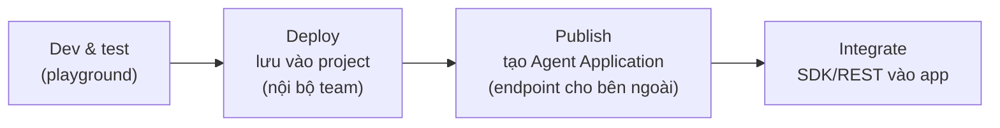

# Note 05 — Foundry Agent Service + phát triển agent bằng VS Code

> **TL;DR:** **AI agent** = phần mềm dùng GenAI để hiểu ngữ cảnh, tự quyết định và hành động thay người dùng (khác app truyền thống chạy theo rule cứng). **Foundry Agent Service** là dịch vụ **fully managed**: tự lo tool-calling lifecycle, conversation state (qua Responses API), hạ tầng — build agent dưới 50 dòng code. Hai loại agent: **declarative** (cấu hình, không code — gồm *prompt-based* và *workflow* YAML đa agent) và **hosted** (agent container hoá viết bằng code, platform host). Phát triển bằng **Foundry portal** (trực quan, prototyping) hoặc **VS Code + Microsoft Foundry extension** (Agent Designer + YAML, version control, sinh code tích hợp). Phân biệt sống còn: **Deploy** (lưu agent vào project) vs **Publish** (tạo **Agent Application** — endpoint ổn định + **Entra identity riêng** → phải **gán lại RBAC** cho identity mới, không thì tool lỗi 403).

## 1. AI agent là gì & vì sao cần

- Agent **hiểu ngữ cảnh → quyết định → hành động** để đạt mục tiêu, không chỉ sinh text. Giá trị: tự động hoá việc lặp lại, hỗ trợ quyết định từ dữ liệu, scale không cần tăng người, chạy 24/7.
- Use case theo loại: personal productivity (M365 Copilot), research (theo dõi trend/báo cáo), sales (lọc lead), customer service (Cineplex xử lý refund), developer (GitHub Copilot).

### Rủi ro bảo mật đặc thù của agent (câu hỏi phỏng vấn hay gặp)

| Rủi ro | Ví dụ hậu quả |
|--------|----------------|
| **Data leakage** | Agent tóm tắt file nội bộ lộ dữ liệu private ra response cho khách |
| **Prompt injection** | Chỉ dẫn ẩn trong message khiến agent lộ credentials |
| **Privilege escalation** | Agent nối CRM thực hiện thao tác admin (export/xoá record) |
| **Data poisoning** | Dataset bị đầu độc khiến agent khuyên nội dung có hại |
| **Supply chain** | Plugin bên thứ ba bị compromise chèn code độc |
| **Over-reliance on autonomy** | Agent tự gửi thanh toán / publish nội dung chưa kiểm chứng |
| **Thiếu audit log** | Không truy vết được hành vi độc hại |
| **Model inversion** | Query lặp moi được dữ liệu private trong fine-tune dataset |

**Mitigation (security-by-design):** RBAC + least privilege; prompt filtering/validation; **human-in-the-loop approval** cho thao tác nhạy cảm; logging đầy đủ; audit dependency bên thứ ba định kỳ; retrain/validate model chống drift & poisoning.

## 2. Foundry Agent Service — dịch vụ managed

Tính năng chính: **automatic tool calling** (service tự lo cả vòng đời gọi tool), **state được quản qua Responses API** (không tự quản conversation state), **tool catalog** phong phú, chọn model tuỳ ý, enterprise security (keyless auth, content safety filters), storage tuỳ chọn (platform-managed hoặc BYO Blob), **observability/tracing** built-in.

### Hai loại agent

| Loại | Định nghĩa bằng | Chi tiết |
|------|------------------|----------|
| **Declarative** | Cấu hình (không code) | • **Prompt-based**: 1 agent = model + instructions + tools (phổ biến nhất) • **Workflow**: đa agent phối hợp, định nghĩa YAML |
| **Hosted** | Code, đóng container | Toàn quyền logic & execution, platform lo hạ tầng |

## 3. Hai môi trường phát triển

| | **Foundry portal** | **VS Code + Foundry extension** |
|---|---|---|
| Hợp với | Prototyping nhanh, cấu hình visual, quản lý tập trung, stakeholder không code | Developer workflow, **Git version control YAML**, lặp nhanh cạnh code app |
| Tính năng | Build > Agents, playground, tool catalog, dashboard usage | 3 khu: **Resources** (models/agents/connections/vector stores), **Tools** (catalog, playgrounds, Local Visualizer, deploy hosted agents), Help; **Agent Designer** + sửa YAML trực tiếp + **sinh code tích hợp** |

![[vscode-foundry-extension-agent-builder.png]]
*Ảnh: Microsoft Learn — Microsoft Foundry extension trong VS Code: sidebar Resources (Models, Declarative Agents với version v1/v2, Hosted Agents, Tools, Assets, Classic) + khu Tools (Model Catalog, các Playground, Local Visualizer, Deploy Hosted Agents); giữa là Agent Builder (name/model/instructions/tool File Search) và phải là Playground test ngay.*

Tài nguyên cần: Foundry **project** + **model deployment** (hạ tầng còn lại tự provision). Tuỳ chọn thêm: AI Search (Foundry IQ/File Search), Storage, Key Vault, Azure Functions.

### Cấu trúc YAML agent (declarative prompt-based)

```yaml
# yaml-language-server: $schema=https://aka.ms/ai-foundry-vsc/agent/1.0.0
version: 1.0.0
name: healthcare-assistant
description: Assists staff with appointment scheduling
id: 'agent-abc123xyz'          # tự sinh, dùng khi gọi API
metadata:
  authors: [developer-name]
  tags: [healthcare, scheduling]
model:
  id: 'gpt-4.1'
  options: { temperature: 0.5, top_p: 1 }
instructions: |
  You're a healthcare assistant...
  - Never access or share patient medical information
tools: []
```

- `temperature` 0.3–0.7 hợp agent nghiệp vụ có cấu trúc; instructions nên: vai trò rõ → guideline → điều cấm.
- Best practices: YAML vào Git; tên/tag mô tả; **test sau mỗi thay đổi**; bắt đầu đơn giản rồi lặp; **một agent một mục đích** (ôm nhiều việc → hành vi bất nhất).

## 4. Tools của agent (tổng quan — chi tiết ở note 06)

Tool catalog 3 nhóm: **Configured** (built-in sẵn dùng: Code Interpreter, File Search), **Catalog** (thêm từ registry: Bing Web Search, Azure AI Search, SharePoint, MCP servers…), **Custom** (OpenAPI spec / MCP server của bạn).

Vòng đời tool-calling **tự động**: user hỏi → agent phân tích chọn tool → gọi với tham số → nhận kết quả → dệt vào câu trả lời. Phân biệt: **File Search** (RAG trên tài liệu upload trực tiếp vào vector store) vs **Azure AI Search** (nối index enterprise có sẵn). Tool khác: Browser Automation, Computer Use, Image Generation, Microsoft Fabric, Deep Research, **Agent-to-Agent** (uỷ thác cho agent khác).

## 5. Test → Deploy → Publish

**Chiến lược test trong playground:** happy path, edge case (input mơ hồ/thiếu), boundary (yêu cầu ngoài phạm vi instructions), multi-turn (giữ context), tool invocation (gọi đúng tool đúng lúc). Ghi lại kết quả để bắt regression.



| | **Deploy** | **Publish** |
|---|---|---|
| Phạm vi | Trong project workspace | Ra ngoài — endpoint gọi được không cần quyền vào project |
| Tạo ra | Bản lưu cấu hình | **Agent Application** (Azure resource: invocation URL + auth policy + **Entra agent identity riêng**) + Deployment (instance có start/stop) |

- Endpoint published: `https://{res}.services.ai.azure.com/api/projects/{proj}/applications/{app}/protocols/openai/responses` — **URL không đổi khi cập nhật version** (traffic tự route 100% sang version mới).
- Auth: **chỉ Entra ID** (caller cần role **Azure AI User** trên Agent Application; **không hỗ trợ API key**). 403 → kiểm tra role.
- Hiện tại endpoint chỉ hỗ trợ **stateless Responses API** → client tự lưu history cho multi-turn.

> ⚠️ **Bẫy kinh điển:** publish xong agent nhận **identity Entra MỚI**, tách khỏi identity project — **quyền không tự chuyển**. Tool chạy ngon lúc dev sẽ **fail authorization sau khi publish** nếu quên gán lại RBAC cho identity mới trên từng resource (AI Search, Storage, Cosmos…).

**Production checklist:** monitoring (App Insights: response time, tool success rate, error, token), managed identity + least privilege, cost (giới hạn độ dài response, rate limiting), retry + exponential backoff, client-side conversation store.

`★ Insight ─────────────────────────────────────`
So với thời AI-102: Agent Service thay thế vai trò của **Assistants API + Bot Framework**. Điểm mấu chốt để trả lời "vì sao dùng Agent Service thay vì tự code vòng lặp tool-calling bằng Inference API": service lo **tool lifecycle + state + hạ tầng + bảo mật** — bạn chỉ khai báo model, instructions, tools.
`─────────────────────────────────────────────────`

## Q&A phỏng vấn

**Q1. Declarative agent khác hosted agent?**
→ Declarative: định nghĩa bằng cấu hình (portal/YAML), gồm prompt-based (1 agent) và workflow (đa agent YAML); nhanh, không code. Hosted: viết code, đóng container, platform host — toàn quyền logic khi cần vượt khỏi khuôn cấu hình.

**Q2. Deploy khác publish?**
→ Deploy = lưu agent vào project để team test/iterate. Publish = tạo Agent Application (Azure resource) có endpoint ổn định + identity Entra riêng để bên ngoài gọi mà không cần quyền vào project.

**Q3. Vì sao tool chạy tốt lúc dev nhưng lỗi sau khi publish?**
→ Agent published có identity Entra mới; RBAC của identity dev không tự chuyển. Phải gán lại role cho identity mới trên mọi resource mà tool truy cập.

**Q4. Agent Service quản conversation state thế nào?**
→ Qua Responses API — service tự quản state hội thoại trong project. Riêng endpoint Agent Application (published) hiện stateless → client tự giữ history.

**Q5. Kể 3 rủi ro bảo mật đặc thù của agent và cách giảm.**
→ Prompt injection (→ prompt filtering/validation), privilege escalation (→ RBAC + least privilege), over-autonomy hành động không mong muốn (→ human-in-the-loop approval cho thao tác nhạy cảm). Kèm logging/audit đầy đủ.

**Q6. Khi nào chọn VS Code extension thay vì portal?**
→ Khi cần version control cấu hình YAML trong Git, phát triển cạnh code app, sinh code tích hợp, debug local. Portal hợp prototyping nhanh và stakeholder không kỹ thuật. Nhiều team dùng cả hai.

## Liên quan
- [[00-MOC-AI-103]] — MOC AI-103
- [[03-Chat-App-Foundry-SDK-va-Tools]] — tools mức prompt (tiền thân của agent tools)
- [[06-Custom-Tools-va-MCP-Tools]] — custom tools & MCP chi tiết
- [[09-Agent-Framework-va-Multi-Agent]] — SDK code-first cho agent
- [[../../../04-AI/04-LangGraph-Agentic/00-MOC-LangGraph-Agentic|MOC LangGraph]] — framework agent phía open-source để đối chiếu
