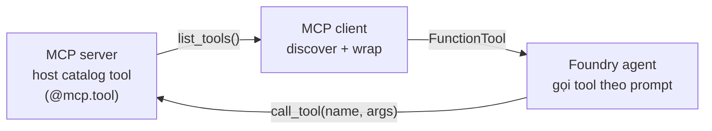

# Note 06 — Custom tools & MCP tools cho agent

> **TL;DR:** Khi built-in tools không đủ, agent cần **custom tools** — 4 cách: **function calling** (hàm trong code app, agent tự quyết khi nào gọi), **Azure Functions** (serverless, event-driven qua queue trigger/binding), **OpenAPI tool** (nối API ngoài bằng spec OpenAPI 3.0 — auth: anonymous/API key/managed identity), **Logic Apps** (low-code workflow). **MCP** (Model Context Protocol) nâng cấp cách tích hợp: **dynamic tool discovery** — agent lấy catalog tool từ **MCP server** lúc runtime, thêm/sửa tool ở server không cần sửa/redeploy agent. Foundry Agent Service hỗ trợ **remote MCP server native** qua object `MCPTool` (server_label, server_url, allowed_tools, `require_approval` mặc định *always* — human-in-the-loop duyệt từng lần gọi).

## 1. Vì sao cần custom tool

Built-in tools (Code Interpreter, File Search, web search…) lo phần "kiến thức + tính toán"; **custom tool nối agent vào hệ thống CỦA BẠN**: CRM tra đơn hàng, hệ thống tồn kho, đặt lịch khám, ticketing IT, LMS… → tự động hoá đúng nghiệp vụ, giảm lỗi người, tăng năng suất.

**Bản chất khai báo (declarative) — điểm dev hay vấp:** bạn **không viết code "gọi tool khi nào"** — chỉ *mô tả* tool (tên có nghĩa + tham số tài liệu hoá tốt), agent **tự suy ra** khi nào và gọi thế nào từ prompt của user. Mô tả càng rõ, agent chọn tool càng chuẩn.

## 2. Bốn cách hiện thực custom tool

| Cách | Cơ chế | Hợp khi |
|------|--------|---------|
| **Function calling** | Định nghĩa hàm + schema trong code app; agent trả về function call để app chạy | Logic tuỳ biến trong app, đa ngôn ngữ |
| **Azure Functions** | Serverless function với **trigger + binding** (ví dụ storage queue in/out) | Event-driven, đã có sẵn Functions trong hệ thống |
| **OpenAPI spec tool** | Nạp spec **OpenAPI 3.0** mô tả REST API; Foundry tự map tham số & parse response | API ngoài/nội bộ đã có spec chuẩn |
| **Azure Logic Apps** | Workflow low-code/no-code nối app, data, service | Team ít code, tận dụng connector có sẵn |

### Function calling — đăng ký với agent

```python
function_tool = FunctionTool(
    name="recent_snowfall",
    parameters={
        "type": "object",
        "properties": {"location": {"type": "string", "description": "The city name to check snowfall for."}},
        "required": ["location"],
        "additionalProperties": False},
    description="Get recent snowfall totals for a given location.",
    strict=True)

agent = project_client.agents.create_version(
    name="snowfall-agent",
    definition=PromptAgentDefinition(
        model="gpt-4.1",
        instructions="You are a weather assistant. Use the provided functions to answer questions.",
        tools=[function_tool]))
```

### Azure Functions tool
`AzureFunctionTool` khai **input_binding + output_binding** (storage queue: queue name + service endpoint) + định nghĩa function (name/description/parameters). Agent gửi request qua queue vào, nhận kết quả từ queue ra.

### OpenAPI tool
Viết file spec JSON (openapi 3.x: servers.url, paths, operationId, parameters, responses) → nạp bằng `OpenApiTool(openapi=OpenApiFunctionDefinition(name=…, spec=…, auth=OpenApiAnonymousAuthDetails()))`. **3 kiểu auth hỗ trợ: anonymous, API key, managed identity.**

## 3. MCP — Model Context Protocol

Vấn đề: tích hợp tay từng API → mỗi lần API đổi phải sửa code agent, càng nhiều tool càng rối. **MCP** giải bằng chuẩn hoá + **dynamic tool discovery**:



**Ưu điểm:** *integrate once* — thêm/sửa/xoá tool **tập trung ở server**, agent luôn dùng version mới nhất, không redeploy; **interoperable** giữa các LLM (đổi model không phải làm lại tích hợp); **auth chuẩn hoá** (không phải quản key lẻ tẻ từng API).

### Tự dựng MCP server + client (cách thủ công)

- **Server**: `FastMCP("server-name")` — decorator `@mcp.tool` biến hàm Python thành tool; **type hints + docstring tự sinh tool definition**; serve qua HTTP.
- **Client**: mở session tới server → `session.list_tools()` lấy catalog → sinh **function stub** bọc mỗi tool trong **async function** (gọi `session.call_tool(tool_name, tool_args)` không blocking) → gói vào `FunctionTool` đăng ký cho agent.

### Cách native: `MCPTool` trong Foundry Agent Service (khuyến nghị)

Không cần tự tạo client session/wrap hàm — chỉ khai object MCPTool, tool **tự được gọi khi cần** trong agent run:

| Tham số | Ý nghĩa |
|---------|---------|
| `server_label` | Định danh server (vd "GitHub") |
| `server_url` | URL MCP server (vd `https://api.githubcopilot.com/mcp/`) |
| `allowed_tools` *(tuỳ chọn)* | Whitelist tool agent được dùng |
| `require_approval` | `always` (**mặc định** — người duyệt từng lần gọi) / `never` |
| custom headers (`update_headers`) | Truyền API key/OAuth token… |

**Luồng approval (human-in-the-loop):** model muốn gọi tool có approval → response chứa **`mcp_approval_request`** (cho biết tool nào sắp được gọi) → bạn gửi follow-up **`mcp_approval_response`** kèm `approval_request_id` + `approve: true/false`. Nối được **nhiều MCP server** cùng lúc (mỗi server một MCPTool).

`★ Insight ─────────────────────────────────────`
Ba tầng tích hợp tool, chọn theo mức "động": (1) **function calling** — tool tĩnh, sống trong code app; (2) **OpenAPI** — tool tĩnh, sống ngoài app nhưng spec cố định; (3) **MCP** — tool **động**, catalog cập nhật runtime, một chuẩn cho mọi LLM. Câu thi "hệ thống tool thay đổi thường xuyên, nhiều team quản lý" → đáp án là MCP.
`─────────────────────────────────────────────────`

## Q&A phỏng vấn

**Q1. App có sẵn một hàm Python muốn agent gọi — dùng tool gì?**
→ **Function calling** (FunctionTool): mô tả schema hàm cho agent; agent trả function call, app thực thi. (Không phải Code Interpreter — cái đó để model tự viết code mới trong sandbox.)

**Q2. Muốn nối agent vào web service OpenAPI 3.0 có sẵn?**
→ **OpenAPI spec tool**: nạp spec vào agent definition; Foundry tự map tham số/parse response. Auth chọn anonymous, API key hoặc managed identity. Không rewrite service, không nhét schema vào instructions.

**Q3. Dynamic tool discovery là gì, MCP làm nó thế nào?**
→ Agent khám phá tool khả dụng lúc runtime thay vì hardcode. MCP server host catalog (hàm + `@mcp.tool`), client `list_tools()` lấy danh sách, agent gọi qua `call_tool`. Thêm/sửa tool chỉ ở server — agent không đổi code.

**Q4. `require_approval` trong MCPTool để làm gì, mặc định là gì?**
→ Bắt duyệt (human-in-the-loop) trước mỗi lần agent gọi tool trên MCP server — chống agent tự hành động nhạy cảm. Mặc định `always`; luồng: `mcp_approval_request` trong response → gửi `mcp_approval_response` (approval_request_id + approve).

**Q5. Vì sao tool nên bọc async khi tự tích hợp MCP client?**
→ Để agent gọi tool **không blocking** — nhiều tool/gọi chậm không treo vòng xử lý.

**Q6. Vì sao nói custom tool mang tính "declarative"?**
→ Dev không viết logic điều phối "khi nào gọi tool"; chỉ mô tả tool rõ ràng (tên, mô tả, tham số). Agent tự phân tích prompt và quyết định gọi tool nào với tham số gì.

## Liên quan
- [[00-MOC-AI-103]] — MOC AI-103
- [[05-Foundry-Agent-Service-va-VS-Code]] — nền tảng agent & tool catalog
- [[07-Foundry-IQ-Knowledge-Agents]] — knowledge base cũng nối qua MCP
- [[12-Language-va-Speech-MCP-Server]] — MCP server dựng sẵn của Azure Language/Speech
- [[../AZ-204/00-MOC-AZ-204|MOC AZ-204]] — Azure Functions trigger/binding chi tiết
