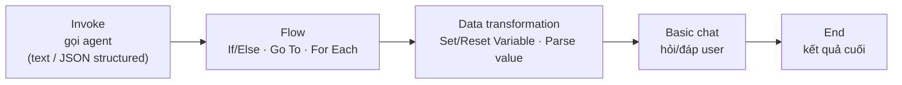

# Note 08 — Tích hợp M365 (Teams/Copilot, Work IQ) & agent-driven workflows

> **TL;DR:** Hai chủ đề ghép: **(1) Publish agent lên Microsoft 365** — từ Foundry portal, wizard tự tạo **Azure Bot Service** (định tuyến message Teams↔agent) + đăng ký app **Entra ID** + sinh **publishing package**; chọn scope **Shared** (dùng ngay, cá nhân/team nhỏ) hay **Organization** (cả tenant, **cần admin duyệt**); nhớ **gán lại RBAC cho identity mới** của agent. Cần SSO tuỳ biến/middleware/multi-env thì dùng **Microsoft 365 Agents Toolkit** (app proxy đứng giữa). **Work IQ** = CLI + **MCP server** cho agent truy vấn dữ liệu M365 (email, meeting, tài liệu, Teams messages, people) qua Microsoft Graph với **đúng quyền của user**. **(2) Workflows** — orchestration đa agent **visual/declarative** trong Foundry: node **Invoke** (gọi agent, structured output JSON) + **Flow** (If/Else, Go To, For Each) + **Data transformation** (Set/Reset/Parse variable) + **Basic chat** + **End**; logic viết bằng **Power Fx** (ngôn ngữ kiểu Excel); hỗ trợ human-in-the-loop, versioning bất biến, chạy từ code qua `agent_reference`.

## Phần A — Publish agent lên Microsoft 365

### 1. Publish trực tiếp từ Foundry portal

Luồng: chọn agent version → **Publish → Publish to Teams and Microsoft 365 Copilot** → portal tự:
1. Tạo **Azure Bot Service** resource (cầu định tuyến message giữa M365 và agent — cần provider `Microsoft.BotService` đã đăng ký trong subscription).
2. Đăng ký **Microsoft Entra ID application**.
3. Sinh **Microsoft 365 publishing package** (.zip) — điền metadata: tên hiển thị, mô tả, icon PNG 32×32 + 192×192, thông tin tổ chức, URL privacy policy + terms of use. ⚠️ **Không nhét secret/API key vào metadata** — user thấy được.
4. Chọn **scope** → prepare package → test bằng cách upload custom app trong Teams (Apps → Manage your apps → Upload) hoặc phân phối thẳng.

| Scope | Hiển thị | Duyệt | Dùng cho |
|-------|----------|-------|----------|
| **Shared** | "Your agents" | Không cần | Test cá nhân, pilot team nhỏ |
| **Organization** | "Built by your org" | **Admin duyệt** (M365 admin center → Agents → Requested → Approve) | Production toàn tenant |

**Quyền cần có:** Azure AI Project Manager (trên project) + Azure AI User (trên agent application) + quyền tạo resource + quyền đăng ký app Entra + tenant cho phép custom app.

> ⚠️ Giống bài publish ở [[05-Foundry-Agent-Service-va-VS-Code]]: agent published mang **identity mới** → tool truy cập AI Search/Storage/Cosmos phải được **gán lại RBAC** cho identity đó, không thì "chạy ở Foundry nhưng fail trong Teams".

**Cập nhật agent:** sửa trong Foundry → test → republish package mới; organization scope có thể phải duyệt lại tuỳ policy.

### 2. Microsoft 365 Agents Toolkit (nâng cao)

Khi cần vượt khả năng publish trực tiếp → dựng **app proxy** giữa M365 và agent: `Teams/Copilot → Proxy App (Agents Toolkit) → Foundry Agent`.

| | Publish trực tiếp | Agents Toolkit proxy |
|---|---|---|
| Setup | Phút | Giờ→ngày |
| Code | Không | Viết app proxy |
| Tuỳ biến | Hạn chế | **Custom SSO, middleware** (log/transform), **multi-environment** (dev/staging/prod), CI/CD, debug IDE đầy đủ |
| Dùng cho | Đa số trường hợp | Enterprise phức tạp |

Toolkit là extension VS Code/Visual Studio; project type **Custom Engine Agent**; có **Agents Playground** local giả lập Teams.

### 3. Work IQ — agent truy cập dữ liệu M365

**Work IQ** = CLI + **MCP server** nối AI assistant vào dữ liệu **Microsoft 365 Copilot**: emails, meetings (lịch, notes), documents (SharePoint/OneDrive), Teams messages, people. Trả lời được: "Sếp nói gì về deadline?", "Tóm tắt channel Engineering hôm nay".

- **2 chế độ:** CLI (`workiq ask -q "…"` — query nhanh/script) và **MCP server mode** (`npx -y @microsoft/workiq mcp` — tích hợp GitHub Copilot/VS Code, assistant tự gọi khi cần).
- Cài: npm (`npm install -g @microsoft/workiq`) hoặc plugin Copilot CLI; trước khi dùng `workiq accept-eula`.
- **Yêu cầu:** Node.js, M365 subscription **có Copilot license**, **admin consent** trong Entra tenant (truy cập dữ liệu organization-wide).
- **Bảo mật:** truy cập qua **Microsoft Graph với identity đã xác thực của bạn** → chỉ thấy cái bạn vốn có quyền thấy; **không lưu dữ liệu** (retrieve on-demand); query auditable; policy bảo vệ dữ liệu của org vẫn áp. (Preview — có thể thay đổi.)

## Phần B — Agent-driven workflows

### 4. Workflow là gì & pattern

Workflow = orchestration **visual, declarative**: chuỗi **node** nối nhau định nghĩa *cái gì xảy ra, khi nào* — platform lo execution + state. Giải bài "một agent không kham nổi": tách classification / decision / resolution thành nhiều agent phối hợp, cân bằng tự động hoá với giám sát con người.

| Pattern | Cách chạy | Dùng cho |
|---------|-----------|----------|
| **Sequential** | Node chạy tuần tự cố định, output nối input | Pipeline nhiều bước, dễ đoán |
| **Human-in-the-loop** | Dừng chờ input/duyệt của người rồi mới tiếp | Approval, bổ sung context thiếu |
| **Group chat** | Điều khiển chuyển động giữa nhiều agent theo ngữ cảnh | Support đa domain, cộng tác phức tạp |

### 5. Node types



- **Invoke**: gọi agent trong project (hoặc tạo mới tại chỗ); cấu hình tools/knowledge/memory/guardrails; định nghĩa **structured output** (JSON schema trong Details tab) để output **dự đoán được** → nuôi routing/điều kiện; lưu output vào **variable** (Action settings). Agent **tái sử dụng** được giữa nhiều workflow (một categorization agent dùng chung).
- **Flow**: **If/Else** (rẽ nhánh theo điều kiện), **Go To** (nhảy node), **For Each** (lặp qua list — xử lý nhiều ticket không nhân đôi node).
- **Data transformation**: **Set Variable**, **Reset Variable**, **Parse value** (bóc dữ liệu từ structured output / đổi format).
- **Basic chat**: nhắn/hỏi user, bắt câu trả lời vào variable. **End**: kết thúc, trả kết quả.
- Workflow chạy trong ngữ cảnh hội thoại (test qua chat window); **không tự save** — phải save tay, mỗi lần save tạo **version bất biến** (rollback/so sánh được); có cả 2 dạng **visual canvas ↔ YAML** đồng bộ; gắn **notes** cho maintainer.

### 6. Power Fx — "chất keo" low-code

Ngôn ngữ công thức kiểu Excel dùng ở mọi chỗ có quyết định/biến/lặp. Biến **System** (context: activity, last message, user info) và **Local** (dữ liệu trong run).

| Mục đích | Công thức |
|----------|-----------|
| Điều kiện confidence | `Local.Confidence > 0.8` |
| If/Else giá trị | `If(Local.Confidence > 0.8, "Proceed", "Escalate")` |
| Chuỗi | `Upper(Local.Input)`, `Concatenate(Local.FirstName, " ", Local.LastName)`, `Len(…)` |
| Kiểm tra rỗng | `IsBlank(Local.Input)`, `IsEmpty(Local.ItemList)` |
| Bảng/list | `Sum(Local.ItemList, Amount)`, `Count(…)`, `ForAll(Local.ItemList, Upper(Name))` |

Pattern điển hình: agent phân loại trả JSON + confidence → If/Else check `Local.Confidence > 0.8` → cao thì tự xử lý, thấp thì **escalate cho người** (human-in-the-loop).

![[workflow-designer-power-fx-loop.png]]
*Ảnh: Microsoft Learn — workflow designer thực tế với một VÒNG LẶP đa agent: Start → Set variable → `student-agent` → `teacher-agent` → Set variable → If/Else 3 nhánh dùng Power Fx: **If** `!IsBlank(Find("[COMPLETE]", Upper(Last(Local.LatestMessage).Text)))` → End (teacher chấm đạt); **Else If** `Local.TurnCount >= 4` → Send message (hết lượt, thoát an toàn); **Else** → Go to quay lại student-agent (lặp tiếp). Đây chính là maker-checker loop dựng bằng node + Power Fx, kèm chốt chặn vòng lặp vô hạn.*

### 7. Gọi workflow từ code

```python
conversation = openai_client.conversations.create()
stream = openai_client.responses.create(
    conversation=conversation.id,
    extra_body={"agent": {"name": "triage-workflow", "type": "agent_reference"}},
    input="Users can't reset their password from the mobile app.",
    stream=True)

for event in stream:
    if event.type == "response.completed": ...          # kết quả cuối
    # response.output_item.done + WORKFLOW_ACTION → một action xong (theo dõi tiến độ realtime)
```

Human-in-the-loop từ code: workflow pause chờ input → app gửi message tiếp vào conversation để resume. Ứng dụng: web app, API/microservice, batch, test CI/CD.

`★ Insight ─────────────────────────────────────`
Workflow (Foundry, visual/YAML + Power Fx) và Agent Framework (SDK code — note 09) giải cùng bài đa agent ở hai mức: workflow cho orchestration **declarative** ai cũng đọc được, versioned, chỉnh không cần deploy; Agent Framework cho **code-first** toàn quyền. Đối chiếu hệ open-source: workflow ≈ LangGraph graph định nghĩa sẵn; Power Fx ≈ conditional edges.
`─────────────────────────────────────────────────`

## Q&A phỏng vấn

**Q1. Publish agent lên Teams thì Azure tự tạo resource gì?**
→ **Azure Bot Service** (định tuyến message M365 ↔ agent) + đăng ký app Microsoft Entra ID + sinh publishing package cho Teams store.

**Q2. Shared scope khác Organization scope?**
→ Shared: hiện dưới "Your agents", dùng ngay không cần duyệt — test/team nhỏ. Organization: "Built by your org" cho cả tenant, **phải admin duyệt** trong M365 admin center — production.

**Q3. Khi nào cần Microsoft 365 Agents Toolkit thay vì publish trực tiếp?**
→ Custom SSO ngoài Entra mặc định, middleware xử lý giữa Teams và agent, multi-environment (dev/staging/prod), CI/CD, debug sâu. Bản chất: dựng app proxy đứng giữa.

**Q4. Work IQ có làm lộ dữ liệu user không có quyền xem không?**
→ Không — nó query Microsoft Graph bằng **identity đã xác thực của chính user**, chỉ trả về cái user vốn có quyền; không lưu dữ liệu; query auditable; cần admin consent ở tenant.

**Q5. Structured output của agent dùng để làm gì trong workflow?**
→ Ép output theo JSON schema → dữ liệu **dự đoán được** để lưu vào variable, đánh giá bằng điều kiện Power Fx (If/Else, switch) và điều khiển routing — nếu chỉ có free-text thì không rẽ nhánh tin cậy được.

**Q6. Xử lý 50 ticket trong một workflow mà không nhân đôi node?**
→ **For Each** node lặp qua list, áp cùng chuỗi hành động cho từng item; kết hợp variable + điều kiện để escalate ticket có confidence thấp.

## Liên quan
- [[00-MOC-AI-103]] — MOC AI-103
- [[05-Foundry-Agent-Service-va-VS-Code]] — publish & agent identity
- [[09-Agent-Framework-va-Multi-Agent]] — orchestration bằng code (so sánh với workflow)
- [[../../../04-AI/04-LangGraph-Agentic/00-MOC-LangGraph-Agentic|MOC LangGraph]] — graph orchestration open-source đối chiếu
