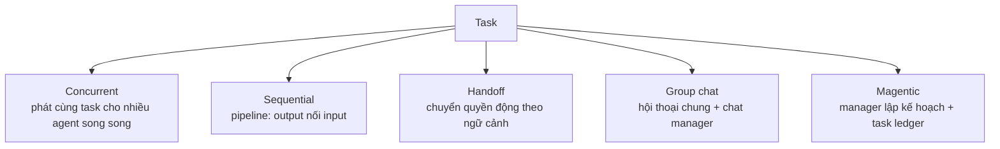

# Note 09 — Microsoft Agent Framework & multi-agent orchestration

> **TL;DR:** **Microsoft Agent Framework** = SDK open-source **thế hệ kế nhiệm của cả Semantic Kernel lẫn AutoGen** (cùng team build): lấy abstraction đơn giản của AutoGen + tính năng enterprise của Semantic Kernel (session state, type safety, middleware, telemetry) + **graph-based workflows**. Mọi agent kế thừa một **Agent base class** thống nhất → đổi provider (Foundry, Azure OpenAI, OpenAI, Anthropic, Bedrock, Ollama…) không phải viết lại logic; **Foundry Agent Service là provider khuyến nghị production** vì có **service-side chat history**. Tools 2 loại: service-provided (Code Interpreter, File Search, Web Search, hosted MCP…) và **custom function tools** (hàm Python + type annotations/`@tool` — framework tự sinh schema; có `approval_mode` human-in-the-loop; **agent cũng làm tool được**). Multi-agent có **5 pattern orchestration**: **Concurrent** (song song độc lập), **Sequential** (pipeline), **Handoff** (chuyển quyền động theo ngữ cảnh), **Group chat** (hội thoại chung có manager, maker-checker), **Magentic** (manager lập kế hoạch động + task ledger) — cùng một interface xây dựng/gọi.

## 1. Kiến trúc & thành phần

| Thành phần | Vai trò |
|-----------|---------|
| **Model clients / Chat clients** | Một interface nối nhiều AI provider (BaseChatClient) |
| **Agent session (AgentThread)** | Quản state hội thoại multi-turn (message roles USER/ASSISTANT/SYSTEM/TOOL) |
| **Context providers** | Component memory cắm-rút, tự nổi thông tin liên quan cho agent |
| **Function tools** | Hàm custom tự đăng ký, framework tự sinh schema |
| **MCP clients** | Hỗ trợ MCP built-in — dynamic tool discovery runtime |
| **Middleware** | Hook chặn/log/sửa hành động agent trước & sau khi chạy |
| **Workflow orchestration** | Graph-based: sequential, concurrent, group chat, handoff |

Mọi agent (bất kể provider) đều có sẵn: function calling, multi-turn conversation, **structured outputs** (type-safe theo schema), streaming, service-provided tools (nơi provider hỗ trợ).

### Provider matrix — điểm chọn provider

| Provider | Service-side chat history |
|----------|---------------------------|
| **Foundry Agent Service** | **Có** ← khuyến nghị production |
| Azure OpenAI / OpenAI **Responses** | Có |
| Azure OpenAI / OpenAI **Chat Completion** | Không |
| Anthropic Claude, Amazon Bedrock, GitHub Copilot, Ollama | Không |

**Service-side history**: hội thoại sống ở service → tiếp tục được qua nhiều request, **kể cả khi app restart hay scale ra nhiều instance**. Provider không hỗ trợ thì framework giữ **local history** trong session object (mất khi process chết — chỉ hợp app ngắn hạn/stateless).

## 2. Tạo agent với Foundry provider (5 bước)

1. **Project + model deployment** sẵn (cần project endpoint + deployment name).
2. **Auth**: `DefaultAzureCredential` tự chọn đúng credential (Azure CLI khi dev, managed identity khi production) — không hardcode key.
3. **Foundry chat client** (`AzureAIAgentClient`): cầu nối app ↔ Agent Service.
4. **Tạo agent** (`ChatAgent`): instructions (system prompt) + tools (framework tự đăng ký + sinh schema).
5. **Session (AgentThread)** + run: session chứa state; **non-streaming** (chờ response trọn) hoặc **streaming** (iterate async từng phần); cả hai đều expose `.text` gộp output.

## 3. Tools trong Agent Framework

- **Service-provided** (Foundry host, chỉ cần khai trong config): Code Interpreter, File Search, Web Search, **Hosted MCP tools**, Azure AI Search, Foundry Toolboxes (bundle tool có tên + version). Một số (Bing Grounding, SharePoint…) đang preview.
- **Custom function tools**: truyền hàm Python thẳng vào agent lúc tạo; mô tả bằng **`Annotated` type + docstring** hoặc **decorator `@tool`** (tự đặt name/description, schema Pydantic khi cần chặt chẽ). Framework tự thực thi khi model gọi và trả kết quả về model.
- **Nhiều tool cùng lúc**: truyền list — model tự chọn tool phù hợp từng đoạn hội thoại, **không cần viết routing logic**.
- **Tool approval**: `approval_mode` trên `@tool` → agent **dừng xin xác nhận** trước khi chạy — cho hành động không đảo ngược/đắt/nhạy cảm.
- **Agent-as-tool**: biến agent con thành function tool của agent ngoài → thiết kế module, agent điều phối uỷ thác domain cho agent chuyên.

Best practices: mô tả tool rõ (model chọn tool **hoàn toàn dựa vào mô tả**); annotate mọi tham số; trả dữ liệu có cấu trúc; một tool một việc; lỗi thì trả message thông tin thay vì raise exception (để model phản hồi hữu ích).

## 4. Workflow core: executors, edges, events

- **Executors**: worker chính — agent hoặc logic tuỳ biến; nhận message, xử lý, phát output.
- **Edges** — cách message chảy:

| Edge | Ý nghĩa | Ví dụ |
|------|---------|-------|
| Direct | Nối thẳng tuần tự | Thu thập input → xử lý booking |
| Conditional | Chỉ chạy khi thoả điều kiện | Hết phòng → nhánh gợi ý ngày khác |
| Switch-case | Route theo giá trị phân loại | VIP → executor premium |
| **Fan-out** | Một message → nhiều executor song song | Check flight + hotel cùng lúc |
| **Fan-in** | Gộp nhiều kết quả về một | Tổng hợp thành itinerary |

- **Events** (observability): WorkflowStarted/Output/Error, ExecutorInvoke/Complete, RequestInfo.

## 5. Năm pattern orchestration

| Pattern | Builder | Dùng khi | Tránh khi |
|---------|---------|----------|-----------|
| **Concurrent** | `ConcurrentBuilder` | Task chạy độc lập song song: brainstorm, ensemble reasoning, voting/quorum, cần nhanh | Agent phụ thuộc output nhau; quota hạn chế; khó gộp/giải xung đột kết quả |
| **Sequential** | `SequentialBuilder` | Bước phải theo thứ tự, mỗi bước tinh chỉnh bước trước (draft → review → polish) | Các bước độc lập; 1 agent đủ; bước đầu fail mà không chặn được downstream |
| **Handoff** | control workflow + switch-case | Không biết trước agent nào/thứ tự nào; chuyên môn lộ ra trong lúc xử lý (support routing) | Thứ tự cố định biết trước; sợ loop handoff vô hạn |
| **Group chat** | `GroupChatBuilder` | Thảo luận/iterate: brainstorm, debate-consensus, **maker-checker loop**, có human tham gia; minh bạch 1 thread | Cần tốc độ; pipeline đơn giản là đủ; >3 agent khó quản |
| **Magentic** | `MagenticBuilder` | Bài toán **mở, không có đường giải định trước**; cần **plan được tài liệu hoá** cho người review; **task ledger** ghi goals/subgoals/plan, tinh chỉnh dần | Đường giải cố định; ưu tiên tốc độ (magentic nặng planning); dễ stall/loop |

- **Group chat manager** mỗi vòng gọi theo thứ tự: `should_request_user_input` → `should_terminate` (vd max rounds) → `filter_results` (nếu kết thúc) → `select_next_agent` (nếu tiếp). Custom bằng cách extend `GroupChatManager`.
- **Magentic** có standard manager cấu hình max round count, stall limit, reset count.
- Luồng dùng chung mọi pattern: định nghĩa agents → chọn builder (+ manager nếu cần) → configure callbacks → run (`run`/`run_stream`) → lấy kết quả async (`get_outputs()` / `WorkflowOutputEvent`).

`★ Insight ─────────────────────────────────────`
Map sang LangGraph để nhớ nhanh: Executor ≈ node, Edge ≈ edge (fan-out/fan-in ≈ parallel branches), Magentic manager ≈ supervisor pattern, maker-checker ≈ reflection. Câu thi hay gặp: "Semantic Kernel hay AutoGen?" — trả lời: cả hai đã **hợp nhất thành Microsoft Agent Framework**; SK đóng góp enterprise features, AutoGen đóng góp agent abstractions.
`─────────────────────────────────────────────────`

## Q&A phỏng vấn

**Q1. Agent Framework quan hệ gì với Semantic Kernel và AutoGen?**
→ Là thế hệ tiếp theo của **cả hai**, do cùng team xây: abstraction đơn giản của AutoGen + session state/type safety/middleware/telemetry của Semantic Kernel + graph-based workflows mới.

**Q2. Vì sao Foundry Agent Service là provider khuyến nghị cho production?**
→ **Service-side chat history**: state hội thoại sống ở service, tự persist qua nhiều request — app restart/scale-out không mất context. Provider Chat Completion thuần chỉ có local history trong memory.

**Q3. Chọn pattern nào: nhiều chuyên gia phân tích cùng một tài liệu theo góc nhìn khác nhau, cần nhanh?**
→ **Concurrent** — cùng task phát cho nhiều agent chạy song song độc lập, gộp kết quả (ensemble). Không dùng sequential (chậm, không cần phụ thuộc nhau).

**Q4. Maker-checker loop là gì, thuộc pattern nào?**
→ Một agent (maker) tạo nội dung, agent khác (checker) review/phê bình, lặp đến khi đạt — trường hợp đặc biệt của **group chat**, chat manager quản lượt nói.

**Q5. Magentic khác handoff chỗ nào?**
→ Handoff: agent **chuyển quyền** cho nhau theo rule/ngữ cảnh, một agent làm tại một thời điểm, không có kế hoạch tổng. Magentic: **manager chuyên trách** lập kế hoạch, giao việc, theo dõi **task ledger** (goals/subgoals/plan) và điều chỉnh động — cho bài toán mở cần plan được tài liệu hoá.

**Q6. Làm sao bắt agent xin phép người trước khi chạy một tool nguy hiểm?**
→ `approval_mode` trên decorator `@tool` — agent pause và yêu cầu xác nhận trước khi thực thi (tương tự `require_approval` của MCPTool ở [[06-Custom-Tools-va-MCP-Tools]]).

**Q7. Đổi từ Azure OpenAI sang model provider khác có phải viết lại agent không?**
→ Không — mọi agent dùng chung Agent base class/BaseChatClient; chỉ đổi cấu hình client, logic agent + tools giữ nguyên. Đây là lợi ích provider-agnostic.

## Liên quan
- [[00-MOC-AI-103]] — MOC AI-103
- [[05-Foundry-Agent-Service-va-VS-Code]] — Agent Service (provider nền)
- [[08-M365-va-Agent-Workflows]] — workflow visual/declarative (đối chiếu code-first)
- [[10-A2A-Protocol]] — giao thức liên agent giữa các hệ khác nhau
- [[../../../04-AI/04-LangGraph-Agentic/00-MOC-LangGraph-Agentic|MOC LangGraph]] — đối chiếu supervisor/reflection pattern
