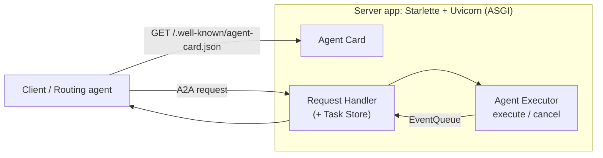

# Note 10 — A2A protocol: Agent Card, Agent Skills & routing agent

> **TL;DR:** **A2A (Agent-to-Agent) protocol** = chuẩn mở cho các agent **khác vendor/platform** khám phá nhau, giao tiếp và phối hợp thực thi task. Agent tự mô tả năng lực bằng **Agent Skills** (id, name, description, tags, examples, input/output modes) và công bố **Agent Card** ("danh thiếp số": identity + endpoint URL + capabilities + skills + auth) tại endpoint chuẩn **`/.well-known/agent-card.json`**. Bên trong, **Agent Executor** xử lý request (2 thao tác: `execute`, `cancel`; giao tiếp qua RequestContext + EventQueue). Server A2A = Agent Card + Request Handler (kèm **Task Store**) + web app (Starlette/Uvicorn). Client fetch card → gửi request **non-streaming** (chờ trọn) hoặc **streaming** (nhận dần); response là **direct message** hoặc **task-based** (theo dõi/hủy được). **Routing agent** đọc card của các remote agent và điều phối workflow (vd: title agent → outline agent).

## 1. Vì sao cần A2A

Task thực tế thường cần **nhiều agent phân tán** (khác team, khác vendor, khác nền tảng) phối hợp — tự nối tay từng cặp thì không scale. A2A chuẩn hoá: **discovery** (tìm agent + năng lực), **communication** (định dạng request/response), **coordinated task execution**.

**3 ưu điểm chính:**
1. **Enhanced collaboration** — agent khác vendor/platform chia sẻ context, làm việc xuyên hệ thống vốn tách rời.
2. **Flexible model selection** — **mỗi agent tự chọn LLM riêng** (tối ưu/fine-tune theo việc của nó) — khác các kịch bản MCP dựa một kết nối LLM duy nhất.
3. **Integrated authentication** — auth nằm sẵn trong protocol, khung bảo mật thống nhất.

## 2. Agent Skills & Agent Card

### Agent Skill — một năng lực cụ thể
| Trường | Ý nghĩa |
|--------|---------|
| **ID** | Định danh duy nhất |
| **Name / Description** | Tên người-đọc-được + giải thích chi tiết skill làm gì |
| **Tags** | Từ khoá phân loại, dễ discovery |
| **Examples** | Prompt/use case mẫu minh hoạ |
| **Input/Output Modes** | Định dạng hỗ trợ (text, JSON…) |

### Agent Card — danh thiếp số của agent
| Trường | Ý nghĩa |
|--------|---------|
| **Identity** | Name, description, version |
| **Endpoint URL** | Nơi truy cập dịch vụ A2A của agent |
| **Capabilities** | Tính năng A2A hỗ trợ (streaming, push notifications) |
| **Default Input/Output Modes** | Media type chính |
| **Skills** | Danh sách Agent Skills gọi được |
| **Authentication Support** | Có yêu cầu credentials không |

- Công bố ở endpoint chuẩn **`/.well-known/agent-card.json`** → client/routing agent **tự động khám phá**.
- Có thể có nhiều version hoặc **extended card** cho user đã xác thực.

## 3. Agent Executor — cầu giữa protocol và business logic

Hai thao tác chính:
- **`execute`**: nhận request (đọc chi tiết qua **RequestContext**: user input, task context) → chạy logic của agent → đẩy kết quả qua **EventQueue** (messages, task updates, artifacts) → routing gửi về requester.
- **`cancel`**: huỷ task đang chạy (agent đơn giản có thể chỉ báo "không hỗ trợ").

Luồng "Hello World": helper class chứa logic → executor nhận request, gọi logic → bọc kết quả thành event → đặt lên event queue → trả về client.

## 4. Host A2A server

3 thành phần bắt buộc:
1. **Agent Card** — expose ở endpoint chuẩn.
2. **Request Handler** — route request tới executor (`execute`/`cancel`); quản vòng đời task qua **Task Store** (track task, streaming data, resubscription — **agent đơn giản vẫn cần task store**).
3. **Server application** — web framework (**Starlette** trong Python) + ASGI server (**Uvicorn**) lắng nghe network.

Setup: định nghĩa skills + card → khởi tạo request handler (executor + task store) → dựng server app (card + handler) → chạy Uvicorn.

## 5. Client kết nối agent

Trách nhiệm client: **discover Agent Card** (từ base URL server, endpoint well-known) → khởi tạo client với card → **gửi request** → **diễn giải response**.

| | **Non-streaming** | **Streaming** |
|---|---|---|
| Cách nhận | Gửi rồi chờ response trọn vẹn | Nhận **incremental** khi agent xử lý |
| Hợp với | Tương tác đơn giản, một câu trả lời | Task chạy lâu, cập nhật realtime cho user |

- Request gồm **role** (vd `user`) + nội dung message; mỗi request có **ID duy nhất** (thường generate).
- Response 2 dạng: **direct message** (output ngay: text/structured) hoặc **task-based** (object đại diện task đang chạy — gọi tiếp để check status/lấy kết quả/cancel). Client phải xử lý được cả hai.

## 6. Routing agent — ghép tất cả lại

Ví dụ workflow technical writer: **title agent** (skill sinh tiêu đề) + **outline agent** (skill sinh dàn ý) đều publish Agent Card → **routing agent** fetch card của cả hai, nhận yêu cầu user → gửi cho title agent → lấy title đút cho outline agent → trả dàn ý hoàn chỉnh — hoàn toàn tự động nhờ discovery + skills chuẩn hoá.

`★ Insight ─────────────────────────────────────`
Phân biệt vàng **MCP vs A2A** (câu thi chắc chắn gặp): **MCP** = chuẩn cho **agent ↔ tools/dữ liệu** (dọc — một LLM gọi công cụ); **A2A** = chuẩn cho **agent ↔ agent** (ngang — nhiều agent ngang hàng, mỗi agent có LLM + vòng suy luận riêng, khám phá nhau qua Agent Card). Chúng bổ trợ: một agent trong mạng A2A vẫn dùng MCP để gọi tool của chính nó.
`─────────────────────────────────────────────────`

## Q&A phỏng vấn

**Q1. A2A protocol giải quyết vấn đề gì?**
→ Chuẩn hoá discovery, giao tiếp và phối hợp task giữa các agent **phân tán, khác vendor/platform** — thay cho việc tích hợp tay từng cặp agent không scale được.

**Q2. Agent Card chứa gì và tìm nó ở đâu?**
→ Metadata của agent: identity (name/description/version), endpoint URL, capabilities (streaming/push), input-output modes, danh sách skills, yêu cầu auth. Lấy tại endpoint chuẩn `/.well-known/agent-card.json`.

**Q3. Agent Skill khác Agent Card?**
→ Skill = mô tả **một năng lực** cụ thể (id, name, description, tags, examples, IO modes). Card = **hồ sơ toàn agent**, trong đó có danh sách skills + cách kết nối. Card là cái client fetch; skill là cái client gọi.

**Q4. Agent Executor làm gì?**
→ Cầu nối giữa protocol và business logic: nhận request (`execute` — đọc RequestContext, chạy logic, phát kết quả qua EventQueue) và xử lý huỷ task (`cancel`). Server route request vào executor qua request handler.

**Q5. Response task-based khác direct message?**
→ Direct message: kết quả trả ngay trong response. Task-based: trả về object task đang chạy — client gọi tiếp để theo dõi status, lấy kết quả sau, hoặc cancel; hợp task dài/phức tạp.

**Q6. A2A hơn gì MCP khi nhiều agent hợp tác?**
→ Mỗi A2A agent **chọn LLM riêng** phù hợp việc của nó (MCP thường một kết nối LLM), auth tích hợp sẵn trong protocol, và có cơ chế discovery (Agent Card) + task lifecycle cho tương tác agent-agent thực thụ.

## Liên quan
- [[00-MOC-AI-103]] — MOC AI-103
- [[06-Custom-Tools-va-MCP-Tools]] — MCP (chuẩn agent↔tool, đối chiếu A2A)
- [[09-Agent-Framework-va-Multi-Agent]] — orchestration nội bộ một hệ (A2A cho liên hệ)
- [[../../../02-Backend/00-MOC-Backend|MOC Backend]] — Starlette/Uvicorn/ASGI (nền của A2A server)
