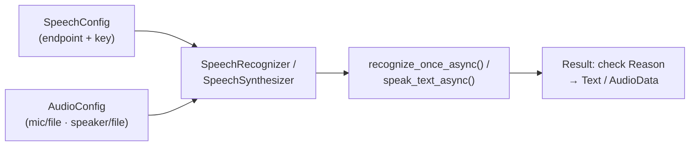

# Note 13 — Speech: model GenAI, Azure Speech SDK & Voice Live API

> **TL;DR:** Ba tầng làm việc với giọng nói trên Foundry: **(1) Model GenAI speech-capable** — `gpt-4o-transcribe`/`-mini-transcribe`/`-transcribe-diarize` (STT) và `gpt-4o-tts`/`-mini-tts` (TTS) gọi qua OpenAI SDK (`client.audio.transcriptions.create` / `client.audio.speech...create` với `voice` + `instructions` chỉnh tông giọng). **(2) Azure Speech in Foundry Tools** (SDK `azure-cognitiveservices-speech`) — pattern kinh điển **SpeechConfig + AudioConfig → SpeechRecognizer** (`recognize_once_async`, check `ResultReason.RecognizedSpeech`) / **SpeechSynthesizer** (`speak_text_async`); tuỳ biến voice (`speech_synthesis_voice_name`), audio format, và **SSML** (style, pause, phoneme, prosody, say-as). **(3) Voice Live API** — hội thoại **speech-to-speech realtime qua WebSocket**: event JSON hai chiều (client: `session.update`, `input_audio_buffer.append`, `response.create`; server: `session.updated`, `response.done`…), **azure semantic VAD** phát hiện lượt nói, noise suppression + echo cancellation, **avatar qua WebRTC**; SDK Python `azure-ai-voicelive` **async-only**; xử lý **interrupt** bằng event `INPUT_AUDIO_BUFFER_SPEECH_STARTED` (clear playback queue ngay). Dùng với **Foundry agent** (agent_id thay model) để đóng gói instructions/logic ngoài code voice.

## 1. Tầng 1 — Model GenAI speech-capable (OpenAI SDK)

| Chiều | Model | Gọi bằng |
|-------|-------|----------|
| **Speech → text** | `gpt-4o-transcribe`, `gpt-4o-mini-transcribe`, `gpt-4o-transcribe-diarize` (diarize = tách người nói) | `client.audio.transcriptions.create(model=…, file=audio_file, response_format="text")` |
| **Text → speech** | `gpt-4o-tts`, `gpt-4o-mini-tts` | `client.audio.speech.with_streaming_response.create(model=…, voice="alloy", input=…, instructions="Speak in an upbeat, excited tone.")` → `stream_to_file(...)` |

Model availability **khác nhau theo region**. Use case: transcribe call/meeting, caption video, giao diện audible (accessibility), assistant đọc tin nhắn.

## 2. Tầng 2 — Azure Speech in Foundry Tools (Speech SDK)

Pattern 5 bước dùng chung cho cả hai chiều:



### Speech to text
```python
import azure.cognitiveservices.speech as speech_sdk
speech_config = speech_sdk.SpeechConfig(subscription=KEY, endpoint=ENDPOINT)
audio_config = speech_sdk.audio.AudioConfig(filename="audio.wav")   # mặc định: system mic
recognizer = speech_sdk.SpeechRecognizer(speech_config=speech_config, audio_config=audio_config)
result = recognizer.recognize_once_async().get()
if result.reason == speech_sdk.ResultReason.RecognizedSpeech:
    print(result.text)
```
`Reason` có 3 giá trị cần nhớ: **RecognizedSpeech** (ok, đọc `Text`), **NoMatch** (parse được audio nhưng không nhận ra speech), **Canceled** (lỗi — soi `CancellationReason` trong Properties).

### Text to speech
`AudioOutputConfig(use_default_speaker=True)` (hoặc file/None để tự xử lý stream) → `SpeechSynthesizer` → `speak_text_async(text).get()` → check `SynthesizingAudioCompleted`, audio nằm trong `AudioData`.

### Tuỳ biến
- **Audio format**: `speech_config.set_speech_synthesis_output_format(SpeechSynthesisOutputFormat.Riff24Khz16BitMonoPcm)` (file type, sample-rate, bit-depth).
- **Voice**: `speech_config.speech_synthesis_voice_name = 'en-US-Brian:DragonHDLatestNeural'` (tên = locale + tên người + kiểu).
- **SSML** (Speech Synthesis Markup Language — XML điều khiển giọng đọc) qua `speak_ssml_async()`:

| Khả năng | Thẻ/ví dụ |
|----------|-----------|
| Speaking style | `<mstts:express-as style="cheerful">` |
| Ngắt/nghỉ | `<break strength="weak"/>` |
| Phát âm phonetic | `<phoneme alphabet="sapi" ph="t ao m ae t ow">tomato</phoneme>` ("SQL"→"sequel") |
| Prosody (pitch/tốc độ/âm sắc) | `<prosody rate=… pitch=…>` |
| Say-as (ngày, giờ, số ĐT) | `<say-as interpret-as="date">` |
| Nhiều giọng một đoạn, chèn audio thu sẵn | nhiều `<voice name=…>` trong một `<speak>` |

## 3. Tầng 3 — Voice Live API (realtime speech-to-speech)

**Voice live API** = hội thoại giọng nói **low-latency hai chiều** cho voice agent — không phải tự ghép STT → LLM → TTS thủ công; một kết nối **WebSocket** làm hết.

### Kiến trúc & tính năng
- **WebSocket** + **event JSON** 2 loại: **client events** (`session.update` cấu hình phiên, `input_audio_buffer.append` đẩy audio, `response.create` yêu cầu sinh response) và **server events** (`session.updated`, `response.done`, `conversation.item.created`…).
- Audio format PCM16/G.711; giọng OpenAI + Azure custom voices; **avatar qua WebRTC** (video/animation/blendshape, kết nối bằng `session.avatar.connect` + SDP offer); **noise reduction** (`azure_deep_noise_suppression`) + **echo cancellation** (`server_echo_cancellation`).
- **Turn detection**: `azure_semantic_vad` (VAD = Voice Activity Detection — phát hiện khi người nói bắt đầu/kết thúc lượt; semantic VAD hiểu ngữ nghĩa nên đỡ ngắt nhầm) với threshold, prefix_padding_ms, silence_duration_ms.

### Endpoint & auth
| | URL |
|---|-----|
| **Project connection** (dùng agent) | `wss://{res}.services.ai.azure.com/voice-live/realtime?api-version=…` + `agent_id`, `project_id` |
| **Model connection** | `wss://{res}.cognitiveservices.azure.com/voice-live/realtime?api-version=…` + `model` |

Auth: **Entra ID keyless** (khuyến nghị — role **Cognitive Services User**, token scope `https://ai.azure.com/.default`, header `Authorization: Bearer <token>`) hoặc API key (header `api-key` — không dùng được trong browser; hoặc query string, mã hoá khi wss).

### SDK Python `azure-ai-voicelive` (async-only từ 1.0.0)

```python
from azure.ai.voicelive.aio import connect
async with connect(endpoint=…, credential=…, model="gpt-4o") as conn:
    await conn.session.update(session=RequestSession(
        modalities=[Modality.TEXT, Modality.AUDIO],
        input_audio_format=InputAudioFormat.PCM16, output_audio_format=OutputAudioFormat.PCM16,
        turn_detection=ServerVad(threshold=0.5, prefix_padding_ms=300, silence_duration_ms=500)))
    async for event in conn:
        ...
```

**Event handling quyết định trải nghiệm** — các event chính:

| Event | Xử lý |
|-------|-------|
| `SESSION_UPDATED` | Phiên sẵn sàng → bắt đầu capture mic |
| `INPUT_AUDIO_BUFFER_SPEECH_STARTED` | **User ngắt lời → clear playback queue NGAY** (không thì agent "nói đè" user) |
| `INPUT_AUDIO_BUFFER_SPEECH_STOPPED` | User nói xong → "Thinking…" |
| `RESPONSE_AUDIO_DELTA` | Chunk audio về → queue phát loa |
| `RESPONSE_AUDIO_TRANSCRIPT_DONE` / `..._TRANSCRIPTION_COMPLETED` | Transcript agent/user |
| `RESPONSE_AUDIO_DONE`, `ERROR` | Kết thúc / lỗi |

Pattern khuyến nghị cho client: class **VoiceAssistant** (config agent, setup session, xử lý event) + class **AudioProcessor** (PyAudio mic/speaker, 24kHz 16-bit PCM mono, playback queue).

### Voice Live + Foundry agent (thay vì model trực tiếp)
Ưu điểm: instructions/config **đóng gói trong agent** (không rải trong session code); logic phức tạp sửa ở agent không đụng client; chỉ cần **agent_id** để nối; tách agent logic khỏi voice implementation → maintainable/scalable. Tạo qua **voice mode trong agent playground** (chọn language, VAD, audio enhancement, voice, interim response, avatar) hoặc bằng code — nhét Voice Live config vào **metadata** của agent (chunk từng **512 ký tự** vì giới hạn metadata).

`★ Insight ─────────────────────────────────────`
Chọn tầng nào: **file audio đã có, cần transcript/đọc văn bản một chiều** → tầng 1 (model GenAI) hoặc tầng 2 (Speech SDK — khi cần SSML/voice control chi tiết); **hội thoại nói chuyện qua lại realtime** → Voice Live (một WebSocket lo trọn STT+LLM+TTS+VAD+interrupt, tự ghép 3 dịch vụ rời sẽ chậm và hụt xử lý ngắt lời). Chi tiết đắt điểm: xử lý interrupt nằm ở **client** — bắt `SPEECH_STARTED` và xoá queue phát ngay.
`─────────────────────────────────────────────────`

## Q&A phỏng vấn

**Q1. gpt-4o-transcribe khác gpt-4o-tts?**
→ transcribe: speech→text (nhận file audio, trả transcript; bản -diarize tách người nói). tts: text→speech (trả audio, chọn voice + instructions chỉnh tông). Nhớ hướng: **transcribe = nghe, tts = nói**.

**Q2. Trong Speech SDK, object nào chỉ định nguồn audio là file?**
→ **AudioConfig** (`filename=…`) — SpeechConfig chỉ giữ endpoint/key; SpeechRecognizer là client proxy nhận cả hai.

**Q3. Đổi giọng synthesis bằng cách nào?**
→ `speech_config.speech_synthesis_voice_name = '<tên voice>'` — không phải output format (cái đó chỉnh file type/sample rate) hay AudioConfig (chỉnh thiết bị ra).

**Q4. SSML cho phép làm gì mà plain text không làm được?**
→ Style cảm xúc, ngắt nghỉ, phoneme phát âm chuẩn, prosody (pitch/rate), say-as (đọc số như ngày/SĐT), nhiều giọng trong một đoạn, chèn audio thu sẵn.

**Q5. Voice Live API dùng giao thức gì? Avatar dùng gì?**
→ Hội thoại: **WebSocket** (event JSON hai chiều). Avatar streaming: **WebRTC**.

**Q6. User ngắt lời voice agent — xử lý thế nào?**
→ Bắt server event `INPUT_AUDIO_BUFFER_SPEECH_STARTED` và **clear playback queue ngay tại client**; nếu chờ API xử lý interrupt thì client vẫn phát nốt câu cũ → agent nói đè user.

**Q7. Vì sao nối Voice Live với agent thay vì model?**
→ Agent đóng gói instructions + logic + config → client chỉ cần agent_id; sửa hành vi hội thoại không phải sửa code voice; tách concerns nên dễ maintain khi có nhiều trải nghiệm hội thoại.

## Liên quan
- [[00-MOC-AI-103]] — MOC AI-103
- [[12-Language-va-Speech-MCP-Server]] — Speech qua MCP cho agent
- [[14-Translator-Text-va-Speech]] — speech translation (TranslationRecognizer)
- [[05-Foundry-Agent-Service-va-VS-Code]] — agent nền cho Voice Live agent
