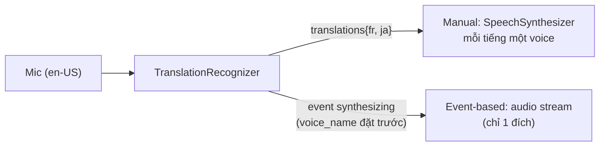

# Note 14 — Translator: dịch text & speech

> **TL;DR:** Hai dịch vụ dịch trong Foundry Tools: **Azure Translator** (dịch **văn bản** giữa 90+ ngôn ngữ qua `TextTranslationClient`: `translate` — dịch nghĩa, tự detect ngôn ngữ nguồn, nhiều đích một lượt; `transliterate` — **chuyển hệ chữ viết** cùng ngôn ngữ, vd Hiragana→Latin; `get_supported_languages` — liệt kê ngôn ngữ; hỗ trợ dịch document giữ cấu trúc + custom model cho thuật ngữ domain) và **Azure Speech** (dịch **giọng nói** qua `SpeechTranslationConfig` + `TranslationRecognizer`; speech-to-speech có 2 lối: **manual synthesis** — lặp qua translations rồi tự `SpeechSynthesizer` từng tiếng, dùng được đa ngôn ngữ; **event-based synthesis** — chỉ **1:1**, đặt `voice_name` + bắt event `synthesizing` lấy audio stream). LLM dịch được nhưng giải pháp dịch toàn diện vẫn cần model chuyên biệt.

## 1. Azure Translator — dịch văn bản

### Kết nối
Endpoint 3 loại: **global** (`api.cognitive.microsofttranslator.com`), **regional** (`api-nam/-apc/-eur...`), hoặc **Foundry resource endpoint** (`{res}.cognitiveservices.azure.com`). Client nhận `endpoint=` **hoặc** `region=`:

```python
from azure.ai.translation.text import *
client = TextTranslationClient(credential=AzureKeyCredential("FOUNDRY_KEY"),
                               endpoint="FOUNDRY_ENDPOINT")   # hoặc region="FOUNDRY_REGION"
```

### Ba thao tác chính

| Method | Làm gì | Điểm nhớ |
|--------|--------|----------|
| `get_supported_languages(scope="translation")` | Liệt kê ngôn ngữ hỗ trợ (tên + ISO code) | ~137 ngôn ngữ |
| `translate(body=[InputTextItem(...)], to_language=["fr","en"])` | **Dịch nghĩa** sang 1+ ngôn ngữ đích | Bỏ `from_language` → **tự detect nguồn** (trả `detected_language`); mỗi input × mỗi đích = một kết quả |
| `transliterate(body=…, language="ja", from_script="Jpan", to_script="Latn")` | **Chuyển hệ chữ**, giữ nguyên ngôn ngữ | "こんにちは" → "Kon'nichiwa" (vẫn là tiếng Nhật, viết Latin) |

Khả năng khác: **document translation** (sync/async, **giữ nguyên cấu trúc tài liệu**), **custom translation models** (thuật ngữ chuyên ngành), chọn dịch bằng default model hoặc LLM (portal có playground so sánh hai loại).

> **translate vs transliterate — cặp phân biệt thi chắc gặp:** "你好" → "Hello" là **translate** (đổi ngôn ngữ). "спасибо" (Cyrillic) → "spasibo" (Latin) là **transliterate** (đổi chữ viết, không đổi ngôn ngữ).

## 2. Azure Speech — dịch giọng nói

### Cấu hình & nhận dạng

```python
import azure.cognitiveservices.speech as speech_sdk
translation_cfg = speech_sdk.translation.SpeechTranslationConfig(
    subscription="FOUNDRY_KEY", endpoint="FOUNDRY_ENDPOINT")
translation_cfg.speech_recognition_language = 'en-US'   # ngôn ngữ NGUỒN (nói)
translation_cfg.add_target_language('fr')               # thêm từng ngôn ngữ ĐÍCH
translation_cfg.add_target_language('ja')
audio_cfg = speech_sdk.AudioConfig(use_default_microphone=True)

translator = speech_sdk.translation.TranslationRecognizer(
    translation_config=translation_cfg, audio_config=audio_cfg)
result = translator.recognize_once_async().get()
# result.text = transcript nguồn; result.translations = dict {"fr": "Bonjour.", "ja": "こんにちは。"}
```

**`SpeechTranslationConfig`** giữ kết nối + ngôn ngữ nguồn/đích (khác `SpeechConfig` thường); **`TranslationRecognizer`** là client dịch (khác `SpeechRecognizer` chỉ transcribe).

### Speech-to-speech: hai lối synthesis

| | **Manual synthesis** | **Event-based synthesis** |
|---|---|---|
| Cách làm | Nhận dict translations → lặp qua từng ngôn ngữ → tạo `SpeechSynthesizer` (SpeechConfig riêng + voice map từng tiếng, vd `fr-FR-HenriNeural`) → `speak_text_async` | Đặt `translation_cfg.voice_name` trước; gắn handler vào event **`synthesizing`** của TranslationRecognizer; trong handler lấy `evt.result.audio` (byte stream) |
| Số ngôn ngữ đích | **Nhiều** | **Chỉ 1:1** (một nguồn → một đích) |
| Bản chất | Ghép 2 thao tác rời (dịch → tổng hợp) | Audio dịch trả thẳng theo stream trong quá trình dịch |



`★ Insight ─────────────────────────────────────`
Ánh xạ nhanh "bài toán → công cụ": văn bản → **Translator** (`translate`/`transliterate`); nói → text đa ngữ → **TranslationRecognizer**; nói → nói nhiều tiếng → manual synthesis; nói → nói một tiếng, cần stream mượt → event-based. Và câu "sao không dùng LLM dịch luôn?": LLM dịch tốt câu ngắn, nhưng giải pháp dịch quy mô (document giữ format, custom terminology, 90+ cặp ngôn ngữ, giá dự đoán được) vẫn thuộc model dịch chuyên biệt.
`─────────────────────────────────────────────────`

## Q&A phỏng vấn

**Q1. Dịch "你好" sang "Hello" dùng hàm nào? "спасибо" → "spasibo"?**
→ `translate` (đổi ngôn ngữ) và `transliterate` (đổi hệ chữ viết Cyrillic→Latin, vẫn là tiếng Nga).

**Q2. Không biết văn bản nguồn tiếng gì thì sao?**
→ Bỏ `from_language` — Translator tự detect và trả `detected_language` kèm kết quả dịch.

**Q3. Object nào chỉ định ngôn ngữ đích khi dịch giọng nói?**
→ **SpeechTranslationConfig** (`add_target_language(...)`; nguồn qua `speech_recognition_language`). AudioConfig chỉ lo nguồn audio.

**Q4. Muốn nói tiếng Anh và phát ra loa bản dịch tiếng Pháp VÀ tiếng Nhật — dùng lối nào?**
→ **Manual synthesis** — event-based không hỗ trợ đa ngôn ngữ đích. Lặp qua translations, mỗi tiếng đặt voice riêng rồi synthesize.

**Q5. Event-based synthesis hoạt động thế nào?**
→ Đặt `voice_name` trong SpeechTranslationConfig → gắn handler vào event `synthesizing` của TranslationRecognizer → handler nhận byte stream audio dịch (`evt.result.audio`). Chỉ dùng cho dịch 1:1.

**Q6. Dịch tài liệu Word 50 trang giữ nguyên format thì dùng gì?**
→ **Document translation** của Azure Translator (sync/async, bảo toàn cấu trúc tài liệu) — không phải tự bóc text ra dịch từng đoạn.

## Liên quan
- [[00-MOC-AI-103]] — MOC AI-103
- [[11-Azure-Language-Text-Analysis]] — language detection (bước trước khi dịch)
- [[13-Speech-GenAI-va-Voice-Live-API]] — Speech SDK nền (SpeechConfig/AudioConfig/Synthesizer)
