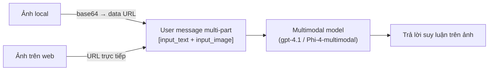

# Note 15 — Vision-enabled GenAI: chat app hiểu ảnh

> **TL;DR:** Muốn app chat "nhìn" được ảnh thì deploy **multimodal model** (model đa phương thức — nhận cả text lẫn ảnh, đôi khi cả audio, làm input): ví dụ **Phi-4-multimodal-instruct**, **gpt-4.1**, **gpt-4.1-mini**. Kỹ thuật giống hệt chat text thường, chỉ khác một chỗ: **user message nhiều phần (multi-part)** — một content item dạng text + một content item dạng ảnh trong CÙNG một message. Ảnh đưa vào theo 2 cách: **URL web** hoặc **binary → Base64** đóng gói thành data URL `data:image/jpeg;base64,{data}`. Responses API dùng cặp type `input_text` / `input_image`; ChatCompletions (cho model không hỗ trợ Responses) dùng `text` / `image_url`. Model không chỉ nhận diện vật thể mà còn **suy luận trên ảnh** (đọc biểu đồ, đánh giá sản phẩm hư hỏng…).

## 1. Multimodal model là gì, chọn model nào?

- **Multimodal model** = model sinh (generative) chấp nhận input **nhiều phương thức**: text + ảnh (một số nhận cả audio). Trong Foundry catalog có: **Microsoft Phi-4-multimodal-instruct**, **OpenAI gpt-4.1**, **gpt-4.1-mini**…
- Khác gì model thị giác cổ điển: không chỉ dán nhãn vật thể — nó **suy luận dựa trên những gì thấy** (interpret biểu đồ, kiểm tra hàng bị hư, tư vấn công thức từ ảnh nguyên liệu…).
- Test nhanh trong **chat playground** của Foundry portal: upload ảnh từ máy + gõ text kèm theo trong cùng một message.

## 2. Cấu trúc prompt đa phương thức — điểm ăn điểm của bài này

Điểm khác biệt DUY NHẤT so với chat text: **một user message chứa mảng content nhiều phần** (multi-part), gồm item text + item ảnh. KHÔNG phải gửi 2 prompt riêng, cũng KHÔNG nhét ảnh vào system message.

### Đưa ảnh vào message: 2 cách
| Cách | Khi nào | Dạng |
|------|---------|------|
| **URL web** | Ảnh đã host công khai | `"image_url": "https://.../anh.jpeg"` |
| **Base64 data URL** | Ảnh local | đọc file nhị phân → `base64.b64encode` → `data:image/jpeg;base64,{image_data}` (đổi `jpeg` thành `png`… theo format) |

### Responses API (chuẩn mới — xem [[03-Chat-App-Foundry-SDK-va-Tools]])

```python
image_data = base64.b64encode(open("dragon-fruit.jpeg", "rb").read()).decode("utf-8")
data_url = f"data:image/jpeg;base64,{image_data}"          # hoặc URL web

response = client.responses.create(
    model="gpt-4.1",
    input=[
        {"role": "developer", "content": "You are an AI assistant for chefs planning recipes."},
        {"role": "user", "content": [
            {"type": "input_text",  "text": "What desserts could I make with this?"},
            {"type": "input_image", "image_url": data_url}
        ]}
    ])
print(response.output_text)
```

### ChatCompletions API (cho model chưa hỗ trợ Responses, vd Phi-4)

```python
response = client.chat.completions.create(
    model="Phi-4-multimodal-instruct",
    messages=[
        {"role": "system", "content": "You are an AI assistant for chefs planning recipes."},
        {"role": "user", "content": [
            {"type": "text",      "text": "What can I make with this fruit?"},
            {"type": "image_url", "image_url": {"url": data_url}}
        ]}
    ])
print(response.choices[0].message.content)
```

### Bảng so kè cú pháp 2 API (dễ nhầm khi thi)

| | Responses API | ChatCompletions API |
|---|---|---|
| Role hướng dẫn | `developer` | `system` |
| Item text | `{"type": "input_text", "text": …}` | `{"type": "text", "text": …}` |
| Item ảnh | `{"type": "input_image", "image_url": <chuỗi URL>}` | `{"type": "image_url", "image_url": {"url": <URL>}}` (bọc thêm object) |
| Lấy kết quả | `response.output_text` | `response.choices[0].message.content` |



`★ Insight ─────────────────────────────────────`
Ba đáp án bẫy kinh điển của module này: (1) model nào nhìn được ảnh? — **multimodal model**, không phải "chỉ GPT của OpenAI" (Phi-4 của Microsoft cũng được) và càng không phải embedding model; (2) gửi ảnh + câu hỏi thế nào? — **một message multi-part**, không phải hai prompt nối nhau, không phải ảnh làm system message; (3) ảnh đưa vào dạng gì? — **cả URL lẫn binary (base64)**, không phải chỉ một trong hai.
`─────────────────────────────────────────────────`

## Q&A phỏng vấn

**Q1. Muốn chat app trả lời câu hỏi về ảnh người dùng gửi, cần loại model nào?**
→ **Multimodal model** (nhận cả text + image input): gpt-4.1, gpt-4.1-mini, Phi-4-multimodal-instruct. Model text thuần hay embedding model không xử lý được ảnh.

**Q2. Cấu trúc prompt kèm ảnh khác chat thường chỗ nào?**
→ User message thành **mảng content nhiều phần**: một item text + một item ảnh trong cùng message. Kết nối endpoint, xử lý response… giữ nguyên như chat text.

**Q3. Ảnh local (không có URL công khai) thì gửi thế nào?**
→ Đọc file nhị phân → encode **Base64** → gói thành data URL `data:image/{format};base64,{data}` rồi đặt vào trường image như một URL bình thường.

**Q4. `input_image` và `image_url` — cái nào của API nào?**
→ `input_text`/`input_image` là **Responses API**; `text`/`image_url` (bọc `{"url": …}`) là **ChatCompletions**. Nhớ mẹo: Responses API có tiền tố `input_`.

**Q5. Multimodal model làm được gì hơn model nhận diện vật thể cổ điển?**
→ **Suy luận trên nội dung nhìn thấy**: đọc hiểu biểu đồ, đánh giá mức hư hỏng của vật thể, gợi ý hành động từ bối cảnh ảnh — không dừng ở dán nhãn "đây là quả cam".

## Liên quan
- [[00-MOC-AI-103]] — MOC AI-103
- [[03-Chat-App-Foundry-SDK-va-Tools]] — Responses API & ChatCompletions nền tảng
- [[16-Sinh-anh-va-Video-gpt-image-Sora]] — chiều ngược lại: sinh ảnh/video từ text
- [[17-Content-Understanding]] — trích xuất CÓ CẤU TRÚC từ ảnh (so với chat tự do ở đây)
