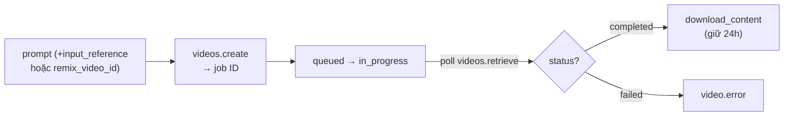

# Note 16 — Sinh ảnh (gpt-image/FLUX) & sinh video (Sora 2)

> **TL;DR:** **Sinh ảnh:** model **gpt-image-1** (OpenAI) và dòng **FLUX** (Black Forest Labs) tạo ảnh **gốc hoàn toàn mới** từ mô tả ngôn ngữ tự nhiên (không phải search ảnh có sẵn); tìm trong catalog bằng filter inference task **"Text to image"**; code dùng **Images API** (`client.images.generate` → decode `b64_json`). **Sinh video:** **Sora 2** (`sora-2`/`sora-2-pro`) — text-to-video, image-to-video (`input_reference`), **remix** video cũ (`remix_video_id`), có cả audio; resolution **1280×720 hoặc 720×1280**, thời lượng **4/8/12 giây**. Video generation là **quy trình bất đồng bộ 3 bước**: `videos.create` (nhận job ID) → **poll** status (`queued/in_progress/completed/failed/cancelled`) → `download_content`. Ràng buộc thi hay hỏi: reference image phải **trùng đúng resolution** video đích + **không chứa mặt người**; tối đa **2 job song song**; video hoàn thành chỉ giữ **24 giờ**; prompt qua content moderation filter.

## 1. Sinh ảnh — image generation models

- Model tạo **ảnh gốc** từ prompt text ("A robot eating spaghetti") — là AI sinh dữ liệu đồ hoạ mới dựa trên dữ liệu huấn luyện, **không phải hệ thống tìm kiếm** ảnh từ catalog.
- Model tiêu biểu trong Foundry: **OpenAI gpt-image-1** (series), **Black Forest Labs FLUX** (series). Trong catalog lọc theo inference task **"Text to image"**.
- Playground: nhập prompt, chọn **resolution**, có thể kèm **reference image** làm gốc (tuỳ model hỗ trợ).

```python
img_results = client.images.generate(          # OpenAI Images API
    model="FLUX.1-Kontext-pro",
    prompt="A robot eating a cheeseburger.",
    n=1, size="1024x1024")
image_data = base64.b64decode(img_results.data[0].b64_json)
open("image.png", "wb").write(image_data)      # kết quả là binary stream
```

## 2. Sora 2 — sinh video

### Năng lực & tham số

| Năng lực | Mô tả |
|----------|-------|
| Text to video | Sinh video từ prompt text |
| Image to video | Biến ảnh có sẵn thành video (ảnh làm **frame đầu tiên**) |
| Video remix | Chỉnh **một khía cạnh** video đã sinh, giữ cấu trúc/bố cục — không sinh lại từ đầu |
| Audio generation | Video output có kèm audio |

| Tham số API | Giá trị |
|-------------|---------|
| `model` | `sora-2` hoặc `sora-2-pro` |
| `size` | `1280x720` (ngang) hoặc `720x1280` (dọc) |
| `seconds` | **4, 8, hoặc 12** (mặc định 4) |
| `input_reference` | Ảnh JPEG/PNG/WebP làm frame đầu |
| `remix_video_id` | ID video cũ để remix |

> 💡 Model nghe lời tốt hơn ở **clip ngắn** — sinh hai clip 4s rồi ghép thường đẹp hơn một clip 8s.

### Quy trình bất đồng bộ 3 bước (pattern thi chắc hỏi)

```python
video = client.videos.create(model="sora-2",
    prompt="A robot walks through a rainy city street at dusk...",
    size="1280x720", seconds="4")               # 1️⃣ tạo job → video.id

while video.status not in ["completed", "failed", "cancelled"]:
    time.sleep(20)
    video = client.videos.retrieve(video.id)    # 2️⃣ poll status

if video.status == "completed":                 # 3️⃣ tải kết quả
    client.videos.download_content(video.id, variant="video").write_to_file("output.mp4")
```

Trạng thái job: `queued` → `in_progress` → `completed` / `failed` (soi `video.error`) / `cancelled`. Playground mất ~1-5 phút/video; nút **View code** cho sẵn cURL theo settings đang chọn.

![[sora-2-video-playground.png]]
*Ảnh: Microsoft Learn — Video playground của sora-2: prompt "A robot waiter in a restaurant." với thanh điều khiển ngay dưới ô nhập gồm tỉ lệ khung (16:9) và thời lượng (4s); video kết quả hiện phía trên, nút View code lấy cURL.*



### Reference image & remix — ràng buộc

- **`input_reference`**: ảnh làm frame đầu, prompt mô tả diễn biến tiếp theo. Resolution ảnh phải **khớp CHÍNH XÁC** size video đích (1280×720 / 720×1280); format JPEG/PNG/WebP; ảnh chứa **mặt người bị từ chối** (dùng phong cảnh, đồ vật, nhân vật hoạt hình).
- **Remix** (`client.videos.remix(video_id=…, prompt=…)`): giữ scene transitions, bố cục, cấu trúc tổng thể; chỉ mô tả **thay đổi** ("same shot, switch to 85mm lens", "same lighting, new palette: teal, sand, rust"). Mỗi lần remix **một chỉnh sửa rõ ràng** — sửa hẹp thì giữ được nhiều fidelity với bản gốc.

### Giới hạn vận hành

| Ràng buộc | Giá trị |
|-----------|---------|
| Job song song | tối đa **2** |
| Video hoàn thành | tải được trong **24 giờ** |
| Content moderation | prompt độc hại → không sinh video (content filter của Azure OpenAI) |

## 3. Viết prompt video hiệu quả — "brief cho nhà quay phim"

Cấu trúc một prompt tốt (prompt anatomy): **camera framing** (wide/medium/close-up, góc máy) → **subject** (chi tiết nhận dạng) → **action** (mô tả theo nhịp/beats: "bước bốn bước tới cửa sổ, dừng, kéo rèm") → **lighting & palette** → **style** ("1970s film", "handheld documentary").

| Prompt yếu | Prompt mạnh |
|-----------|-------------|
| "A beautiful street at night" | "Wet asphalt, zebra crosswalk, neon signs reflecting in puddles" |
| "Person moves quickly" | "Cyclist pedals three times, brakes, and stops at crosswalk" |
| "Cinematic look" | "Anamorphic 2.0x lens, shallow DOF, volumetric light" |

`★ Insight ─────────────────────────────────────`
So sánh 3 mode sinh nội dung cùng client OpenAI SDK: ảnh = **đồng bộ** (`images.generate` trả kết quả luôn); video = **bất đồng bộ** (create → poll → download — giống pattern Content Understanding note 17). Còn bộ số Sora 2 đáng học thuộc: **2** resolution, **3** thời lượng (4/8/12s), **2** job song song, **24h** hạn tải — đề trắc nghiệm xoay quanh đúng mấy con số này.
`─────────────────────────────────────────────────`

## Q&A phỏng vấn

**Q1. Tìm model sinh ảnh trong Foundry catalog bằng filter nào?**
→ Inference task **"Text to image"** (không phải "Image to text" — đó là chiều mô tả ảnh).

**Q2. Ảnh do gpt-image-1 sinh ra lấy từ đâu?**
→ **Sinh mới hoàn toàn** từ model — không lấy từ catalog/search ảnh có sẵn.

**Q3. Sora 2 hỗ trợ thời lượng nào? Resolution nào?**
→ **4, 8, 12 giây**; **1280×720** (landscape) hoặc **720×1280** (portrait).

**Q4. Điều kiện dùng reference image với Sora 2?**
→ Resolution ảnh **khớp chính xác** size video đích; JPEG/PNG/WebP; **không chứa mặt người** (bị từ chối).

**Q5. Remix dùng để làm gì?**
→ **Chỉnh có chủ đích một khía cạnh** video có sẵn (đổi palette, đổi lens…) mà giữ cấu trúc/bố cục — không phải ghép nhiều video hay thêm nhạc nền.

**Q6. Vì sao code sinh video phải poll? Flow chuẩn?**
→ Video generation **bất đồng bộ** (mất 1-5 phút): `videos.create` → lặp `videos.retrieve` đến khi `completed`/`failed`/`cancelled` → `download_content(variant="video")`. Nhớ tải trong 24h.

## Liên quan
- [[00-MOC-AI-103]] — MOC AI-103
- [[15-Vision-GenAI-Multimodal]] — chiều ngược: model đọc hiểu ảnh
- [[02-Model-Catalog-Chon-Deploy-Danh-gia]] — deploy model từ catalog
- [[04-Toi-uu-Model-va-Responsible-GenAI]] — content filter chặn prompt độc hại
