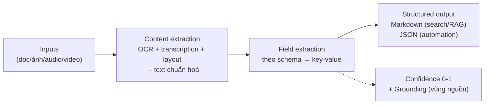

# Note 17 — Content Understanding: trích xuất có cấu trúc từ MỌI loại nội dung

> **TL;DR:** **Azure Content Understanding** là Foundry Tool dùng GenAI biến nội dung **phi cấu trúc** (unstructured — document, ảnh, audio, video) thành **dữ liệu có cấu trúc**: bạn định nghĩa **schema** (bộ field muốn lấy), service tự trích. Trái tim là **analyzer** — hoặc **prebuilt** (`prebuilt-image/-receipt/-invoice/-idDocument/-document`) hoặc **custom** (schema riêng, mỗi field chọn 1 trong 3 method: **extract** — đọc giá trị y nguyên, **classify** — phân loại theo enum cho trước, **generate** — sinh mô tả từ phân tích). Kết quả kèm **confidence score** (0-1; 0.9+ tự động hoá được, <0.7 nên người duyệt) và **grounding** (toạ độ vùng nội dung nơi giá trị được trích — trường `source`), output **Markdown** (cho search/RAG) hoặc **JSON** (cho automation). Làm việc qua **Content Understanding Studio** (tạo project, schema editor, build & test analyzer — prebuilt mới xài trực tiếp trong Foundry portal, custom phải qua Studio) hoặc **API/SDK** (`azure-ai-contentunderstanding`, pattern bất đồng bộ POST `:analyze` → poll `analyzerResults`). Yêu cầu trước khi dùng API: Foundry resource phải có sẵn deployment **GPT-4.1 + GPT-4.1-mini + text-embedding-3-large**.

## 1. Content Understanding là gì & vì sao dùng

Một service duy nhất, một quy trình phát triển nhất quán, xử lý **cả 4 loại nội dung**:

| Loại | Ví dụ use case |
|------|----------------|
| Document/form | Bóc giá trị hoá đơn để tự động hoá thanh toán, phân tích hợp đồng, claims |
| Ảnh | Đọc biểu đồ, phát hiện lỗi sản phẩm, nhận diện vật thể/người |
| Audio | Tóm tắt cuộc gọi hội nghị, sentiment hội thoại khách hàng |
| Video | Rút ý chính từ recording họp, tóm tắt thuyết trình, phát hiện hoạt động trong camera an ninh |

Lợi ích cốt lõi: **một schema thay cho prompt engineering phức tạp**; nhiều AI model **cross-validate** lẫn nhau tăng độ chính xác; **confidence + grounding** giảm chi phí human review; **classification** để phân loại tài liệu và route tới analyzer phù hợp. Use case lớn: intelligent document processing, **Search/RAG ingest** (nội dung multimodal → index), **chuẩn hoá input hỗn tạp cho AI agent**, analytics.

## 2. Kiến trúc: pipeline một analyzer



| Thành phần | Vai trò |
|-----------|---------|
| **Analyzer** | Định nghĩa CÁCH xử lý: base analyzer + model dùng + field schema + tuỳ chọn |
| **Content extraction** | Biến input thô → text chuẩn hoá + metadata (OCR, speech transcription, layout detection) |
| **Field extraction** | Sinh key-value theo schema |
| **Confidence score** | 0→1 mỗi field: **0.9+** tin được cho automation; **0.7-0.9** cân nhắc human review; **<0.7** nên duyệt tay |
| **Grounding** | Chỉ đúng **vùng trong nội dung** nơi giá trị được trích (trường `source`, vd `D(1,100,50,…)`) |

Format ảnh input: JPEG, PNG, BMP, TIFF, HEIF, PDF.

## 3. Schema & 3 method của field — phân biệt quan trọng nhất

```json
{
  "description": "Product image analyzer",
  "baseAnalyzerId": "prebuilt-image",
  "fieldSchema": { "fields": {
    "ProductName": { "type": "string", "method": "extract",
                     "description": "Name of the product visible in the image" },
    "Condition":   { "type": "string", "method": "classify",
                     "description": "Condition of the product", "enum": ["new", "used", "damaged"] },
    "Description": { "type": "string", "method": "generate",
                     "description": "Brief description of what the image shows" }
  }},
  "models": { "completion": "gpt-4.1", "embedding": "text-embedding-3-large" }
}
```

| Method | Nghĩa | Ví dụ |
|--------|-------|-------|
| **extract** | Lấy giá trị **y như xuất hiện** trong nội dung (đọc được) | Text trên nhãn sản phẩm, email trên danh thiếp |
| **classify** | Phân loại vào **enum định trước** | "damaged" / "undamaged" |
| **generate** | **Sinh** giá trị từ phân tích (không có sẵn trong nội dung) | Mô tả cảnh trong ảnh |

**Prebuilt analyzers**: `prebuilt-image` (phân tích ảnh tổng quát), `prebuilt-receipt` (vendor/items/totals/dates từ hoá đơn bán lẻ), `prebuilt-invoice`, `prebuilt-idDocument` (bằng lái, hộ chiếu), `prebuilt-document` (base cho analyzer tài liệu custom).

## 4. Con đường phát triển: Studio vs API

- **Content Understanding Studio** (khuyến nghị để tạo/test custom analyzer): tạo **project** gắn với Foundry resource (tự provision storage + key vault) → **schema editor**: upload file mẫu → chọn template → định nghĩa field (template/field type phụ thuộc loại nội dung; document còn có tuỳ chọn barcode, công thức toán) → **test** trên file mẫu → **build** analyzer (analyzer thành accessible qua endpoint của Foundry resource) → tiếp tục refine thành **version có tên** mới. GenAI cho phép "định nghĩa schema bằng ví dụ" với rất ít dữ liệu; có thể label field tường minh để tăng chất lượng.
- **Foundry portal** chỉ dùng trực tiếp được một số **prebuilt** model — custom analyzer phải qua Studio (hoặc API).
- Schema chỉ tạo được ở **region hỗ trợ** Content Understanding.

## 5. Client app: SDK & REST

**Chuẩn bị:** Foundry resource (endpoint + key, lấy ở Azure portal / trang chủ project Foundry portal; hoặc Entra ID qua Foundry SDK). `pip install azure-ai-contentunderstanding` (Python ≥3.9). ⚠️ **Bắt buộc có trước 3 deployment: GPT-4.1, GPT-4.1-mini, text-embedding-3-large** trên resource.

### SDK — poller lo việc poll giúp

```python
from azure.ai.contentunderstanding import ContentUnderstandingClient
from azure.ai.contentunderstanding.models import AnalysisInput
client = ContentUnderstandingClient(endpoint=endpoint, credential=AzureKeyCredential(key))

# Tạo analyzer từ định nghĩa JSON (mục 3)
poller = client.begin_create_analyzer("business_card_analyser", body=analyzer_definition)

# Phân tích: URL hoặc bytes (AnalysisInput(data=file_bytes))
poller = client.begin_analyze(analyzer_id="business_card_analyser",
                              inputs=[AnalysisInput(url="https://host.com/business-card.png")])
result = poller.result()                       # tự poll đến khi xong
for name, field in result.contents[0].fields.items():
    if field.type == "string": print(f"{name}: {field.value}")
```

### REST — tự poll bằng operation ID

| Bước | Request |
|------|---------|
| Tạo analyzer | **PUT** `{endpoint}/contentunderstanding/analyzers/{name}?api-version=2025-11-01` (body = JSON schema; header `Ocp-Apim-Subscription-Key`) → header **`Operation-Location`** = callback URL để GET status |
| Phân tích | **POST** `…/analyzers/{name}:analyze` body `{"inputs": [{"url": "…"}]}` → nhận **operation ID** |
| Lấy kết quả | **GET** `…/analyzerResults/{id}` — poll đến khi `status: "Succeeded"` |

- File URL → operation `analyze`; **binary trực tiếp** → operation **`analyzeBinary`**.
- Response JSON gồm: `markdown` (biểu diễn text — cho search/RAG), `fields` (giá trị **type-specific** như `valueString` + `confidence` + `spans` + `source` grounding), và với document còn có layout OCR đầy đủ (`pages/words/lines/paragraphs/sections`).

## 6. Responsible AI tích hợp

Content Understanding tích hợp **Azure AI Content Safety** lọc nội dung độc hại (bạo lực, hate speech…); mô tả khuôn mặt (face description) nhận diện thuộc tính khuôn mặt trong ảnh/video; **dữ liệu sinh trắc học (biometric) đòi hỏi notice + consent** từ chủ thể dữ liệu.

`★ Insight ─────────────────────────────────────`
Content Understanding là "tướng mới" của kỳ thi — nó thống nhất những gì trước đây phải ghép nhiều service (Form Recognizer cho form, Vision cho ảnh, Speech cho audio, Video Indexer cho video) thành MỘT pattern: **schema → analyzer → confidence + grounding**. Bộ ba extract/classify/generate là câu phân biệt đắt giá nhất: extract = "đọc cái CÓ SẴN", classify = "chọn từ enum", generate = "viết cái KHÔNG có sẵn". Và để ý cả hai đường (SDK/REST) đều bất đồng bộ — SDK chỉ giấu vòng poll sau `poller.result()`.
`─────────────────────────────────────────────────`

## Q&A phỏng vấn

**Q1. Content Understanding giúp build loại giải pháp nào?**
→ **Analyzer trích thông tin từ document, ảnh, video, audio** (đa phương thức) thành dữ liệu cấu trúc — không phải chatbot dịch thuật hay image generator.

**Q2. Grounding là gì? Confidence 0.95 nói lên điều gì?**
→ Grounding = xác định **vùng cụ thể trong nội dung** nơi mỗi giá trị được trích (trường `source`). Confidence 0.95 (>0.9) = **tin cậy được cho xử lý tự động**; <0.7 nên có người duyệt.

**Q3. Trích vendor + tổng tiền từ hoá đơn bán lẻ (receipt) dùng analyzer nào?**
→ **prebuilt-receipt** (không phải prebuilt-image chung chung, cũng không phải prebuilt-invoice — invoice là hoá đơn thương mại B2B).

**Q4. Ba method của field trong schema khác nhau thế nào?**
→ **extract** lấy y nguyên giá trị hiện diện trong nội dung; **classify** gán vào enum định trước; **generate** sinh mới từ phân tích (vd mô tả ảnh).

**Q5. Công cụ đồ hoạ nào để tạo project + custom analyzer? Định nghĩa "cái muốn trích" bằng gì?**
→ **Content Understanding Studio** (Foundry portal chỉ chạy được một số prebuilt); định nghĩa bằng **schema**.

**Q6. Client app cần config gì? Gọi analyze cần chỉ định gì? Field trả về dạng gì?**
→ Cần **endpoint + key của Foundry resource**; gọi analyze phải chỉ định **tên analyzer**; field trả về dạng **type-specific value** (`valueString`…) kèm confidence.

**Q7. Gửi file binary trực tiếp (không có URL) qua REST thì dùng gì?**
→ Operation **`analyzeBinary`** thay cho `analyze`.

**Q8. Khác nhau giữa output `markdown` và `fields` trong kết quả?**
→ `markdown` = biểu diễn text toàn nội dung → nạp **search/RAG**; `fields` = key-value theo schema → **automation workflow**.

## Liên quan
- [[00-MOC-AI-103]] — MOC AI-103
- [[18-Document-Intelligence-Foundry]] — service "anh em" chuyên sâu document/form (phân biệt ở note 18)
- [[15-Vision-GenAI-Multimodal]] — chat tự do trên ảnh (không schema)
- [[19-Knowledge-Mining-AI-Search]] — đích đến search/RAG của output markdown
- [[04-Toi-uu-Model-va-Responsible-GenAI]] — Content Safety nền tảng
