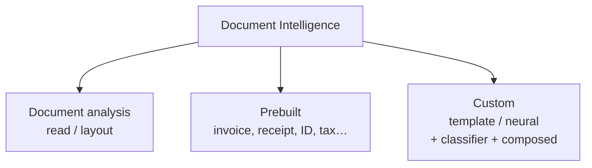

# Note 18 — Document Intelligence: bóc dữ liệu từ form & tài liệu

> **TL;DR:** **Azure Document Intelligence** (service trong Foundry, tiền thân Form Recognizer) dùng **OCR + deep learning** bóc text, **key-value pairs**, **selection marks** (checkbox/radio), **bảng** từ tài liệu — trả JSON kèm **bounding box** giữ quan hệ vị trí gốc. Ba nhóm model: (1) **document analysis** — `read` (text + phát hiện ngôn ngữ + phân biệt chữ in/viết tay) và `layout` (read + bảng + selection marks + cấu trúc + tuỳ chọn keyValuePairs); (2) **prebuilt** — invoice, receipt, ID document, tax (W-2/1099/1040), mortgage, contract… dùng ngay không cần train; (3) **custom** — **template model** (layout cố định: train vài phút, rẻ, 100+ ngôn ngữ) vs **neural model** (layout biến thiên: chính xác hơn, train lâu/đắt hơn), cộng **custom classifier** (nhận diện loại tài liệu để route) và **composed model** (gộp nhiều custom model sau 1 endpoint, tự phân loại rồi trích). Train custom qua **Document Intelligence Studio** (label visual, tự sinh file) hoặc REST: blob container chứa form mẫu (**≥5-6 bản**) + `ocr.json` (mỗi form) + `fields.json` (một file) + `labels.json` (mỗi form) + SAS URL → Build model. Giới hạn input: JPEG/PNG/BMP/PDF/TIFF (read nhận thêm Office), ≤500MB (free 4MB), 50×50→10.000×10.000 px, PDF ≤ A3 không khoá mật khẩu.

## 1. Ba nhóm model — khung xương của service



### Document analysis models

| Model | Trích được | Khi nào dùng |
|-------|-----------|--------------|
| **read** | Text in + viết tay, **phát hiện ngôn ngữ** từng dòng, phân loại in/viết tay; multi-page dùng tham số `pages` | Chỉ cần chữ, tài liệu không có cấu trúc cố định |
| **layout** | read + **selection marks** + **bảng** (cell kèm vị trí + chỉ số hàng/cột, xử lý được merged cells, trang nghiêng) + cấu trúc; tuỳ chọn **keyValuePairs** | Cần bảng + cấu trúc, không cần field định danh sẵn |

> `general document` model đời cũ đã **deprecated** (2023-10-31-preview) — năng lực key-value/entity gộp vào **layout**.

### Prebuilt models (không cần train)

| Nhóm | Model tiêu biểu |
|------|----------------|
| Tài chính/pháp lý | **Invoice** (customer, vendor, PO number, ngày, line items, totals), **Receipt**, Bank statement, Check, Pay stub, Credit card, Contract |
| Thuế Mỹ | **Unified US tax** (một model cho mọi form thuế được hỗ trợ), W-2, 1098, 1099, 1040 |
| Mortgage | 1003 (URLA), 1004 (URAR), 1005, 1008, Closing disclosure |
| Định danh | **ID document** (bằng lái Mỹ/EU, hộ chiếu quốc tế), Health insurance card, Marriage certificate |

⚠️ ID document bóc dữ liệu cá nhân chịu luật bảo vệ dữ liệu — cần permission của chủ thể.

Mọi prebuilt đều trích: text, key-value pairs (`Weight` ↔ `31 kg`), selection marks, tables, và **fields cố định** theo loại form (invoice → `CustomerName`, `InvoiceTotal`). **Luôn kiểm tra có prebuilt phù hợp trước khi đầu tư custom.**

## 2. Custom models — bảng chọn template vs neural (điểm thi nặng ký)

| Tiêu chí | **Custom template** | **Custom neural** |
|----------|--------------------|--------------------|
| Hợp với | Form cấu trúc, **layout cố định** giữa các bản (questionnaire, form chính phủ) | Tài liệu **semi/unstructured, layout biến thiên** |
| Thời gian train | **Vài phút** | Lâu hơn (theo dataset) |
| Chi phí | Thấp | Cao hơn |
| Độ chính xác | Cao với layout cố định, tụt khi layout đổi | **Cao hơn tổng thể**, nhất là khi format biến thiên |
| Ngôn ngữ | **100+** | Ít hơn |
| Tính năng | key-value, selection marks, tables, regions, signatures | **overlapping fields**, signature detection, confidence mức table/row/cell |

> 💡 Chiến lược: **bắt đầu bằng template** (nhanh, rẻ); layout biến thiên hoặc accuracy không đủ → chuyển **neural**.

Hai mảnh ghép còn lại:
- **Custom classifier**: nhận diện **loại** tài liệu trước khi gọi model trích — route tài liệu vào đúng extraction model.
- **Composed model**: **gộp nhiều custom model** sau một model ID duy nhất; service tự phân loại tài liệu → chọn component model phù hợp → trả kết quả trích của model đó.

### Train custom model (REST/SDK)

1. Blob container chứa **≥5-6 form mẫu** + bộ file JSON: **`ocr.json` mỗi form** (sinh từ hàm Analyze document) + **một `fields.json`** (mô tả field cần trích) + **`labels.json` mỗi form** (map field ↔ vị trí trong form).
2. Sinh **SAS URL** cho container.
3. Gọi **Build model** (REST/SDK) → **Get model** lấy model ID.

Hoặc dùng **Document Intelligence Studio** (documentintelligence.ai.azure.com): tự sinh ocr/labels/fields.json qua giao diện label visual — cần bật **CORS** cho storage container. Studio còn test được document analysis + prebuilt models.

### Dùng model

```python
client = DocumentAnalysisClient(endpoint=endpoint, credential=AzureKeyCredential(key))
task = client.begin_analyze_document_from_url(model_id, formUrl)   # model_id = custom/prebuilt/read/layout
result = task.result()   # analyzeResult: content + pages + fields
```

## 3. Resource, input & add-on

- Resource: **Foundry resource** (đa dịch vụ, một endpoint/key) hoặc **Document Intelligence resource** riêng (chỉ dịch vụ này).
- Input: JPEG/PNG/BMP/**PDF** (text hoặc scan)/TIFF; model **read nhận thêm file Microsoft Office**; ≤**500 MB** (free tier **4 MB**); ảnh 50×50 → 10.000×10.000 px; PDF ≤ **17×17 inch (A3)**, **không password**.
- **Add-on** (một số tính phí thêm): high resolution, **formula extraction**, font properties, **barcode**, **searchable PDF** (scan → PDF tìm kiếm được), **query fields** (hỏi field bằng ngôn ngữ tự nhiên), key-value pairs (cho layout).

## 4. Document Intelligence vs Content Understanding — cặp phân biệt của kỳ thi mới

| | **Document Intelligence** | **Content Understanding** ([[17-Content-Understanding]]) |
|---|---|---|
| Phạm vi | **Document/form** chuyên sâu | **Đa phương thức** (doc + ảnh + audio + video) |
| Cách định nghĩa trích | Prebuilt field cố định / custom model **train bằng label** | **Schema** khai báo (extract/classify/generate) — GenAI, gần như không cần train |
| Thế mạnh | Kho prebuilt khổng lồ (thuế, mortgage, ID…), bounding box chi tiết, add-on OCR | Suy luận GenAI (field **generate**), một pattern cho mọi loại content, grounding |
| Chọn khi | Form chuẩn ngành có prebuilt sẵn / layout in cố định cần train nhanh | Nội dung hỗn hợp nhiều phương thức, field cần suy luận/sinh |

`★ Insight ─────────────────────────────────────`
Bộ câu hỏi tình huống lặp đi lặp lại: *"text + bảng, format biến thiên, không cần field định danh"* → **layout** (đừng chọn read — thiếu bảng; đừng chọn invoice — thừa); *"train custom qua REST cần gì"* → form mẫu + **ocr.json + fields.json + labels.json** trong blob; *"một endpoint route invoice lẫn receipt"* → **composed model** (hoặc classifier + extraction models). Còn ranh giới với Content Understanding: DI = "máy đọc form chuyên nghiệp", CU = "GenAI hiểu mọi loại nội dung theo schema" — giáo trình mới giữ CẢ HAI, không phải CU thay thế DI.
`─────────────────────────────────────────────────`

## Q&A phỏng vấn

**Q1. Cần text + cấu trúc bảng từ tài liệu format đa dạng, không cần field định danh — model nào?**
→ **Layout model** (read chỉ có text; invoice là prebuilt field cố định).

**Q2. Train custom model qua REST API cần artifact gì?**
→ Blob container: form mẫu (≥5-6) + **`ocr.json`** mỗi form + **một `fields.json`** + **`labels.json`** mỗi form; kèm SAS URL. Studio thì tự sinh các file này.

**Q3. Công ty xử lý cả invoice lẫn receipt, muốn MỘT endpoint tự route — dùng gì?**
→ **Composed model** (gộp nhiều custom model, tự phân loại) hoặc custom classifier + các extraction model.

**Q4. Chọn template hay neural?**
→ Layout **cố định** → template (train phút, rẻ, 100+ ngôn ngữ). Layout **biến thiên**/semi-structured → neural (chính xác hơn, hỗ trợ overlapping fields, confidence mức cell).

**Q5. Read model khác layout model chỗ nào?**
→ Read: text (in + viết tay) + detect ngôn ngữ. Layout = read **+ bảng + selection marks + cấu trúc** (+ tuỳ chọn key-value pairs). General document model cũ đã deprecated, gộp vào layout.

**Q6. Scan hoá đơn 600 MB có xử lý được không?**
→ Không — giới hạn **500 MB** (standard) / 4 MB (free). Kèm các ràng buộc: đúng format, 50×50→10.000×10.000 px, PDF ≤ A3, không password.

**Q7. Muốn biến tài liệu scan thành PDF tìm kiếm được?**
→ Add-on **Searchable PDF** (lưu ý một số add-on tính phí thêm: formula, barcode, high-res, query fields…).

## Liên quan
- [[00-MOC-AI-103]] — MOC AI-103
- [[17-Content-Understanding]] — bảng phân biệt hai service trích xuất
- [[19-Knowledge-Mining-AI-Search]] — DI làm custom skill trong pipeline AI Search
