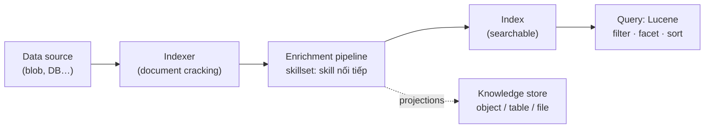

# Note 19 — Azure AI Search: knowledge mining, index & knowledge store

> **TL;DR:** **Azure AI Search** = dịch vụ index + query dữ liệu mọi nguồn (structured/semi/unstructured) cho 3 kịch bản: enterprise search, **RAG** (vector index làm grounding data — xem [[07-Foundry-IQ-Knowledge-Agents]]), và **knowledge mining** (đào insight từ tài liệu). Dây chuyền: **data source** → **indexer** (tự động hoá, thực hiện **document cracking** — "mổ" tài liệu lấy nội dung) → **enrichment pipeline** chạy **skillset** các **AI skill** (built-in từ Foundry Tools: detect ngôn ngữ, entity, key phrase, translate, PII, **OCR ảnh**, caption ảnh; hoặc **custom skill** — vd Azure Function bọc Document Intelligence), mỗi skill **đắp thêm field** vào document JSON phân cấp (ảnh vào `normalized_images`, OCR chạy trên từng ảnh, merge skill gộp text) → **index** (field có 6 thuộc tính: key/searchable/filterable/sortable/facetable/retrievable) → query **full-text** cú pháp **Lucene** (simple/full) qua 4 giai đoạn: parsing → lexical analysis → retrieval → **scoring TF/IDF**; filter bằng `$filter` OData (**case-sensitive**), **facets** cho UI lọc, `$orderby` để sort. Ngoài index, skillset có thể định nghĩa **knowledge store** lưu **projections** (object JSON / **table quan hệ** / file ảnh) phục vụ ETL & analytics.

## 1. Dây chuyền indexing — nhìn một phát hiểu cả module



- **Indexer** tự động hoá trích + index qua enrichment pipeline; mỗi entity indexed → một **document JSON phân cấp**.
- Document khởi đầu = field map từ nguồn (`metadata_storage_name`, `metadata_author`, `content`); nếu nguồn có ảnh → indexer tách vào collection **`normalized_images`** (`image0`, `image1`…).
- **Skill chạy trên context cụ thể trong cây**: skill detect ngôn ngữ ghi field `language` mức document; skill **OCR chạy cho TỪNG ảnh** trong `normalized_images`; **merge skill** gộp `content` + text OCR các ảnh → field mới `merged_content`. Output của skill này làm **input cho skill sau**.
- Map vào index 2 kiểu: field từ nguồn → **implicit** (trùng tên tự map) hoặc explicit (đổi tên/áp hàm); field do skill sinh → luôn **explicit** từ vị trí phân cấp.

## 2. Skillset: built-in vs custom

| | Built-in skills | Custom skills |
|---|---|---|
| Nguồn năng lực | **Foundry Tools** (Azure Vision, Azure Language) | Code của bạn (thường **Azure Function**) |
| Ví dụ | Detect ngôn ngữ; entity (places/locations…); key phrases; translate; **PII extract/remove**; **OCR text từ ảnh**; caption + tag ảnh | "Wrapper" quanh service ngoài — vd truyền ảnh form sang **Document Intelligence** bóc field ([[18-Document-Intelligence-Foundry]]) |
| Điều kiện | Cần gắn **Foundry Tools resource cùng region** với AI Search (không gắn → giới hạn **20 document**) | Tự host, tự trả chi phí |

## 3. Index & query

### 6 thuộc tính của field trong index

| Thuộc tính | Cho phép |
|-----------|----------|
| **key** | Khoá duy nhất của record |
| **searchable** | Full-text search được |
| **filterable** | Dùng trong biểu thức filter |
| **sortable** | Dùng để sắp xếp kết quả |
| **facetable** | Làm **facet** (giá trị lọc hiển thị trên UI) |
| **retrievable** | Xuất hiện trong kết quả (mặc định BẬT tất cả field) |

### Full-text search — cú pháp Lucene, 4 giai đoạn

- 2 biến thể: **simple** (match term trực quan) và **full** (regex, filter phức tạp…). Tham số hay dùng: `search`, `queryType` (simple/full), `searchFields`, `select`, **`searchMode`** (`Any` = chứa từ nào cũng được; `All` = phải chứa đủ mọi term).
- 4 giai đoạn xử lý query:

| # | Giai đoạn | Làm gì |
|---|-----------|--------|
| 1 | **Query parsing** | Dựng cây subquery: term query (`hotel`), phrase query (`"free parking"`), prefix query (`air*`) |
| 2 | **Lexical analysis** | Lowercase, bỏ stopword ("the", "a"…), đưa về gốc từ ("comfortable"→"comfort"), tách từ ghép |
| 3 | **Document retrieval** | Match term ↔ index, ra tập document |
| 4 | **Scoring** | Chấm điểm relevance bằng **TF/IDF** |

### Filter, facet, sort

```text
# Filter 2 cách:
search=London+author='Reviewer'   queryType=Simple          # nhét vào simple expression
search=London  $filter=author eq 'Reviewer'  queryType=Full # OData $filter — CASE-SENSITIVE!

# Facet 2 bước: lấy giá trị → lọc theo lựa chọn
search=*  facet=author
search=*  $filter=author eq 'selected-facet-value'

# Sort (mặc định theo relevance score):
search=*  $orderby=last_modified desc
```

## 4. Knowledge store — đầu ra thứ hai ngoài index

Định nghĩa trong **skillset**; khi indexer chạy, dữ liệu enriched được **persist** thành **projections**:

| Projection | Dạng | Dùng cho |
|-----------|------|----------|
| **Object** | File JSON | ETL, tích hợp data orchestration |
| **Table** | **Schema quan hệ** (bảng) | Analysis & reporting (Power BI…) |
| **File** | File ảnh trích từ tài liệu | Lưu ảnh nhúng ra ngoài |

`★ Insight ─────────────────────────────────────`
AI Search đội hai mũ trong giáo trình mới: mũ **RAG** (vector index cho grounding — chính là hạ tầng dưới Foundry IQ, note 07) và mũ **knowledge mining** (module này) — cùng một indexer/skillset nhưng đích khác: một bên phục vụ LLM truy hồi, một bên phục vụ người tìm kiếm + analytics. Bộ ba đáp án trắc nghiệm gốc của module: cái gì **chạy theo lịch để extract + enrich**? — indexer; built-in skill lấy năng lực từ đâu? — **Foundry Tools**; projection nào ra **schema quan hệ**? — table.
`─────────────────────────────────────────────────`

## Q&A phỏng vấn

**Q1. Thành phần nào được lên lịch chạy để trích + làm giàu dữ liệu vào index?**
→ **Indexer** — tự động hoá document cracking + chạy enrichment pipeline; projection chỉ là đầu ra, query là phía đọc.

**Q2. Built-in skills dựa trên dịch vụ nào? Điều kiện gì?**
→ **Foundry Tools** (Azure Vision, Azure Language…). Phải gắn Foundry Tools resource **cùng region** với AI Search; không gắn thì chỉ index được ≤20 document.

**Q3. Ảnh nhúng trong tài liệu được xử lý thế nào trong pipeline?**
→ Indexer tách vào collection **`normalized_images`** → skill OCR chạy **trên từng ảnh** → merge skill gộp text ảnh với `content` thành `merged_content`.

**Q4. Điểm relevance mặc định tính bằng gì? Muốn sort khác thì sao?**
→ **TF/IDF** (term frequency / inverse document frequency) ở giai đoạn scoring. Override bằng `$orderby=<field sortable> asc|desc`.

**Q5. `searchMode=Any` vs `All` với query "comfortable hotel"?**
→ `Any`: chứa "comfortable" HOẶC "hotel" đều match; `All`: phải chứa **cả hai**.

**Q6. Facet là gì, cần thuộc tính field nào?**
→ UI element cho user lọc theo **danh sách giá trị rời rạc** của field; field phải **facetable**; flow 2 query: `facet=author` lấy giá trị → `$filter=author eq '…'` lọc. Lưu ý `$filter` OData **case-sensitive**.

**Q7. Muốn dữ liệu enriched ra bảng quan hệ cho báo cáo?**
→ Định nghĩa **knowledge store** trong skillset với **table projection** (object = JSON, file = ảnh).

**Q8. Bóc field từ form trong pipeline index thì làm sao?**
→ **Custom skill** (Azure Function) gọi **Document Intelligence** rồi trả field về document index — pattern "wrapper service ngoài".

## Liên quan
- [[00-MOC-AI-103]] — MOC AI-103
- [[07-Foundry-IQ-Knowledge-Agents]] — RAG platform xây trên AI Search
- [[18-Document-Intelligence-Foundry]] — custom skill gọi DI
- [[11-Azure-Language-Text-Analysis]] — năng lực Language đứng sau built-in skills
- [[../../../04-AI/02-RAG-Optimization/00-MOC-RAG-Optimization|MOC: RAG Optimization]] — lý thuyết retrieval/hybrid search tổng quát
