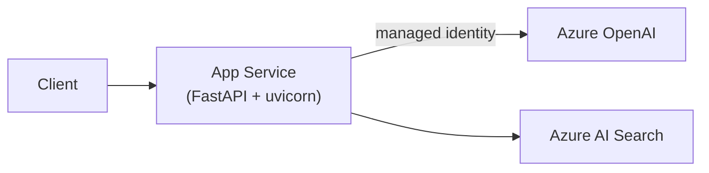

# Deploy ứng dụng AI lên Azure

> [!summary] TL;DR
> Hai cách phổ biến đưa **FastAPI** (backend AI) lên Azure: **App Service** (PaaS, web app chạy **liên tục** — hợp API server có traffic ổn định, WebSocket, streaming) và **Azure Functions** (serverless, **event-driven**, trả theo lần chạy — hợp tác vụ ngắn/sự kiện, traffic thưa). Cấu hình nhạy cảm (API key Azure OpenAI…) đặt trong **App Settings / Key Vault**, ưu tiên **managed identity**. Chọn theo mô hình tải: **luôn chạy → App Service; theo sự kiện/thưa → Functions**.

---

## 1. App Service vs Functions

| | App Service | Azure Functions |
|---|---|---|
| Mô hình | Web app **chạy liên tục** | **Serverless**, theo sự kiện |
| Tính tiền | Theo App Service Plan (tier) | Consumption: theo số lần chạy/thời gian |
| Hợp với | API ổn định, WebSocket, **streaming LLM** | Tác vụ ngắn, webhook, batch, traffic thưa |
| Cold start | Không (luôn ấm) | Có (plan consumption) |
| Scale | Scale up/out + autoscale | Tự scale theo sự kiện |

> [!question] Phỏng vấn: "Deploy FastAPI chatbot streaming — App Service hay Functions?"
> **App Service** (hoặc Container Apps): chatbot cần kết nối **giữ lâu** (SSE/WebSocket cho streaming token) và traffic tương đối ổn định → web app chạy liên tục phù hợp, tránh cold start. Functions hợp hơn cho tác vụ **ngắn, rời rạc** (xử lý 1 request rồi trả). → liên hệ streaming ở [[../../../02-Backend/00-MOC-Backend|MOC Backend]].

---

## 2. Deploy FastAPI lên App Service (phác thảo)

```bash
# Đóng gói: FastAPI chạy bằng gunicorn/uvicorn worker
# requirements.txt cần: fastapi, uvicorn[standard], gunicorn

az webapp up \
  --name my-ai-api \
  --resource-group AZ900 \
  --runtime "PYTHON:3.12" \
  --sku B1

# Startup command (App Service → Configuration):
# gunicorn -w 4 -k uvicorn.workers.UvicornWorker main:app
```

- **App Settings** (biến môi trường) lưu `AZURE_OPENAI_ENDPOINT`, `AZURE_OPENAI_API_KEY`… — KHÔNG hardcode trong code.
- An toàn hơn: bật **managed identity** cho web app + cấp RBAC tới Azure OpenAI/Key Vault → khỏi lưu key ([[10-Identity-Security-AzureAD-RBAC]]).



> [!question] Phỏng vấn: "Lưu API key của Azure OpenAI ở đâu khi deploy?"
> KHÔNG để trong code/repo. Dùng **App Settings** (env var) cho mức cơ bản, tốt hơn là **Azure Key Vault** + **managed identity** để app tự lấy secret mà không cần lưu key đâu cả. Đây là thực hành bảo mật chuẩn (Zero Trust, "data + identity là của bạn").

---

```
★ Insight ─────────────────────────────────────
• Chọn host theo HÌNH DẠNG TẢI: luôn chạy & giữ kết nối → App Service;
  rời rạc theo sự kiện → Functions. Streaming LLM thiên về App Service.
• Cold start là cái giá của serverless: tiết kiệm khi rảnh nhưng độ trễ
  lần gọi đầu cao — cân nhắc cho API người dùng cuối.
• Bí quyết bảo mật xuyên suốt: managed identity > Key Vault > App
  Settings > (tệ nhất) hardcode. Càng lên càng ít nơi secret tồn tại.
─────────────────────────────────────────────────
```

---

## Tự kiểm tra

1. App Service vs Functions khác nhau ở mô hình chạy & tính tiền thế nào?
2. Vì sao streaming LLM thường chọn App Service?
3. Cold start là gì, ảnh hưởng ra sao?
4. Thứ tự ưu tiên nơi lưu secret khi deploy?

---

## Liên quan
- [[07-Compute-VM-Container-Functions]] — nền tảng compute & app hosting
- [[16-Azure-OpenAI-Service]] — backend gọi Azure OpenAI
- [[../../../02-Backend/00-MOC-Backend]] — FastAPI, streaming, production
