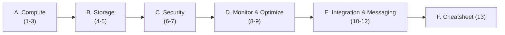

# MOC: AZ-204 — Developing Solutions for Microsoft Azure

> 📚 Cert **AZ-204 (Azure Developer Associate)** — góc nhìn **lập trình viên** (SDK, code, binding, deploy) bổ sung cho AZ-900 (khái niệm) và AI-103 (AI). Nhiều dịch vụ trùng tên với AZ-900 nhưng AZ-204 đào sâu *cách viết code dùng dịch vụ đó*.
> Nguồn: `_source/Microsoft/Az-204.docx` (12 lesson / 5 module) + Microsoft Learn.
>
> **Trạng thái:** ✅ HOÀN TẤT 13 note (2026-06-28) — đã viết đủ nội dung cả 6 cụm. Quy ước: 🚧 chưa viết · 🟡 đang viết · ✅ xong.

## Cụm A — Compute (Module 1)

| # | Note | Bài gốc | TT |
|---|------|---------|----|
| 1 | [[01-Containers-ACR-ACI-Container-Apps\|Container: image, ACR, ACI, Container Apps]] | L1 | ✅ |
| 2 | [[02-App-Service-Web-Apps\|App Service Web Apps: deploy, config, autoscale]] | L2 | ✅ |
| 3 | [[03-Azure-Functions-Bindings-Triggers\|Azure Functions: binding & trigger]] | L3 | ✅ |

## Cụm B — Storage (Module 2)

| # | Note | Bài gốc | TT |
|---|------|---------|----|
| 4 | [[04-Cosmos-DB-SDK-Consistency-ChangeFeed\|Cosmos DB: SDK, consistency level, change feed]] | L4 | ✅ |
| 5 | [[05-Blob-Storage-SDK-Lifecycle\|Blob Storage: SDK, metadata, lifecycle]] | L5 | ✅ |

## Cụm C — Security (Module 3)

| # | Note | Bài gốc | TT |
|---|------|---------|----|
| 6 | [[06-AuthN-AuthZ-Identity-Entra-MSAL-SAS-Graph\|AuthN/AuthZ: Identity platform, Entra ID, MSAL, SAS, Graph]] | L6 | ✅ |
| 7 | [[07-Key-Vault-App-Configuration-Managed-Identity\|Key Vault, App Configuration & Managed Identity]] | L7 | ✅ |

## Cụm D — Monitor & Optimize (Module 4)

| # | Note | Bài gốc | TT |
|---|------|---------|----|
| 8 | [[08-Caching-Redis-CDN\|Caching: Azure Cache for Redis & CDN]] | L8 | ✅ |
| 9 | [[09-Application-Insights\|Application Insights: metrics, logs, traces]] | L9 | ✅ |

## Cụm E — Integration & Messaging (Module 5)

| # | Note | Bài gốc | TT |
|---|------|---------|----|
| 10 | [[10-API-Management\|API Management: instance, products, policies]] | L10 | ✅ |
| 11 | [[11-Event-Grid-Event-Hub\|Event-based: Event Grid & Event Hub]] | L11 | ✅ |
| 12 | [[12-Service-Bus-Queue-Storage\|Message-based: Service Bus & Queue Storage]] | L12 | ✅ |

## Cụm F — Ôn thi

| # | Note | Bài gốc | TT |
|---|------|---------|----|
| 13 | [[13-AZ-204-Cheatsheet-va-QA\|AZ-204 Cheatsheet + Q&A phỏng vấn]] | tổng hợp | ✅ |

---

## Bản đồ nhu cầu ↔ dịch vụ (tra nhanh)

| Nhu cầu lập trình | Dịch vụ Azure | Note |
|-------------------|---------------|------|
| Đóng gói & chạy container | ACR / ACI / Container Apps | 1 |
| Host web app / API (HTTP) | App Service | 2 |
| Code chạy theo sự kiện (serverless) | Azure Functions | 3 |
| NoSQL phân tán toàn cầu | Cosmos DB | 4 |
| Lưu file / object | Blob Storage | 5 |
| Đăng nhập user, gọi API có token | Microsoft Identity (MSAL) / Entra ID | 6 |
| Cất secret/key/cert an toàn | Key Vault + Managed Identity | 7 |
| Tăng tốc đọc, giảm tải DB | Cache for Redis / CDN | 8 |
| Theo dõi lỗi & hiệu năng app | Application Insights | 9 |
| Cổng API (gateway, throttle, version) | API Management | 10 |
| Phát/nhận sự kiện (event) | Event Grid / Event Hub | 11 |
| Hàng đợi tin nhắn (decoupling) | Service Bus / Queue Storage | 12 |

## Đối chiếu với note đã có (tránh trùng, học bổ sung)

| Chủ đề AZ-204 | Đã có ở | AZ-204 đào sâu thêm |
|----------------|---------|----------------------|
| App Service & Functions | [[../AI-Azure/18-Azure-App-Service-Functions-deploy]] | binding/trigger, deploy slot, autoscale, TLS/connection string |
| Cosmos DB / Storage | [[../AZ-900/09-Storage-Blob-Disk-Files]], Database domain | SDK code, consistency level, change feed, lifecycle policy |
| Identity & RBAC | [[../AZ-900/10-Identity-Security-AzureAD-RBAC]] | MSAL flow, SAS token, Microsoft Graph, Managed Identity trong code |
| Key Vault / secrets | [[../../../06-DevOps/09-CI-CD-Continuous-Deployment]] | đọc secret từ code qua SDK + Managed Identity |
| Monitoring | [[../AZ-900/14-Monitoring-Advisor-Monitor]] | instrument App Insights SDK, telemetry, KQL trace |

## Lộ trình

## Liên quan
- [[../00-MOC-Azure]] — MOC Azure tổng (AZ-900 + AI-Azure + AI-103)
- [[../AI-103/00-MOC-AI-103]] — AI-103 (AI-trên-Azure, Microsoft Foundry era)
- [[../../01-AWS-Bedrock/00-MOC-AWS-Bedrock]] — nhánh AWS để đối chiếu
