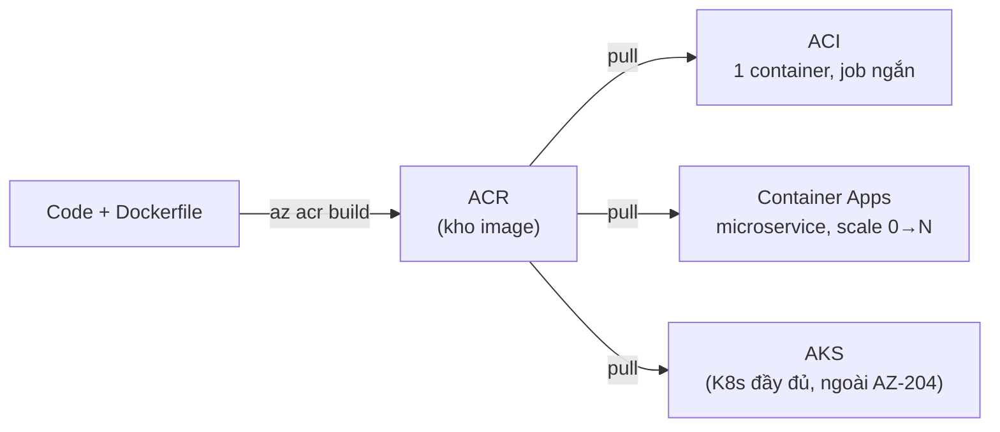

# Containers: ACR, ACI & Container Apps

> [!summary] TL;DR
> **Container** = đóng gói app + mọi thư viện/cấu hình vào 1 **image** (ảnh bất biến) để chạy giống nhau ở mọi nơi (máy dev, cloud). Build image từ **Dockerfile** (công thức từng lớp `FROM/COPY/RUN/CMD`). Trên Azure có 3 dịch vụ theo mức độ "tự lo": **ACR** (Azure Container Registry — *kho* lưu & build image riêng tư) → **ACI** (Container Instance — chạy **1 container lẻ** nhanh, không cần cụm, trả theo giây) → **Container Apps** (chạy **microservice serverless** có **auto-scale tới 0** bằng **KEDA**, **revisions** cho blue-green, **Dapr** cho giao tiếp service-to-service). Quy tắc chọn: việc dùng-một-lần/job ngắn → **ACI**; app web/microservice nhiều bản, cần scale & versioning → **Container Apps**; cần điều phối Kubernetes đầy đủ → **AKS** (ngoài phạm vi AZ-204).

---

## 1. Nền tảng container & image

| Khái niệm | Giải nghĩa |
|---|---|
| **Image** (ảnh) | Gói **chỉ-đọc** chứa app + runtime + thư viện + cấu hình. Bất biến, đánh **tag** (vd `myapp:1.0`). |
| **Container** | Một **instance đang chạy** của image. Nhiều container từ cùng 1 image. |
| **Dockerfile** | File text mô tả cách **build image** theo từng **layer** (lớp); layer được cache để build lại nhanh. |
| **Registry** (kho) | Nơi **lưu & phân phối** image (như "GitHub cho image"). Public: Docker Hub; riêng tư trên Azure: **ACR**. |

**Container vs VM:** container **chia sẻ kernel** của host (không bê cả OS), nên **nhẹ** và **khởi động trong vài giây**; VM ảo hoá cả phần cứng + OS riêng nên nặng và chậm hơn.

**Dockerfile mẫu (gloss từng dòng):**
```dockerfile
FROM python:3.12-slim        # ảnh nền (base image) có sẵn Python
WORKDIR /app                 # thư mục làm việc bên trong container
COPY requirements.txt .      # chép file khai báo thư viện vào image
RUN pip install -r requirements.txt   # cài thư viện → tạo 1 layer
COPY . .                     # chép toàn bộ source vào image
CMD ["uvicorn", "main:app", "--host", "0.0.0.0"]   # lệnh chạy khi container khởi động
```

> **Layer caching:** đặt dòng ít thay đổi (cài thư viện) **trước** dòng hay đổi (copy source) → sửa code không phải cài lại thư viện, build nhanh hơn nhiều.

---

## 2. Azure Container Registry (ACR) — kho image riêng tư

- **Là gì:** registry **riêng tư** được Azure quản lý để lưu image của bạn, tích hợp Entra ID/RBAC cho phân quyền pull/push.
- **Tier (SKU):** **Basic** (học/dev) · **Standard** (production thường) · **Premium** (geo-replication nhân bản image đa region, content trust, private link).
- **ACR Tasks** — build image **trên cloud** (không cần Docker ở máy local):
  - `az acr build` — build + push 1 lệnh (quick task).
  - **Automatic triggers**: tự build khi **commit Git**, khi **base image cập nhật** (vá lỗi bảo mật), hoặc theo lịch.
  - **Multi-step task**: chuỗi build → run test → push, định nghĩa trong file YAML.

```bash
# Build & push thẳng lên ACR, không cần Docker local
az acr build --registry myregistry --image myapp:1.0 .
# Đăng nhập để pull/push
az acr login --name myregistry
```

> **Vì sao ACR Tasks quan trọng:** "base image update trigger" tự rebuild image khi ảnh nền (vd `python:3.12`) được vá lỗi bảo mật → app luôn chạy trên nền đã patch mà không cần can thiệp tay.

---

## 3. Azure Container Instance (ACI) — chạy 1 container lẻ

- **Là gì:** cách **nhanh nhất** chạy container trên Azure **không cần quản lý VM/cụm**. Trả tiền **theo giây** theo vCPU + bộ nhớ.
- **Hợp với:** job ngắn/chạy-một-lần (batch, xử lý dữ liệu), task theo sự kiện, build agent — *không* phải web app chạy 24/7 cần scale.
- **Khái niệm chính:**
  - **Container group** — nhóm nhiều container **chung host, chung mạng/IP & vòng đời** (giống pod của Kubernetes). Multi-container group chỉ hỗ trợ trên Linux.
  - **Restart policy**: `Always` / `OnFailure` / `Never` — quan trọng cho job: dùng `OnFailure`/`Never` để job xong thì dừng (không tốn tiền).
  - **Environment variables** & **secure env var** (giấu giá trị nhạy cảm).
  - **Mount Azure Files** để lưu dữ liệu bền (container vốn vô trạng thái — stateless).

```bash
az container create --resource-group rg --name job1 \
  --image myregistry.azurecr.io/myapp:1.0 \
  --restart-policy OnFailure --cpu 1 --memory 1.5
```

---

## 4. Azure Container Apps — microservice serverless

- **Là gì:** chạy container dạng **serverless** (Azure tự lo hạ tầng), xây trên Kubernetes + KEDA + Dapr nhưng **ẩn toàn bộ độ phức tạp K8s**. Đây là lựa chọn AZ-204 nhấn mạnh nhất cho microservice.
- **Khái niệm cốt lõi:**

| Khái niệm | Giải nghĩa |
|---|---|
| **Environment** | Ranh giới bảo mật/mạng chung cho nhiều container app (chung VNet, chung Log Analytics). |
| **Revision** (bản sửa đổi) | Một **snapshot bất biến** của app sau mỗi lần deploy → cho phép **blue-green / canary**: chia % traffic giữa các revision, rollback tức thì. |
| **KEDA** | *Kubernetes Event-Driven Autoscaling* — auto-scale theo **HTTP traffic, queue length, sự kiện**; **scale tới 0** khi không có request (không tốn tiền lúc rảnh). |
| **Dapr** | *Distributed Application Runtime* — "sidecar" cung cấp service-to-service invocation, pub/sub, state management, secrets cho microservice. |
| **Ingress** | Cổng vào HTTP, có thể public hoặc internal; tự cấp HTTPS. |



---

## 5. Chọn dịch vụ nào? (ACI vs Container Apps vs AKS)

| Tiêu chí | **ACI** | **Container Apps** | **AKS** |
|---|---|---|---|
| Mục đích | 1 container lẻ, job ngắn | Microservice serverless | Cụm Kubernetes đầy đủ |
| Auto-scale | Không (chạy cố định) | **Có, tới 0** (KEDA) | Có (tự cấu hình) |
| Versioning/blue-green | Không | **Revisions** | Tự làm (Deployment) |
| Độ phức tạp quản lý | Thấp nhất | Thấp (ẩn K8s) | Cao nhất |
| Khi nào dùng | Batch, task one-off | Web/API/microservice | Cần control K8s, service mesh |

> [!question] Phỏng vấn: "Cần chạy một microservice HTTP, lúc không ai gọi thì không tốn tiền, lúc tải cao tự scale, lại muốn deploy phiên bản mới chia traffic thử nghiệm — chọn gì?"
> **Azure Container Apps**: KEDA scale **tới 0** khi rảnh (không tính phí compute), tự scale lên theo HTTP traffic; **revisions** cho phép chia % traffic (canary/blue-green) và rollback. ACI không scale-to-N theo traffic; AKS thì thừa độ phức tạp cho nhu cầu này.

> [!question] Phỏng vấn: "Build image mà máy CI không cài Docker thì sao?"
> Dùng **ACR Tasks** (`az acr build`) — build ngay trên Azure, không cần Docker daemon ở local/CI; còn tự rebuild khi base image được vá bảo mật.

---

```
★ Insight ─────────────────────────────────────
• 3 dịch vụ là một "thang tự-lo": ACI (bạn chỉ ném 1 container) →
  Container Apps (Azure lo scale/version, bạn không thấy K8s) →
  AKS (bạn cầm lái K8s). Lên thang = nhiều quyền điều khiển + nhiều
  trách nhiệm vận hành.
• "Scale to zero" của KEDA là điểm phân biệt then chốt với App Service:
  hết request → 0 instance → 0 chi phí compute (hợp tải bất thường).
• Revision = bất biến giống image: deploy không sửa bản cũ mà tạo
  bản mới → rollback chỉ là chuyển 100% traffic về revision trước.
─────────────────────────────────────────────────
```

---

## Tự kiểm tra

1. Phân biệt **image** và **container**. Vì sao image gọi là "bất biến"?
2. Container nhẹ hơn VM nhờ đâu (gợi ý: kernel)?
3. Trong Dockerfile, vì sao nên `COPY requirements.txt` & cài thư viện **trước** khi `COPY` source?
4. `az acr build` giải quyết vấn đề gì so với build Docker ở local?
5. ACI vs Container Apps: cái nào **scale tới 0**? Cái nào hợp job batch one-off?
6. **Revision** trong Container Apps dùng để làm gì? Liên hệ với deployment slot của App Service ([[02-App-Service-Web-Apps]]).

---

## Liên quan
- [[00-MOC-AZ-204]]
- [[02-App-Service-Web-Apps]] — PaaS host code không cần container
- [[03-Azure-Functions-Bindings-Triggers]] — serverless theo sự kiện
- [[../AZ-900/07-Compute-VM-Container-Functions]] — tổng quan compute (góc AZ-900)
- [[../../../06-DevOps/13-Docker-Practical|Docker thực hành]]
