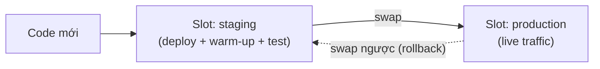

# App Service Web Apps: deploy, config, autoscale

> [!summary] TL;DR
> **App Service** = **PaaS** host ứng dụng HTTP (web/API/mobile backend) — bạn chỉ đưa code/container, Azure lo OS, patch, load balancer, TLS. Mọi web app chạy trên một **App Service Plan** (quyết định compute + tính năng + giá: **F1** free → **B** basic → **S** standard → **P** premium). **Deploy** qua ZIP/`az webapp up`/Git/GitHub Actions/container. **Deployment slot** (chỉ Standard+) = bản sao môi trường (vd `staging`) để deploy → warm-up → **swap** sang production gần như **không downtime**, lỗi thì **swap ngược** để rollback. Cấu hình runtime qua **App settings** (biến môi trường) & **connection strings** — *ghi đè* giá trị trong code, không hardcode. **Scale up** = đổi tier mạnh hơn (dọc); **scale out** = thêm nhiều instance (ngang) theo **autoscale rule** (CPU/lịch).

---

## 1. App Service & App Service Plan

| Khái niệm | Giải nghĩa |
|---|---|
| **Web App** | Ứng dụng HTTP chạy trên App Service: .NET/Node/Python/Java/PHP **hoặc custom container**. |
| **App Service Plan** | "Máy chủ ảo" đứng sau: định **OS (Win/Linux)**, **region**, **tier/size**, **số instance**. Nhiều web app **chung 1 plan** → chung tài nguyên. |
| **Tier (SKU)** | **F1** (Free, chia sẻ, có quota) · **B** (Basic) · **S** (Standard — có slot + autoscale) · **P/Pv3** (Premium — mạnh, nhiều slot, VNet). |

> **Lưu ý tính tiền:** trả tiền theo **App Service Plan** (compute đã cấp), *không* theo từng web app. Nhồi nhiều app nhẹ vào 1 plan để tiết kiệm — nhưng chúng tranh tài nguyên.

---

## 2. Deploy code & deployment slots (swap)

**Cách deploy:**
| Cách | Dùng khi |
|---|---|
| **ZIP deploy** / `az webapp up` | Đẩy nhanh từ máy/CLI |
| **Git / GitHub Actions / Azure DevOps** | CI/CD tự động theo commit |
| **Container** (từ ACR) | App đã đóng gói image |
| **Run from package** | Mount thẳng file zip, deploy nguyên tử (atomic) |

**Deployment slot (Standard trở lên):**
- Slot = **bản sao** web app có hostname riêng (vd `myapp-staging.azurewebsites.net`).
- Quy trình **blue-green**: deploy lên `staging` → kiểm thử → **swap** với `production`. Swap **hoán đổi** chứ không copy → production nhận đúng instance đã **warm-up** (đã nạp sẵn), tránh cold start.
- Lỗi sau swap → **swap ngược** = rollback tức thì.
- **App setting có thể đánh dấu "slot setting" (deployment slot setting)** → giá trị **dính theo slot, không bị swap** (vd connection string của staging trỏ DB test).



---

## 3. App settings, connection strings, TLS

- **App settings** = **biến môi trường** Azure tiêm vào app lúc chạy; **ghi đè** giá trị trong file config → không hardcode, đổi không cần build lại. (Đọc trong code như env var thường.)
- **Connection strings** = chuỗi kết nối DB; tách riêng vì có loại đặc thù (SQLServer, MySQL…) và được mã hoá khi lưu.
- 👉 Giá trị nhạy cảm nên **tham chiếu Key Vault** (`@Microsoft.KeyVault(...)`) thay vì để plaintext — xem [[07-Key-Vault-App-Configuration-Managed-Identity]].
- **TLS/SSL:** gắn **custom domain**, thêm **certificate** (App Service Managed Certificate miễn phí, hoặc import), bật **HTTPS Only** + **minimum TLS version**. Hỗ trợ **CORS** cấu hình sẵn cho API.

---

## 4. Diagnostics logging & log stream

| Loại log | Nội dung |
|---|---|
| **Application logging** | Log do code ghi (stdout/ILogger), mức Error/Warning/Info |
| **Web server logging** | Log HTTP của web server (request, status) |
| **Failed request tracing** | Chi tiết các request lỗi (vì sao 500/404) |
| **Deployment logging** | Quá trình deploy |

- **Log stream** = xem log **trực tiếp gần real-time** (`az webapp log tail`) khi debug.
- Tích hợp **Application Insights** để telemetry sâu (trace, dependency, exception) — xem [[09-Application-Insights]].
- **Kudu / SCM** (`*.scm.azurewebsites.net`): bảng điều khiển nâng cao, console, xem file hệ thống.

---

## 5. Autoscaling — scale up vs scale out

| | **Scale UP** (dọc) | **Scale OUT** (ngang) |
|---|---|---|
| Làm gì | Đổi sang **tier mạnh hơn** (nhiều CPU/RAM) | Thêm **nhiều instance** cùng chạy |
| Giới hạn | Trần phần cứng 1 máy | Gần như không giới hạn (theo tier) |
| Tự động? | Thường thủ công | **Autoscale rule** tự động |

- **Autoscale rule**: tăng/giảm instance theo **metric** (CPU %, memory, HTTP queue length) hoặc theo **lịch** (scheduled — vd giờ cao điểm). Đặt **min/max instance** để khống chế chi phí.
- **Always On**: giữ app luôn "ấm", không bị unload khi rảnh (tránh cold start) — cần cho web app & WebJobs liên tục.

> [!question] Phỏng vấn: "Deploy bản mới mà không gây downtime và lỡ lỗi thì rollback ngay — làm sao trên App Service?"
> Dùng **deployment slot**: deploy lên `staging`, để **warm-up**, rồi **swap** với production (hoán đổi instance đã sẵn sàng → gần như zero-downtime). Lỗi thì **swap ngược** để rollback tức thì. Nhớ đánh dấu các setting đặc thù môi trường là **slot setting** để không bị swap nhầm.

> [!question] Phỏng vấn: "CPU app tăng vọt giờ cao điểm — scale up hay scale out?"
> **Scale out** (thêm instance) qua autoscale rule theo CPU/lịch là phù hợp cho tải biến động & độ sẵn sàng; scale up (đổi tier) hợp khi một request đơn lẻ cần nhiều CPU/RAM hơn hoặc cần tính năng của tier cao.

---

```
★ Insight ─────────────────────────────────────
• App Service = "container không cần Dockerfile": Azure dựng runtime
  sẵn, bạn chỉ đẩy code. So với Container Apps: ít kiểm soát hơn
  nhưng nhanh để lên web/API truyền thống.
• Swap mạnh ở chỗ "hoán đổi instance đã warm-up", không phải copy
  file — nên production không chịu cold start sau deploy.
• "Slot setting" là bẫy thi: setting thường THEO swap (đi cùng code);
  setting đánh dấu slot-setting thì DÍNH slot (ở lại) — dùng cho
  connection string / cấu hình riêng môi trường.
─────────────────────────────────────────────────
```

---

## Tự kiểm tra

1. App Service Plan quyết định những gì? Tính tiền theo plan hay theo web app?
2. Mô tả quy trình **swap** deployment slot và vì sao gần như không downtime.
3. **App setting** thường vs **slot setting** khác nhau ra sao khi swap?
4. Giá trị nhạy cảm (mật khẩu DB) nên để ở App setting plaintext hay tham chiếu Key Vault? Vì sao?
5. Phân biệt **scale up** và **scale out**; autoscale rule kích hoạt theo gì?

---

## Liên quan
- [[00-MOC-AZ-204]]
- [[01-Containers-ACR-ACI-Container-Apps]] — chạy app dạng container (đối chiếu)
- [[03-Azure-Functions-Bindings-Triggers]] — serverless, cùng nền App Service Plan
- [[07-Key-Vault-App-Configuration-Managed-Identity]] — đưa secret ra khỏi App settings
- [[../AI-Azure/18-Azure-App-Service-Functions-deploy]] — deploy FastAPI lên App Service/Functions
- [[../AZ-900/07-Compute-VM-Container-Functions]] — App Service ở góc AZ-900
