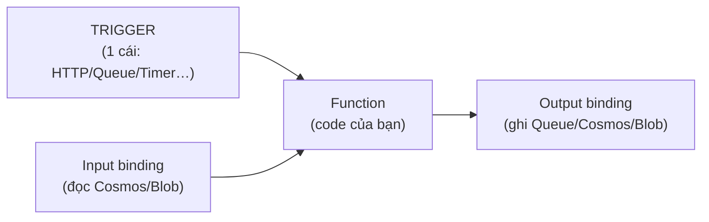

# Azure Functions: trigger, binding, hosting plan

> [!summary] TL;DR
> **Azure Functions** = **serverless** chạy **một hàm nhỏ** khi có sự kiện, trả tiền **theo lần chạy + thời gian + bộ nhớ** (không có request → không tốn tiền). Mỗi function có đúng **1 trigger** (cái *kích hoạt* nó chạy: HTTP, Timer/CRON, Blob mới, message Queue/Service Bus, Event Grid/Hub, Cosmos change feed) và **0..n binding** (kết nối **khai báo** tới resource: **input** = đọc dữ liệu vào, **output** = ghi kết quả ra — đỡ viết code SDK). Chọn **hosting plan**: **Consumption** (rẻ nhất, scale-to-0 nhưng có **cold start**, timeout ngắn) · **Premium** (pre-warmed → không cold start, VNet, timeout dài) · **Dedicated/App Service** (chạy trên plan có sẵn). Việc dài/nhiều bước cần trạng thái → **Durable Functions** (orchestration: chaining, fan-out/fan-in, human interaction).

---

## 1. Vì sao Functions & hosting plan

**Functions** hợp với xử lý **event-driven, ngắn, rời rạc**: xử lý file vừa upload, chạy job theo lịch, phản hồi message hàng đợi, webhook. Không hợp app HTTP chạy liên tục, nặng, lâu (dùng App Service/Container Apps).

| Hosting plan | Scale | Cold start | Timeout mặc định | VNet | Khi nào |
|---|---|---|---|---|---|
| **Consumption** | Tự động, **về 0** | **Có** (lúc rảnh bị thu hồi) | 5 phút (tối đa 10) | Hạn chế | Tải thấp/biến động, tiết kiệm |
| **Premium** (Elastic) | Tự động, **giữ instance ấm** | **Không** (pre-warmed) | 30 phút (cấu hình hơn) | Có | Cần phản hồi nhanh, VNet, chạy lâu |
| **Dedicated (App Service)** | Theo plan | Không (Always On) | Không giới hạn | Có | Đã có App Service Plan, tận dụng |

> **Cold start** = lần gọi đầu sau khi function bị "ngủ" phải khởi tạo lại runtime → trễ vài trăm ms–vài giây. Consumption rẻ nhưng dính; Premium trả thêm tiền để **luôn ấm**.

---

## 2. Trigger — cái kích hoạt hàm

- **Mỗi function = đúng 1 trigger.** Trigger định nghĩa "khi nào hàm chạy" và thường mang **dữ liệu sự kiện** vào.

| Trigger | Chạy khi |
|---|---|
| **HTTP** | Có HTTP request (làm API/webhook) |
| **Timer** | Theo lịch **CRON** (vd `0 */5 * * * *` — mỗi 5 phút) |
| **Blob** | Có blob mới/đổi trong container |
| **Queue / Service Bus** | Có message trong hàng đợi |
| **Event Grid / Event Hub** | Có event được publish / luồng dữ liệu |
| **Cosmos DB** | **Change feed** — có document thay đổi |

---

## 3. Binding — kết nối khai báo (input/output)

- **Binding** = cách **khai báo** (declarative) để hàm đọc/ghi resource **mà không viết code SDK kết nối**. Azure lo việc đọc dữ liệu vào tham số và ghi kết quả ra.
  - **Input binding** = lấy dữ liệu **vào** hàm (vd đọc 1 document Cosmos theo id).
  - **Output binding** = đẩy kết quả **ra** (vd ghi 1 message vào Queue, 1 row vào Cosmos).
- Cấu hình qua **decorator/attribute** (Python/C#) hoặc `function.json`.

**Ví dụ (Python v2) — HTTP trigger + Cosmos output binding:**
```python
@app.route(route="order")                          # trigger: HTTP
@app.cosmos_db_output(arg_name="doc",              # output binding: ghi vào Cosmos
    database_name="shop", container_name="orders",
    connection="COSMOS_CONN")
def create_order(req: func.HttpRequest, doc: func.Out[func.Document]):
    doc.set(func.Document.from_dict({"id": "...", "item": "book"}))
    return func.HttpResponse("created")
```
> Không có dòng nào mở kết nối Cosmos thủ công — binding lo hết. Giảm boilerplate, ít lỗi.



---

## 4. Durable Functions — orchestration có trạng thái

Function thường **vô trạng thái (stateless)**; cần luồng dài/nhiều bước có nhớ trạng thái thì dùng **Durable Functions** (extension). Các **pattern**:

| Pattern | Ý nghĩa |
|---|---|
| **Function chaining** | Chạy tuần tự A→B→C, kết quả bước trước làm đầu vào bước sau |
| **Fan-out / fan-in** | Chạy **song song** nhiều việc rồi **gom** kết quả lại |
| **Async HTTP API** | Khởi động job dài, trả ngay endpoint để client poll trạng thái |
| **Human interaction** | Chờ phê duyệt của người (có timeout) |

- **Orchestrator function** điều phối; **activity function** làm việc thực; trạng thái được lưu tự động (checkpoint) để chạy lại đúng chỗ.

---

## 5. Khi nào chọn Functions (vs App Service vs Container Apps)

| | **Functions** | **App Service** | **Container Apps** |
|---|---|---|---|
| Mô hình | Hàm theo sự kiện | Web app liên tục | Microservice container |
| Tính tiền | Theo lần chạy | Theo plan (compute cấp) | Theo dùng, scale-to-0 |
| Hợp với | Job ngắn, webhook, ETL nhẹ | Web/API truyền thống | Microservice cần container + scale |

> [!question] Phỏng vấn: "Phân biệt trigger và binding?"
> **Trigger** là *điều khiến hàm chạy* — mỗi function có đúng **một** (HTTP, Timer, Queue…). **Binding** là *kết nối khai báo tới dữ liệu* mà không cần viết code SDK: **input** đọc dữ liệu vào, **output** ghi kết quả ra; một hàm có thể có nhiều binding hoặc không có.

> [!question] Phỏng vấn: "Function trên Consumption phản hồi chậm ở request đầu — vì sao và khắc phục?"
> Đó là **cold start**: lúc rảnh instance bị thu hồi, request đầu phải khởi tạo lại runtime. Khắc phục: chuyển sang **Premium plan** (pre-warmed, không cold start) hoặc Dedicated với **Always On**.

---

```
★ Insight ─────────────────────────────────────
• Trigger là "1", binding là "n": nhớ con số này để khỏi nhầm khi thi
  — một hàm không thể có 2 trigger nhưng có thể nhiều input/output.
• Binding biến hạ tầng thành tham số hàm: bạn khai báo "tôi cần ghi
  vào Cosmos", Azure lo kết nối → code sạch, ít lỗi credential.
• Consumption vs Premium chính là đánh đổi "rẻ + cold start" vs
  "đắt hơn + luôn ấm" — y hệt logic scale-to-0 ở Container Apps.
─────────────────────────────────────────────────
```

---

## Tự kiểm tra

1. Mỗi function có bao nhiêu **trigger**? Bao nhiêu **binding**?
2. Phân biệt **input binding** và **output binding**, cho ví dụ.
3. **Cold start** là gì? Plan nào tránh được và đánh đổi gì?
4. Kể 2 pattern của **Durable Functions** và khi nào dùng.
5. Khi nào chọn Functions thay vì App Service / Container Apps?

---

## Liên quan
- [[00-MOC-AZ-204]]
- [[02-App-Service-Web-Apps]] — cùng nền App Service Plan; Always On/cold start
- [[01-Containers-ACR-ACI-Container-Apps]] — scale-to-0 (đối chiếu KEDA)
- [[11-Event-Grid-Event-Hub]] · [[12-Service-Bus-Queue-Storage]] — nguồn trigger
- [[../AI-Azure/18-Azure-App-Service-Functions-deploy]] — deploy Functions thực hành
