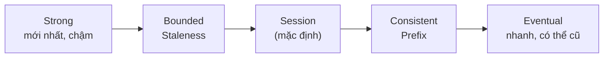

# Cosmos DB: SDK, consistency level, change feed

> [!summary] TL;DR
> **Azure Cosmos DB** = cơ sở dữ liệu **NoSQL phân tán toàn cầu**, độ trễ thấp, **SLA 99.999%**, scale ngang tự động. Đo throughput bằng **RU/s** (*Request Unit per second* — "đồng tiền" gộp CPU+IO+RAM của mỗi thao tác; cấp theo **provisioned / autoscale / serverless**). Phân cấp: **Account → Database → Container → Item**; **partition key** quyết định dữ liệu chia ra sao — chọn key **cardinality cao, phân tán đều** để tránh **hot partition** (1 phân vùng quá tải). Dùng **SDK** CRUD/query (point read theo `id`+partition key là rẻ & nhanh nhất). Điểm thi đặc trưng: **5 consistency level** đánh đổi *độ mới dữ liệu ↔ độ trễ/sẵn sàng*: **Strong → Bounded Staleness → Session (mặc định) → Consistent Prefix → Eventual**. **Change feed** = nhật ký thay đổi theo thứ tự, để trigger xử lý (Functions, change feed processor) cho event sourcing / materialized view / đồng bộ.

---

## 1. Tổng quan, RU/s & multi-model

- **Phân tán toàn cầu**: bật **multi-region**, thậm chí **multi-region write** (ghi nhiều vùng) → người dùng đọc/ghi ở vùng gần nhất.
- **RU/s (Request Unit/giây)**: mọi thao tác (read/write/query) "tốn" một số RU; bạn cấp ngân sách RU/s.

| Chế độ throughput | Cách tính | Hợp với |
|---|---|---|
| **Provisioned** | Cấp cố định RU/s | Tải ổn định, dự đoán được |
| **Autoscale** | Tự co giãn 10%–100% mức trần | Tải biến động |
| **Serverless** | Trả theo RU thực dùng | Tải thấp/thưa, dev/test |

- **Multi-model (API)**: **NoSQL (Core/SQL)** mặc định · **MongoDB** · **Cassandra** · **Gremlin** (graph) · **Table**. Chọn API lúc tạo account, không đổi sau.

---

## 2. Phân cấp & partition key

```
Account  →  Database  →  Container  →  Item (JSON document)
                              └── chia theo PARTITION KEY → các physical partition
```
- **Partition key** = thuộc tính trong item dùng để **nhóm & phân tán** dữ liệu (vd `/userId`, `/tenantId`).
- **Chọn tốt:** giá trị **đa dạng (cardinality cao)**, phân phối **đều** read/write, và những item hay query cùng nhau nằm cùng partition.
- **Hot partition** = key kém → một phân vùng nhận quá nhiều tải (vd phân theo `/country` mà 90% user một nước) → bị **throttle (429)** dù tổng RU còn dư.

> **Logical vs physical partition:** mỗi giá trị key là 1 *logical partition* (tối đa 20GB); Azure tự gộp/đặt chúng lên các *physical partition*. Bạn chỉ chọn key, Azure lo phần vật lý.

---

## 3. SDK: CRUD & query

```python
from azure.cosmos import CosmosClient
client = CosmosClient(URL, credential)            # nên dùng Managed Identity thay key
container = client.get_database_client("shop").get_container_client("orders")

container.create_item({"id": "o1", "userId": "u1", "total": 50})   # create
item = container.read_item(item="o1", partition_key="u1")          # POINT READ (rẻ nhất)
container.upsert_item({"id": "o1", "userId": "u1", "total": 80})   # update/insert
items = container.query_items(                                     # query SQL
    "SELECT * FROM c WHERE c.userId=@u",
    parameters=[{"name": "@u", "value": "u1"}],
    partition_key="u1")                                           # truyền key → query 1 partition
```
- **Point read** (`read_item` theo `id` + partition key) = rẻ nhất (~1 RU), luôn ưu tiên khi biết khóa.
- **Query** quét nhiều item tốn nhiều RU; **truyền partition key** để query gói trong 1 phân vùng (tránh cross-partition fan-out đắt).
- **Pagination** bằng **continuation token** (lấy trang tiếp theo).

---

## 4. Năm consistency level (bảng đánh đổi)

Đánh đổi giữa **độ mới của dữ liệu đọc được** và **độ trễ / độ sẵn sàng / RU**:

| Level | Đảm bảo | Đánh đổi |
|---|---|---|
| **Strong** | Luôn đọc được bản **ghi mới nhất** (như 1 bản sao) | Độ trễ cao nhất, không cho multi-region write |
| **Bounded Staleness** | Trễ tối đa **K phiên bản** hoặc **T thời gian** | Cân bằng; biết rõ "cũ tối đa bao nhiêu" |
| **Session** *(mặc định)* | Trong **cùng 1 session**, đọc thấy chính cái mình vừa ghi (read-your-writes) | Phổ biến nhất cho app web/user |
| **Consistent Prefix** | Đọc theo **đúng thứ tự ghi**, không nhảy cóc (nhưng có thể cũ) | Yếu hơn Session |
| **Eventual** | Cuối cùng sẽ hội tụ, không đảm bảo thứ tự | Độ trễ thấp nhất, RU rẻ nhất, dữ liệu có thể cũ |

> Đi từ trên xuống: **dữ liệu càng "tươi" càng tốn trễ/RU**; xuống dưới: nhanh & rẻ nhưng có thể đọc dữ liệu cũ. **Session** là mặc định vì hợp nhất với trải nghiệm người dùng web.



---

## 5. Change feed — xử lý sự kiện thay đổi

- **Change feed** = dòng **log các thay đổi** (insert/update) trong container, **theo thứ tự**, **bền** (đọc lại được).
- Cách tiêu thụ:
  - **Azure Functions Cosmos DB trigger** — hàm tự chạy mỗi khi có thay đổi (xem [[03-Azure-Functions-Bindings-Triggers]]).
  - **Change feed processor** (trong SDK) — quản lý nhiều consumer + checkpoint (lease container).
- **Dùng cho:** đồng bộ sang hệ khác, tạo **materialized view** (bảng tổng hợp đọc nhanh), **event sourcing**, gửi thông báo, cập nhật cache/search index.
- *Lưu ý:* change feed (mặc định) bắt **insert & update**, **không** bắt delete (dùng soft-delete + TTL nếu cần theo dõi xóa).

> [!question] Phỏng vấn: "Vì sao chọn partition key quan trọng? Hậu quả nếu chọn sai?"
> Partition key quyết định dữ liệu phân tán ra sao. Chọn sai (cardinality thấp / lệch tải) gây **hot partition**: một phân vùng quá tải bị **throttle 429** dù tổng RU còn dư, và một logical partition còn bị trần **20GB**. Nên chọn key đa dạng, phân tán đều read/write.

> [!question] Phỏng vấn: "Khác nhau giữa Strong và Eventual? Mặc định là gì và vì sao?"
> **Strong** đảm bảo luôn đọc bản ghi mới nhất nhưng độ trễ cao và không cho multi-region write; **Eventual** nhanh & rẻ nhất nhưng có thể đọc dữ liệu cũ, sai thứ tự. Mặc định là **Session** (read-your-writes trong một session) — cân bằng tốt nhất cho app web hướng người dùng.

---

```
★ Insight ─────────────────────────────────────
• RU/s là tư duy tính tiền lạ của Cosmos: bạn không nghĩ theo CPU/RAM
  mà theo "mỗi thao tác tốn bao nhiêu RU" → tối ưu = giảm RU mỗi query
  (point read, truyền partition key, tránh cross-partition).
• 5 consistency level là một thanh trượt: kéo về Strong = đúng nhưng
  chậm; kéo về Eventual = nhanh nhưng có thể cũ. Đề thi rất hay hỏi
  thứ tự và "mặc định là Session".
• Change feed biến DB thành nguồn sự kiện: thay vì poll bảng, bạn để
  Functions phản ứng theo thay đổi — chính là event-driven trong nhà.
─────────────────────────────────────────────────
```

---

## Tự kiểm tra

1. **RU/s** là gì? 3 chế độ cấp throughput khác nhau ra sao?
2. Vẽ phân cấp Account→…→Item. **Partition key** ảnh hưởng gì tới hiệu năng?
3. **Point read** vs **query** — cái nào rẻ RU hơn và vì sao nên truyền partition key?
4. Liệt kê **5 consistency level** theo thứ tự mạnh→yếu. Mặc định là gì?
5. **Change feed** dùng để làm gì? Tiêu thụ bằng cách nào?

---

## Liên quan
- [[00-MOC-AZ-204]]
- [[05-Blob-Storage-SDK-Lifecycle]] — storage còn lại của module 2
- [[03-Azure-Functions-Bindings-Triggers]] — Cosmos change feed trigger
- [[../../../03-Database/00-MOC-Database|MOC Database]] — đối chiếu SQL vs NoSQL
