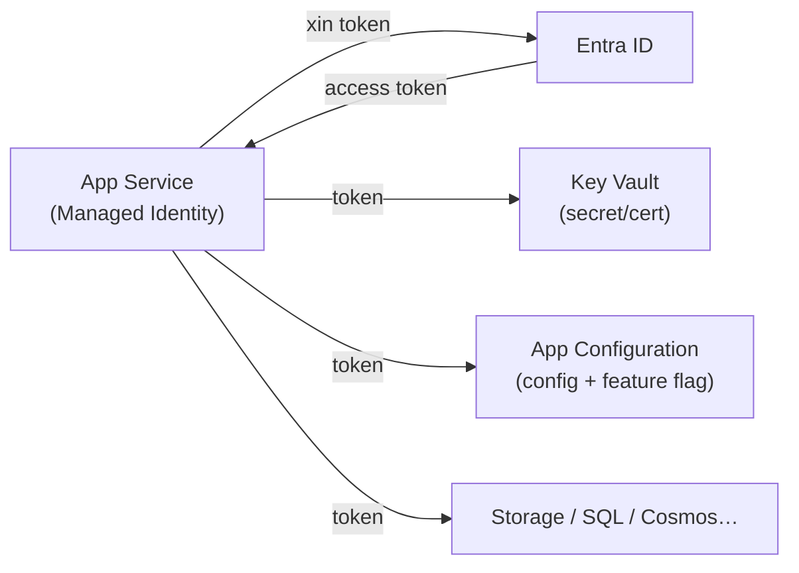

# Key Vault, App Configuration & Managed Identity

> [!summary] TL;DR
> Đừng **hardcode** secret/connection string/cert trong code hay config (repo public → lộ là mất). Azure tách 2 kho riêng: **Key Vault** giữ **giá trị bí mật** (*secrets, keys, certificates*) có RBAC + audit + rotation + soft-delete; **App Configuration** là **kho cấu hình tập trung** (*configuration store* — key-value **không bí mật** + **feature flags** bật/tắt tính năng), và **tham chiếu Key Vault** cho phần nhạy cảm. Mấu chốt khử secret hoàn toàn là **Managed Identity** — một danh tính Entra **do Azure tự quản** gắn vào resource (App Service/Function/VM…): app lấy token tự động để truy cập Key Vault/Storage/DB **mà không cần lưu một key nào**. Có 2 kiểu: **system-assigned** (gắn vòng đời resource, 1-1) và **user-assigned** (độc lập, dùng chung nhiều resource). Trong code dùng **`DefaultAzureCredential`** để tự chọn cách lấy token (Managed Identity trên Azure, tài khoản dev ở local). Luồng chuẩn: **App (Managed Identity) → token Entra → đọc secret từ Key Vault**, không key nào nằm trong code.

---

## 1. Vì sao cần — rủi ro hardcode secret

- Secret trong code/`.env`/appsettings dễ bị **commit nhầm lên Git** (repo public → lộ vĩnh viễn dù xóa sau), khó **xoay vòng (rotate)**, khó **audit** ai truy cập.
- Giải pháp phân tầng: **(1)** secret → **Key Vault**; **(2)** cấu hình thường + feature flag → **App Configuration**; **(3)** truy cập 2 kho đó **không cần secret** → **Managed Identity**.

---

## 2. Azure Key Vault — kho bí mật

- Lưu 3 loại object: **Secrets** (chuỗi: mật khẩu, connection string, API key) · **Keys** (khóa mã hóa, ký số; Premium có **HSM-backed**) · **Certificates** (chứng chỉ TLS, tự gia hạn).
- **Phân quyền:** **Azure RBAC** (khuyến nghị) hoặc **access policy** (cũ).
- **Bảo vệ:** **soft delete** + **purge protection** (chống xóa vĩnh viễn nhầm/ác ý), **audit log**, **rotation** (xoay vòng khóa định kỳ).

```python
from azure.identity import DefaultAzureCredential
from azure.keyvault.secrets import SecretClient
client = SecretClient("https://myvault.vault.azure.net", DefaultAzureCredential())
db_pw = client.get_secret("db-password").value      # không có key nào trong code
```

---

## 3. App Configuration — kho cấu hình tập trung (configuration store)

> 🎯 Đây là phần "**cấu hình store**" — một **configuration store** tách khỏi code.

- **Là gì:** dịch vụ quản lý **cấu hình tập trung** dạng **key-value** cho nhiều app/microservice/môi trường — thay vì rải config trong từng app, gom về **một nguồn sự thật**.
- **Tính năng chính:**

| Tính năng | Ý nghĩa |
|---|---|
| **Key-value** | Cấu hình thường (không bí mật): URL, timeout, kích thước trang… |
| **Label** | Phân biệt **môi trường/phiên bản** cùng một key (vd key `Timeout` label `dev` vs `prod`) |
| **Feature flag** | **Bật/tắt tính năng** không cần deploy lại (feature management) |
| **Point-in-time snapshot** | Đọc lại cấu hình **tại một thời điểm** trong quá khứ (rollback config) |
| **Key Vault reference** | Giá trị nhạy cảm **trỏ sang Key Vault**, không lưu plaintext trong store |

- **Feature flag** cho phép **canary / kill-switch**: triển khai code đã có tính năng nhưng **tắt cờ**, bật dần cho nhóm user — bật/tắt **runtime** mà không deploy lại.

```python
from azure.appconfiguration import AzureAppConfigurationClient
cfg = AzureAppConfigurationClient.from_connection_string(conn)   # hoặc Managed Identity
page_size = cfg.get_configuration_setting(key="App:PageSize", label="prod").value
```

> **Phân vai rõ:** **App Configuration = cấu hình KHÔNG bí mật + feature flag**; **Key Vault = bí mật**. Giá trị nhạy cảm để trong App Configuration dưới dạng **Key Vault reference** (con trỏ), thực thể vẫn nằm ở Key Vault.

---

## 4. Managed Identity — danh tính do Azure quản (bỏ secret)

- **Managed Identity** = một **service principal** trong Entra ID được Azure **tự tạo & tự xoay khóa** cho resource → app dùng để lấy token **mà không lưu/không thấy secret nào**.

| | **System-assigned** | **User-assigned** |
|---|---|---|
| Vòng đời | **Gắn với resource** (xóa resource → xóa identity) | **Độc lập**, là resource riêng |
| Quan hệ | 1 resource ↔ 1 identity | **1 identity ↔ nhiều resource** (dùng chung) |
| Hợp khi | App đơn lẻ, đơn giản | Nhiều app/Function chung quyền, hoặc cần gán quyền trước |

- Cấp quyền cho identity bằng **RBAC** (vd role *Key Vault Secrets User* trên vault) → app đọc được secret.



---

## 5. Luồng chuẩn & DefaultAzureCredential

- **`DefaultAzureCredential`** (Azure SDK) **tự dò** cách lấy token theo môi trường: trên Azure dùng **Managed Identity**; ở máy dev dùng tài khoản Azure CLI/VS Code đã đăng nhập → **cùng một dòng code chạy cả local lẫn cloud**, không đổi gì.
- **Luồng chuẩn không-secret:** App có **Managed Identity** → `DefaultAzureCredential` lấy **token Entra** → gọi **Key Vault/App Configuration/Storage** → **không key nào nằm trong code/repo**.

> [!question] Phỏng vấn: "Khi nào dùng Managed Identity thay vì lưu secret/connection string?"
> Bất cứ khi nào resource Azure (App Service, Function, VM, Container Apps) cần truy cập dịch vụ Azure khác (Key Vault, Storage, SQL, Cosmos). Managed Identity loại bỏ secret khỏi code/config (Azure tự tạo & xoay khóa), giảm rủi ro lộ và khỏi phải rotate tay. Chỉ khi gọi hệ **ngoài Azure** không hỗ trợ Entra mới cần secret (và để trong Key Vault).

> [!question] Phỏng vấn: "Phân biệt Key Vault và App Configuration? Cái nào giữ feature flag?"
> **Key Vault** giữ **bí mật** (secret/key/cert) với bảo vệ chặt; **App Configuration** là **configuration store** giữ **cấu hình thường (không bí mật) + feature flags**, hỗ trợ label theo môi trường và snapshot. Feature flag nằm ở **App Configuration**. Giá trị nhạy cảm trong App Configuration nên là **Key Vault reference**.

> [!question] Phỏng vấn: "System-assigned vs user-assigned Managed Identity?"
> **System-assigned** gắn vòng đời resource (xóa resource là mất, quan hệ 1-1); **user-assigned** là resource độc lập, **một identity gán cho nhiều resource** dùng chung quyền — hợp khi nhiều app/Function cần cùng bộ quyền hoặc muốn gán quyền trước khi tạo app.

---

```
★ Insight ─────────────────────────────────────
• Ba dịch vụ giải đúng 3 câu: "giấu bí mật ở đâu?" (Key Vault),
  "đổi cấu hình/bật tắt tính năng không deploy lại?" (App
  Configuration), "truy cập chúng mà không cần key?" (Managed Identity).
• App Configuration ≠ Key Vault: nhồi secret vào App Configuration là
  sai vai — để config thường + feature flag, còn bí mật trỏ sang
  Key Vault bằng reference.
• DefaultAzureCredential là "viết một lần, chạy mọi nơi": local lấy
  token từ CLI, trên Azure lấy từ Managed Identity — không if/else
  môi trường trong code.
─────────────────────────────────────────────────
```

---

## Tự kiểm tra

1. Vì sao không nên hardcode secret? 3 tầng giải pháp là gì?
2. Key Vault giữ những loại object nào? **soft delete + purge protection** chống gì?
3. **App Configuration** (configuration store) khác Key Vault ra sao? **Feature flag** & **label** dùng để làm gì?
4. **System-assigned** vs **user-assigned** Managed Identity — chọn khi nào?
5. `DefaultAzureCredential` giúp gì cho việc chạy code ở local vs trên Azure?

---

## Liên quan
- [[00-MOC-AZ-204]]
- [[06-AuthN-AuthZ-Identity-Entra-MSAL-SAS-Graph]] — token & Entra ID nền tảng
- [[02-App-Service-Web-Apps]] — App settings tham chiếu Key Vault
- [[../../../06-DevOps/09-CI-CD-Continuous-Deployment]] — secrets trong CI/CD
