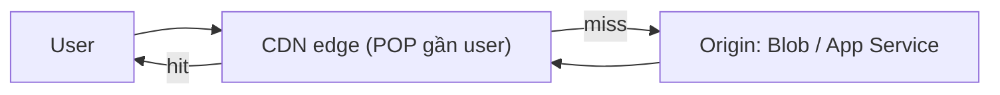

# Caching: Azure Cache for Redis & CDN

> [!summary] TL;DR
> **Cache** = giữ bản sao dữ liệu hay-dùng ở nơi **đọc nhanh** để giảm **latency**, giảm tải DB/backend, tăng throughput. **Azure Cache for Redis** là **in-memory store** (lưu trong RAM) được quản lý, dùng làm **cache**, **session store**, **pub/sub**, **distributed lock**; tier **Basic/Standard/Premium/Enterprise**. Pattern phổ biến nhất là **cache-aside (lazy loading)**: đọc cache trước, miss thì đọc DB rồi **nạp vào cache kèm TTL**. Khó nhất là **invalidation** (giữ cache không lỗi thời) — giải bằng **TTL** + xóa/cập nhật khi ghi. Tối ưu: **đừng tạo connection mỗi request** (tái dùng connection multiplexer), sizing đúng, mã hóa in-transit. **Azure CDN** thì cache **nội dung tĩnh ở edge** (POP gần user) — cấu hình qua **profile → endpoint**, có caching rule/TTL/**purge**, origin là Blob/App Service.

---

## 1. Vì sao cache & Azure Cache for Redis

- **Lợi ích cache:** giảm độ trễ (RAM nhanh hơn disk/DB nhiều lần), giảm tải nguồn gốc (DB, API ngoài), chịu tải đột biến tốt hơn.
- **Azure Cache for Redis** = dịch vụ Redis được Azure quản lý (in-memory, key-value). Công dụng:

| Dùng làm | Ý nghĩa |
|---|---|
| **Cache** | Lưu kết quả query/HTML/đối tượng hay đọc |
| **Session store** | Lưu session người dùng (web nhiều instance dùng chung) |
| **Pub/Sub** | Kênh publish/subscribe nhẹ giữa các service |
| **Distributed lock** | Khóa phân tán điều phối nhiều instance |

- **Tier:** **Basic** (1 node, dev) · **Standard** (2 node, có SLA) · **Premium** (clustering, persistence, VNet) · **Enterprise** (Redis Enterprise, module nâng cao).

---

## 2. Cache patterns (cache-aside, TTL, invalidation)

| Pattern | Cách hoạt động |
|---|---|
| **Cache-aside (lazy)** | App đọc cache → **miss** thì đọc DB → ghi lại vào cache. Phổ biến nhất. |
| **Read-through** | Cache tự đọc DB khi miss (lib lo) |
| **Write-through** | Ghi DB **đồng thời** ghi cache (cache luôn mới, ghi chậm hơn) |
| **Write-behind** | Ghi cache trước, đẩy xuống DB sau (nhanh, rủi ro mất nếu sập) |

```python
def get_user(uid):
    key = f"user:{uid}"
    if (cached := r.get(key)):        # 1) đọc cache
        return cached
    user = db.query_user(uid)          # 2) miss → đọc DB
    r.set(key, user, ex=300)           # 3) nạp cache + TTL 300s
    return user
```

- **TTL (Time To Live)** = thời gian sống của entry → tự hết hạn, tránh dữ liệu cũ tồn mãi.
- **Invalidation** (bài toán khó nhất): khi dữ liệu nguồn đổi, cache phải được **xóa/cập nhật** (vd xóa `user:{uid}` ngay sau khi update DB) — nếu không, đọc trúng bản cũ (stale).
- **Eviction policy**: cache đầy thì bỏ bớt theo luật (vd **LRU** — bỏ entry ít dùng gần đây nhất).

---

## 3. Cấu hình tối ưu Redis

- **Tái dùng connection** (điểm quan trọng): tạo **một** connection multiplexer dùng chung cho toàn app, **không mở connection mới mỗi request** (tốn handshake, cạn cổng) — đúng tinh thần connection pool ở Backend.
- **Sizing**: chọn dung lượng theo lượng dữ liệu nóng; theo dõi memory & evicted keys.
- **Key naming** nhất quán (`entity:id:field`) để dễ quản lý & xóa theo prefix.
- Bật **TLS in-transit**; Premium hỗ trợ **clustering** (chia shard) & **persistence** (lưu xuống đĩa để khôi phục).

---

## 4. Azure CDN (endpoint, profile, edge)

- **CDN (Content Delivery Network)** = mạng máy chủ **edge (POP)** đặt khắp toàn cầu, **cache nội dung tĩnh** (ảnh/CSS/JS/video) **gần user** → tải nhanh, giảm tải origin.

| Khái niệm | Ý nghĩa |
|---|---|
| **Profile** | Nhóm cấu hình CDN (chọn pricing tier/provider) |
| **Endpoint** | Một host CDN ánh xạ tới **origin** (Blob/App Service/host khác) |
| **Caching rule / TTL** | Quy định nội dung nào cache, bao lâu |
| **Purge** | Xóa nội dung đã cache ở edge để buộc lấy bản mới |

- **Luồng:** user → edge gần nhất → **cache hit** trả ngay; **miss** thì edge lấy từ origin, cache lại rồi trả.
- So với **Azure Front Door**: Front Door là CDN + **global load balancing + WAF + routing L7** (toàn diện hơn cho app động); CDN thuần tập trung cache tĩnh.



> [!question] Phỏng vấn: "Mô tả cache-aside. Vấn đề lớn nhất của caching là gì?"
> **Cache-aside**: đọc cache trước; miss thì đọc DB và **nạp lại cache kèm TTL**. Vấn đề khó nhất là **invalidation** — khi nguồn thay đổi phải xóa/cập nhật cache, nếu không sẽ phục vụ dữ liệu cũ (stale). Giải pháp: TTL hợp lý + chủ động xóa key khi ghi DB.

> [!question] Phỏng vấn: "Vì sao không nên mở connection Redis mới mỗi request?"
> Mỗi connection tốn handshake (TCP/TLS) và tài nguyên; mở liên tục gây cạn cổng và chậm. Nên dùng **một connection multiplexer dùng chung** (tái dùng), giống connection pool DB.

---

```
★ Insight ─────────────────────────────────────
• Cache là đánh đổi "nhanh ↔ có thể cũ": chọn TTL chính là chọn mức
  chấp nhận dữ liệu cũ. Không có TTL/invalidation thì cache thành nguồn
  lỗi tinh vi.
• Redis vs CDN cùng là cache nhưng khác tầng: Redis cache DỮ LIỆU ứng
  dụng (server-side, động), CDN cache NỘI DUNG TĨNH ở edge (gần user).
• "Tái dùng connection" lặp lại ở Redis, DB pool, HTTP client — một
  nguyên tắc xuyên suốt: handshake đắt, đừng lặp mỗi request.
─────────────────────────────────────────────────
```

---

## Tự kiểm tra

1. 3 lợi ích của cache? Redis ngoài cache còn dùng làm gì?
2. Mô tả **cache-aside**; vai trò của **TTL** và **invalidation**.
3. Vì sao phải tái dùng connection thay vì mở mới mỗi request?
4. CDN cache gì, ở đâu? Phân biệt **profile / endpoint / purge**.
5. CDN khác Azure Front Door ở điểm nào?

---

## Liên quan
- [[00-MOC-AZ-204]]
- [[09-Application-Insights]] — đo latency/cache hit qua telemetry
- [[../AZ-900/08-Networking-VNet-VPN-ExpressRoute]] — CDN/edge ở góc mạng
- [[../AI-Azure/17-Azure-AI-Search]] — caching trong pipeline RAG
