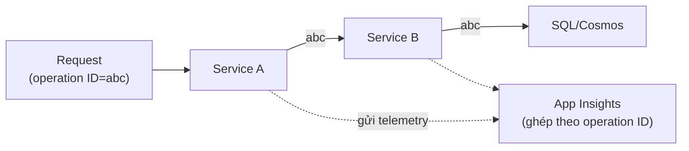

# Application Insights: metrics, logs, traces

> [!summary] TL;DR
> **Application Insights** = dịch vụ **APM** (*Application Performance Monitoring*) thuộc **Azure Monitor**, tự thu **telemetry** (dữ liệu đo) của app: **requests, dependencies, exceptions, traces, custom events/metrics**, page view. Gắn vào app qua **connection string** (cách mới; *instrumentation key* là cũ) — **auto-instrumentation (codeless)** cho App Service/Functions hoặc **SDK/OpenTelemetry** trong code. Sức mạnh là **distributed tracing**: một **operation ID** xâu chuỗi một request đi qua nhiều service → thấy toàn bộ hành trình & nút thắt. Phân tích bằng **Application Map** (sơ đồ phụ thuộc), **Live Metrics** (real-time), blade **Failures/Performance**, và **Log Analytics + KQL** (ngôn ngữ truy vấn) để query sâu + đặt **alert**. Dữ liệu nhiều/đắt thì bật **sampling** (lấy mẫu) và chỉnh **retention**.

---

## 1. App Insights & Azure Monitor

- **Azure Monitor** là nền giám sát chung của Azure (metrics + logs); **Application Insights** là phần **APM tập trung vào ứng dụng**, dữ liệu lưu trong **Log Analytics workspace**.
- Khác **Log/metrics hạ tầng** (CPU VM, AZ-900/14): App Insights nhìn từ **góc ứng dụng** — request chậm ở đâu, exception nào, gọi DB/HTTP nào tốn thời gian.

---

## 2. Instrument app (SDK / codeless / OpenTelemetry)

| Cách gắn | Đặc điểm |
|---|---|
| **Auto-instrumentation (codeless)** | Bật trong App Service/Functions, **không sửa code**; nhanh nhưng ít tùy biến |
| **SDK** | Thêm thư viện vào code → telemetry tùy biến, custom event/metric |
| **OpenTelemetry** | Chuẩn mở, vendor-neutral; Azure Monitor exporter đẩy về App Insights |

- Kết nối bằng **connection string** (chứa endpoint + key; thay cho *instrumentation key* cũ).

```python
from azure.monitor.opentelemetry import configure_azure_monitor
configure_azure_monitor(connection_string="InstrumentationKey=...;IngestionEndpoint=...")
# từ đây request/dependency/exception được thu tự động
```

---

## 3. Telemetry types & distributed tracing

| Loại telemetry | Ghi nhận |
|---|---|
| **Request** | Mỗi HTTP request vào app (thời gian, status) |
| **Dependency** | Cuộc gọi ra ngoài (DB, HTTP API, storage) + độ trễ |
| **Exception** | Lỗi/ngoại lệ kèm stack trace |
| **Trace** | Log dạng dòng (mức severity) |
| **Custom event / metric** | Sự kiện/đo lường nghiệp vụ do bạn ghi |

- **Distributed tracing**: gắn **operation ID** (correlation ID) vào request và **truyền qua mọi service** nó đi qua → ghép lại thành **một dòng thời gian end-to-end** (microservice nào chậm, lỗi ở đâu).



---

## 4. Phân tích: Application Map, KQL, alert

- **Application Map**: sơ đồ tự động các thành phần app + phụ thuộc, hiện nơi lỗi/chậm.
- **Live Metrics**: số liệu **real-time** (request/s, lỗi) khi đang deploy/incident.
- **Failures / Performance blade**: gom exception & request chậm nhất.
- **Log Analytics + KQL** (*Kusto Query Language*): query telemetry sâu, làm chart, làm điều kiện **alert**.

```kql
requests
| where timestamp > ago(1h) and success == false
| summarize count() by resultCode, bin(timestamp, 5m)
```

- **Alert** + **smart detection**: cảnh báo khi lỗi vượt ngưỡng / phát hiện bất thường tự động.

---

## 5. Sampling & retention

- **Sampling** (lấy mẫu): chỉ giữ một **tỷ lệ** telemetry (vd 20%) → giảm **chi phí ingest** & khối lượng mà vẫn giữ tính đại diện. Có **adaptive** (tự điều chỉnh theo tải), fixed-rate, ingestion sampling.
- **Data retention**: thời gian giữ dữ liệu trong workspace (mặc định ~90 ngày, cấu hình được); ảnh hưởng chi phí.

> [!question] Phỏng vấn: "Một request chậm đi qua nhiều microservice — App Insights giúp truy nguyên thế nào?"
> Dùng **distributed tracing**: mỗi request mang **operation ID** truyền qua các service; App Insights ghép telemetry theo ID đó thành **dòng thời gian end-to-end** và vẽ **Application Map** → thấy chính xác service/dependency nào là nút thắt.

> [!question] Phỏng vấn: "Telemetry quá nhiều, chi phí cao — làm gì mà vẫn giám sát được?"
> Bật **sampling** (lấy mẫu, vd adaptive) để giảm khối lượng ingest nhưng giữ tính đại diện, và điều chỉnh **retention**. Có thể tách custom metric quan trọng để không bị sampling bỏ.

---

```
★ Insight ─────────────────────────────────────
• 5 loại telemetry là "ống nhòm" theo lớp: request (vào) → dependency
  (ra) → exception (lỗi) → trace (log) → custom (nghiệp vụ). Nhớ bộ này
  là biết App Insights nhìn được gì.
• Operation ID là sợi chỉ đỏ của microservice: không có nó, log mỗi
  service rời rạc; có nó, một request thành một câu chuyện liền mạch.
• Sampling là đánh đổi "chi phí ↔ độ chi tiết" — y như TTL của cache
  là đánh đổi "tốc độ ↔ độ mới". Quan sát toàn hệ luôn là bài toán
  chi phí.
─────────────────────────────────────────────────
```

---

## Tự kiểm tra

1. App Insights là gì, thuộc dịch vụ nào, lưu dữ liệu ở đâu?
2. 3 cách instrument app; **connection string** thay cho cái gì cũ?
3. Kể 5 loại telemetry. **Distributed tracing** dựa trên gì?
4. **KQL** dùng để làm gì? Viết một query đơn giản đếm request lỗi.
5. **Sampling** giải quyết vấn đề gì và đánh đổi điều gì?

---

## Liên quan
- [[00-MOC-AZ-204]]
- [[08-Caching-Redis-CDN]] — đo cache hit/latency qua telemetry
- [[02-App-Service-Web-Apps]] — bật App Insights cho web app
- [[../AZ-900/14-Monitoring-Advisor-Monitor]] — Azure Monitor góc AZ-900
