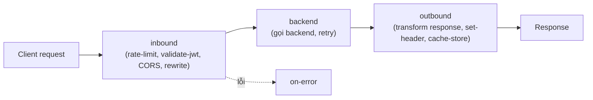

# API Management: instance, products, policies

> [!summary] TL;DR
> **Azure API Management (APIM)** = một **facade/gateway** đặt **trước** các backend API (App Service/Functions/bất kỳ) để quản lý tập trung **bảo mật, throttle, version, transform, analytics** — backend không phải tự lo. Gồm **3 mặt**: **API gateway** (nhận request, áp policy, forward), **management plane** (cấu hình qua portal/CLI/ARM), **developer portal** (tài liệu tự sinh cho lập trình viên dùng API). Mô hình tổ chức: **API** (tập operations) → gói trong **Product** (kèm policy + điều kiện) → client cần **Subscription** (lấy **subscription key**) để gọi; **Group** phân loại người dùng (Administrators/Developers/Guests). Sức mạnh thực sự là **policies** — đoạn XML chạy ở 4 giai đoạn **inbound / backend / outbound / on-error**: rate-limit/quota, **caching**, transform (rewrite URL/header), CORS, **`validate-jwt`**, mock. Client xác thực qua **subscription key**, **OAuth2/JWT**, hoặc **client certificate (mTLS)**.

---

## 1. APIM tổng quan (gateway, portal, management)

| Thành phần | Vai trò |
|---|---|
| **API gateway** | Điểm vào: nhận request, **áp policy**, forward tới backend, trả response |
| **Management plane** | Nơi cấu hình (Portal/CLI/ARM/Bicep): định nghĩa API, product, policy |
| **Developer portal** | Trang tài liệu API tự sinh để dev khám phá, lấy key, thử API |

- **Tier:** **Consumption** (serverless, trả theo gọi) · **Developer** (không SLA, để test) · **Basic/Standard** (production) · **Premium** (multi-region, VNet, scale lớn).

---

## 2. API / Product / Group / Subscription

```
API (nhiều operation)  ──gói vào──>  Product  ──cấp──>  Subscription (key)
                                       │
                              Group (Administrators / Developers / Guests)
```

| Khái niệm | Ý nghĩa |
|---|---|
| **API** | Tập **operations** (endpoint) import từ OpenAPI/backend |
| **Product** | **Gói** một/nhiều API + policy + điều kiện dùng; có thể **Open** (không cần key) hoặc **Protected** (cần subscription) |
| **Subscription** | Đăng ký dùng product → sinh **subscription key** để gọi API |
| **Group** | Nhóm người dùng: built-in **Administrators / Developers / Guests**, hoặc custom |

---

## 3. Authentication (cho client gọi APIM)

| Cách | Cơ chế |
|---|---|
| **Subscription key** | Gửi header `Ocp-Apim-Subscription-Key: <key>` |
| **OAuth 2.0 / JWT** | Gửi `Authorization: Bearer <token>`, APIM **`validate-jwt`** kiểm token |
| **Client certificate (mTLS)** | Client xuất trình cert, APIM xác thực |

> Phân biệt: xác thực **client ↔ APIM** (ở trên) khác với xác thực **APIM ↔ backend** (APIM có thể dùng Managed Identity/cert để gọi backend an toàn).

---

## 4. Policies — trái tim của APIM

- **Policy** = đoạn **XML** APIM thực thi theo **pipeline 4 giai đoạn**:



| Giai đoạn | Chạy khi | Policy hay dùng |
|---|---|---|
| **inbound** | Trước khi tới backend | `rate-limit`, `quota`, `validate-jwt`, `cors`, `rewrite-uri`, `set-header`, `cache-lookup` |
| **backend** | Lúc gọi backend | `forward-request`, retry, set backend |
| **outbound** | Sau khi backend trả | transform body, `set-header`, `cache-store` |
| **on-error** | Khi có lỗi | xử lý/định dạng lỗi |

- **Ví dụ hữu ích:** **rate-limit** (chặn lạm dụng), **quota** (giới hạn theo tháng/subscription), **caching** (cache-lookup/cache-store giảm tải backend), **transform** (giấu cấu trúc backend), **validate-jwt** (chặn token sai ngay ở cổng). Có **policy expression** (C#) cho logic động.

```xml
<inbound>
  <rate-limit calls="100" renewal-period="60" />        <!-- 100 req/60s -->
  <validate-jwt header-name="Authorization" failed-validation-httpcode="401">
    <openid-config url="https://login.microsoftonline.com/{tenant}/v2.0/.well-known/openid-configuration" />
  </validate-jwt>
</inbound>
```

---

## 5. Tạo, document, version API

- **Import OpenAPI** (Swagger) để tạo API nhanh + sinh tài liệu trong developer portal.
- **Versioning** (v1/v2 — đường dẫn/header/query) cho phép nhiều phiên bản song song; **Revisions** sửa không-phá-vỡ rồi "make current".

> [!question] Phỏng vấn: "Backend API cần rate-limit + xác thực JWT + ẩn cấu trúc nội bộ mà không sửa code backend — làm sao?"
> Đặt **APIM** trước backend và dùng **policies** ở **inbound**: `rate-limit`/`quota` chặn lạm dụng, `validate-jwt` kiểm token ngay cổng, `rewrite-uri`/transform để ẩn cấu trúc backend. Backend giữ nguyên, mọi thứ tập trung ở gateway.

> [!question] Phỏng vấn: "Phân biệt Product, Subscription, API trong APIM?"
> **API** là tập operations; **Product** gói một/nhiều API kèm policy & điều kiện dùng; **Subscription** là đăng ký của client vào product, sinh **subscription key** để gọi. Một product protected buộc client phải có subscription hợp lệ.

---

```
★ Insight ─────────────────────────────────────
• APIM là "tường tiền sảnh" của API: dồn các mối lo xuyên suốt (auth,
  throttle, cache, transform) ra khỏi từng backend → backend chỉ lo
  nghiệp vụ. Đây là pattern Gateway/BFF ở tầng quản trị.
• Policy 4 giai đoạn là mô hình tinh thần cần thuộc: inbound (chặn/biến
  đổi vào) → backend (gọi) → outbound (biến đổi ra) → on-error. Đề thi
  hay hỏi policy nào đặt ở giai đoạn nào.
• Subscription key ≠ OAuth token: key định danh "đăng ký dùng product",
  token định danh "user/app". Nhiều API dùng cả hai lớp.
─────────────────────────────────────────────────
```

---

## Tự kiểm tra

1. 3 thành phần của APIM và vai trò mỗi cái?
2. Phân biệt **API / Product / Subscription / Group**.
3. 3 cách client xác thực với APIM?
4. Policy chạy ở **4 giai đoạn** nào? Kể policy tiêu biểu ở inbound và outbound.
5. Versioning vs Revisions khác nhau ra sao?

---

## Liên quan
- [[00-MOC-AZ-204]]
- [[02-App-Service-Web-Apps]] · [[03-Azure-Functions-Bindings-Triggers]] — backend đứng sau APIM
- [[06-AuthN-AuthZ-Identity-Entra-MSAL-SAS-Graph]] — validate-jwt dùng token Entra
- [[../../../02-Backend/00-MOC-Backend|MOC Backend]] — REST API, auth, rate-limit
